<!-- more -->

## Euclid’s Algorithm
$$gcd(m,n) = gcd(n, m \space \text{mod} \space n)$$
algorithm: repeatedly replace $(m,n)$ with $(n, m \space \text{mod} \space n)$, until the second component becomes 0.

## Stable Matching: Problem

**Definition: Matching**

**Definition: Perfect Matching**

**Definition: Unstable Pair** `m` and `w` are unstable if
- `m` prefers `w` to its current
- `w` prefers `m` to its current
- i.e. can be improved

**Definition: Stable Pair** a perfect matching with no unstable pairs

> Hint: Try to define the problem from the opposite direction. (What is an unstable pair)

**Problem:** Given the preference lists of n men and n women, find a stable matching (if one exists).

### Stable Roomate Problem

1. assign roommate pairs for `2n` people, stable matching doesn't always exists.
   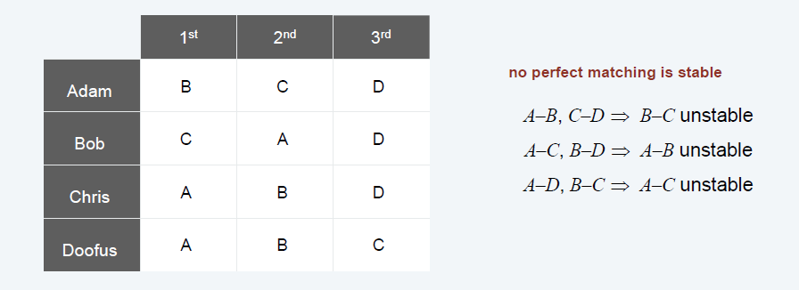

2. Is stable matching unique? not necessarily(四角恋)
   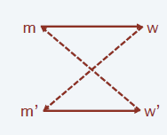

## Solution: Gale-Shapley

1. initialize empty matching `S`
2. while `some men are not proposed`
   1. `w = first woman on m`
   2. if `w` unmatched
      - add `(m,w)` to `S`
   3. else if `w` prefers `m` to current `m'`
      - remove `(m',w)` from `S`
      - add `(m,w)` to `S`
      - add `m'` to queue
3. return `S`

### Proof of correctness: Termination

**Observations**
1. Men propose to women in decreasing order of preference
2. Once a woman is matched, she never becomes unmatched

**Claim:** Algorithm terminates after at most $n^2$ iterations of while loop
**Proof.** Each time through the while loop a man proposes to a new woman. There are only $n^2$ possible proposals.
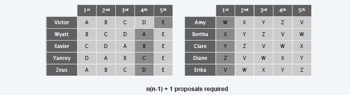

### Proof of correctness: Perfection

> Hint: Prove by contradiction

**Claim:** In Gale-Shapley matching, all men and women get matched.
**Proof.**
- if a man is not matched upon termination of GS algorithm, 
- then some woman is never proposed
- but the man has proposed to all women
- contradiction

### Proof of correctnes: Stability

**Claim:** After GS Matching, there are no unstable pairs.

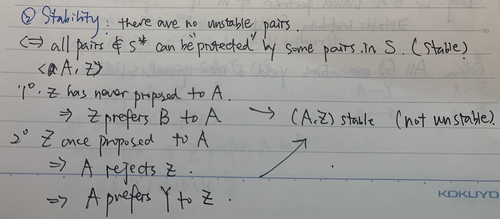

## Implementation

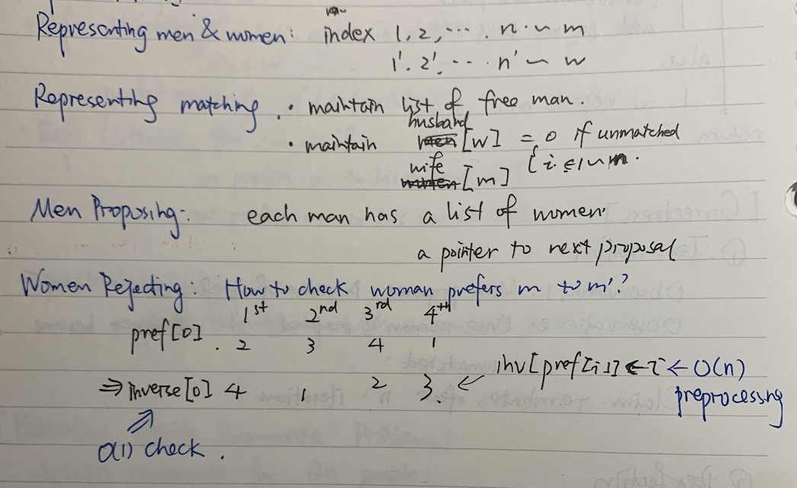

## Analysis
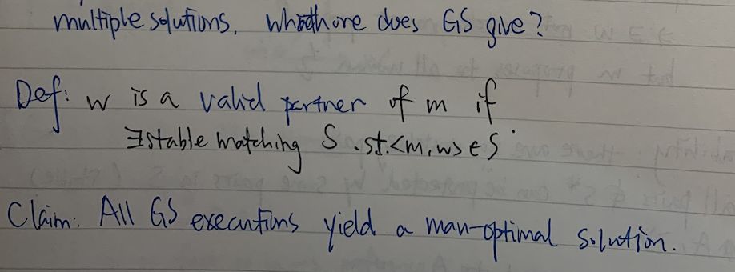

### Man Optimality
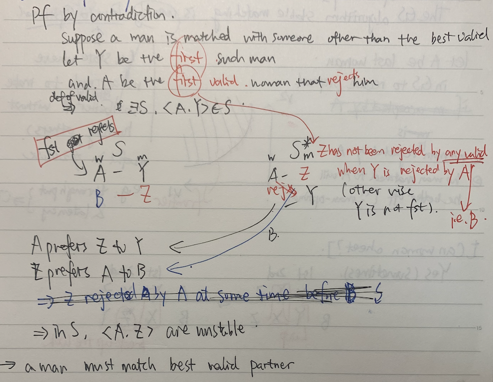

### Woman Pessimality
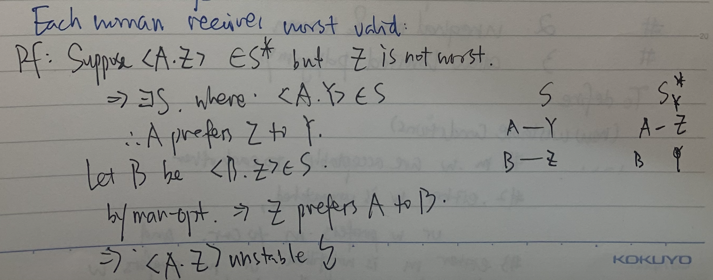

### Pareto Optimality
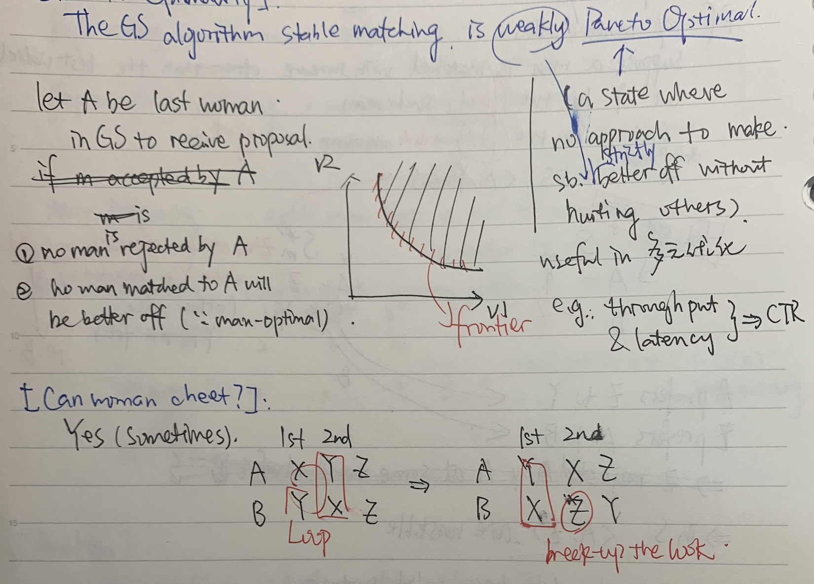

## Extensions
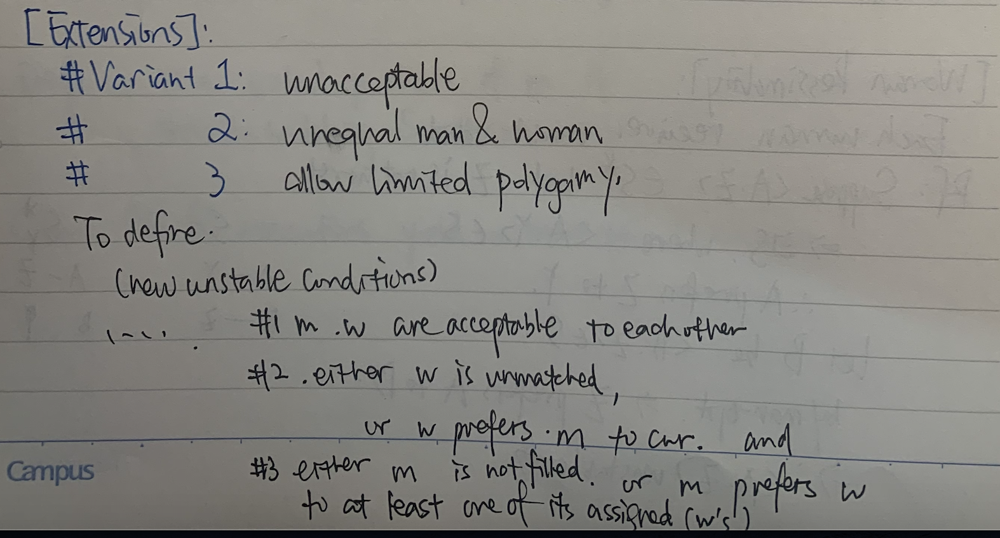

## 5 Representative Problems

### Interval Scheduling

**Input.** Set of jobs with start times and finish times.
**Goal.** Find maximum cardinality subset of mutually compatible(jobs don't overlap) jobs.

**Solution.** *Greedy algorithm:* A myopic rules that process the input one piece at a time with no apparent look-ahead. Learn the structure of underlying problems that can be solved by greedy algorithms

> Here, the myopic rule in the greedy algorithm is that *the job ends earliest*
> Choose different criteria in different problems

### Weighted Interval Scheduling

**Input:** Set of jobs with start times, finish times, and **weights**.
**Goal.** Find maximum weight subset of mutually compatible jobs.

**Solution.** *Dynamic programming:* build up the optimal value over all possible solutions in a compact, tabular way that leads to a very efficient algorithm

> The optimizating goal is not the number of jobs, but the weights sum.
> The nature of dynamic programming is **divide and conquer(backtracking)**
> The primal characteristic of dynamic programming is that the execution order of the code is not static. (make use of the solution of sub-problems and combine them to the solution to a bigger problem)

### Bipartite matching

**Problem**. Given a bipartite graph $G=(L \cup R, E)$, find a max cardinality matching.
**Def**. A subset of edges $M \subset E$ is a matching if each node appears
in exactly one edge in $M$.
**Solution**. *Augmentation(增强路径)*: inductively build up larger matchings, selectively backtracking along the way; it is the central component in a large class of solvable problem: **network flow problems**

> Main Idea, when we permutate the augmentation, the cardinality of the problem will succeed forward exactly once.

> Note: in many cases, if the graph in case is a bipartite graph, the complexity of the problem will be reduced greatly

### Independent Set
**Problem**. Given a graph $G=(V,E)$, find a max cardinality independent set.
**Def**. A subset $S\subset V$is independent if for every $(u,v)\inE$, either $u \notin S$ or $v \notin S$ or both.

> NP-complete
> but in some special cases, it can be degenerated to *interval scheduling* or *bipartite matching* problem
> 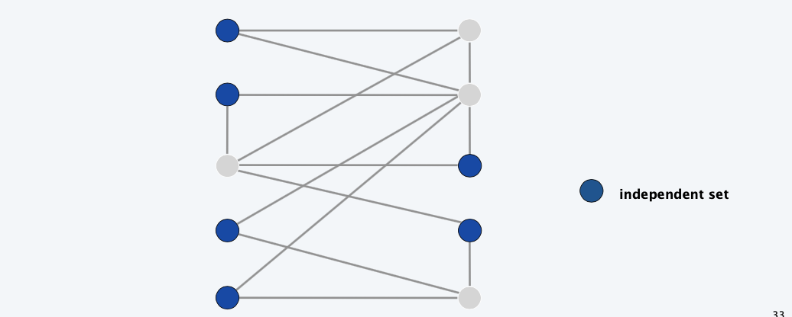

### Competitive Facility Location

**Input**. Graph with weight on each node.
**Game**. Two competing players alternate in selecting nodes.

Not allowed to select a node if any of its neighbors have been selected. Subsect of selected notes must form an independent set.

**Goal**. Select a *maximum weight* subset of nodes. Is there a strategy that no matter how player 1 plays, player 2 can guarantee a bound B.

> **PSPACE-complete:** harder than NP-complete.
> Conjectured lack of short “proofs”.
> Application: Game playing or planning in artificial intelligence.

> **NP vs PSPACE**
> we can't find polynominal time solution to NP problems, but we can easily certify the solution.
> For PSPACE problems, there hardly exists an efficient certifying method.

### Summary

- Variations on a theme: independent set.
  - Interval scheduling: $O(n\log n)$ greedy algorithm.
  - Weighted interval scheduling: $O(n\log n)$ dynamic programming algorithm.
  - Bipartite matching: $O(n^k)$max-flow based algorithm.
  - Independent set: **NP**-complete.
  - Competitive facility location: **PSPACE**-complete.