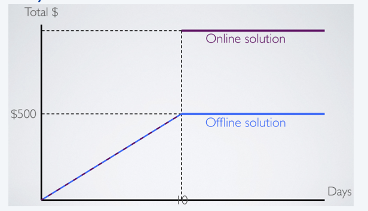
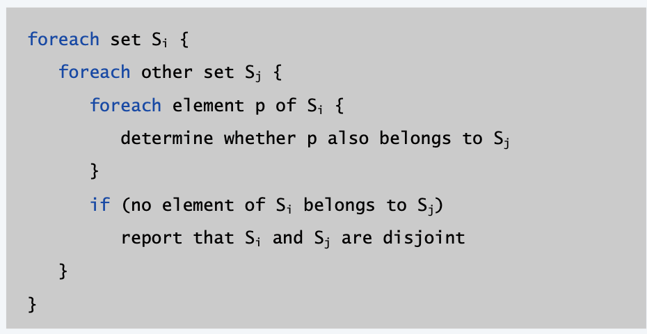
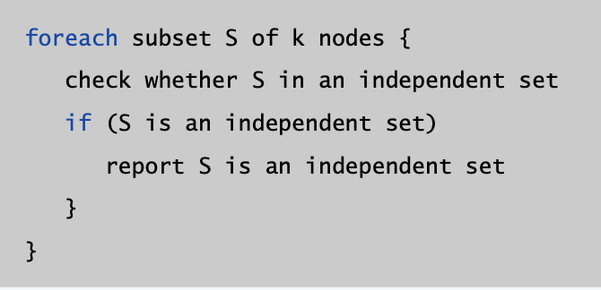
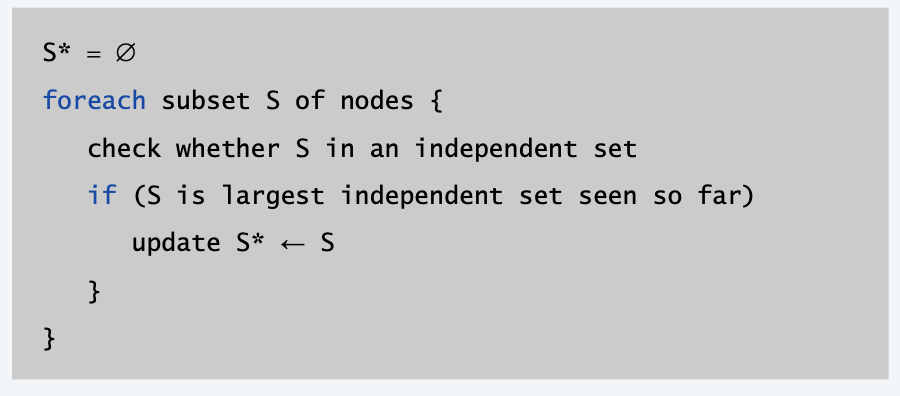

<!--more-->

[[toc]]

## Computational Tractability

### Brute Force

For many nontrivial problems, there is a natural brute-force search algorithm that checks every possible solution.
- Typically takes $2^n$ time or worse for inputs of size n. 
- Unacceptable in practice.

### Polynomial Running Time

**Desirable Scaling Property** 衡量随着输入增加，算法复杂度的增加程度。
- When the input size doubles, the algorithm should only slow down by some constant factor C.

**Def**. An algorithm is **poly-time** if the above scaling property holds.
> There exists constants $c > 0$ and $d > 0$ such that on every input of size $n$, its running time is bounded by $c \cdot n^d$ primitive computational steps.

We say that an algorithm is efficient if has a polynomial running time.
**Justification**. It really works in practice!
- In practice, the poly-time algorithms that people develop have low constants and low exponents.
- Breaking through the exponential barrier of brute force typically exposes some crucial structure of the problem.

**Exceptions**. Some poly-time algorithms do have high constants and/or exponents, and/or are useless in practice.
- Which would you prefer $20\cdot n^{100}$ vs. $n^{1 + 0.02 \ln n}$?
- depends on $n$

> When analyzing the practicalbility of an algorithm, also pay attention how large $n$ is

### Worst-Case Analysis

**Worst case**. Running time guarantee for any input of size n. ・Generally captures efficiency in practice.
- Draconian view, but hard to find effective alternative.

**Exceptions**. Some exponential-time algorithms are used widely in practice because the worst-case instances seem to be rare.

<!-- see links -->
> Delicate Designs in algorithms to reduce occurences of worst case
> Simplex Algorithm: https://www.bilibili.com/video/av32574099/
> Linux Grep: https://www.cnblogs.com/lanxuezaipiao/p/3452579.html 
> K-Means Algorihm: http://blog.mpacula.com/2011/04/27/k-means-clustering-example-python/

### Other Types of Analyses

- Worst case. Running time guarantee for **any input** of size n.
  - Ex. Heapsort requires at most $2 n \log_{2} n$ compares to sort n elements.
- Probabilistic. Expected running time of a randomized algorithm.
  - Ex. The expected number of compares to quicksort $n$ elements is $\approx 2n \ln n$.
  > *Since we are randomly selecting the initial `pilot` number*
- Amortized.(分摊) Worst-case running time for any **sequence** of n operations.
  - Motivation: majority of operations are cheap, but some rare might be expensive
  - Idea: Amortize the costs to all operations
  - Ex. Starting from an empty stack, any sequence of n push and pop operations takes O(n) operations using a resizing array.
- Average-case. *Expected* running time for a *random* input of size n.
  - The expected number of character compares performed by 3-way radix quicksort on n uniformly random strings is $\approx 2n \ln n$.

### Online Algorithms

- **An offline algorithm** has access to all of its data at the start – it “knows” all of its data in advance
- **An online algorithm** does not have access to all of the data at the start
  - Data is received **serially**, with no knowledge of what comes next

> Ski-Reantal Problem
> We don’t know the future, so what can we do?
> - Try to get within some constant multiplicative factor of the offline solution!
>   - “I want to spend at most X times the amount the offline solution would spend”
> - Strategy:
>   - Rent until total spending equals the cost of buying
>   - Then buy if we want to ski some more 10
> - How good?
>   - If `ski<=10`, optimal
>   - If `ski>10`, we never spend more than **twice** the offline solution
> 
> Generally, Offline algorithm should perform better than Online algorithms

### Competitive Analysis

> Hint: Sometimes competitive analysis(comparison between different algorithms) is also useful

How to compare between two online algorithms?

- **Definition: Competitive ratio**: Ratio of performance of an online algorithm to performance of an optimal offline algorithm
$$\text{perf online} \le c\cdot \text{perf offline} + \alpha$$
  - Our online algorithm is “2-competitive” with the offline solution
  - Our ski-rental solution has a competitive ratio of 2, since we are never more than 2 times as bad as the offline solution
- Competitive analysis frames an online algorithm’s efficiency in terms of an offline solution
- Applications of Online Algorithms
  - CPUs and memory caches (EI338) (how to drop cache, rule?)
  - Artificial intelligence : Heuristics, search, genetic algorithms 
  - Machine learning
  - Statistics

## Asymptotic Order of Growth
渐进复杂度

### Big-Oh Notation (Upper Bound)

**Definition: Upper Bounds:** $T(n)$ is $O(f(n))$ if there exist constants $c>0$ and $n_0 \ge 0$ such that $T(n) \le c \cdot f(n)$ for all $n \ge n_0$

**Alternate Definition:** $T(n)$ is $O(f(n))$ if $\lim_{n\rightarrow\infty} \sup \frac{T(n)}{f(n)} < \infty$

Notational Abuses
- *equal sign:* $O(f(n))$ is a set of functions, but computer scientists often write $T(n)=O(f(n))$ instead of $T(n)\in O(f(n))$
- *domain:* The domain of $f (n)$ is typically the natural numbers $\left\{ 0, 1, 2, ... \right\}$.
  - Sometimes we restrict to a subset of the natural numbers.
  - Other times we extend to the reals.
- *Nonnegative functions* When using big-Oh notation, we assume that the functions involved are (asymptotically) nonnegative.

### Big-Omega Notation (Lower Bound)

**Definition: Lower Bounds:** $T(n)$ is $\Omega(f(n))$ if there exist constants $c>0$ and $n_0 \ge 0$ such that $T(n) \ge c \cdot f(n)$ for all $n \ge n_0$

> Typical usage. Any compare-based sorting algorithm requires $\Omega(n \log n)$ compares in the worst case.
> **Proof.** Sorted order is on of n factorial permutations. If the algorithm always completes after at most $f(n)$ steps, it cannot distinguish more than $2^{f(n)}$ cases because the keys are distinct and each comparison has only two possible outcomes.( Stirling's approximation)
> $$2^{f(n)} \geq n ! \rightarrow f(n) \geq \log _{2}(n !) \approx \Omega\left(n \log _{2} n\right)$$

### Big-Theta Notation (Tight Bound)

**Definition: Tight Bounds:** $T(n)$ is $\Theta(f(n))$ if there exist constants $c_1>0, c_2>0$ and $n_0 \ge 0$ such that $c_1 \cdot f(n) \le T(n) \le c_2 \cdot f(n)$ for all $n \ge n_0$

> Typical usage. Mergesort makes $\Theta(n \log n)$ compares to sort $n$ elements.

### Useful Facts

**Proposition**. If $\lim _{n \rightarrow \infty} \frac{f(n)}{g(n)}=c>0,$ then $f(n)$ is $\Theta(g(n))$, or equivalently, $g(n)$ is $\Theta(f(n))$
**Pf**. By definition of the limit, there exists $n_{0}$ such such that for all $n \geq n_{0}$
$$
\frac{1}{2} c<\frac{f(n)}{g(n)}<2 c
$$
- Thus, $f(n) \leq 2 c g(n)$ for all $n \geq n_{0},$ which implies $f(n)$ is $O(g(n))$.
- Similarly, $f(n) \geq 1 / 2 c g(n)$ for all $n \geq n_{0},$ which implies $f(n)$ is $\Omega(g(n))$

**Proposition**. If $\lim _{n \rightarrow \infty} \frac{f(n)}{g(n)}=0,$ then $f(n)$ is $O(g(n))$

### Asymptotic bounds for some common functions

- **Polynomials**. Let $T(n)=a_{0}+a_{1} n+\ldots+a_{d} n^{d}$ with $a_{d}>0 .$ Then, $T(n)$ is $\Theta\left(n^{d}\right)$
  - Pf. $\quad \lim _{n \rightarrow \infty} \frac{a_{0}+a_{1} n+\ldots+a_{d} n^{d}}{n^{d}}=a_{d}>0$
- **Logarithms**. $\Theta\left(\log _{a} n\right)$ is $\Theta\left(\log _{b} n\right)$ for any constants $a, b>0 .$
  -  $\log _{a} n=1 / \log _{b} a * \log _{b} n$
- **Logarithms and polynomials.** For every $d>0, \log n$ is $O\left(n^{d}\right)$
- **Exponentials and polynomials.** For every $r>1$ and every $d>0, n^{d}$ is $O\left(r^{n}\right)$
  - Pf. $\lim _{n \rightarrow \infty} \frac{n^{d}}{r^{n}}=0$
- **Note: when comparing two exp algorithms,** Asymptotically speaking, exponential functions are all different.
  - $$\text { For } r>s>1, r^{d}=\Theta\left(s^{d}\right)$$ this is wrong!

### Big-Oh notation with multiple variables

**Upper bounds.** $T(m, n)$ is $O(f(m, n))$ if there exist constants $c>0, m_{0} \geq 0$ and $n_{0} \geq 0$ such that $T(m, n) \leq c \cdot f(m, n)$ for all $n \geq n_{0}$ and $m \geq m_{0}$
- Ex. $\quad T(m, n)=32 m n^{2}+17 m n+32 n^{3}$
- $\cdot T(m, n)$ is both $O\left(m n^{2}+n^{3}\right)$ and $O\left(m n^{3}\right)$
- $T(m, n)$ is neither $O\left(n^{3}\right)$ nor $O\left(m n^{2}\right)$

**Typical usage.** Breadth-first search takes $O(m+n)$ time to find the shortest
path from $s$ to $t$ in a digraph.

## Survey of common running times

### Linear Time

- Find Maximum
- Merge two sorted
  - Claim. Merging two lists of size n takes $O(n)$ time.
  - Pf. After each compare, the length of output list increases by 1.

### Linearithmic time

$O(n\log n)$: arises in divide-and-conquer algorithms
- mergesort, heapsort
  - $\log n$ divide
  - $n$ conquer
- For some greedy algorithms, we need to sort the input first
- Largest empty interval: Given $n$ time-stamps $x_1, \ldots, x_n$ on which copies of a file arrive at a server, what is largest interval when no copies of file arrive?
  - Sort the time-stamps.
  - Scan the sorted list in order, identifying the maximum gap between successive time-stamps.

### Quadratic time

$O(n^2)$ Enumerate all pairs of elements.
- **Closest pair of points.** Given a list of $n$ points in the plane $(x_1, y_1), ..., (x_n, y_n)$, find the pair that is closest.
  - Brute Force, Try all pairs of points, save the minimum
  - **Remark:** $\Omega(n^2)$ seems inevitable, but there is a better solution

### Cubic Time

$O(n^3)$ triple matching

- **Set disjointness**. Given n sets $S_1, ..., S_n$ each of which is a subset of $1, 2, ..., n$, is there some pair of these which are disjoint?
  - 

### Polynomial Time

- **Independent set of size k.** Given a graph, are there k nodes such that no two are joined by an edge?
  -  Enumerate all subsets of k nodes.
  -  
  -  Check whether $S$ is an independent set takes $O\left(k^{2}\right)$ time.
  -  Number of $k$ element subsets $=\left(\begin{array}{l}n \\ k\end{array}\right)=\frac{n(n-1)(n-2) \times \cdots \times(n-k+1)}{k(k-1)(k-2) \times \cdots \times 1} \leq \frac{n^{k}}{k !}$
  -  $O\left(k^{2} n^{k} / k !\right)=O\left(n^{k}\right)$

### Exponential Time
- I**ndependent set.** (NP Problem) Given a graph, what is maximum cardinality of an independent set?
  - $O(n^2 2^n)$ solution. Enumerate all subsets.
  - 

### Sublinear Time
- **Search in a sorted array.** Given a sorted array A of n numbers, is a given number x in the array?
  - Binary Search
  - **O(\log n) Solution**