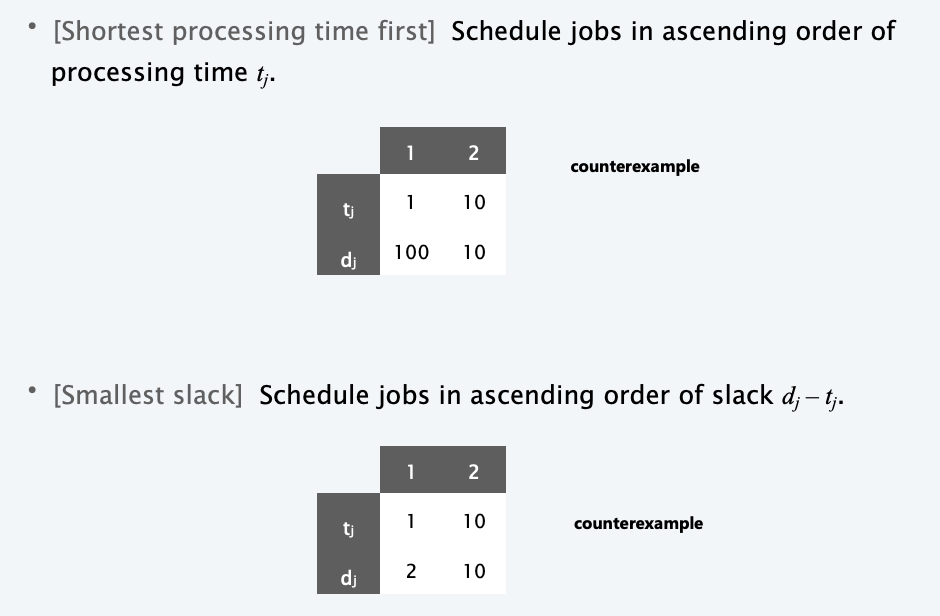
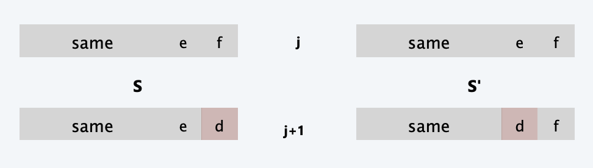

<!--more-->

[toc]

## Graphs

### basic definitions and applications

**Notation.** $G=(V,E)$
- $V$ = nodes.
- $E$ = edges between pairs of nodes.
- Captures pairwise relationship between objects. 
- Graph size parameters: $n = |V|, m = |E|$.

#### Representation

**Adjacency Matrix.** $n$-by-$n$ matrix with $A_{uv} = 1$ if $(u, v)$ is an edge.
- Two representations of each edge.
- Space proportional to $n^2$.
- Checking if $(u, v)$ is an edge takes $\Theta (1)$ time.
- Identifying all edges takes $\Theta(n^2)$ time.
- *Redundant when the graph is sparse*

**Adjacency lists.** Node indexed array of lists.
- Two representations of each edge.
- Space is $\Theta(m + n)$.
- Checking if $(u, v)$ is an edge takes $O(\text{degree}(u))$ time. 
- Identifying all edges takes $\Theta(m + n)$ time.
- *Some techniques as local sensitive hash are applied to optimize the performance of adjacency lists*

#### Paths and connectivity

**Def**. A **path** in an undirected graph $G = (V, E)$ is a sequence of nodes $v_1, v_2, \ldots, v_k$ with the property that each consecutive pair $v_{i–1}$, $v_i$ is joined by an edge in $E$.

**Def**. A path is **simple** if all nodes are distinct.

**Def**. An undirected graph is **connected** if for every pair of nodes u and v, there is a path between u and v.

#### Cycles

**Def**. A **cycle** is a path $v_1, v_2, \ldots, v_k$ in which $v_1 = v_k$, $k > 2$, and the first $k – 1$ nodes are all distinct.

#### Trees

**Def**. An undirected graph is a **tree** if it is connected and does not contain a cycle.

**Theorem**. Let G be an undirected graph on n nodes. Any two of the following statements imply the third.
- $G$ is connected.
- $G$ does not contain a cycle. 
- $G$ has $n – 1$ edges.

#### Rooted Trees

Given a tree $T$, choose a root node $r$ and orient each edge away from $r$. 

**Importance**. Models hierarchical structure.

### graph connectivity and graph traversal 

#### Connectivity Problem

**s-t connectivity problem.** Given two node s and t, is there a path between s and t ?

**s-t shortest path problem.** Given two node s and t, what is the length of the shortest path between s and t ?

**Applications.**
- Friendster.
- Maze traversal.
- Kevin Bacon number.
- Fewest number of hops in a communication network.

#### BFS

**Property**. Let $T$ be a BFS tree of $G=(V,E)$,and let $(x,y)$ be an edge of G. Then, the level of x and y differ by at most 1.

Proof by contradiction.

**Theorem (Analysis)**. The above implementation of BFS runs in $O(m + n)$ time if the graph is given by its adjacency representation.

- when we consider node $u$, there are $degree(u)$ incident edges $(u, v)$
- total time processing edges is $\sum_{u\in V} degree(u) = 2m.$ 
- each edge $(u, v)$ is counted exactly twice, in sum: once in $degree(u)$ and once in $degree(v)$

#### Connected Component

Connected component. Find all nodes reachable from s.

**Theorem**. Upon termination, R is the connected component containing s. 
- BFS = explore in order of distance from s.
- DFS = explore in a different way.

### testing bipartiteness

**Def**. An undirected graph $G = (V, E)$ is bipartite if the nodes can be colored blue or white such that every edge has one white and one blue end.

**Lemma. (no odd cycle)** If a graph G is bipartite, it cannot contain an odd length cycle.
Pf by contradiction, can't be colored properly.

**Lemma (Test-bi with BFS)**. Let $G$ be a connected graph, and let $L_{0}, \ldots, L_{k}$ be the layers produced by BFS starting at node $s$. Exactly one of the following holds.
(i) No edge of $G$ joins two nodes of the same layer, and $G$ is bipartite.
(ii) An edge of $G$ joins two nodes of the same layer, and $G$ contains an
odd-length cycle (and hence is not bipartite).
> **Proof.** omitted
> 

**Corollary**. A graph G is bipartite iff it contain no odd length cycle.

> Note, in some problems, testing bipartiteness as a preprocessing can be a key solution

### connectivity in directed graphs

#### Strong connectivity

**Def**. Nodes $u$ and $v$ are mutually reachable if there is a both path from $u$ to $v$ and also a path from $v$ to $u$.

**Def**. A graph is strongly connected if every pair of nodes is mutually
reachable.

**Lemma (Instantiazation of SCC)**. Let $s$ be any node. $G$ is strongly connected iff every node is
reachable from $s$, and $s$ is reachable from every node.

**Pf**. $\Rightarrow$ Follows from definition.
**Pf**. $\Leftarrow$ Path from $u$ to $v$ : concatenate $u$ ors path with $s \sim v$ path.
Path from $v$ to $u$ : concatenate $v$ us path with $s$ œu path.

#### Strong connectivity: algorithm analysis

**Theorem**. Can determine if $G$ is strongly connected in $O(m + n)$ time. 
**Pf**.
- Pick any node $s$.
- Run BFS from $s$ in $G$.
- Run BFS from $s$ in $G^{reverse}$.
- Return true iff all nodes reached in both BFS executions. 
- Correctness follows immediately from previous lemma.

### DAGs and topological ordering

#### Directed Acyclic Graphs

**Def**. A DAG is a directed graph that contains no directed cycles.
**Def**. A topological order of a directed graph $G = (V, E)$ is an ordering of its nodes as $v_1, v_2, \ldots, v_n$ so that for every edge $(v_i, v_j)$ we have $i < j$.

**Precedence constraints.** Edge $(v_i, v_j)$ means task $v_i$ must occur before $v_j$.
**Applications**.
- Course prerequisite graph: course $v_i$ must be taken before $v_j$. 
- Compilation: module $v_i$ must be compiled before $v_j$.
- Pipeline of computing jobs: output of job $v_i$ needed to determine input of job $v_j$.

#### Topological Order iff DAG

**Lemma**. If G has a topological order, then G is a DAG.

Pf. [by contradiction]
- Suppose that $G$ has a topological order $v_{1}, v_{2}, \ldots, v_{n}$ and that $G$ also has a directed cycle $C$. Let's see what happens.
- Let $v_{i}$ be the _lowest-indexed node_ *(MINIMAL COUNTEREXAMPLE)* in $C,$ and let $v_{j}$ be the node justbefore $v_{i} ;$ thus $\left(v_{j}, v_{i}\right)$ is an edge.
- By our choice of $i,$ we have $i<j .$
- On the other hand, since $\left(v_{j}, v_{i}\right)$ is an edge and $v_{1}, v_{2}, \ldots, v_{n}$ is a topological order, we must have $j<i,$ a contradiction.

**Lemma**. If G is a DAG, then G has a node with no entering edges.
Pf. [by contradiction]
- Suppose that $G$ is a DAG and every node has at least one entering edge.
Let's see what happens.
- Pick any node $v$, and begin following edges backward from $v$. since $v$ has at least one entering edge $(u, v)$ we can walk backward to $u$
- Then, since $u$ has at least one entering edge $(x, u),$ we can walk backward to $x$
- Repeat until we visit a node, say $w$, twice. **(Since the graph is finite. we can always find a cycle)**
- Let $C$ denote the sequence of nodes encountered between successive visits to $w . C$ is a cycle.

**Lemma**. If G is a DAG, then G has a topological ordering.

Pf. [by induction on $n]$
- Base case: true if $n=1$
- Given DAG on $n>1$ nodes, find a node $v$ with no entering edges.
- $G-\{v\}$ is a DAG, since deleting $v$ cannot create cycles.
- By inductive hypothesis, $G-\{v\}$ has a topological ordering.
- Place $v$ first in topological ordering; then append nodes of $G-\{v\}$ 
- in topological order. This is valid since $v$ has no entering edges.

> Which also implies a method to find the topological ordering for DAG

**Theorem**. Algorithm finds a topological order in O(m + n) time.

Pf.
- Maintain the following information:
  - $\operatorname{count}(w)=$ remaining number of incoming edges
  - $S=$ set of remaining nodes with no incoming edges 
- Initialization: $O(m+n)$ via single scan through graph.
- Update: to delete $v$
  - remove $v$ from $S$
  - decrement count $w$ ) for all edges from $v$ to $w$ and add $w$ to $S$ if $\operatorname{count}(w)$ hits 0
- this is $O(1)$ per edge

## Greedy Algorithms

We start with 3 ~ 4 examples, to show how to prove greedy works. Then we introduce optimal caching, an online algorithm, and analyze its competitive ratio with the offline algorithm.

### Coin Changing

#### Cashier's algorithm

At each iteration, add coin of the largest value that does not take us past the amount to be paid.

Is cashier's algorithm optimal? (*i.e. use as less coins as possible*)

#### Analysis: Optimality

**Property**. Number of pennies ≤ 4. 
- Pf. Replace 5 pennies with 1 nickel(5分).

**Property**. Number of nickels ≤ 1.

**Property**. Number of quarters ≤ 3.

**Property**. Number of nickels + number of dimes(1毛) ≤ 2.
- Pf. Replace 3 dimes and 0 nickels with 1 quarter and 1 nickel
- Replace 2 dimes and 1 nickel with 1 quarter.
- Recall: at most 1 nickel.

**Theorem**. Cashier's algorithm is optimal for U.S. coins: 1,5,10,25,100 .
Pf. [by induction on $x$ or say $k$ as intervals]
- Consider optimal way to change $c_{k} \leq x<c_{k+1}$ : greedy takes coin $k$
- We claim that any optimal solution must also take coin $k .$
  - if not, it needs enough coins of type $c_{1}, \ldots, c_{k-1}$ to add up to $x$
  - table below indicates no optimal solution can do this
- Problem reduces to coin-changing $x-c_{k}$ cents, which, by induction, is optimally solved by cashier's algorithm.

Table: 在最优解中，若不用$c_k$价值的硬币,在前文分析的property约束下，最多可拼的价值。

### Interval Scheduling

#### Greedy Template

How to use greedy to design an algorithm?

> idea: Consider jobs in some natural order.

Some orders(found by intuitions) can be found for interval shceduling problem.
- [Earliest start time] Consider jobs in ascending order of $s_j$.
- [Shortest interval] Consider jobs in ascending order of $f_j – s_j$.
- [Fewest conflicts] For each job j, count the number of conflicting jobs $c_j$. Schedule in ascending order of $c_j$.
- [Earliest finish time] Consider jobs in ascending order of $f_j$

> next step: trial and error

Can we find a counterexample where we follow the selecting order of [earliest start time/shortest interval/fewest conflicts/...], but we can't find an optimal solution?

> Correct Algorithm: earliest finish time first algorithm

**Proposition.** Can implement earliest-finish-time first in $O(n \log n)$ time. 
- Keep track of job $j^*$ that was added last to A.
- Job $j$ is compatible with A iff $s_j \ge f_j^{*}$ .
- Sorting by finish time takes $O(n \log n)$ time.

#### Analysis: Optimal

> We want to show that greedy is no worse than other optimal solutions.

**Theorem**. The earliest-finish-time-first algorithm is optimal.
Pf. [by contradiction + maximal counterexample principle + a lemma proved with induction]
- Assume greedy is not optimal, and let's see what happens.
- Let $i_{1}, i_{2}, \ldots i_{k}$ denote set of jobs selected by greedy.
- Let $j_{1}, j_{2}, \ldots j_{m}$ denote set of jobs in an optimal solution with $i_{1}=j_{1}, i_{2}=j_{2}, \ldots, i_{r}=j_{r}$ for **the largest possible value of** $r$
- By induction, for all indices $r<=k$ we have $f\left(i_{r}\right)<=f\left(j_{r}\right)$
  - 
  - Then we can replace the next job found by the optimal solution  with the "earliest-end" found by the greedy algorithm, making no difference.
- Then, we can claim that job $i_{r+1}$ exists and finishes before $j_{r+1}$, meaning $i_{r+1}$ can still be a feasible and optimal solution, which contradicts to the maximality of $r$.

### Interval Partitioning

- Lecture $j$ starts at $s_j$ and finishes at $f_j$.
- Goal: find minimum number of classrooms to schedule all lectures so that no two lectures occur at the same time in the same room.

#### Use Greedy Template to find the solution

- [Earliest start time] Consider lectures in ascending order of $s_j$. 
- [Earliest finish time] Consider lectures in ascending order of $f_j$. 
- [Shortest interval] Consider lectures in ascending order of $f_j – s_j$.
- [Fewest conflicts] For each lecture j, count the number of conflicting lectures $c_j$. Schedule in ascending order of $c_j$.

Trial and Error:

Solution: Earliest start time first

#### Implementation and Complexity

> how to check compatibility of the classroom and next lecture?
>  - maintain a **min-priority queue** to represent the latest ending time of every classroom.

**Proposition**. The earliest-start-time-first algorithm can be implemented in
$\mathrm{O}(n \log n)$ time.
Pf. Store classrooms in a priority queue (key = finish time of its last lecture).
- To determine whether lecture $j$ is compatible with some classroom, compare $s j$ to key of min classroom $k$ in priority queue.
- To add lecture $j$ to classroom $k,$ increase key of classroom $k$ to $f_{j}$
- Total number of priority queue operations is $O(n)$.
- Sorting by start time takes $O(n \log n)$ time.
- 
**Remark**. This implementation chooses the classroom $k$ whose finish time
of its last lecture is the earliest.

#### Optimality: lower bound on optimal solution

> Idea: to show that the greedy algorithm will always give the lower bound

**Def**. The depth of a set of open intervals is the maximum number that contain any given time.
**Key observation**. Number of classrooms needed ≥ depth. 

> Q. Does number of classrooms needed always equal depth?
> A. Yes! Moreover, earliest-start-time-first algorithm finds one.

**Observation**. The earliest-start-time first algorithm never schedules two
incompatible lectures in the same classroom.

**Theorem**. Earliest-start-time-first algorithm is optimal.
Pf.
- Let $d=$ number of classrooms that the algorithm allocates.
- Classroom $d$ is opened because we needed to schedule a lecture, say $j$ that is incompatible with all $d-1$ other classrooms.
- These $d$ lectures each end after $s_{j}$.
- since we sorted by start time, all these incompatibilities are caused by lectures that start no later than $s_{j}$
- Thus, we have $d$ lectures overlapping at time $s_{j}+\varepsilon$
- > Schedule as the algorithm may do, the number of classrooms needed is always less than or equal to depth
- + Key observation $\Rightarrow$ all schedules use $\geq d$ classrooms.

### Scheduling to minimize lateness

#### Problem Definition

- single resource processes one job at a time.
- Job $j$ requires $t_{j}$ units of processing time and is due at time $d_{j}$
- If $j$ starts at time $s_{j},$ it finishes at time $f_{j}=s_{j}+t_{j}$
- Lateness: $\&=\max \left\{0, f_{j}-d_{j}\right\}$
- Goal: schedule all jobs to minimize maximum lateness $L=\max _{j} l_j$. 糟糕可能会出现，减小糟糕的严重程度

- Given: Process time, Deadlines
- Output: Schedule

#### Greedy Template

- [Shortest processing time first] Schedule jobs in ascending order of processing time $t_j$.
- [Earliest deadline first] Schedule jobs in ascending order of deadline $d_j$.
- [Smallest slack] Schedule jobs in ascending order of slack $d_j – t_j$.

CounterExamples:

#### Solution: Earliest Deadline First

#### Analysis

**Observation 1**. There exists an optimal schedule with no idle time., otherwise the output will be better or same.

**Observation 2**. The earliest-deadline-first schedule has no idle time.

**Def.** Given a schedule S, an inversion is a pair of jobs $i$ and $j$ such that: $i < j$ but $j$ scheduled before $i$.

> Proof idea: build an argument and an operation to show that the operation maintain the argument until it is reduced to the greedy case.

**Observation 3.** The earliest-deadline-first schedule has no inversions.

**Observation 4.** If a schedule (with no idle time) has an inversion, it has one with a pair of inverted jobs scheduled consecutively.

**Claim.** Swapping two adjacent, inverted jobs reduces the number of inversions by one and does not increase the max lateness.

Pf. Let $l$ be the lateness before the swap, and let $l'$ be it afterwards.
- $l'_{k}=l_k$ for all $k \neq i, j .$
- $l'_{i} \leq l_{i}$
- If job $j$ is late, $l'_{j}=f^{\prime}_j-d_{j}$ (definition)
  $=f_{i}-d_{j} \quad\left(j \text { now finishes at time } f_{i}\right)$
  $\leq f_{i}-d_{i} \quad$ (since $i$ and $j$ inverted $)$ $\leq l_i \quad$ (definition)

**Theorem.** The earliest-deadline-first schedule S is optimal.
Pf. [by contradiction]
Define S* to be an optimal schedule that has the fewest number of inversions, and let's see what happens.
- Can assume $S^*$ has no idle time.
- If $S^*$ has no inversions, then $S = S^*$.
- If $S^*$ has an inversion, let $i–j$ be an adjacent inversion.
- Swapping i and j
  - does not increase the max lateness
  - strictly decreases the number of inversions 
- This contradicts definition of $S^*$

### Summary: Greedy analysis strategies
- **Greedy algorithm stays ahead**. Show that after each step of the greedy algorithm, its solution is at least as good as any other algorithm's.
- **Structural**. Discover a simple "structural" bound asserting that every possible solution must have a certain value. Then show that your algorithm always achieves this bound.
- **Exchange argument.** Gradually transform any solution to the one found by the greedy algorithm without hurting its quality.
- Other greedy algorithms. Gale-Shapley, Kruskal, Prim, Dijkstra, Huffman, ...

### Optimal Caching

#### Optimal Offline Caching

**Problem**: Caching.
- Cache with capacity to store $k$ items.
- Sequence of m item requests $d_1, d_2, \ldots, d_m$.
- Cache hit: item already in cache when requested.
- Cache miss: item not already in cache when requested: must bring requested item into cache, and *evict(剔除)* some existing item, if full.

#### Offline Strategies: greedy algorithms
- LIFO / FIFO. Evict element brought in most (east) recently. 
- LRU. Evict element whose most recent access was earliest. 
- LFU. Evict element that was least frequently requested.

- Q:What if we know the future, what is the best greedy strategy to select which to evict?
  - A:**Farthest in future**
  - AKA: clairvoyant algorithm
  - FF is optimal eviction schedule.
  - Pf. Algorithm and theorem are intuitive; proof is subtle.
  - *Some OS may apply this idea by implementing pre-fetch*

#### Analysis

**Def [Reduced Eviction Schedules]**. A **reduced** schedule is a schedule that only inserts an item into the cache in a step in which that item is requested. (evict次数是一样的)

**Claim**. Given any unreduced schedule S, can transform it into a reduced schedule S' with no more evictions. *(However, in system's perspective, such op will prevent cache miss, we will leave this idea behind when analyzing algorithm)*
Pf. [by induction on number of unreduced items]
- Suppose S brings d into the cache at time t, without a request. 
- Let c be the item S evicts when it brings d into the cache. 
  - Case 1: d evicted at time t', before next request for d.
  - 
  - Case 2: d requested at time t' before d is evicted. 
  - 
  
**Theorem.** FF is optimal eviction algorithm.
**Invariant**  There exists an optimal reduced schedule $S$ that makes the same eviction schedule as $S_{F F}$ through the first $j$ requests.
Pf. [by induction on $j]$
Let $S$ be reduced schedule that satisfies invariant through $j$ requests. We produce $S^{\prime}$ that satisfies invariant after $j+1$ requests.
- Consider $(j+1)^{\text {st }}$ request $d=d_{j+1}$. 
- Since $S$ and $S_{F F}$ have agreed up until now, they have the same cache contents before request $j+1 .$
- Case $1:\left(d\right.$ is already in the cache). $S^{\prime}=S$ satisfies invariant.
- Case $2:\left(d\right.$ is not in the cache and $S$ and $S_{F F}$ evict the same element). $S^{\prime}=S$ satisfies invariant.
- Case $3:\left(d\right.$ is not in the cache and $S$ evicts $f$; and $S_{F F}$ evicts $e \neq f$ (*minimal counterexample principle*)
  - *We want to show: depite the difference, evicting $e$ will not be worse than $f$.*
  - begin construction of $S'$ from $S$ by evicting $e$ instead of $f$
  - 
  - now $S^{\prime}$ agrees with $S_{F F}$ on first $j+1$ requests; we show that having element $f$ in cache is no worse than having element $e$
  - let $S^{\prime}$ behave the same as $S$ until $S^{\prime}$ is forced to take a different action
    (because either $S$ evicts $e$; or because either $e$ or $f$ is requested)

> We show that under this case, we can still coonstruct an optimal schedule $s'$ based on $S$ and reduced transformation lemma (invariant)

Let $j^{\prime}$ be the first time after $j+1$ that $S^{\prime}$ must take a different action (*involves e or f or both*) from $S$, and let $g$ be item requested at time $j^{\prime}$

- case 3a: $ g=e$
  - Can't happen with FF since there must be a request for $f$ before $e$.
- case 3b: $g=f$ Element $f$ can't be in cache of $S$, so let $e^{\prime}$ be the element that $S$ evicts.
  - if $e^{\prime}=e, S^{\prime}$ accesses $f$ from cache; now $S$ and $S^{\prime}$ have same cache
  - if $e^{\prime} \neq e$, we make $S^{\prime}$ evict $e^{\prime}$ and brings e into the cache;
    now $S$ and $S^{\prime}$ have the same cache 
  - We let $S^{\prime}$ behave exactly like $S$ for remaining requests.
  - (*S' is no longer reduced, but can be transformed into a reduced schedule that agrees with SFF through step j+1*)

- Case 3c: $g \neq e, f . \quad S$ evicts $e$
  - Make $S^{\prime}$ evict $f$
  - 
  - now $S$ and $S^{\prime}$ have the same cache 
  - We let $S^{\prime}$ behave exactly like $S$ for remaining requests.

## Caching Perspective

Online vs. offline algorithms.
- Offline: full sequence of requests is known a priori. 
- Online (reality): requests are not known in advance. 
- Caching is among most fundamental online problems in CS.

**LIFO**. Evict page brought in most recently.
**LRU**. Evict page whose most recent access was earliest.
  - FIF with direction of time reversed!

**Theorem**. FF is optimal offline eviction algorithm.
- Provides basis for understanding and analyzing online algorithms. 
- LRU is k-competitive. [Section 13.8]
- LIFO is arbitrarily bad.

For any online caching (Randomized) algorithm, the nu mber of misses it incurs on any sequence 𝜎 is at most 𝑘⋅𝑓(𝜎) +𝑘.Theexpectednumberofmissesisatmost 𝑂(log𝑘) ⋅ 𝑓 𝜎 . Here 𝑓 (𝜎) is the cost of optimal offline algorithm