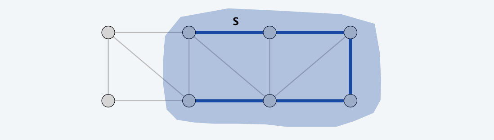
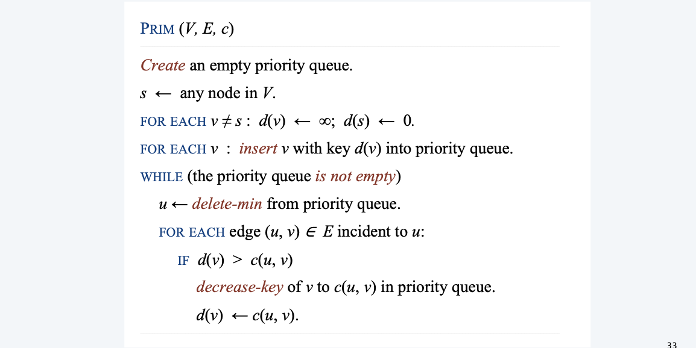

<!--more-->

[toc]


## Dijkstra's algorithm

**Problem.**  Given a digraph $G=(V, E),$ edge lengths $\ell \geq 0,$ source $s \in V$ and destination $t \in V,$ find the shortest directed path from $s$ to $t$

**Greedy approach.** Maintain a set of explored nodes $S$ for which algorithm has determined the shortest path distance $d(u)$ from $s$ to $u$.
- Initialize $S=\{s\}, d(s)=0$ 
- Repeatedly choose unexplored node $v$ which minimizes
$$
\pi(v)=\min _{e=(u, v): u \in S} d(u)+\ell_{e}
$$
add $v$ to $S$, and set $d(v) = \pi(v)$.

### Proof of Correctness

**Invariant.** For each node $u\in S$, $d(u)$ is the length of the shortest $s \approx u$ path.
- Base case: $|S|=1$ is easy since $S=\{s\}$ and $d(s)=0$
- Inductive hypothesis: Assume true for $|S|=k \geq 1$
  - Let $v$ be next node added to $S,$ and let $(u, v)$ be the final edge.
  - The shortest $s \sim u$ path plus $(u, v)$ is an suv path of length $\pi(v)$. 
  - Consider any sœv path $P$. **We show that it is no shorter than** $\pi(v)$. 
  - Let $(x, y)$ be the first edge in $P$ that leaves $S,$ and let $P^{\prime}$ be the subpath to $x$ **(Why don't we choose to add y?)**
  - $P$ is already too long as soon as it reaches $y .$ **(Why?)**
  - 

### Efficient Implementation
> Hint: 以存代算
**Critical optimization 1**. For each unexplored node $v$, explicitly
maintain $\pi(v)$ instead of computing directly from formula:
$$
\pi(v)=\min _{e-(u, v): u \in S} d(u)+\ell_{e}
$$
- For each $v \notin S, \pi(v)$ **can only decrease** (because $S$ only increases).
- More specifically, suppose $u$ is added to $S$ and there is an edge $(u, v)$ leaving $u$. Then, it suffices to update:
    $$
    \pi(v)=\min \{\pi(v), d(u)+\ell(u, v)\}
    $$

**Critical optimization 2.** Use a **priority queue** to choose the unexplored node that minimizes $\pi(v)$.
- Algorithm stores $d(v)$ for each explored node $v$
- Priority queue stores $\pi(v)$ for each unexplored node $v$
- Recall: $d(u)=\pi(u)$ when $u$ is deleted from priority queue.


**Performance**. Depends on PQ: n insert, n delete-min, m decrease-key. 
- Array implementation optimal for dense graphs.
- Binary heap much faster for sparse graphs.
- 4-way heap worth the trouble in performance-critical situations. 
- Fibonacci/Brodal best in theory, but not worth implementing.


### Variants
Can apply the idea of Dijkstra to ... 
- Undirected Graphs: $d(v) \le d(u) + \ell (u,v)$
- Maximum Capacity Paths: $d(v) \ge \min \left\{ \pi(u), c(u,v)\right\}$
- Maximum Reliability paths: $d(v) \ge d(u) \star \gamma (u,v)$ (components in a system)


## minimum spanning trees 

### Cycle-cut Intersection

**Def**. A **path** is a sequence of edges which connects a sequence of nodes. 
**Def**. A **cycle** is a path with no repeated nodes or edges other than the
starting and ending nodes.
**Def**. A **cut** is a partition of the nodes into two nonempty subsets S and V – S. 
**Def**. The **cutset** of a cut S is the set of edges with exactly one endpoint in S.

**Proposition**. A cycle and a cutset intersect in an even number of edges.


**Proposition**. Let T = (V, F) be a subgraph of G = (V, E). TFAE: 
- T is a spanning tree of G.
- T is acyclic and connected.
- T is connected and has n – 1 edges.
- T is acyclic and has n – 1 edges.
- T is minimally connected: removal of any edge disconnects it. 
- T is maximally acyclic: addition of any edge creates a cycle. 
- T has a unique simple path between every pair of nodes.

### MST

Given a connected graph $G = (V, E)$ with edge costs $c_e$, an MST is a subset of the edges $T \subset E$ such that $T$ is a spanning tree whose sum of edge costs is minimized.

**Cayley's theorem.** There are $n^{n–2}$ spanning trees of $K_n$. (*impossible to use brute-force*)


### A good example of transforming MST

Optimal message passing.
- Distribute message to n agents.
- Each agent can communicate with some of the other agents, but their communication is (independently) detected with probability $p_{ij}$.
- Group leader wants to transmit message to all agents so as to minimize the total probability that message is detected.

Objective
- Find tree $T$ that minimizes: $1-\prod_{(i, j) \in T}\left(1-p_{i j}\right)$
- Or equivalently, maximizes:  $\prod_{(i, j) \in T}\left(1-p_{i j}\right)$
- Or equivalently, maximizes: $\sum_{(i, j) \in T} \log \left(1-p_{i j}\right)$
- Or equivalently, MST with weights $p_{ij}$ (???)

### Fundamental Cycle
Note that,
- Adding any non-tree edge e to a spanning tree T forms unique cycle C. 
- Deleting any edge $f \in C$ from $T \cup \{ e \}$ results in new spanning tree.
**Observation.** If $c_e < c_f$ where $c_f$in $T$ and $c_e$ not, then $T$ is not an MST

### Fundamental cutset

Fundamental cutset.
- Deleting any tree edge f from a spanning tree T divide nodes into two connected components. Let D be cutset.
- Adding any edge $e \in D$ to $T – \{ f \}$ results in new spanning tree.
**Observation.** If $c_e < c_f$ where $c_f$ and $c_e$ are in the cut set, $c_f$in $T$ and $c_e$ not, then $T$ is not an MST

### The greedy Algorithm

Red rule.
- Let C be a cycle with no red edges. **(any cycle)**
- Select an uncolored edge of C of max weight and color it red.
Blue rule.
- Let D be a cutset with no blue edges. **(any cut)**
- Select an uncolored edge in D of min weight and color it blue.
Greedy algorithm.
- Apply the red and blue rules (**either or both, non-deterministically**!) until all edges are colored. The blue edges form an MST.
- Note: can stop once n – 1 edges colored blue.

> Note: the following algorithms are just efficient implementations (special cases) of the red/blue rule

### Proof of Correctness

**Color invariant**. There exists an MST $T^*$ containing all of the blue edges and none of the red edges.
**Proof** [by induction on number of iterations]
- Base case. No edges colored ⇒ every MST satisfies invariant.
- Induction step (blue rule). 
  - Suppose color invariant true before blue rule.
  - Let $D$ be chosen cutset, and let $f$ be edge colored blue.
  - if $f \in T^{*}, T^{*}$ still satisfies invariant.
  - Otherwise, **consider fundamental cycle** $C$ by adding $f$ to $T^{*}$. *(By Cycle cut intersection)*
  - let $e \in C$ be another edge in $D$.
  - $e$ is uncolored and $c e \geq c_{f}$ since
    - $e \in T^{*} \Rightarrow e$ not $\mathrm{red}$
    - blue rule $\Rightarrow e$ not blue and $c e \geq c f$
  - Thus, $T^{*} \cup\{f\}-\{e\}$ satisfies invariant.
- Induction step (red rule). 
  - Suppose color invariant true before red rule. 
  - let $C$ be chosen cycle, and let $e$ be edge colored red. 
  - if $e \notin T^{*}, T^{*}$ still satisfies invariant.
  - (by contradiction, e in spanning tree) Otherwise, consider fundamental cutset $D$ by deleting $e$ from $T^{*}$. 
  - let $f \in D$ be another edge in $C$. 
  - $f$ is uncolored and $c e \geq c f$ since
    - $f \notin T^{*} \Rightarrow f$ not blue
    - red rule $\Rightarrow f$ not red and $c e \geq c f$ 
  - Thus, $T^{*} \cup\{f\}-\{e\}$ satisfies invariant.

**Theorem**. The greedy algorithm terminates. Blue edges form an MST.

Pf. We need to show that either the red or blue rule (or both) applies.
- Suppose edge e is left uncolored.
- Blue edges form a forest.
- Case 1: both endpoints of e are in same blue tree.
  - ⇒ apply red rule to cycle formed by adding e to blue forest.
  - 
- Case 2: both endpoints of e are in different blue trees.
  - ⇒ apply blue rule to cutset induced by either of two blue trees.
  - 

## Prim, Kruskal, Boruvka 

### Prim Algorithm

```
Initialize S = any node.
Repeat (n-1) times:
- Add to tree the min weight edge with one endpoint in S
- Add new node to S
```

**Theorem**. Prim's algorithm computes the MST.
Pf. Special case of greedy algorithm (blue rule repeatedly applied to S).


**Theorem**. Prim's algorithm can be implemented in $O(m \log n)$ time. 
Pf. Implementation almost identical to Dijkstra's algorithm.
[ d(v) = weight of cheapest known edge between v and S ]



### Kruskal Algorithm
```
Consider edges in ascending order of weight: 
- Add to tree unless it would create a cycle.
```

**Theorem**. Kruskal's algorithm computes the MST. 
Pf. Special case of greedy algorithm.
- Case 1: both endpoints of e in same blue tree.
  - ⇒ color red by applying red rule to unique cycle.
  - i.e. all other edges in cycle are blue
- Case 2. If both endpoints of e are in different blue trees.
  - ⇒ color blue by applying blue rule to cutset defined by either tree.
  - no edge in cutset has smaller weight (since Kruskal chose it first)
- Case 3. If both endpoints are not in trees
  - it form a single tree

**Theorem**. Kruskal's algorithm can be implemented in $O(m \log m)$ time. 
- Sort edges by weight.
- Use union-find data structure to dynamically maintain connected components.

### Reverse-Delete Algorithm
```
Consider edges in descending order of weight: 
- Remove edge unless it would disconnect the graph.
```
**Theorem**. The reverse-delete algorithm computes the MST. Pf. Special case of greedy algorithm.
- Case 1: removing edge e does not disconnect graph.
  ⇒ apply red rule to cycle C formed by adding e to existing path between its two endpoints
- Case 2: removing edge e disconnects graph.
  ⇒ apply blue rule to cutset D induced by either component. 
  - e is the only edge in the cutset 
  - (any other edges must have been colored red / deleted)

Fact. [Thorup 2000] Can be implemented in $O(m \log n (\log \log n)^3)$ time.


### Borůvka's algorithm
```
Repeat until only one tree.
- Apply blue rule to cutset corresponding to **each** blue tree. 
- Color all selected edges blue.
```
> Benefit: Facilitates Parallel Computing for very large graph

**Theorem**. Borůvka's algorithm computes the MST. **(assume edge costs are distinct)**
Pf. Special case of greedy algorithm (repeatedly apply blue rule).


#### Implementation

**Theorem**. Borüvka's algorithm can be implemented in $O(m \log n)$ time. *(a slack upper bound)*
Pf.
- To implement a phase in $O(m)$ time:
  - compute connected components of blue edges
  - for each edge $(u, v) \in E,$ check if $u$ and $v$ are in different components;if so, update each component's best edge in cutset
- At most  $\log_2 n$ **phases** since each phase (at least) **halves total # trees**.

**Node contraction version.**
- After each phase, contract each blue tree to a single supernode. 
- **Delete parallel edges** (keeping only cheapest one) and self loops. 
- Borůvka phase becomes: take cheapest edge incident to each node.


**Theorem**. Borüvka's algorithm runs in $O(n)$ time on planar graphs.
Pf.
- To implement a Borüvka phase in $O(n)$ time:
  - use contraction version of algorithm
  - in planar graphs, $m \leq 3 n-6$
  - graph stays planar when we contract a blue tree
- Number of nodes (at least) halves.
- At most $\log_2 n$ phases: $c n+c n / 2+c n / 4+c n / 8+\ldots=O(n)$

### Borůvka-Prim algorithm
> Basic Idea:
> Boruvka - contract nodes (efficient when lot of nodes)
> Prim - add edges on contract graphs

**Theorem**. The Borüvka-Prim algorithm computes an MST and can be
implemented in $O(m \log \log n)$ time.
Pf.
- Correctness: special case of the greedy algorithm.
- The $\log_2 \log_2 n$ phases of Borúvka's algorithm take $O(m \log \log n)$ time; resulting graph has at most $n / \log 2 n$ nodes and $m$ edges.
- Prim's algorithm (using Fibonacci heaps) takes $O(m+n)$ time on a graph with $n / \log _{2} n$ nodes and $m$ edges.
$$
O\left(m+\frac{n}{\log n} \log \left(\frac{n}{\log n}\right)\right)
$$

> Does linear-time MST algorithm exist?
> - Not really

## Single-link clustering

An application of MST, 聚类问题

**Goal**. Given a set $U$ of $n$ objects labeled $p_{1}, \ldots, p_{n},$ partition into clusters so that objects in different clusters are far apart.

### Definitions

- **k-clustering.** Divide objects into $k$ non-empty groups.
- **Distance function.** Numeric value specifying "closeness" of two objects.
  - $d\left(p_{i}, p_{j}\right)=0$ iff $p_{i}=p_{j} \quad$ [identity of indiscernibles]
  - $\cdot d\left(p_{i}, p_{j}\right) \geq 0$  \[nonnegativity\]
  - $d\left(p_{i}, p_{j}\right)=d\left(p_{j}, p_{i}\right) \quad[$ symmetry $]$
- **Spacing**. Min distance between any pair of points in different clusters.
- **Goal**. Given an integer $k$, find a $k$ -clustering of maximum spacing.

> maximize the minimum distance between any pair


### Greedy Clustering Algorithm

“Well-known” algorithm in science literature for single-linkage k-clustering:
- Form a graph on the node set U, corresponding to n clusters.
- Find the closest pair of objects such that each object is in a different cluster, and add an edge between them.
- Repeat n – k times until there are exactly k clusters.
- 从完全图不断删边，至所需cluster

**Key observation**. This procedure is precisely Kruskal's algorithm (except we stop when there are k connected components).
**Alternative**. Find an MST and delete the k – 1 longest edges.

### Analysis

**Theorem**. Let $C^{*}$ denote the clustering $C^{*}, \ldots, C^{*}$, formed by deleting the $k-1$ longest edges of an MST. Then, $C^{*}$ is a $k$ -clustering of max spacing.
**Pf**. Let $C$ denote some other clustering $C_{1}, \ldots, C_{k}$
- The spacing of $C^{*}$ is the length $d^{*}$ of the $(k-1)^{\text {st }}$ longest edge in MST.
- Let $p_{i}$ and $p_{j}$ be in the same cluster in $C^{*},$ say $C^{*},$ but different clusters in $C,$ say $C_{s}$ and $C_{t}$
- Some edge $(p, q)$ on $p_{i}-p_{j}$ path in $C^{*}$, spans two different clusters in $C$.
- Edge $(p, q)$ has length $\leq d^{*}$ since it wasn't deleted.
- Spacing of $C$ is $\leq d^{*}$ since $p$ and $q$ are in different clusters.

