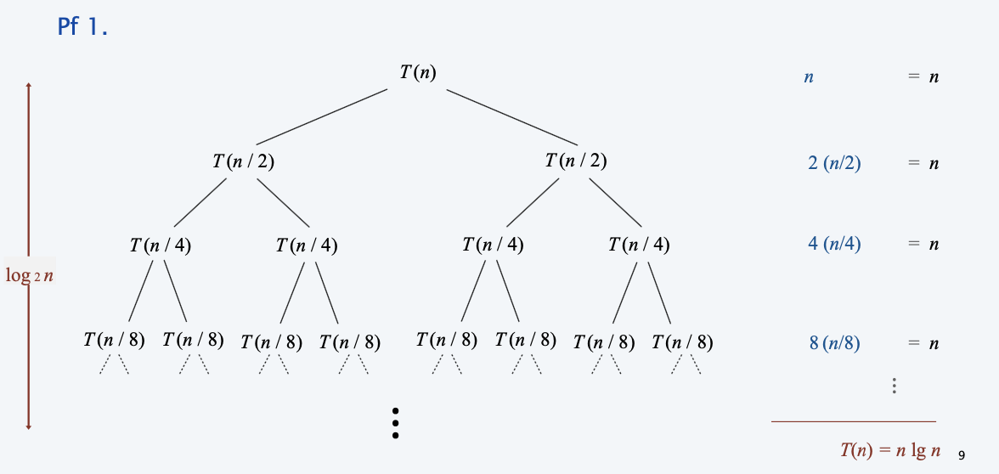
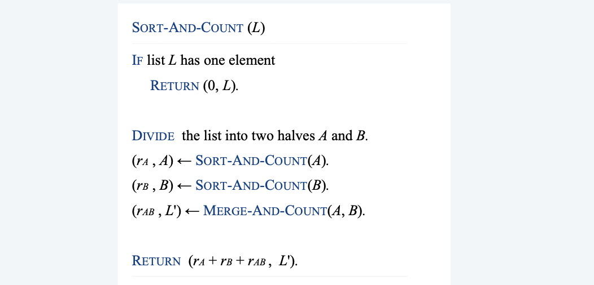
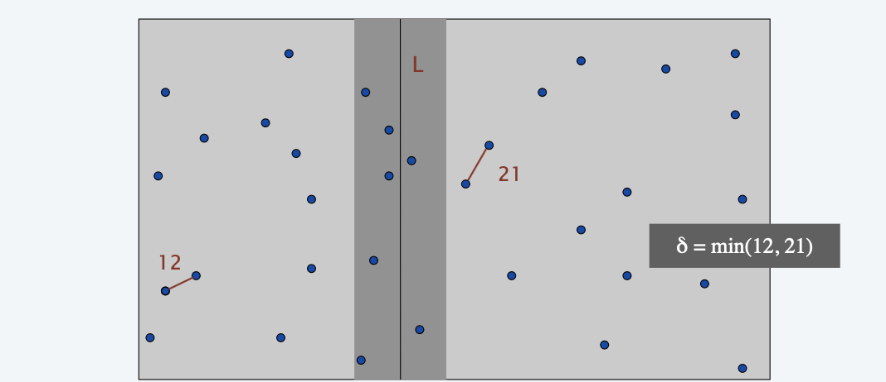
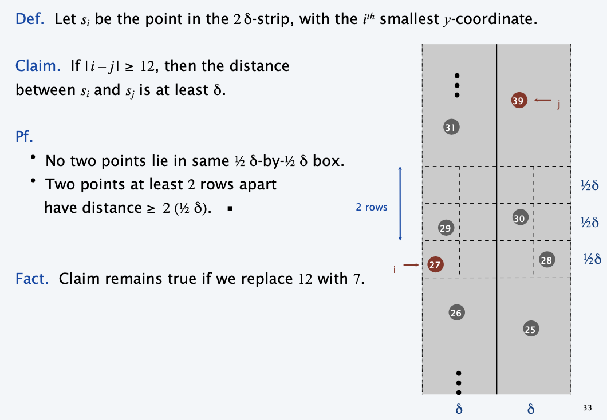
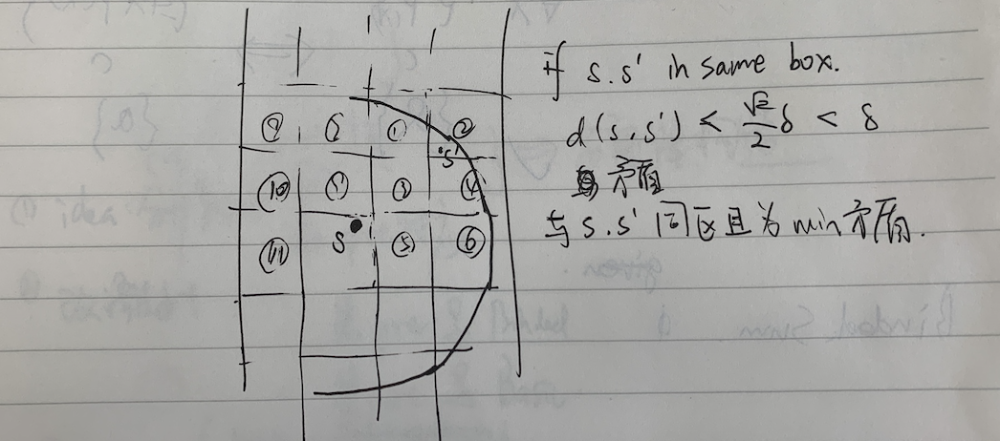
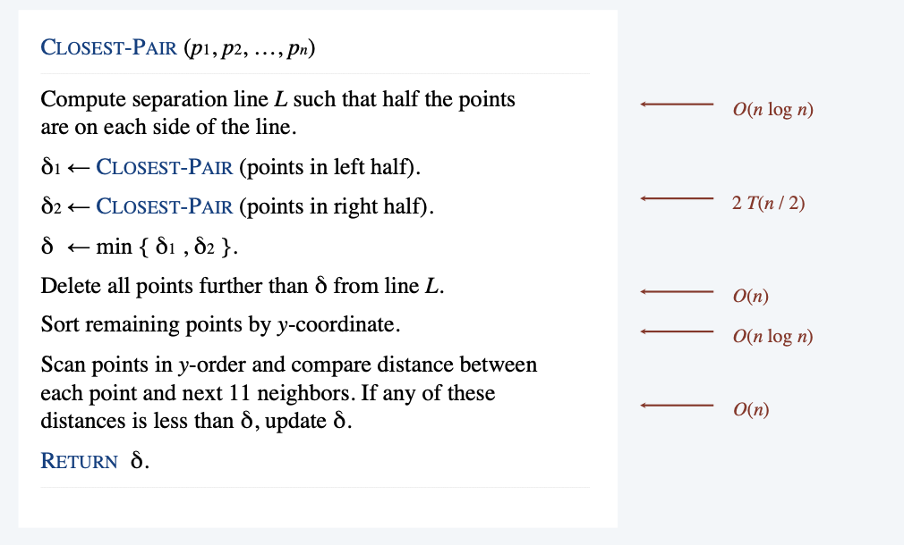
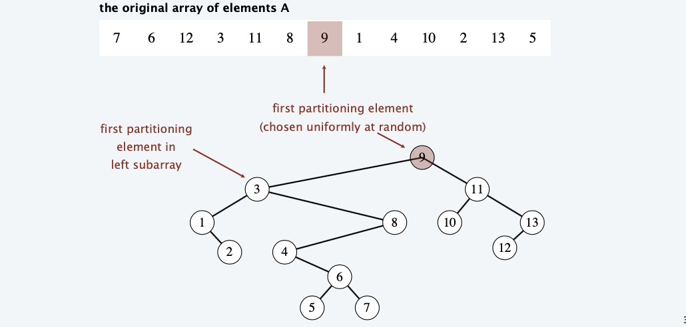

# Divide and Conquer (I)

<!-----
title: 【Algorithm】Divide and Conquer (I)
url: al-divide
date: 2020-10-02 15:27:46
tags: 
- Algorithm

categories: 
- Courses

----->

Divide-and-conquer.
- Divide up problem into several subproblems.
- Solve each subproblem recursively.
- Combine solutions to subproblems into overall solution.
Most common usage.
- Divide problem of size n into two subproblems of size n / 2 **in linear time.** 
- Solve two subproblems recursively.
- Combine two solutions into overall solution **in linear time**.
Consequence.
- Bruteforce: Θ(n^2). 
- Divide-and-conquer: Θ(nlogn).

<!--more-->

[[toc]]

## mergesort

**Def**. $T(n)=$ max number of compares to mergesort a list of size $\leq n$

**Note**. $T(n)$ is monotone nondecreasing.

**Mergesort recurrence**.
$$
T(n) \leq\left\{\begin{array}{ll}
0 & \text { if } n=1 \\
T(\ln / 2])+T(\ln / 2\rfloor)+n & \text { otherwise }
\end{array}\right.
$$

**Solution**. $T(n)$ is $O\left(n \log _{2} n\right)$

**Assorted proofs**. We describe several ways to prove this recurrence. Initially we assume $n$ is a power of 2 and replace $\leq$ with $=$

### Proof by recursion tree

Proposition. If $T(n)$ satisfies the following recurrence, then $T(n)=n \log _{2} n$
$$
T(n)=\left\{\begin{array}{ll}
0 & \text { if } n=1 \\
2 T(n / 2)+n & \text { otherwise }
\end{array}\right.
$$

### Proof by induction

> if n is the power of 2...

**Pf**. [ by induction on $n$ ]
Base case: when $n=1, T(1)=0$
Inductive hypothesis: assume $T(n)=n \log _{2} n$
Goal: show that $T(2 n)=2 n \log _{2}(2 n)$
$$
\begin{aligned}
T(2 n) &=2 T(n)+2 n \\
&=2 n \log 2 n+ 2 n \\
&=2 n\left(\log _{2}(2 n)-1\right)+2 n \\
&=2 n \log _{2}(2 n)
\end{aligned}
$$

> if n is not the power of 2...

**Claim**. If $T(n)$ satisfies the following recurrence, then $T(n) \leq n\left[\log _{2} n\right\rceil$
$$
T(n) \leq\left\{\begin{array}{ll}
0 & \text { if } n=1 \\
\left.T\left(\Gamma_{n} / 2\right\rceil\right)+T(\lfloor n / 2\rfloor)+n & \text { otherwise }
\end{array}\right.
$$
Pf. [by strong induction on $n]$
- Base case: $n=1$.
- Define $n_{1}=\lfloor n / 2\rfloor$ and $n_{2}=[n / 2\rceil$
- Induction step: assume true for $1,2, \ldots, n-1$

$$
\begin{aligned}
T(n) & \leq T\left(n_{1}\right)+T\left(n_{2}\right)+n \\
& \leq n_{1}\left[\log _{2} n_{1}\right]+n_{2}\left[\log _{2} n_{2}\right\rceil+n \\
& \leq n_{1}\left[\log _{2} n_{2}\right]+n_{2}\left[\log _{2} n_{2}\right]+n \\
&=n\left[\log _{2} n_{2}\right]+n \\
&\left.\leq n\left(\log _{2} n\right]-1\right)+n \\
&=n\left[\log _{2} n\right]
\end{aligned}
$$

## Counting Inversions

Application: Counting Inversions can help measure similarities.
- collaborative filtering (match people who are like you)
- sensitivity analysis of ranking function
- rank aggregation for meta-searching on the Web
- ...

### Algorithm

- Divide: separate list into two halves
- Conquer: count inversions in each list
- Combine: count inversions `(a,b)` with $a\in A$ and $b \i B$
  - How?
  - idea: binary search, if $A,B$ are sorted,
  - improvement: scan from left to right
    - Compare $a_i$ and $b_j$.
    - If $a_i < b_j$, then $a_i$ is not inverted with any element left in B.
    - If $a_i > b_j$, then $b_j$ is inverted with every element left in A. 
    - Append smaller element to sorted list C.

### Analysis

**Proposition**. The sort-and-count algorithm counts the number of inversions
in a permutation of size $n$ in $O(n \log n)$ time.
Pf. The worst-case running time $T(n)$ satisfies the recurrence:
$$
T(n)=\left\{\begin{array}{ll}
\Theta(1) & \text { if } n=1 \\
\left.\left.T\left\lceil n / 2\right\rceil\right)+T(\lceil n / 2\rfloor\right)+\Theta(n) & \text { otherwise }
\end{array}\right.
$$

By using master theorem we can get the complexity.

## Closest pair of points 

**Closest pair problem.** Given n points in the plane, find a pair of points with the smallest Euclidean distance between them.

**Brute force**. Check all pairs with Θ(n2) distance calculations.
**1d version**. Easy O(n log n) algorithm if points are on a line.
> by sorting, which implies whether sorting can help us reduce complexity
**Nondegeneracy assumption**. No two points have the same x-coordinate.

### Dividing Attempts
1. Sorting solution.
   - Sort by x-coordinate and consider nearby points. 
   - Sort by y-coordinate and consider nearby points.
2. Subdivide region into 4 quadrants.
   - Impossible to ensure $n / 4$ points in each piece.
   > in divide and conquer, bad division won't reduce complexity

### Solution
- Divide: **draw vertical line** L so that $n / 2$ points on each side.
  > Make sure our division is sound
- Conquer: find closest pair in each side recursively. 
- Combine: find closest pair with one point in each side.
  > How to reduce $O(n^2)$
- Return **best** of 3 solutions.

> Note: we've got the `min` of the two sub-problems, which can help us screen out many candidates.
> 
> Furthermore, Sort along L axis,
> Only check distances of those **within 11 positions in sorted list!**

> to compare i, we at most need to make comparisons with 12 points in the boxes, i.e. make 11 comparisons
> 
> Draw line and screen out, if the distance is greater or equal to 12, then the distance will essentially be greater than $\delta$
> Furthermore, the bound can be reduced from 11 to 7, _use other shapes to approximate the circle of radius $\delta$_

### Analysis

**Theorem**. The divide-and-conquer algorithm for finding the closest pair of points in the plane can be implemented in $O\left(n \log ^{2} n\right)$ time.
$$
T(n)=\left\{\begin{array}{ll}
\Theta(1) & \text { if } n=1 \\
\left.T\left(\Gamma_{n} / 2\right\rceil\right)+T(\lfloor n / 2\rfloor)+O(n \log n) & \text { otherwise }
\end{array}\right.
$$

**Lower bound.** In quadratic decision tree model(二项决策树模型), any algorithm
for closest pair (even in 1-D) requires $\Omega(n \log n)$ quadratic tests.

### Extension

Q. How to improve to $O(n \log n)$ ?
- bottleneck:
  - divide
  - sort remaining points
- idea: integrate `sort` into `mergesort`
  - we don't have to do sort every time
A. Yes. Don't sort points in strip from scratch each time.
- Each recursive returns two lists: all points sorted by x-coordinate, and all points sorted by y-coordinate.
- Sort by merging two pre-sorted lists.

> Random algorithm gives better performance, but not necessarily optimal
Theorem. [Shamos 1975$]$ The divide-and-conquer algorithm for finding the closest pair of points in the plane can be implemented in $O(n \log n)$ time.
Pf.
$$
T(n)=\left\{\begin{array}{ll}
\Theta(1) & \text { if } n=1 \\
\left.T\left(\Gamma_{n} / 2\right\rceil\right)+T\left(\left\lfloor_{n} / 2\right\rfloor\right)+\Theta(n) & \text { otherwise }
\end{array}\right.
$$
Note. See SECTION 13.7 for a randomized $O(n)$ time algorithm.

## Randomized quicksort 

**Proposition**. The expected number of compares to quicksort an array of n distinct elements is $O(n \log n)$.
**Pf**. Consider BST representation of partitioning elements.

- Observation 1: An element is compared with only its ancestors and descendants.
  - e.g. 3 & 6 are compared
- Observation 2: Pr[$a_i$ and $a_j$ are compared]= $2 / |j-i+1|$.
  - Pr[2 and 8 compared] = 2/7 
  - (compared if either 2 or 8 are chosen as partition before 3, 4, 5, 6 or 7)
$$
\begin{aligned}
&\begin{aligned}
\text { Expected number of compares }=\sum_{i=1}^{N} \sum_{j=i+1}^{N} \frac{2}{j-i+1} &=2 \sum_{i=1}^{N} \sum_{j=2}^{N-i+1} \frac{1}{j} \\
& \leq 2 N \sum_{j=1}^{N} \frac{1}{j}
\end{aligned}\\
&\sim 2 N \int_{x=1}^{N} \frac{1}{x} d x\\
&=2 N \ln N
\end{aligned}
$$

Remark. Number of compares only decreases if equal elements.

## median and selection

Omitted

