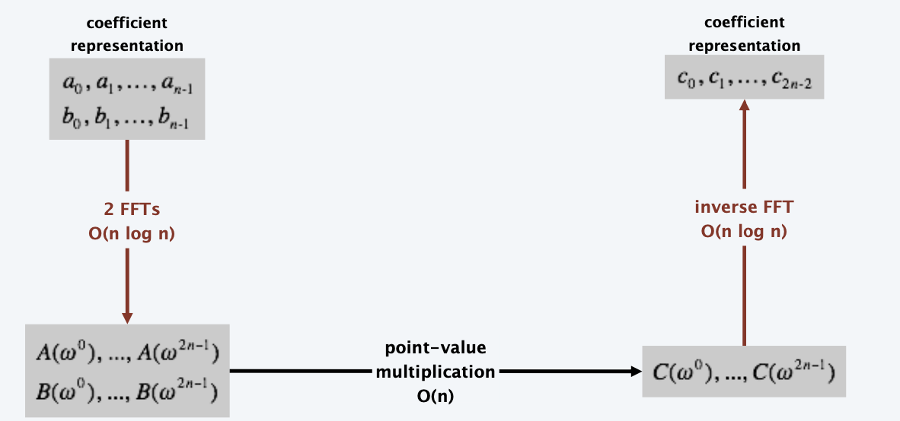

# Divide and Conquer (II)

<!-----
title: 【Algorithm】Divide and Conquer (II)
url: al-conquer
date: 2020-10-12 14:05:10
tags: 
- Algorithm

categories: 
- Courses

----->

<!--more-->

[[toc]]

## Master theorem

**Goal**. Recipe for solving common divide-and-conquer recurrences:
$$
T(n) = aT \left(\frac{n}{b}\right) + f(n)
$$

**Recursion Tree.**
- $k = \log_b n$ levels.
- $a^i$ = number of subproblems at level i. 
- $n / b^i$ = size of subproblem at level i.

### Case Examples

1. $T(n) = 3T(n/2) + n$ with $T(1) = 1$, $T(n) = 3n^{\log_2 3} - 2n$, $r = 3/2 > 1$ - leaf dominant, since problem grows faster than division
2. $T(n) = 2T(n/2) + n$ with $T(1) = 1$, $T(n) = n(\log_2 n + 1)$, $r = 1$ - the cost of all subproblems per layer - uniform
3. $T(n) = 3T(n/4) + n^5$ with $T(1) = 1$, $n^5 \le T(n) \le (1 + r + \ldots + ...) n^5 = \frac{1}{1-r} n^5$, $r = \frac{3}{4^5} < 1$ - merge dominant

### Master theorem. 

**Theorem**. Suppose that $T(n)$ is a function on the nonnegative integers that satisfies the recurrence
$$
T(n)=a T\left(\frac{n}{b}\right)+f(n)
$$
where $n / b$ means either $\lfloor n / b\rfloor$ or $\lceil n / b\rceil$. Let $k=\log _{b} a .$ Then,
- **Case 1**. (leaf dominant) If $f(n)=O\left(n^{k-\varepsilon}\right)$ for some constant $\varepsilon>0,$ then $T(n)=\Theta\left(n^{k}\right)$
- **Case 2**. (evenly distributed) If $f(n)=\Theta\left(n^{k} \log ^{p} n\right),$ then $T(n)=\Theta\left(n^{k} \log ^{p+1} n\right)$
- **Case 3**. (merge dominant) If $f(n)=\Omega\left(n^{k+\varepsilon}\right)$ for some constant $\varepsilon>0$ and if $a f(n / b) \leq c f(n)$ **for
some constant** $c<1$ **and all sufficiently large** $n,$ then $T(n)=\Theta(f(n))$
> After division, the scale of subproblem should be less than the original problem

Pf sketch.
- Use **recursion tree** to sum up terms (assuming n is an exact power of b). 
- Three cases for geometric series.
- _Deal with floors and ceilings._ (complexity)

## Integer multiplication

### Complex Multiplication

> Reduce the multiplication times in complex calculation

$(a+bi)(c+di)=x+yi$
- $x = ac - bd, y = bc+ad$
- $x = ac - bd, y = (a+b)(c+d) - ac - bd$

> idea: cut the 32-bit integer into 2*16bits to improve performance

### Divide and conquer multiplication

#### First Attempt

$$
(2^m a + b)(2^m c + d) = 2^{2m} ac + 2^m (bc+ad) + bd
$$

$$
T(n) = 4T(n/2) + \Theta(n) \quad (k = \log_2 4)\implies T(n) = \Theta(n^2)
$$

#### Karatsuba trick

$$
\begin{aligned}
(2^m a + b)(2^m c + d) &= 2^{2m} ac + 2^m (bc+ad) + bd \\
     2^{2m} ac + 2^m (ac + bd -(a-b)(c-d)) + bd
\end{aligned}
$$
> what about others like `bc+ad=(a+c)(b+d)-ac-bd`, it may cause the intermediate products to have an extra carry bit.

**Bottom Line.** Only three multiplication of $n/2$-bit integers
$$
T(n) = 3T(n/2) + \Theta(n) \quad (k = \log_2 3)\implies T(n) = \Theta(n^{\log_2 3})
$$

**Practice**. Faster than grade-school algorithm for about 320-640 bits.
> Can be applied in encryption (where long bits of multiplication is involved)

## Matrix multiplication 

- For grade-school matrix multiplication, $\Theta(n^3)$ arithmetic operations
- Block matrix multiplication,
  $$
  T(n) = 8T(n/2) + \Theta(n^2) \quad (k = \log 8 = 3) \implies T(n) = \Theta (n^3)
  $$

### Strassen's Trick

$$
T(n) = 7T(n/2) + \Theta(n^2) \quad (k = \log 7 ) \implies T(n) = \Theta (n^{2.81})
$$

Q. What if n is not a power of 2? 
A. Could pad matrices with zeros. (but expensive when $n$ is large)
> Research on such topics/ sparse matrix is going on

## Convolution and FFT

### Polynomials: coefficient representation
**Polynomial**. [coefficient representation]
$$
\begin{array}{l}
A(x)=a_{0}+a_{1} x+a_{2} x^{2}+\cdots+a_{n-1} x^{n-1} \\
B(x)=b_{0}+b_{1} x+b_{2} x^{2}+\cdots+b_{n-1} x^{n-1}
\end{array}
$$
**Add**. $O(n)$ arithmetic operations.
$$
A(x)+B(x)=\left(a_{0}+b_{0}\right)+\left(a_{1}+b_{1}\right) x+\cdots+\left(a_{n-1}+b_{n-1}\right) x^{n-1}
$$
**Evaluate**. $O(n)$ using Horner's method.
$$
A(x)=a_{0}+\left(x\left(a_{1}+x\left(a_{2}+\cdots+x\left(a_{n-2}+x\left(a_{n-1}\right)\right) \cdots\right)\right)\right.
$$
**Multiply** (convolve). $O\left(n^{2}\right)$ using brute force.
$$
A(x) \times B(x)=\sum_{i=0}^{2 n-2} c_{i} x^{i}, \text { where } c_{i}=\sum_{j=0}^{i} a_{j} b_{i-j}
$$

### Polynomials: point-value representation

**Fundamental theorem of algebra**. A degree n polynomial with complex coefficients has exactly n complex roots.
**Corollary**. A degree $n – 1$ polynomial A(x) is uniquely specified by its evaluation at n distinct values of x

**Polynomial**. [point-value representation]
$$
\begin{array}{l}
A(x):\left(x_{0}, y_{0}\right), \ldots,\left(x_{n-1}, y_{n-1}\right) \\
B(x):\left(x_{0}, z_{0}\right), \ldots,\left(x_{n-1}, z_{n-1}\right)
\end{array}
$$
**Add**. $O(n)$ arithmetic operations.
$$
A(x)+B(x):\left(x_{0}, y_{0}+z_{0}\right), \ldots,\left(x_{n-1}, y_{n-1}+z_{n-1}\right)
$$
**Multiply** (convolve). $O(n),$ but need $2 n-1$ points.
$$
A(x) \times B(x): \quad\left(x_{0}, y_{0} \times z_{0}\right), \ldots,\left(x_{2 n-1}, y_{2 n-1} \times z_{2 n-1}\right)
$$
**Evaluate**. $O\left(n^{2}\right)$ using Lagrange's formula.
$$
A(x)=\sum_{k=0}^{n-1} y_{k} \frac{\prod_{j \neq k}\left(x-x_{j}\right)}{\prod_{j\neq k}\left(x_{k}-x_{j}\right)}
$$

### Converting between two representations

**Tradeoff.** Fast evaluation or fast multiplication. We want both!

representation | multiply  | evaluate
 --- | --- | ---
coefficient | $O(n^2)$ | $O(n)$
point-value | $O(n)$   | $O(n^2)$

**Goal**. Efficient conversion between two representations $\implies$ all ops fast.

### Coefficient $\Rightarrow$ point-value.

 Given a polynomial $a_{0}+a_{1} x+\ldots+a_{n-1} x^{n-1},$
evaluate it at $n$ distinct points $x_{0}, \ldots, x_{n-1}$
$$
\left[\begin{array}{c}
y_{0} \\
y_{1} \\
y_{2} \\
\vdots \\
y_{n-1}
\end{array}\right]=\left[\begin{array}{ccccc}
1 & x_{0} & x_{0}^{2} & \cdots & x_{0}^{n-1} \\
1 & x_{1} & x_{1}^{2} & \cdots & x_{1}^{n-1} \\
1 & x_{2} & x_{2}^{2} & \cdots & x_{2}^{n-1} \\
\vdots & \vdots & \vdots & \ddots & \vdots \\
1 & x_{n-1} & x_{n-1}^{2} & \cdots & x_{n-1}^{n-1}
\end{array}\right]\left[\begin{array}{c}
a_{0} \\
a_{1} \\
a_{2} \\
\vdots \\
a_{n-1}
\end{array}\right]
$$
Running time. $O\left(n^{2}\right)$ for matrix-vector multiply (or $n$ Horner's).
> How to find the n points is the key to efficiency

### Point-value $\Rightarrow$ coefficient. 

Given $n$ distinct points $x_{0}, \ldots, x_{n-1}$ and values
$y_{0}, \ldots, y_{n-1},$ find unique polynomial $a_{0}+a_{1} x+\ldots+a_{n-1} x^{n-1},$ that has given values at given points.
$\square \square$
$$
\left[\begin{array}{c}
y_{0} \\
y_{1} \\
y_{2} \\
\vdots \\
y_{n-1}
\end{array}\right]=\left[\begin{array}{ccccc}
1 & x_{0} & x_{0}^{2} & \cdots & x_{0}^{n-1} \\
1 & x_{1} & x_{1}^{2} & \cdots & x_{1}^{n-1} \\
1 & x_{2} & x_{2}^{2} & \cdots & x_{2}^{n-1} \\
\vdots & \vdots & \vdots & \ddots & \vdots \\
1 & x_{n-1} & x_{n-1}^{2} & \cdots & x_{n-1}^{n-1}
\end{array}\right]\left[\begin{array}{c}
a_{0} \\
a_{1} \\
a_{2} \\
\vdots \\
a_{n-1}
\end{array}\right]
$$
Vandermonde matrix is invertible iff $\mathrm{x}_{i}$ distinct
Running time. $O\left(n^{3}\right)$ for Gaussian elimination.
or $\mathrm{O}\left(\mathrm{n}^{2.3727}\right)$ via fast matrix multiplication

### Discrete Fourier Transform

Coefficient $\Rightarrow$ point-value.
- Key idea. Choose $x_k = \omega^k$ where ω is principal nth root of unity.
- The nth roots of unity are: $\omega_0$, $\omega_1$, ..., $\omega_{n-1}$ where $\omega = e^{2\pi i/n}$
- The $1⁄2$nth roots of unity are: $\nu_0$, $\nu_1$, ..., $\nu_{n/2 -1}$ where $\nu = \omega^2 = e^{4\pi i/n}$

### Fast Fourier Transform

**Goal**. Evaluate a degree $n-1$ polynomial $A(x)=a_{0}+\ldots+a_{n-1} x^{n-1}$ at its $n^{t h}$ roots of unity: $\omega^{0}, \omega^{1}, \ldots, \omega^{n-1}$

**Divide**. Break up polynomial into even and odd powers.
- $A_{\text {even}}(x)=a_{0}+a_{2} x+a_{4} x^{2}+\ldots+a_{n-2} x^{n / 2-1}$
- $A_{\text{odd}}(x)=a_{1}+a_{3} x+a_{5} x^{2}+\ldots+a_{n-1} x^{n / 2-1}$
- $A(x)=A_{\text {even}}\left(x^{2}\right)+x A_{\text {odd}}\left(x^{2}\right)$

**Conquer**. Evaluate $A_{\text {even}}(x)$ and $A_{\text {odd}}(x)$ at the $1 / 2 n^{\text {th}}$ roots of unity: $v^{0}, v^{1}, \ldots, v^{n / 2-1}$

**Combine**.
$A\left(\omega^{k}\right)=A_{\text {even}}\left(v^{k}\right)+\omega^{k} A_{\text {odd}}\left(v^{k}\right), 0 \leq k<n / 2$
$A\left(\omega^{k+1 / 2 n}\right)=A_{\text {even}}\left(v^{k}\right)-\omega^{k} A_{\text {odd}}\left(v^{k}\right), 0 \leq k<n / 2$

**Theorem**. The FFT algorithm evaluates a degree n – 1 polynomial at each of the nth roots of unity in $O(n \log n)$ steps and O(n) extra space.

**Proof.**
$$
T(n) = 2T(n/2) + \Theta(n) \implies T(n) = \Theta(n\log n)
$$

### Inverse FFT

**Claim**. Inverse of Fourier matrix $F_{n}$ is given by following formula:
$$
G_{n}=\frac{1}{n}\left[\begin{array}{cccccc}
1 & 1 & 1 & 1 & \cdots & 1 \\
1 & \omega^{-1} & \omega^{-2} & \omega^{-3} & \cdots & \omega^{-(n-1)} \\
1 & \omega^{-2} & \omega^{-4} & \omega^{-6} & \cdots & \omega^{-2(n-1)} \\
1 & \omega^{-3} & \omega^{-6} & \omega^{-9} & \cdots & \omega^{-3(n-1)} \\
\vdots & \vdots & \vdots & \vdots & \ddots & \vdots \\
1 & \omega^{-(n-1)} & \omega^{-2(n-1)} & \omega^{-3(n-1)} & \cdots & \omega^{-(n-1)(n-1)}
\end{array}\right]
$$
$\mathrm{F_n} / \sqrt{\mathrm{n}}$ is a unitary matrix

**Consequence**. To compute inverse FFT, apply same algorithm but use
$\omega^{-1}=e^{-2 \pi i / n}$ as principal $n^{t h}$ root of unity (and divide the result by $n$ ).

(Don't forget to divide result by n)

### Polynomial multiplication

**Theorem**. Can multiply two degree n – 1 polynomials (*padding with 0s to make n a power of 2*) in $O(n \log n)$ steps.

**Pf**.

> Advanced Topics:
> Efficient Implementations with recusrion tree, bit-reverse order