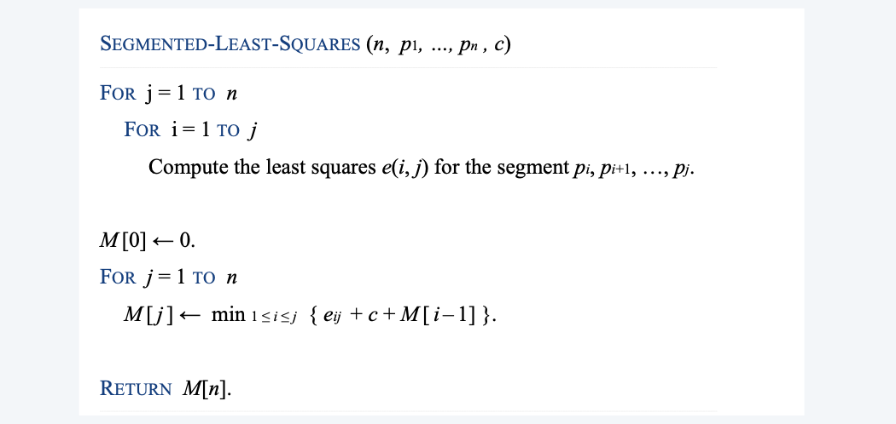
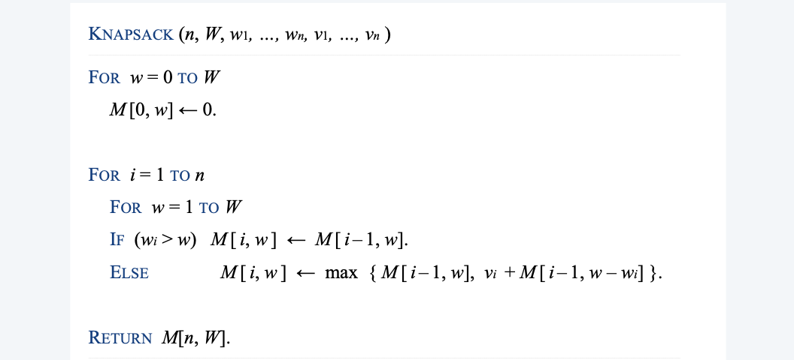

**Dynamic programming**. Break up a problem into a series of overlapping subproblems, and build up solutions to larger and larger subproblems.

<!--more-->

## Introduction

Some famous dynamic programming algorithms.
- Unix `diff` for comparing two files.
- Viterbi for hidden Markov models.
- De Boor for evaluating spline curves.
- Smith-Waterman for genetic sequence alignment. 
- Bellman-Ford for shortest path routing in networks. 
- Cocke-Kasami-Younger for parsing context-free grammars.

## Weighted Interval Scheduling

### Problem
Weighted interval scheduling problem.
- Job j starts at $s_j$, finishes at $f_j$, and has weight or value $v_j$.
- Two jobs compatible if they don't overlap.
- Goal: find maximum weight subset of mutually compatible jobs.

### Idea

> Preprocessing:
> 
**Notation**. Label jobs by finishing time: f1 ≤ f2 ≤ . . . ≤ fn .

> We first model the notion of **compatible**, in order to represent them in the result

**Def**. $p(j)$ = largest index $i < j$ such that job $i$ is compatible with $j$.
Ex. $p(8)=5,p(7)=3,p(2)=0$.

**Notation**. $OPT(j)$= value of optimal solution to the problem consisting of job requests $1, 2, ..., j$.

> idea: either a job is in the optimal solution or not. What's the difference?
> or How to degrade the problem into smaller ones?

**Case 1**. OPT selects job j.
- Collect profit $v_j$.
- Can't use incompatible jobs $\{p(j) + 1, p(j) + 2, ..., j - 1\}$.
- Must include optimal solution to problem consisting of remaining compatible jobs $1, 2, ..., p(j)$.
  > To be found by subproblems
**Case 2**. OPT does not select job j.
- Must include optimal solution to problem consisting of remaining compatible jobs 1, 2, ..., j - 1.

> Now we can Write a recurrence

### Implementation

> Observation, there must be some redundancy between $OPT(p(j))$ and $OPT(j-1)$ (since $p(j) \le j - 1$)
> **Memoization**. Cache results of each subproblem; lookup as needed.

### Analysis

**Claim.** Memorized version of algorithm takes $O(n\log n)$ time
- Sort by finish time $O(n\log n)$
- Computing $p(\cdot)$: $O(n\log n)$ via sorting by starting time
- `M-Compute-Opt(j)`： either takes $O(1)$ time or make recursive calls
  > but $n$ entry will at most be filled $n$ times, $2n$ recursive calls
  $O(n)$

### Find the solution
> Now we know the optimal value, what about the solution?
> **Note.** forall DP problems, to know the composition of DP solutions, we can _*make a second pass*_
> After running DP, we know `OPT(n)` and `OPT(n-1)`
> - if `OPT(n) - OPT(n-1) = 0`, we know that job `n` is not selected
> - if `OPT(n) - OPT(n-1) = v(n)`, `n` is selected

**Analysis**. # of recursive calls ≤ n ⇒ O(n).

### Easier Implementation: bottom-up

**Bottom-up dynamic programming**. Unwind recursion.

## Segmented Least Squares

### Problem

> Recall: linear least square

**Least squares.** Foundational problem in statistics.
- Given n points in the plane: $(x_1, y_1), (x_2, y_2) , ..., (x_n, y_n)$.
- Find a line $y = ax + b$ that minimizes the sum of the squared error:

$$
SSE = \sum_{i=1}^n (y_i - ax_i -b)^2
$$

**Solution.**(最小二乘法) min error is achieved when

**Segmented least squares.**
- Points lie roughly on a sequence of several line segments. 
- Given n points in the plane: $(x_1, y_1), (x_2, y_2) , ..., (x_n, y_n)$ with $x_1 < x_2 < \ldots < x_n$, find a sequence of lines that minimizes $f (x)$.

> Connect all points with segments? Use one segment?

**Q.** What is a reasonable choice for $f(x)$ to balance *accuracy* and *parsimony*?

> The cost function will be composed of two parts: square error and number of lines
> Formal Problem:
Given n points in the plane: $(x_1, y_1), (x_2, y_2) , ..., (x_n, y_n)$ with $x_1 < x_2 < \ldots < x_n$ and a constant $c > 0$, find a sequence of lines that minimizes $f (x) = E + c L$:
- E = the sum of the sums of the squared errors in each segment. 
- L = the number of lines.

### Solution

> First step in DP, define `OPT` 最优子结构（要求：可迭代）

**Notation.**
- `OPT(j)` = minimum cost for points $p_i,p_2,\ldots,p_j$,
- `e(i,j)` = minimum sum of squares for points $p_i, p_{i+1},\ldots,p_j$

**To Compute `OPT(j)`**...
> We can choose any point before, and add an extra line to include the points after it
- Last segment uses points $p_i, p_{i+1}, \ldots, p_j$ for some i.
- $Cost = e(i,j) + c + OPT(i-1)$.
  > optimal substructure property (proof via exchange argument)
 

> **Remark**. For DP problems, we usually need to scan the solution of all sub problems (unlike divide and conquer)

### Analysis

**Theorem**. [Bellman 1961] The dynamic programming algorithm solves the segmented least squares problem in $O\left(n^{3}\right)$ time and $O\left(n^{2}\right)$ space.
**Pf**.
- Bottleneck = computing $e(i, j)$ for $O\left(n^{2}\right)$ pairs.
- $O(n)$ per pair using formula.
$$
a=\frac{n \sum_{i} x_{i} y_{i}-\left(\sum_{i} x_{i}\right)\left(\sum_{i} y_{i}\right)}{n \sum_{i} x_{i}^{2}-\left(\sum_{i} x_{i}\right)^{2}}, \quad b=\frac{\sum_{i} y_{i}-a \sum_{i} x_{i}}{n}
$$

**Remark**. Can be improved to $O\left(n^{2}\right)$ time and $O(n)$ space by precomputing various statistics. How?
- By storing $\sum x_i$

## Knapsack Problem

- Given n objects and a "knapsack." 
- Item $i$ weighs $w_i >0$ and has value $v_i >0$. 
- Knapsack has capacity of W.
- Goal: fill knapsack so as to maximize total value.

**Observation**. None of greedy algorithms is optimal.
- Greedy by value. Repeatedly add item with maximum vi.
- Greedy by weight. Repeatedly add item with minimum wi. 
- Greedy by ratio. Repeatedly add item with maximum ratio vi / wi. (only functions well when mod = 0)

### A False Example

**Def**. `OPT(i)` = max profit subset of items $1, ..., i$. 

**Case 1**. OPT does not select item i.
- OPT selects best of { 1, 2, ..., i - 1 }.
  > OK: optimal substructure property (proof via exchange argument)
**Case 2**. OPT selects item i. 
- Selecting item i does not immediately imply that we will have to reject other items.
  > We cannot instantly decide which things to eliminate.
- Without knowing what other items were selected before i, we don't even know if we have enough room for i.
  > We cannot relate the constraint in the current problem with the sub problem in the recurrence
Conclusion. Need more subproblems!
> the single dimension `value` can't work

### Solution: Add a new variable

**Def**. `OPT(i, w)` = max profit subset of items 1, ..., i with weight limit w. 
**Case 1**. OPT does not select item i.
- OPT selects best of { 1, 2, ..., i - 1 } using weight limit w.
**Case 2**. OPT selects item i.
- New weight limit = $w - w_i$.
- OPT selects best of { 1, 2, ..., i - 1 } using this new weight limit.

> Now in both cases: **optimal substructure property (proof via exchange argument)**

### Implementation: bottom-up

> Problem, we need to traverse the `weight` space, which requires the weight to be an integer (sparse)
> a trade off between all combinations VS $N\times W_{\max}$

### Analysis

Theorem. There exists an algorithm to solve the knapsack problem with n items and maximum weight $W$ in $\Theta(n W)$ time and $\Theta(n W)$ space.
Pf.
- Takes O(1) time per table entry.
- There are $\Theta(n W)$ table entries.
- After computing optimal values, can trace back to find solution:
  - take item i in `OPT(i,w)` iff `M[i,w] > M[i-1,w]`.

**Remarks**.
- Not polynomial in input size!
  > pseudo-polynomial
  > if the given `W` is very large
- Decision version of knapsack problem is NP-COMPLETE. [ CHAPTER 8 ] 
- There exists a poly-time algorithm that produces a feasible solution that has value within 1% of optimum. [ SECTION 11.8 ]

## RNA secondary structure

### Problem definition

**RNA**. String B = $b_1 b_2 \ldots b_n$ over alphabet { A, C, G, U }.

**Secondary structure.** RNA is single-stranded so it tends to loop back and form base pairs with itself. This structure is essential for understanding behavior of molecule.

**Secondary structure.** A set of pairs S = { ($b_i$, $b_j$) } that satisfy: 
- [Watson-Crick] S is a matching and each pair in S is a Watson-Crick complement: A-U, U-A, C-G, or G-C.
- [No sharp turns] The ends of each pair are separated by at least 4 intervening bases. If $(b_i, b_j) \in S$, then i < j - 4.
- [Non-crossing] If $(b_i, b_j)$ and $(b_k, b_l)$ are two pairs in S, then we cannot have i < k < j < l.

**Free energy**. Usual hypothesis is that an RNA molecule will form the secondary structure with the minimum total free energy.

**Goal**. Given an RNA molecule B = $b_1 b_2 \ldots b_n$, find a secondary structure S that maximizes the number of base pairs.

### Solution

> Define subproblems

**False Attempt.** `OPT(j)=` maximum number of base pairs in a secondary structure of the substring $b_1 b_2 \ldots b_j$

**Difficulty**. Results in two subproblems but one of wrong form.
- Find secondary structure in $b_1 b_2\ldots b_{i-1}$
- Find secondary structure in $b_{i+1} b_{i+2} \ldots b_{n-1}$
  > 最优子结构不成立

**Notation.** `OPT(i,j)=` maximum number of base pairs in a secondary structure of the substring $b_i b_{i+1} \ldots b_j$

**Case 1**. If $i \ge j-4$.
- `OPT(i, j) = 0` by no-sharp turns condition.
**Case 2.** Base $b_j$ is not involved in a pair. 
- `OPT(i, j) = OPT(i, j - 1)`.
**Case 3.** Base $b_j$ pairs with $b_t$ for some $i \le t < j - 4$.
- Noncrossing constraint decouples resulting subproblems. 
- `OPT(i, j) =` $1 + \max_t \{ OPT(i, t - 1) + OPT(t + 1, j - 1) \}$ where $i \le t < j-4$ and $b_t$ and $b_j$ are complements.

> Note: no-crossing is an important condition since it clearly decompose the problem into two subproblems(with no other dirty work).

### Implementation

> Evalutation Order matters!

**Q**. In which order to solve the subproblems? 
**A**. **Do shortest intervals first**. (k = j - i)

> k = the length of the interval
> Since we are always building solutions based on shorter intervals

**Theorem**. The dynamic programming algorithm solves the RNA secondary substructure problem in $O(n^3)$ time and $O(n^2)$ space.

## Summary

**Outline**.
- Polynomial number of subproblems.
- Solution to original problem can be computed from **subproblems**. 
- **Natural ordering of subproblems from smallest to largest**, with an **easy-to-compute recurrence** that allows one to determine the solution to a subproblem from the solution to smaller subproblems.

**Techniques.**
- Binary choice: weighted interval scheduling.
- Multiway choice: segmented least squares.
- Adding a new variable: knapsack problem.
- Dynamic programming over intervals: RNA secondary structure.

**Top-down vs. bottom-up.** Different people have different intuitions.