Application of **Dynamic programming** in Interval Matching & Graphs

<!--more-->

[[toc]]

## Sequence Alignment

### String Similarity

> Recall: we've counted inversions to compare similarity

Use mismatches and gap to compare strings.

**Edit Distance**.
- Gap penalty $\delta$, mismatch penalty $\alpha_{pq}$
- Cost = sum of gap and mismatch penalties

**Applications**. Unix diff, speech recognition, computational biology, ...

### Problem Definition

**Goal.** Given two strings $x_1, x_2, ... x_m$ and $y_1, y_2, ..., y_n$ find min cost alignment.

**Def.**  An alignment M is a set of ordered pairs $x_i – y_j$ such that each item occurs in at most one pair and no crossings. 
- crossing is $x_i –y_j$ and $x_i^{\prime} –y_j^{\prime}$ cross if $i<i'$,but $j>j'$

**Def**. The cost of an alignment M is:

### Analysis

**Def**. OPT(i, j) = min cost of aligning prefix strings $x_1,x_2, ..., x_i$ and $y_1, y_2, ...,y_j$. 

**Case 1**. OPT matches $x_i – y_j$.
Pay mismatch for $x_i – y_j$ + min cost of aligning $x_1, x_2, ..., x_{i–1}$ and $y_1, y_2, ... y_{j–1}$. 

**Case 2a**. OPT leaves $x_i$ unmatched.
Pay gap for $x_i$ + min cost of aligning $x_1, x_2, ..., x_{i–1}$ and $y_1, y_2, ... y_{j}$.

**Case 2b**. OPT leaves $y_j$ unmatched.
Pay gap for $y_j$ + min cost of aligning $x_1, x_2, ..., x_{i}$ and $y_1, y_2, ... y_{j-1}$.

### Implementation

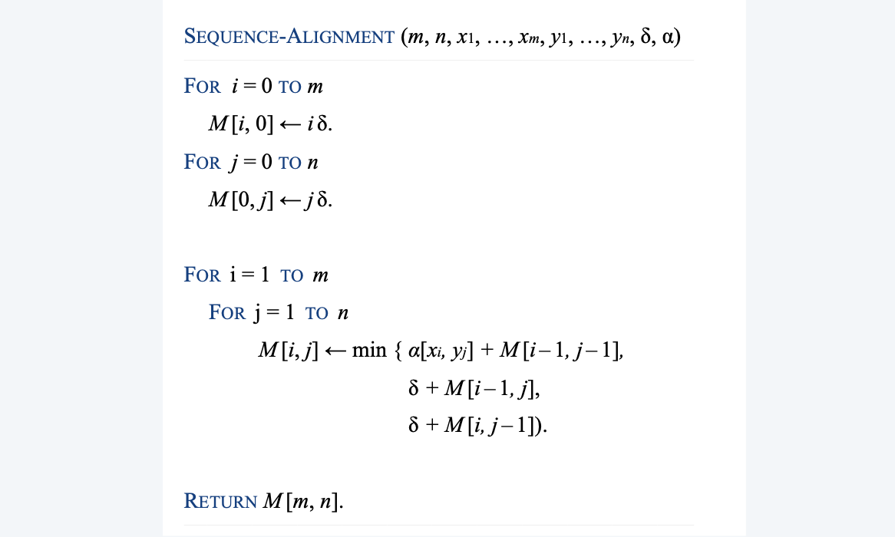

### Analysis

**Theorem**. The dynamic programming algorithm computes the edit distance (and optimal alignment) of two strings of length m and n in $\Theta(mn)$ time and $\Theta(mn)$ space.
**Pf**.
- Algorithm computes edit distance.
- Can trace back to extract optimal alignment itself.

> When matching, `m` and `n` can be very large
> Space is a problem
**Q**. Can we avoid using quadratic space?
**A**. Easy to compute optimal value in $O(mn)$ time and $O(m + n)$ space.
> Note, when we are computing `M[i,j]`, we only need `M[i-1,j]`, `M[i,j-1]` and `M[i-1,j-1]`
> A simple implementation: We only need two rows of data, update them as we go forward
- Compute `OPT(i, •)` from `OPT(i – 1, •)`.
- **But**, no longer easy to recover optimal alignment itself.
  > The following algorithm can keep space complexity small while preserving the possibility of recovering

## Hirschberg's algorithm

### Sequence alignment in linear space
**Theorem**. There exist an algorithm to find an optimal alignment in O(mn) time and O(m + n) space.
- Clever combination of *divide-and-conquer* and *dynamic programming*.
- Inspired by idea of Savitch from complexity theory.

### Hirschberg's algorithm

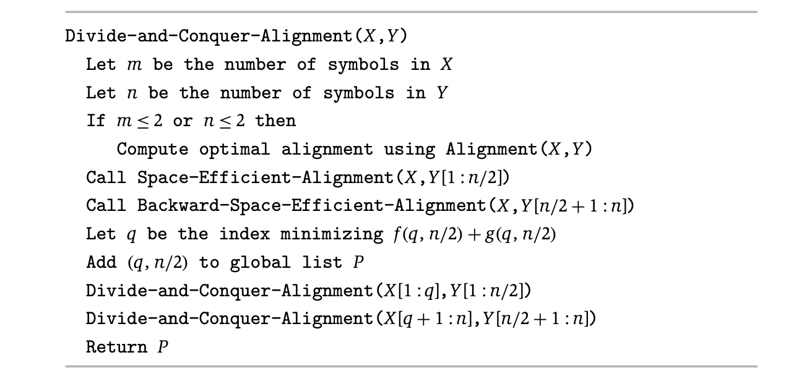

> Idea: view the DP process as a directed graph, find the shortest path

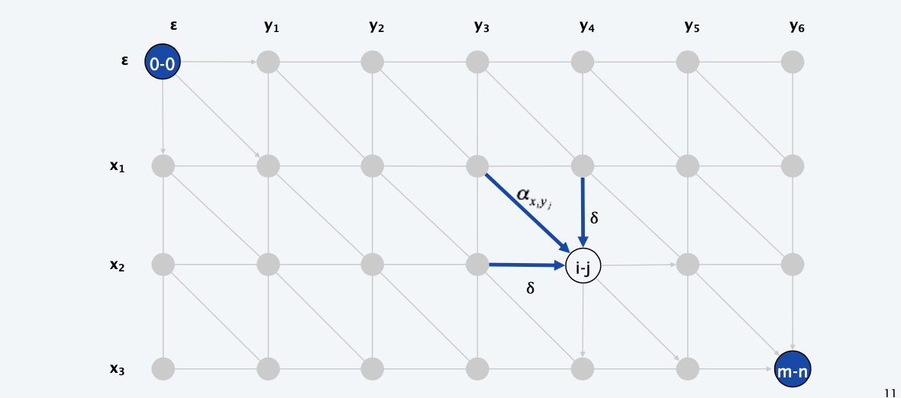

Edit distance graph.
- Let $f(i, j)$ be shortest path from (0,0) to $(i, j)$
- Lemma: $f(i, j)=O P T(i, j)$ for all $i$ and $j$

> The path view and the orginal DP view are equivalent in semantics, pF by strong induction on `i+j`

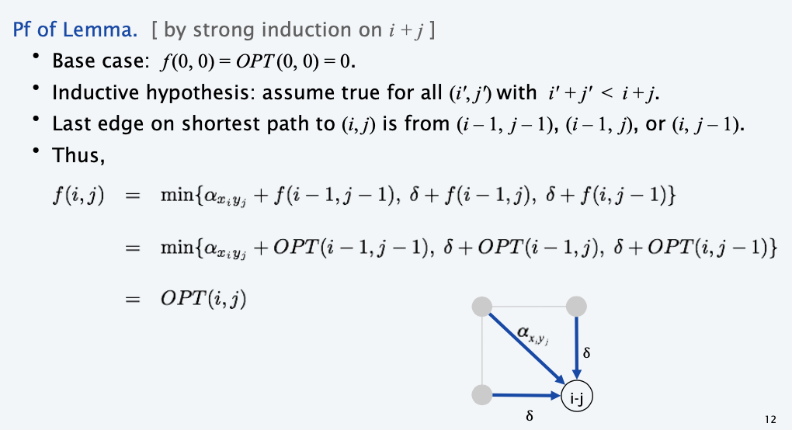

> observation: the shortest path must pass one node in a middle column

> Note: when you are dividing, you are cutting the problem into a even smaller problem (instead of half-half), so the master theorem will give a loser bound

## Bellman-Ford

**Dijkstra**. Can fail if negative edge weights. (Check assumption of Dijkstra)

**Reweighting**. Adding a constant to every edge weight can fail.

> The foundamental reason why Dijkstra fails:
> - The basic assumption in Dijkstra, assume edges are added to the frontier incrementally (w.r.t distance from begin)
> 
> - when exist negative cycles, we can't even find the solution

**Lemma1:** if negative cycles exist, no shortest path can be found.
**Lemma2:** If G has no negative cycles, then there exists a cheapest path from v to t that is simple ( and has $\le n–1$ edges). (Otherwise, we can remove the cycle)
> Gives an upper bound of the DP solution

### Solution with DP

> What is the optimal substructure

**Def.** Given terminal `v`, $OPT(i,v)$=cost of shortest path from v to t that use $\le i$ edges.
**Case 1:** Cheapest $v \sim t$ path uses $\leq i-1$ edges.
- $O P T(i, v)=\operatorname{OPT}(i-1, v)$
**Case 2:** Cheapest $v \sim t$ path uses exactly $i$ edges.
- if $(v, w)$ is first edge, then $O P T$ uses $(v, w),$ and then selects best $w \sim t$ path using $\leq i-1$ edges

$$
O P T(i, v)=\left\{\begin{array}{ll}
\infty & \text { if } i=0 \\
\min \{O P T(i-1, v), & \left.\min _{(v, w) \in E}\left\{O P T(i-1, w)+c_{v w}\right\}\right\} \quad \text { otherwise }
\end{array}\right.
$$

> Recall, like the least square problem, we are just cutting the subproblem of the `size-1` (the size here is the number of edges)

**Observation**. If no negative cycles, $O P T(n-1, v)=$ cost of cheapest $v \sim t$ path. 
**Pf**. By Lemma $2,$ cheapest $v \sim t$ path is simple.

### Implementation

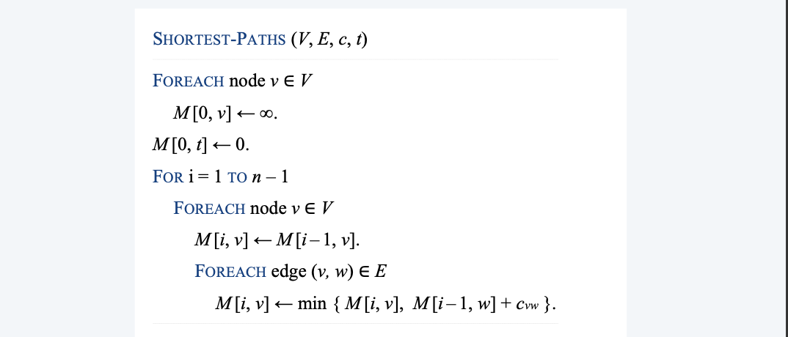

### Analysis

**Theorem 1**. Given a digraph $G=(V, E)$ with no negative cycles, the dynamic
programming algorithm computes the cost of the cheapest $v \sim t$ path for
each node $v$ in $\Theta(m n)$ time and $\Theta\left(n^{2}\right)$ space.
**Pf.**
- Table requires $\Theta\left(n^{2}\right)$ space.
- Each iteration $i$ takes $\Theta(m)$ time since we examine each edge once.
  > Although we will check every node + every edge for each iteration, but totally it's the number of edges
**Finding the shortest paths**.
- Approach 1: Maintain a `successor` $(i, v)$ that points to next node on cheapest $v \sim t$ path using at most $i$ edges.
- Approach 2: Compute optimal costs $M[i, v]$ and consider only edges with $M[i, v]=M[i-1, w]+c_{ v w}$

### Improvement

**Space optimization.** 
- Maintain two 1d arrays (instead of 2d array). 
- d(v) = cost of cheapest v↝t path that we have found so far. 
- successor(v) = next node on a v↝t path.

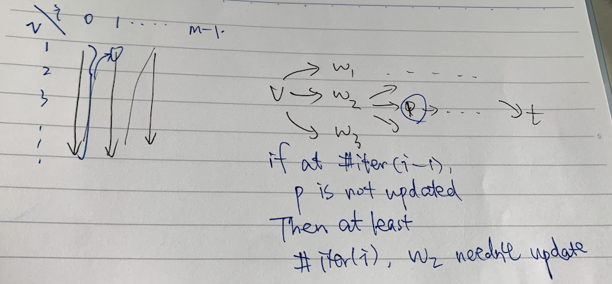

**Performance optimization.** If d(w) was not updated in iteration i – 1, then no reason to consider edges entering w in iteration i.

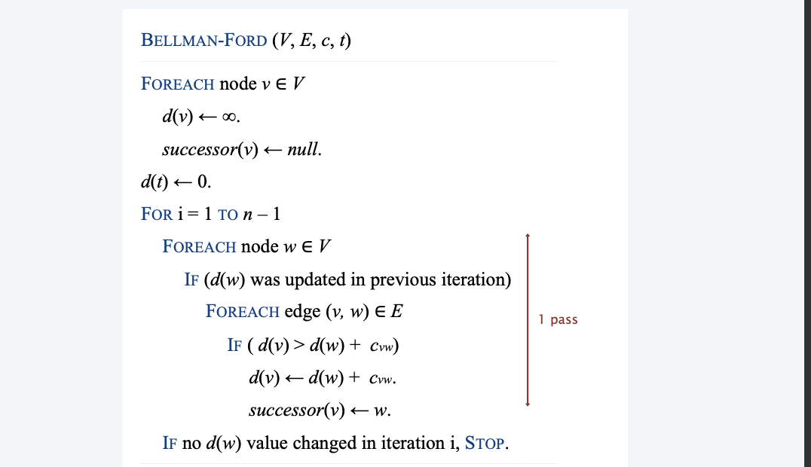

### Analysis for Improvement Algorithm

**Claim**. After the ith pass of Bellman-Ford, d(v) equals the cost of the cheapest v↝t path using at most i edges.

**Counterexample**. Claim is false!

> weaken the inductive hypothesis
**Lemma 3.**  Throughout Bellman-Ford algorithm, $d(v)$ is the cost of some $v \sim t$
path; after the $i^{t h}$ pass, $d(v)$ is _**no larger than**_ the cost of the cheapest $v \sim t$ path using $\leq i$ edges.
> instead of exactly using `i` edges
**Pf. [by induction on i]**
- Assume true after $i^{t h}$ pass.
- Let $P$ be any $v \sim t$ path with $i+1$ edges.
- Let $(v, w)$ be first edge on path and let $P^{\prime}$ be subpath from $w$ to $t$.
- By inductive hypothesis, $d(w) \leq c\left(P^{\prime}\right)$ since $P^{\prime}$ is a $w \sim t$ path with $i$ edges.
- After considering $v$ in pass $i+1: d(v) \leq c _{v w}+d(w) \le c_{vw} + c(P') = c(P)$

**Theorem 2**. Given a digraph with no negative cycles, Bellman-Ford
computes the costs of the cheapest $v \sim t$ paths in $O(m n)$ time and $\Theta(n)$ extra space.
Pf. Lemmas $2+3 $ 

> The improved algorithm can be **substantially faster** in practice

### Analysis for Improvement Algorithm for solution

> We can't follow the successor path when induction
**Claim**. Throughout the Bellman-Ford algorithm, following successor(v) pointers gives a directed path from v to t of cost d(v).

**Counterexample**. Claim is false!
- Cost of successor v↝t path may have strictly lower cost than d(v).
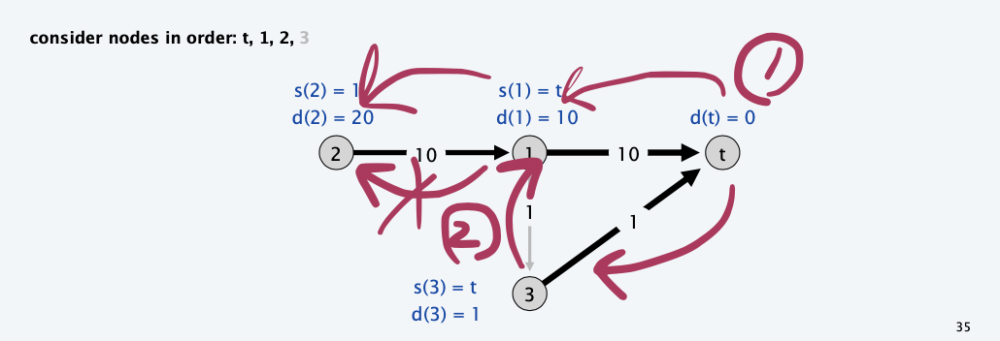

- Succseeor graph may have cycles
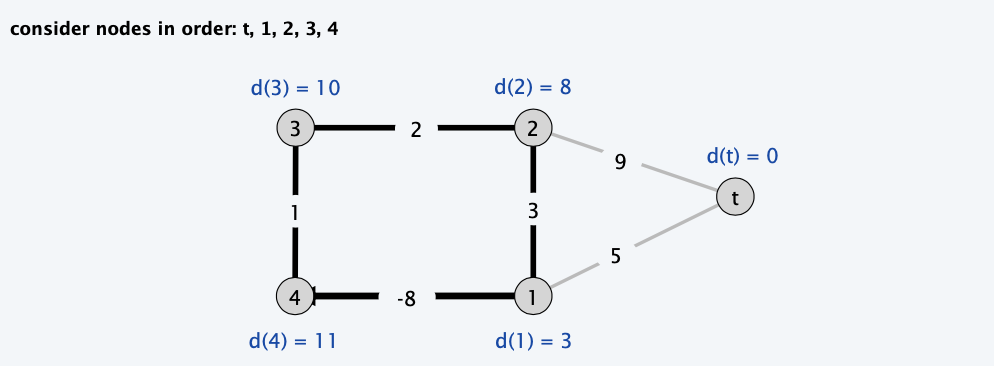

**Lemma 4.** If the successor graph contains a directed cycle $W$, then $W$ is a negative cycle.
**Pf.**
- If successor $(v)=w,$ we must have $d(v) \geq d(w)+c v w$
  (LHS and RHS are equal when successor( $v$ ) is set; $d(w)$ can only decrease; $d(v)$ decreases only when successor $(v)$ is reset)
- Let $v_{1} \rightarrow v_{2} \rightarrow \ldots \rightarrow v_{k}$ be the nodes along the cycle $W$.
- Assume that $(v k, v 1)$ is the last edge added to the successor graph.
- Just prior to that: $d\left(v_{1}\right) \geq d\left(v_{2}\right)+c\left(v_{1}, v_{2}\right)$
$$
\begin{array}{lll}
d(v_ 2) & \geq d(v_ 3) & +c(v_ 2, v_ 3) \\
\vdots & \vdots & \vdots \\
d(v_ {k-1}) & \geq d(v_ k) & +c(v k-1, v_ k) \\
d(v_ {k}) & > d(v_ {1}) & +c(v_{ k}, v_{1})
\end{array}
$$
The last one holds strictly since we are updating $d(v_k)$
- Adding inequalities yields $c\left(v_{1}, v_{2}\right)+c\left(v_{2}, v_{3}\right)+\ldots+c\left(v_{k-1}, v_{k}\right)+c\left(v_{k}, v_{1}\right)<0$
- $\mathrm{W}$ is a negative cycle

**Theorem 3 .** Given a digraph with no negative cycles, Bellman-Ford finds the cheapest $s \sim t$ paths in $O(m n)$ time and $\Theta(n)$ extra space.
**Pf.**
- The successor graph cannot have a negative cycle. [Lemma 4$]$
- Thus, following the successor pointers from $s$ yields a directed path to $t$.
- Let $s=v_{1} \rightarrow v_{2} \rightarrow \ldots \rightarrow v_{k}=t$ be the nodes along this path $P$.
- Upon termination, if successor $(v)=w,$ we must have $d(v)=d(w)+c_{v w}$ (LHS and RHS are equal when successor( $v$ ) is set; $d(\cdot)$ did not change)
> Since algorithm terminated
- Thus, $\quad d(v 1) \quad=d(v 2) \quad+c(v 1, v 2)$
$$
d(v 2)=d(v 3)+c(v 2, v 3)
$$
$$
\begin{array}{ccc}
\vdots & \vdots & \vdots \\
d\left(v_{k-1}\right) & = & d\left(v_{k}\right) & +c\left(v_{k-1}, v_{k}\right)
\end{array}
$$
- Adding equations yields $d(s)=d(t)+c\left(v_{1}, v_{2}\right)+c\left(v_{2}, v_{3}\right)+\ldots+c\left(v_{k-1}, v_{k}\right)$

> The proof above shows that only after when all $d(v)$ stops updating can we find the solution.

## Distance Vector Protocoals

> Use of Bellman Ford in Computer Network

**Communication network.**
- Node ≈ router.
- Edge ≈ direct communication link. 
- Cost of edge ≈ delay on link.
  > The dealy is naturally nonnegative, but Bellman-Ford used anyway!
**Dijkstra's algorithm**. Requires global information of network. 

**Bellman-Ford**. Uses only local knowledge of neighboring nodes.
> Local knows the distance to neighbors, neighbors know the distance to `t`
> i.e. maintain a `d(v)` table and `successor(v)` table

**Synchronization**. We don't expect routers to run in lockstep. The order in which each for each loop executes in not important. Moreover, algorithm still converges even if updates are asynchronous.
> the misplacement of information
> It's OK if the whole network topological structure & most delay distribution is stable
> i.e. Bellman-Ford will converge

**Distance vector protocols**. [ "routing by rumor" ]
- Each router maintains a vector of shortest path lengths to every other node (distances) and the first hop on each path (directions). 
- Algorithm: each router performs n separate computations, one for each potential destination node.
  - Ex. Algorithms that are based on DVP
    - RIP, Xerox XNS RIP, Novell's IPX RIP, Cisco's IGRP, DEC's DNA Phase IV, AppleTalk's RTMP.
**Caveat**. Edge costs may change during algorithm (or fail completely).
> 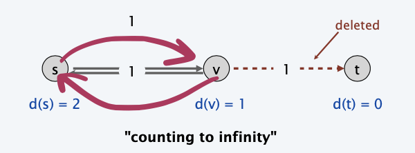
> After fails, `v` assume that `s` can reach to `t`, but it doesn't know that `s` reach `t` via `v` himself
> 内卷 => failure of the whole network

**Link state routing.**
- Each router also stores the entire path.
  > Maybe within a sub-network
  > not just the distance and first hop
- Based on Dijkstra's algorithm.
- Avoids "counting-to-infinity" problem and related difficulties. 
- Requires significantly more storage.
- Ex. Border Gateway Protocol (BGP), Open Shortest Path First (OSPF).

## Detecting Negative Cycles

### Introduction

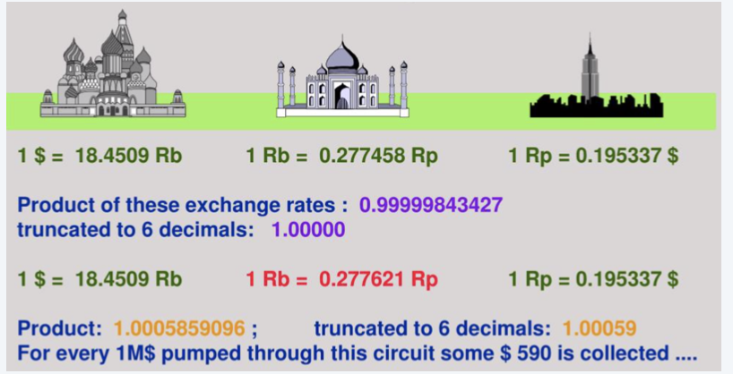

**Lemma 5.** If $O P T(n, v)=\mathrm{OPT}(n-1, v)$ for all $v,$ then no negative cycle can reach $t$.
**Pf**. Bellman-Ford algorithm.

**Lemma 6 .** If $O P T(n, v)<\mathrm{OPT}(n-1, v)$ for some node $v,$ then (any) cheapest path from $v$ to $t$ contains a cycle $W .$ Moreover $W$ is a negative cycle.
**Pf**. [by contradiction]
- Since $O P T(n, v)<\mathrm{OPT}(n-1, v),$ we know that shortest $v \sim t$ path $P$ has
exactly $n$ edges.
- By pigeonhole principle, $P$ must contain a directed cycle $W$.
- Deleting $W$ yields a $v \sim t$ path with $<n$ edges $\Rightarrow W$ has negative cost.

> How to find?

### Detection

**Theorem** $4 .$ Can find a negative cycle in $\Theta(m n)$ time and $\Theta\left(n^{2}\right)$ space.
**Pf**.
- Add new node $t$ and connect all nodes to $t$ with 0 -cost edge.
- $G$ has a negative cycle iff $G^{\prime}$ has a negative cycle than can reach $t$. 
- If $O P T(n, v)=O P T(n-1, v)$ for all nodes $v,$ then no negative cycles. 
- If not, then extract directed cycle from path from $v$ to $t$.
  (cycle cannot contain $t$ since no edges leave $t$ )

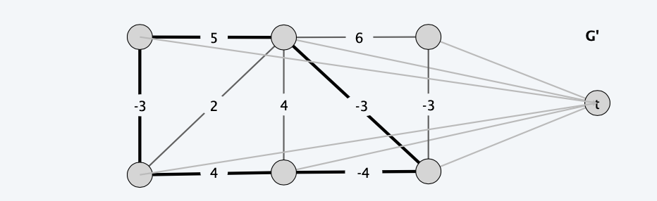

**Theorem** $5 .$ Can find a negative cycle in $O(m n)$ time and $O(n)$ extra space.
Pf.
- Run Bellman-Ford for $n$ passes (instead of $n-1$ ) on modified digraph.
- If no $d(v)$ values updated in pass $n,$ then no negative cycles.
- Otherwise, suppose $d(s)$ updated in pass $n$.
- Define pass $(v)=$ last pass in which $d(v)$ was updated.
- Observe pass( $s)=n$ and pass(successor(v)) $\geq$ pass $(v)-1$ for each $v$.
- Following successor pointers, we must eventually repeat a node.
- Lemma $4 \Rightarrow$ this cycle is a negative cycle.
**Remark**. See p. 304 for improved version and early termination rule.
(Tarjan's subtree disassembly trick)