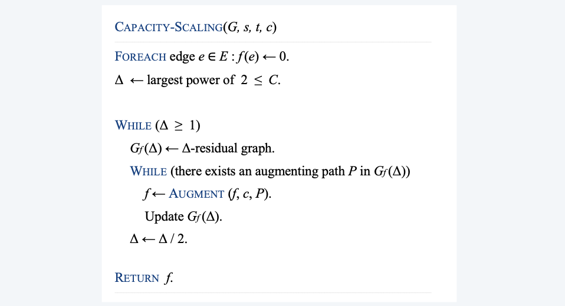
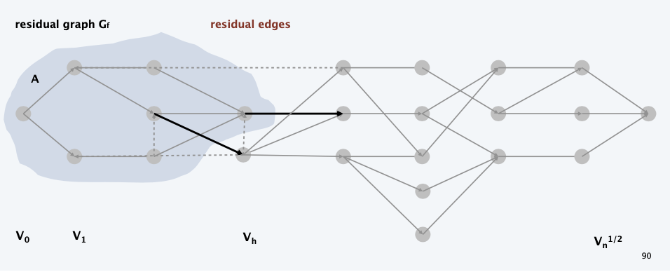

Augmentation path
- For any implementation, if the maximum capacity is $C$, then the runtime is $O(MC)$, where $M$ is the cost of every augmentation, due to the integral values
- capacity scaling
- shortest path
- blocking flow (based on layer graph, so that backward edges will be avoided AMAP)

<!--more-->

## max-flow and min-cut problems 

### Flow network

- Abstraction for material flowing through the edges. 
- DigraphG=(V,E)withsources∈V andsinkt∈V. 
- Nonnegative integer capacity c(e) for each e ∈ E.

### Minimum cut problem

Def. A st-cut (cut) is a partition $(A, B)$ of the vertices with $s \in A$ and $t \in B$.
Def. Its capacity is the sum of the capacities of the edges from $A$ to $B$.
$$
\operatorname{cap}(A, B)=\sum_{e \text { out of } A} c(e)
$$

Min-cut problem. Find a cut of minimum capacity.

### Maximum flow problem

> All nodes won't store flows, the flow-in should be equal to flow-out

Def. An $s t$ -flow (flow) $f$ is a function that satisfies:
For each $e \in E: \quad 0 \leq f(e) \leq c(e) \quad$ [capacity]
For each $v \in V-\{s, t\}: \quad \sum_{e \text { in to } v} f(e)=\sum_{e \text { out of } v} f(e)$
[flow conservation]
Def. The value of a flow $f$ is: $\operatorname{val}(f)=\sum_{e \text { out of } s} f(e)$

Max-flow problem. Find a flow of maximum value.

## Ford-Fulkerson algorithm

### Towards a max-flow algorithm

> Intuition: for any path, its flow is restricted by the min edge
Greedy algorithm.
- Start with $f(e)=0$ for all edge $e \in E$.
- Find an $s \sim t$ path $P$ where each edge has $f(e)<c(e)$.
- Augment flow along path $P$.
- Repeat until you get stuck.

> Greedy is a myopic algorithm, it doesn't know when to **withdraw**

### Residual Graph

> In order to support **withdraw**, we define the reverse edge (the allowance for withdraw)

**Original edge**: $e = (u, v) \in E$. 
- Flow $f (e)$.
- Capacity $c(e)$.
**Residual edge.**
- "Undo" flow sent.
- $e = (u, v)$ and $e^R = (v, u)$. 
- Residual capacity:
  - original graph G
  - $c_{f}(e)=\left\{\begin{array}{ll}c(e)-f(e) & \text { if } e \in E \\ f(e) & \text { if } e^{R} \in E\end{array}\right.$
- Residual graph: $G_f = (V, E_f )$.
- Residual edges with positive residual capacity.
- $E_f ={e:f(e)< c(e)} \cup {e^R :f(e) > 0}$.
- Key property: $f'$is a flow in $G_f$ iff $f+f'$ is a flow in G.
  -  where flow on a reverse edge negates flow on a forward edge
 
> You can either forward for the remaining 11 unit, or withdraw for at most 6 sent units

### Augmenting Path

**Def**. An augmenting path is a simple $s \sim t$ path $P$ in the residual graph $G_{f}$.
**Def**. The **bottleneck capacity** of an augmenting $P$ is the minimum residual capacity of any edge in $P$.
> Note the capacity here is w.r.t. the residual graph
**Key property.** Let $f$ be a flow and let $P$ be an augmenting path in $G_{f}$. Then $f^{\prime}$ is a flow and $\operatorname{val}\left(f^{\prime}\right)=\operatorname{val}(f)+$ bottleneck $(G_f, P)$

### Ford-Fulkerson Algorithm

Ford-Fulkerson augmenting path algorithm.
- Start with $f (e) = 0$ for all edge $e \in E$.
- Find an augmenting path P in the residual graph $G_f$ . 
- Augment flow along path P.
- Repeat until you get stuck.

> Observation: the later the algorithm, the more capacity backwarding edge, and the longer the found path (since more backwarding edges are passed)
> At the end of the algorithm, the points reachable from `s` in $G_f$ is the minimum cut

## max-flow min-cut theorem

### Relationship between flows and cuts

**Flow value lemma.** Let $f$ be any flow and let $(A, B)$ be any cut. Then, the net
flow across $(A, B)$ equals the value of $f$
$$
\sum_{e \text { out of } A} f(e)-\sum_{e \text { in to } A} f(e)=v(f)
$$

**Weak duality**. Let $f$ be any flow and $(A, B)$ be any cut. Then, $v(f) \leq \operatorname{cap}(A, B)$
**Pf**. $\quad v(f)=\sum_{e \text { out of } A} f(e)-\sum_{e \text { in to } A} f(e)$
$$
\begin{aligned}
\text { flow-value } & \leq \sum_{\text {lemma }} f(e) \\
& \leq \sum_{\text {e out of } A} c(e) \\
&=\operatorname{cap}(A, B)
\end{aligned}
$$
> Derived from the flow-value lemma

### Max-Flow Min-Cut Theorem

**Augmenting path theorem**. A flow f is a max-flow iff no augmenting paths. 
**Max-flow min-cut theorem.** Value of the max-flow = capacity of min-cut.

Pf. The following three conditions are equivalent for any flow $f:$
i. There exists a cut $(A, B)$ such that $\operatorname{cap}(A, B)=\operatorname{val}(f)$
ii. $f$ is a max-flow.
iii. There is no augmenting path with respect to $f$.

- $[\mathrm{i} \Rightarrow \mathrm{ii}]$
  - Suppose that $(A, B)$ is a cut such that $\operatorname{cap}(A, B)=v a l(f)$
  - Then, for any flow $f^{\prime},$ val $\left(f^{\prime}\right) \leq \operatorname{cap}(A, B)=\operatorname{val}(f)$
  > weak duality + by assumption
  - Thus, $f$ is a max-flow.
- $[\mathrm{ii} \Rightarrow$ iii $]$ We prove contrapositive: $\sim \mathrm{iii} \Rightarrow \sim \mathrm{ii} .$
  - Suppose that there is an augmenting path with respect to $f$. 
  - Can improve flow $f$ by sending flow along this path. 
  - Thus, $f$ is not a max-flow.
- $[\mathrm{iii} \Rightarrow \mathrm{i}]$
  - Let f be a flow with no augmenting paths.
  - Let A be set of nodes reachable from s in residual graph $G_f$. 
  - By definition of cut A, $s \in A$.
  - By definition of flow f, $t \notin A$.
  - According to flow-value lemma
  > **Observation.** the forward-flow between A and B should be 0. and the forward-flow from B to A should also be 0 (no way to undo), otherwise still reachable
  > Then the cut will be exactly be the reachable relation
  - 

## capacity-scaling algorithm
> What's the runtime complexity?
> find augmenting path $O(m)$, how many times?

**Assumption**. Capacities are **integers** between 1 and C.
**Integrality invariant**. Throughout the algorithm, the flow values $f (e)$
and the residual capacities $c_f (e)$ are integers.

**Theorem**. The algorithm terminates in at most val $(f^*) \le n C$ iterations.
**Pf**. Each augmentation increases the value by at least 1. 

**Corollary**. The running time of Ford-Fulkerson is $O(mnC)$.
**Corollary**. If C = 1, the running time of Ford-Fulkerson is $O(m n)$.

**Integrality theorem**. Then exists a max-flow $f^*$ for which every flow value $f^*(e)$ is an integer.
**Pf**. Since algorithm terminates, theorem follows from invariant. 

### Bad Case for Ford-Fulkerson

**Q**. Is generic Ford-Fulkerson algorithm poly-time in input size?
**A**.
No. If max capacity is C, then algorithm can take ≥ C iterations.

> Note every time we iterate, we are always choosing the bottleneck agument path (passing 1)
> A good way to improve efficiency  is in choosing good augmenting paths

### Choosing good augmenting paths

Use care when selecting augmenting paths.
- Some choices lead to exponential algorithms.
- Clever choices lead to polynomial algorithms.
- If capacities are irrational, algorithm not guaranteed to terminate!
Goal. Choose augmenting paths so that: 
- Can find augmenting paths efficiently. 
- Few iterations.
Choose augmenting paths with:
- Max bottleneck capacity. 
  > Which may cost a lot
- **Sufficiently large** bottleneck capacity.
  > Can be implemented with a scaling factor $\Delta$
- Fewest number of edges.

### Capacity-scaling algorithm
> idea: choose sufficiently large bottlenect capacity
**Intuition**. Choose augmenting path with highest bottleneck capacity: it increases flow by max possible amount in given iteration.
- Don't worry about finding exact highest bottleneck path.
- Maintain scaling parameter $\Delta$.
- Let $G_{f}(\Delta)$ be the subgraph of the residual graph consisting only of arcs with capacity $\geq \Delta$.
> Since we are scaling $\Delta$ every iteration, we can have fewer iteration times
> As the algorithm forwards, less capacity augmenting paths will also emerge

### Proof of correctness

**Assumption**. All edge capacities are integers between 1 and C. 
**Integrality invariant**. All flow and residual capacity values are integral.
**Theorem**. If capacity-scaling algorithm terminates, then f is a max-flow. 
**Pf**.
- By integrality invariant, when $\Delta = 1 \rightarrow G_f (\Delta) = G_f$ .
- Upon termination of $\Delta = 1$ phase, there are no augmenting paths. 

### Analysis of Runtime

**Lemma** $1 .$ The outer while loop repeats $1+\left\lceil\log _{2} C\right\rceil$ times.
**Pf**. Initially $C / 2<\Delta \leq C ; \Delta$ decreases by a factor of 2 in each iteration.

**Lemma** $2 .$ Let $f$ be the flow at the end of a $\Delta$ -scaling phase. Then, the value of the max-flow $\leq \operatorname{val}(f)+m \Delta$ . 
> Intuition: $m \Delta$  is the maximum flow in the future, proof on next slides, m is the number of edges
> Similar to the proof above

$\begin{aligned} \operatorname{val}(f)=& \sum_{e \text { out of } A} f(e)-\sum_{e \text { in to } A} f(e) \\ & \geq \sum_{e \text { out of } A}(c(e)-\Delta)-\sum_{e \text { in to } A} \Delta \\ &=\sum_{e \text { out of } A} c(e)-\sum_{e \text { out of } A} \Delta-\sum_{e \text { in to } A} \Delta \\ & \geq \operatorname{cap}(A, B)-m \Delta \end{aligned}$
> Since we have only selected edges with capacity greater than $\Delta$

**Lemma** $3 .$ There are at most $2 \mathrm{m}$ augmentations per scaling phase.
**Pf**.
- Let $f$ be the flow at the end of the previous scaling phase. 
- LEMMA $2 \Rightarrow \operatorname{val}\left(f^{*}\right) \leq \operatorname{val}(f)+2 m \Delta^{\prime} \cdot$ (current scaling factor, $\left.\Delta^{\prime}=1 / 2 \Delta\right)$
  > There goes the `2m`
- Each augmentation in a $\Delta^{\prime}$ -phase increases val $(f)$ by at least $\Delta^{\prime} .$

**Theorem**. The scaling max-flow algorithm finds a max flow in $O(m \log C)$
augmentations. An augmentation need $O(m),$ including setup of graph and
finding a path. It can be implemented to run in $O\left(m^{2} \log C\right)$ time.
Pf. Follows from LEMMA 1 and LEMMA $3 .$

## shortest augmenting paths

> Another finding strategy
> Find the one with the fewest number of edges via BFS

### Analysis of Runtime

**Lemma 1**. Throughout the algorithm, length of the shortest path never decreases.

**Lemma 2**. After at most $m$ shortest path augmentations, the length of the shortest
augmenting path strictly increases.
> during which time, all the original paths have been used up and there is reverse edge
> (a loose upper bound)

**Theorem**. The shortest augmenting path algorithm runs in $O\left(m^{2} n\right)$ time. 
**Pf**.
- $O(m+n)$ time to find shortest augmenting path via BFS.
- $O(m)$ augmentations for paths of length $k$
- If there is an augmenting path, there is a simple one.
  - $\Rightarrow 1 \leq k<n$
  - $\Rightarrow O(m n)$ augmentations.

### Proof of Lemmas

**Def**. Given a digraph $G=(V, E)$ with source $s,$ its level graph is defined by:
- $\ell(v)=$ number of edges in shortest path from $s$ to $v$
- $L_{G}=\left(V, E_{G}\right)$ is the subgraph of $G$ that contains only those edges $(v, w) \in E$ with $\ell(w)=\ell(v)+1$

**Property**. Can compute level graph in $O(m+n)$ time. Pf. Run BFS; delete back and side edges.

**Key property**. $P$ is a shortest $s \sim v$ path in $G$ iff $P$ is an $s \sim v$ path $L_{G}$.
> because it is a simple path, and won't reverse back

**L1**. Throughout the algorithm, length of the shortest path never decreases.
- Let $f$ and $f^{\prime}$ be flow before and after a shortest path augmentation.
- Let $L$ and $L^{\prime}$ be level graphs of $G_{f}$ and $G_{f^{\prime}}$ 
- Only back edges added to $G_{f}$ " (any path with a back edge is longer than previous length)

**L2**. After at most m shortest path augmentations, the length of the shortest augmenting path strictly increases.
- The bottleneck edge(s) is deleted from L after each augmentation. 
- No new edge added to L until length of shortest path strictly increases.

### Extension improving the running time
**Note**. $\Theta(mn)$ augmentations necessary on some networks. 
- Try to decrease time per augmentation instead. 
- Simple idea ⇒ $O(m n^2 )$ [Dinic 1970] 
- Dynamic trees ⇒ $O(m n \log n)$ [Sleator-Tarjan 1983]

## blocking-flow algorithm
> Yet another way to find augmentation path
> Based on **Level Graph**, like **DFS**, forward and retreat

**Two types of augmentations.**
- Normal: length of shortest path does not change. 
- Special: length of shortest path strictly increases.
**Phase of normal augmentations.**
- Explicitly maintain level graph $L_G$.
- Start at s, advance along an edge in $L_G$ until reach t or get stuck. 
- If reach t, augment and and update $L_G$.
- If get stuck, delete node from $L_G$ and go to previous node.

### Implementation
> We need to maintain the previous node, and the operation corresponding to the forward move

or in module form

### Analysis
> yet another loose analysis

**Lemma**. A phase can be implemented in $O(m n)$ time.
Pf.
- Initialization happens once per phase. $\longrightarrow \mathrm{O}(\mathrm{m})$ using BFS
- At most $m$ augmentations per phase. $\longrightarrow \mathrm{O}(\mathrm{mn})$ per phase (because an augmentation deletes at least one edge from $L_{G}$ )
- At most $n$ retreats per phase. $\longrightarrow \mathrm{O}(\mathrm{m + n})$ (because a retreat deletes one node from $L_{G}$ )
- At most $m n$ advances per phase. $\longrightarrow \mathrm{O}(\mathrm{mn})$ (because at most $n$ advances before retreat or augmentation)

**Theorem**. [Dinic 1970 ] The blocking-flow algorithm runs in $O\left(m n^{2}\right)$ time.
**Pf**.
By lemma, $O(m n)$ time per phase.
- At most $n$ phases (as in shortest augment path analysis).

## Choosing good augmenting paths: summary

- Push-relabel algorithm (SECTION 7.4). [Goldberg-Tarjan 1988]
  Increases flow one edge at a time instead of one augmenting path at a time.
  > Introduce ideas like potential energy

**Warning**. _Worst-case running time_ is generally not useful for predicting or comparing max-flow algorithm performance in practice.
**Best in practice.** Push-relabel method with gap relabeling: $O(m^{3/2})$.

**Computer vision.** Different algorithms work better for some dense problems that arise in applications to computer vision.
> Since graphs are typically dense

## unit-capacity simple networks

### Bipartite matching ?

Q. Which max-flow algorithm to use for bipartite matching?
- Generic augmenting path: $O\left(m\left|f^{*}\right|\right)=O(m n)$
Capacity scaling: $O\left(m^{2} \log U\right)=\mathrm{O}\left(m^{2}\right)$
Shortest augmenting path: $O\left(m n^{2}\right)$
Q. Suggests "more clever" algorithms are not as good as we first thought?
A. No, just need more clever analysis!
Next. We prove that shortest augmenting path algorithm can be implemented in $O\left(m n^{1 / 2}\right)$ time.

### Unit-capacity simple networks

**Def**. A network is a unit-capacity simple network if:
- Every edge capacity is 1.
- Every node (other than s or t) has either 
  (i) at most one entering edge
  or (ii) at most one leaving edge.

**Property**. Let G be a simple unit-capacity network and let f be a 0-1 flow,
then $G_f$ is a unit-capacity simple network. 
> Derived from the propery of every node (either single entry or single exit)

**Ex**. Bipartite matching.

> Which can give our analysis a tighter bound

### Shortest Augmenting Path Algorithm on Unit Capacity

Shortest augmenting path algorithm.
- Normal augmentation: length of shortest path does not change.
- Special augmentation: length of shortest path strictly increases.
Theorem. [Even-Tarjan 1975 ] In unit-capacity simple networks, the shortest
augmenting path algorithm computes a maximum flow in $O\left(m n^{1 / 2}\right)$ time.
Pf.
- **Ll**. Each phase of normal augmentations takes $O(m)$ time.
- **L2**. After at most $n^{1 / 2}$ phases, $|f| \geq\left|f^{*}\right|-\mathbf{n^{1 / 2}}$ `<-- this is different`
- **L3**. After at most $n^{1 / 2}$ additional augmentations, flow is optimal.

### Normal Augmentations on Unit Capacity

Phase of normal augmentations.
- Explicitly maintain level graph $L_{G}$.
- Start at $s$, advance along an edge in $L_{G}$ until reach $t$ or get stuck.
- If reach $t$, augment and and update $L_{G}$.
- If get stuck, delete node from $L_{G}$ and go to previous node.

**Lemma** $1 .$ A phase of normal augmentations takes $O(m)$ time.
**Pf**.
- $O(m)$ to create level graph $L_{G}$
- $O(1)$ per edge since each edge traversed and deleted at most once. 
- $O(1)$ per node since each node deleted at most once.

**LEMMA 2**. After at most $n^{1 / 2}$ phases, $|f| \geq\left|f^{*}\right|-n^{1 / 2}$
- After $n^{1 / 2}$ phases, length of shortest augmenting path is $>n^{1 / 2}$
- Level graph has more than $n^{1 / 2}$ levels.
- Let $1 \leq h \leq n^{1 / 2}$ be layer with min number of nodes: $\left|V_{h}\right| \leq n^{1 / 2}$

- Let $A=\{v: \ell(v)<h\} \cup\{v: \ell(v)=h$ and $v$ has $\leq 1$ outgoing residual edge $\}$
- $\operatorname{capf}(A, B) \leq\left|V_{h}\right| \leq n^{1 / 2} \Rightarrow|f| \geq\left|f^{*}\right|-n^{1 / 2}$
> Worst Case: $\sqrt{n}$ points for $\sqrt{n}$ levels, otherwise better, saturate soon

