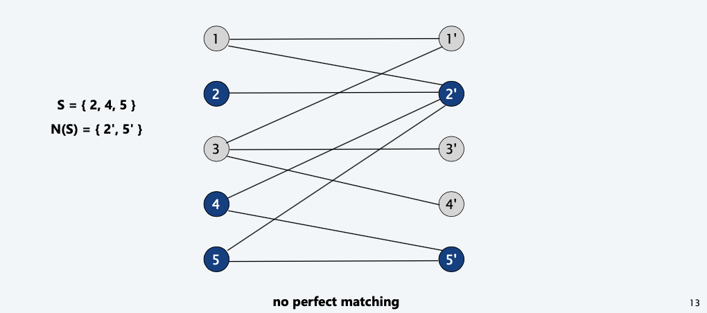
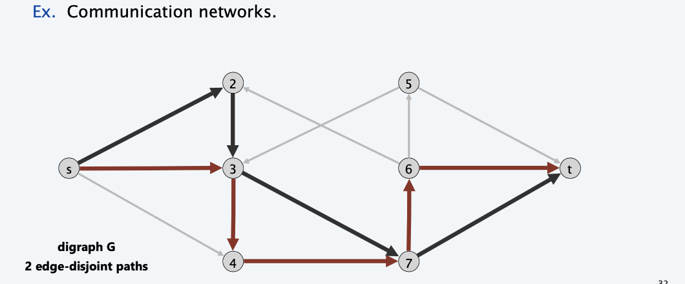

<!--more-->

## Bipartite matching

**Def**. Given an undirected graph $G = (V, E)$ a subset of edges $M \subset E$ is a matching if each node appears in _at most one edge_ in $M$.
**Max matching**. Given a graph, find a max cardinality matching.

**Def**. A graph G is bipartite if the nodes can be partitioned into two subsets L and R such that _every edge connects a node_ in L to one in R.
**Bipartite matching**. Given a bipartite graph $G = (L \cup R, E)$, find a max cardinality matching.

### Solution

- Create digraph $G' = (L \cup R \cup \{s, t\}, E' )$.
- Direct all edges from L to R, and assign infinite (or unit) capacity
  > The constraint of the original problems should be retained
  > Here, it is preserved by the condition that every in-edge of the node is 1
  > with the bottleneck, the inner-edges capacity doesn't matter
- Add source s, and unit capacity edges from s to each node in L. 
- Add sink t, and unit capacity edges from each node in R to t.

### Correctness

**Theorem**. Max cardinality of a matching in $G =$ value of max flow in $G'$. 
**Pf**. $\le$
- Given a max matching M of cardinality k.
- Consider flow $f$ that sends 1 unit along each of $k$ paths. 
- f is a flow, and has value k. 
  $\ge$
- Let f be a max flow in $G'$ of value k.
- Integrality theorem $\rightarrow$ k is integral and can assume f is 0-1. 
- Consider M = set of edges from L to R with $f(e) = 1$.
  - each node in L and R participates in at most one edge in M 
  - $|M|=k$: consider cut $(L\cup s,R \cup t)$ 

### Perfect Matching

**Def**. Given a graph $G = (V, E)$ a subset of edges $M \subset E$ is a perfect matching if each node appears _in exactly one edge_ in M.

**Q**. When does a bipartite graph have a perfect matching?

**Structure of bipartite graphs with perfect matchings.**
- Clearly we must have $|L| = |R|$. 
- What other conditions are necessary? 
- What conditions are sufficient?

### Hall's Theorem for perfect matching

**Notation**. Let S be a subset of nodes, and let $N(S)$ be the set of nodes adjacent to nodes in S.
**Observation**. If a bipartite graph $G = (L \cup R, E)$ has a perfect matching, then $|N(S)| \ge |S|$ for all subsets $S \subset L$.
**Pf**.
Each node in S has to be matched to a different node in N(S).
(Otherwise, can't happen).

**Theorem** Let $G = (L \cup R, E)$ be a bipartite graph with $|L| = |R|$. G has a perfect matching iff $|N(S)| \ge |S|$ for all subsets $S \subset L$.
**Pf**. $\Rightarrow$ This was the previous observation.
**Pf**. $\Leftarrow$ Suppose $G$ does not have a perfect matching.
- Formulate as a max flow problem and let $(A, B)$ be min cut in $G^{\prime} .$
- By max-flow min-cut theorem, $\operatorname{cap}(A, B)<|L|$.
- Define $L_{A}=L \cap A, L_{B}=L \cap B, R_{A}=R \cap A$
- $\operatorname{cap}(A, B)=\left|L_{B}\right|+\left|R_{A}\right|$
  > Which is also why we set the inner capacity to be $\infty$, since we won't include them into the minimum cut
- since min cut can't use $\infty$ edges: $N\left(L_{A}\right) \subseteq R_{A}$
- | $N\left(L_{A}\right)|\leq| R_{A}|=\operatorname{cap}(A, B)-| L_{B}|<| L|-| L_{B}|=| L_{A} \mid$

### Bipartite matching running time
**Theorem**. The Ford-Fulkerson algorithm solves the bipartite matching problem in $O(m n)$ time.
**Theorem**. [Hopcroft-Karp 1973] The bipartite matching problem can be solved in $O(m n^{1/2})$ time.

### Extension: Nonbipartite matching.
Given an undirected graph (not necessarily bipartite), find a matching of maximum cardinality.
・Structure of nonbipartite graphs is more complicated.
・But well-understood. [Tutte-Berge, Edmonds-Galai] 
・Blossomalgorithm: $O(n^4)$. [Edmonds1965] 
・Bestknown: $O(mn^{1/2})$. [Micali-Vazirani1980,Vazirani1994]

### K-regular Bipartite Graphs

**Dancing problem.**
- Exclusive Ivy league party attended by n men and n women.
- Each man knows exactly k women; each woman knows exactly k men. 
- Acquaintances are mutual.
- Is it possible to arrange a dance so that each woman dances with a different man that she knows?
**Mathematical reformulation**.
Does every k-regular bipartite graph have a perfect matching?
> Yes.

### k-regular bipartite graphs have perfect matchings

**Theorem**. Every $k$ -regular bipartite graph $G$ has a perfect matching.
**Pf**.
- Size of max matching = value of max flow in $G^{\prime}$.
- Consider flow
    $$
    f(u, v)=\left\{\begin{array}{ll}
    1 / k & \text { if }(\mathrm{u}, \mathrm{v}) \in E \\
    1 & \text { if } \mathrm{u}=s \text { or } \mathrm{v}=t \\
    0 & \text { otherwise }
    \end{array}\right.
    $$
- $f$ is a flow in $G^{\prime}$ and its value $=n \Rightarrow$ perfect matching.

**Alternate Pf.**
Use Hall's Theorem
- There are total $k|S|$ edges from any set $S \subset A$ to $N(S)$
- Also, total number of edgers into $N(S)$ is $k|N(S)|$
- $k|N(S)| \ge k|S| \rightarrow |N(S)| \ge |S|$

## Disjoint paths

### Formulation
**Def**. Two paths are **edge-disjoint** if they have no edge in common. 
**Disjoint path problem**. Given a digraph $G = (V, E)$ and two nodes s and t,
find the max number of edge-disjoint $s\sim t$ paths.

**Max flow formulation**. Assign unit capacity to every edge.
> So that once an augmenting path is used, it won't be used again later

### Theorem

**Theorem**. Max number edge-disjoint $s\sim t$ paths equals value of max flow.
**Pf.** $\le$
- Suppose there are $k$ edge-disjoint $s \sim t$ paths $P_{1}, \ldots, P_{k}$
- Set $f(e)=1$ if $e$ participates in some path $P_{j} ;$ else set $f(e)=0$ 
- since paths are edge-disjoint, $f$ is a flow of value $k$
$\ge$
- Suppose max flow value is k.
- Integrality theorem $\rightarrow$ there exists 0-1 flow f of value k. 
- Consider edge (s, u) with $f(s, u) = 1$.
  - by conservation, there exists an edge (u, v) with $f(u, v) = 1$
  - continue until reach t, always choosing a new edge 
- Produces k (not necessarily simple) edge-disjoint paths. 
> The algorithm will not necessarily return a simple path, but it can be simple decomposed
> can eliminate cycles to get simple paths in O(mn) time if desired (flow decomposition)

### Network Connectivity: Menger's Theorem

**Def**. A set of edges $F \subset E$ disconnects t from s if every $s\sim t$ path uses at least one edge in F.
**Network connectivity**. Given a digraph $G = (V, E)$ and two nodes s and t, find min number of edges whose removal disconnects t from s.

> Yet another specialization of max-flow min-cut thm.

**Theorem**. [Menger 1927 ] The max number of edge-disjoint $s \sim t$ paths
is equal to the min number of edges whose removal disconnects $t$ from $s$.

**Pf**. $\leq$
- Suppose the removal of $F \subseteq E$ disconnects $t$ from $s,$ and $|F|=k$
- Every $s \sim t$ path uses at least one edge in $F$.
- Hence, the number of edge-disjoint paths is $\leq k$

**Pf**. $\geq$
- Suppose max number of edge-disjoint paths is $k$.
- Then value of max flow $=k$.
- Max-flow min-cut theorem $\Rightarrow$ there exists a cut $(A, B)$ of capacity $k$.
- Let $F$ be set of edges going from $A$ to $B$.
- $|F|=k$ and disconnects $t$ from $s$

> What about an undirected graph?
> ~~Simply turn the edge into a 2-path directed edge **WON'T WORK**, because it may cause double use of this edge~~

## Edge-disjoint paths in undirected graphs

### Formulation
**Def**. Two paths are edge-disjoint if they have no edge in common. 
**Disjoint path problem in undirected graphs**. Given a graph $G = (V, E)$ and
two nodes s and t, find the max number of edge-disjoint s-t paths.
**Max flow formulation**. Replace edge edge with two antiparallel edges and assign unit capacity to every edge.
**Observation**. Two paths P1 and P2 may be edge-disjoint in the digraph but not edge-disjoint in the undirected graph.
> if P1 uses edge (u, v) and P2 uses its antiparallel edge (v, u)

**Lemma**. In any flow network, there exists a maximum flow $f$ in which for
each pair of antiparallel edges $e$ and $e^{\prime},$ either $f(e)=0$ or $f\left(e^{\prime}\right)=0$ or both.
Moreover, integrality theorem still holds.
> The original implementation can still work!
**Pf**. [ by induction on number of such pairs of antiparallel edges ]
- Suppose $f(e)>0$ and $f\left(e^{\prime}\right)>0$ for a pair of antiparallel edges $e$ and $e^{\prime}$
- $\operatorname{Set} f(e)=f(e)-\delta$ and $f\left(e^{\prime}\right)=f\left(e^{\prime}\right)-\delta,$ where $\delta=\min \left\{f(e), f\left(e^{\prime}\right)\right\}$
- $f$ is still a flow of the same value but has one fewer such pair.
> In another word, anti-parallel edges can always be eliminated, and won't change the value of the maximum flow

### Menger's Theorems in Undirected Graph

**Theorem**. Given an **undirected** graph with two nodes s and t,
the max number of **edge-disjoint** s-t paths equals the min number of edges whose removal disconnects s and t.

**Theorem**. Given a **undirected** graph with two nonadjacent nodes s and t, the max number of internally **node-disjoint** s-t paths equals the min number of internal nodes whose removal disconnects s and t.
> Turn a node into `n ~> unit capacity ~> n`
> node contraction / node split

**Theorem**. Given an **directed** graph with two nonadjacent nodes s and t, the max number of internally **node-disjoint** $s\sim t$ paths equals the min number of internal nodes whose removal disconnects t from s.

## Extensions to max flow 

> Recall in typical flow graph, nodes shoule be flow conservative (in = out)
> but in some problems, nodes are required to sink

### Circulation to Flow

**Def**. Given a digraph $G=(V, E)$ with nonnegative edge capacities $c(e)$ and
node supply and demands $d(v),$ a **circulation** is a function that satisfies:
$$
\begin{array}{l}
\text { For each } e \in E: 0 \leq f(e) \leq c(e)  \text { (capacity) }\\
\text { For each } v \in V: \sum_{e \text { in to } v} f(e)-\sum_{e \text { out of } v} f(e)=d(v)  \text { (Conservation) }
\end{array}
$$

1. Add new source s and sink t.
2. For each v with $d(v) < 0$, add edge $(s, v)$ with capacity $-d(v)$. 
3. For each v with $d(v) > 0$, add edge $(v, t)$ with capacity $d(v)$.
**Claim**. $G$ has circulation iff $G^{\prime}$ has max flow of value $D=\sum_{v: d(v)>0} d(v)=\sum_{\nu: d(v)<0}-d(v)$

**Integrality theorem**. If all capacities and demands are integers, and there exists a circulation, then there exists one that is integer-valued.
**Pf**. Follows from max-flow formulation + integrality theorem for max flow.

**Theorem**. Given $(V, E, c, d)$, there does **NOT** exist a circulation iff there exists a node partition $(A, B)$ such that $\sum_{v \in B} d(v) > cap(A, B)$.
**Pf** sketch. Look at min cut in G'.
> $d(v)$ includes both supply and demand nodes, pf by split the two cases
> Intuition: max-flow is used, but the supply can't be attained, then there should exist no circulation
> demand by nodes in B exceeds supply of nodes in B plus max capacity of edges going from A to B

### Circulation with demands and lower bounds

**Feasible circulation**.
- Directed graph $G=(V, E)$.
- Edge capacities $c(e)$ and lower bounds $\ell(e)$ for each edge $e \in E$
- Node supply and demands $d(v)$ for each node $v \in V$.

**Def**. A **circulation** is a function that satisfies:
- For each $e \in E: \quad \ell(e) \leq f(e) \leq c(e)$ (capacity)
- For each $v \in V: \quad \underset{\text { in to } v}{\sum f(e)-\sum_{\text {e out of } v} ~} f(e)=d(v) \quad$ (conservation)

**Circulation problem with lower bounds**. Given $(V, E, \ell, c, d),$ does there exist
a feasible circulation?

> How to transform the problem?

**Max flow formulation**. Model lower bounds as circulation with demands. 
- Send $\ell(e)$ units of flow along edge e.
- Update demands of both endpoints.

**Theorem**. There exists a circulation in $G$ iff there exists a circulation in $G'$. Moreover, if all demands, capacities, and lower bounds in $G$ are integers, then there is a circulation in $G$ that is integer-valued.
**Pf sketch**. $f (e)$ is a circulation in $G$ iff $f '(e) = f (e) – \ell(e)$ is a circulation in $G'$.

## Survey design

- Design survey asking $n_1$ consumers about $n_2$ products. 
- Can only survey consumer $i$ about product $j$ if they own it. 
- Ask consumer $i$ between $c_i$ and $c'_i$ questions.
- Ask between $p_j$ and $p'_j$ consumers about product $j$.

**Goal**. Design a survey that meets these specs, if possible.

**Bipartite perfect matching**. Special case when ci = ci' = pj = pj' = 1.

> The survey is concerned with two aspects, customers and products. To indicate the relation of "buy", they should be represented in a graph

**Max-flow formulation**. Model as circulation problem with lower bounds. 
- Add edge (i, j) if consumer j owns product i.
- Add edge from s to consumer j .
- Add edge from product i to t.
- Add edge from t to s.
- Integer circulation $\iff$ feasible survey design.
  > There might exist multiple feasible designs

> The $[0,\infty]$ edge is added to make the graph balanced as a circulation

## Airline scheduling

**Airline scheduling.**
- Complex computational problem faced by nation's airline carriers. 
- Produces schedules that are efficient in terms of:
  - equipment usage, crew allocation, customer satisfaction
  - in presence of unpredictable issues like weather, breakdowns 
- One of largest consumers of high-powered algorithmic techniques.

> A toy problem Focused on crew allocation, assign crew as little as possible
**"Toy problem."**
- Manage flight crews by reusing them over multiple flights.
- Input: set of $k$ flights for a given day, together with their information
  - Flight $i$ leaves origin $o_i$ at time $s_i$ and arrives at destination $d_i$ destination at time $f_i$.
- Minimize number of flight crews.

> Things to consider when transforming to Network Flow:
> - Flow or Circulation (or whether exists a solution or find the optimal(usually maximum flow) problem)
> - What are edges and what are nodes
> - Additional s or t?

> Idea: minimizing problem, but we are checking whether given `c` resources we can find a solution, since `c` is bounded by the total flight number `n`
**Circulation formulation**. [to see if c crews suffice]
- For each flight $i$, include two nodes $u_i$ and $v_i$.
- Add source $s$ with demand $-c$, and edges $(s, u_i)$ with capacity 1
  > Departures are fulfilled, `[0,1]` crew can begin with any flight
- Add sink $t$ with demand $c$, and edges $(v_i, t)$ with capacity 1. 
  > Arrivals are fulfilled, `[0,1]` crew can end with any flight
- For each $i$, add edge $(u_i, v_i)$ with lower bound and capacity 1. 
  > `[1,1]` exactly one crew for each flight 
- if flight $j$ reachable from $i$, add edge $(v_i, u_j)$ with capacity 1.
  > Same crew can do consecutive flight, i.e. time allowed, space allowed
  > Doesn't have to serve consecutively, lower bound zero

**Theorem**. The airline scheduling problem can be solved in $O\left(k^{3} \log k\right)$ time.
Pf.
- $k=$ number of flights.
- $c=$ number of crews (unknown).
- $O(k)$ nodes, $O\left(k^{2}\right)$ edges.
- At most $k$ crews needed.
  $\Rightarrow$ solve $\lg k$ circulation problems.
- Value of the flow is between 0 and $k$.
  $\Rightarrow$ at most $k$ augmentations per circulation problem.
- Overall time $=O\left(k^{3} \log k\right.$ ).
> Use **binary search** to find `c`

**Remark**. Can solve in $O\left(k^{3}\right)$ time by formulating as **minimum flow problem**(?).

**Real-world problem models countless other factors**
- Union regulations: e.g., flight crews can only fly certain number of hours in given interval.
- Need optimal schedule over planning horizon, not just one day. 
- Deadheading has a cost.
- Flights don't always leave or arrive on schedule. 
- Simultaneously optimize both flight schedule and fare structure.

**Message**.
- Our solution is a generally useful technique for efficient reuse of limited resources but trivializes real airline scheduling problem.
- Flow techniques useful for solving airline scheduling problems (and are widely used in practice).
- Running an airline efficiently is a very difficult problem.

## Image segmentation
**Image segmentation**.
- Central problem in image processing. 
- Divide image into **coherent** regions.
**Ex**. Three people standing in front of complex background scene. Identify each person as a coherent object.

**Foreground / background segmentation.**
- Label each pixel in picture as belonging to foreground or background.
- $V=$ set of pixels, $E=$ pairs of neighboring pixels. 
- $a_{i} \geq 0$ is likelihood pixel $i$ in foreground.
- $b_{i} \geq 0$ is likelihood pixel $i$ in background. 
- $p_{i j} \geq 0$ is separation penalty for labeling one of $i$ and $j$ as foreground, and the other as background.

**Goals**.
- Accuracy: if $a_{i}>b_{i}$ in isolation, prefer to label $i$ in foreground.
- Smoothness: if many neighbors of $i$ are labeled foreground, we should be inclined to label $i$ as foreground.
- Find partition $(A, B)$ that maximizes: 
  $$\quad \sum_{i \in A} a_{i}+\sum_{j \in B} b_{j}-\sum_{
      \begin{array}{l}
          (i, j) \in E \\
          |A \cap\{i, j\} |= 1
      \end{array}} p_{i j}
  $$
- where A is foreground and B is background, $|A \cap\{i, j\} |= 1$ indicates that exactly one of the element in pair is in the foreground and the other in the background

> Combination of maximize and minimize, how to formulate?

**Formulate as min cut problem**. (the current problem)
- Maximization. 
- No source or sink. 
- Undirected graph.

**Turn into minimization problem.**
$$
\begin{aligned}
&\text { Maximizing } \sum_{i \in A} a_{i}+\sum_{j \in B} b_{j}-\sum_{(i, j) \in E} p_{i j}\\
&\text { is equivalent to minimizing } \underbrace{\left(\sum_{i \in V} a_{i}+\sum_{j \in V} b_{j}\right)}_{\text {a constant }}-\sum_{i \in A} a_{i}-\sum_{j \in B} b_{j}+\sum_{(i, j) \in E} p_{i j}\\
&\text { or alternatively } \quad \sum_{j \in B} a_{j}+\sum_{i \in A} b_{i}+\sum_{(i, j) \in E \atop|A \cap\{i, j\}|-1} p_{i j}
\end{aligned}
$$

**Formulate as min cut problem $G' = (V', E')$.** 
- Include node for each pixel.
- Use two antiparallel edges instead of undirected edge.
- Add source s to correspond to foreground. 
- Add sink t to correspond to background.

- Precisely the quantity we want to minimize.

## project selection (maximum weight closure problem)
> Constrained Problems with chained constraints

**Projects with prerequisites**.
- Set of possible projects P : project v has associated revenue $p_v$. (can be positive or negative)
- Set of prerequisites E : if $(v, w) \in E$, cannot do project $v$ unless also do project $w$.
- A subset of projects $A \subset P$ is feasible if the prerequisite of every project in A also belongs to $A$.

**Project selection problem.** Given a set of projects P and prerequisites E, choose a feasible subset of projects to maximize revenue.
> Trick: the project must be chained, some project may have high revenue, but with negative prerequired projects.

**Prerequisite graph**. Add edge $(v, w)$ if can't do v without also doing w.

> Once picked, all the nodes pointed by the picked node will also be picked
> Recall, in bipartite matching, we use **$\infty$ capacity** to derive Hall's Theorem, to make sure that particular edges are to be included in the same cut.

**Min-cut formulation**.
- Assign capacity $\infty$ to all prerequisite edge.
- Add edge $(s, v)$ with capacity $p_{v}$ if $p_{v}>0$
- Add edge $(v, t)$ with capacity $-p_{v}$ if $p_{v}<0$.
- For notational convenience, define $p_{s}=p_{t}=0$

**Claim**. $(A, B)$ is min cut iff $A-\{s\}$ is optimal set of projects.
- Infinite capacity edges ensure $A-\{s\}$ is feasible.
- Max revenue because: 
$$
\begin{aligned}
\operatorname{cap}(A, B)&=\sum_{v \in B: p_{\nu}>0} p_{v}+\sum_{v \in A: p_{v}<0}\left(-p_{v}\right)\\
&=\sum_{v \in B: p_{\nu}>0} p_{v}+\sum_{v \in A: p_{v}<0}\left(-p_{v}\right) + \sum_{v \in A: p_{v}>0}p_{v} - \sum_{v \in A: p_{v}>0}p_{v}\\
&=\underbrace{\sum_{v: p_{\gamma}>0} p_{v}}_{\text {constant }}-\sum_{v \in A} p_{v}
\end{aligned}
$$
> The reason why we set $p_{v}<0$ is to make double-neg -> positive

**Application: Open-pit mining**. (studied since early 1960s)
- Blocks of earth are extracted from surface to retrieve ore. 
- Each block v has net value pv = value of ore – processing cost. 
- Can't remove block v before w or x.
- 
> Now hyper-soundwave can pre-detect the minings, it is left for the algorithm to decide how to find an cost-efficient strategy

## Baseball elimination

**Q**. Which teams have a chance of finishing the season with the most wins?

Except for Montreal, **Philadelphia is mathematically eliminated.**
- Philadelphia finishes with ≤ 83 wins.
- Either New York or Atlanta will finish with ≥ 84 wins.

**Observation**. Answer depends not only on how many games already won and left to play, but on **whom** they're against.

- Set of teams $S$.
- Distinguished team $z \in S$.
- Team x has won wx games already.
- Teams x and y play each other $r_{xy}$ additional times.

**Baseball elimination problem.** Given the current standings above, is there any outcome of the remaining games in which team z finishes with the most (or tied for the most) wins?

### Formulation

Can team 4 finish with most wins?
- Assume team 4 wins all remaining games ⇒ w4 + r4 wins. 
- Divvy remaining games so that all teams have ≤ w4 + r4 wins.

**Game node** & **Team node**, Game node and Team node are connected by $\infty$

> Team 4 can win iff we can find a solution to saturate all the edges

### Correctness

**Theorem**. Team 4 not eliminated iff max flow saturates all edges leaving s. 
**Pf**.
- Integrality theorem $\rightarrow$ each remaining game between x and y added to number of wins for team x or team y.
- Capacity on (x, t) edges ensure no team wins too many games. 