# Intractability (I)

<!-----
title: 【Algorithm】Intractability (I)
url: al-intract
date: 2020-11-09 14:44:16
tags: 
- Algorithm

categories: 
- Courses

----->

if X poly-reduces to Y, then if Y has a poly-solution, X also has. Conversely, if X is proved to have no poly-solution, then Y will also have no poly-solution.

Decision Problem
1. independent set problem: if there exists an independent set $\ge k$ nodes
2. vertex cover problem: if there exists a vertex cover (for all edges) with $\le k$ nodes
> S is an independent set of size k iff V-S is a vertex cover of size n-k
3. 3-SAT $\le_{P}$ independent set
   1. literal: true or false
   2. clause: 3 disjunction
   3. CNF
   4. build triangle for every clause, connect negating variables, run independent set with size $k$
4. Set-Cover: if there exists $\le k$ subsets to cover the universal set

Search Problem
1. independent set search problem: find an independent set $\ge k$ nodes
2. find a vertex cover with $\le k$ nodes

Optimization Problem
1. Find a maximum size independent set
2. Find a minimum size vertex cover

> Decision Problem $\equiv_{P}$ Opt Problems $\equiv_{P}$ Search Problem, by trying $k$

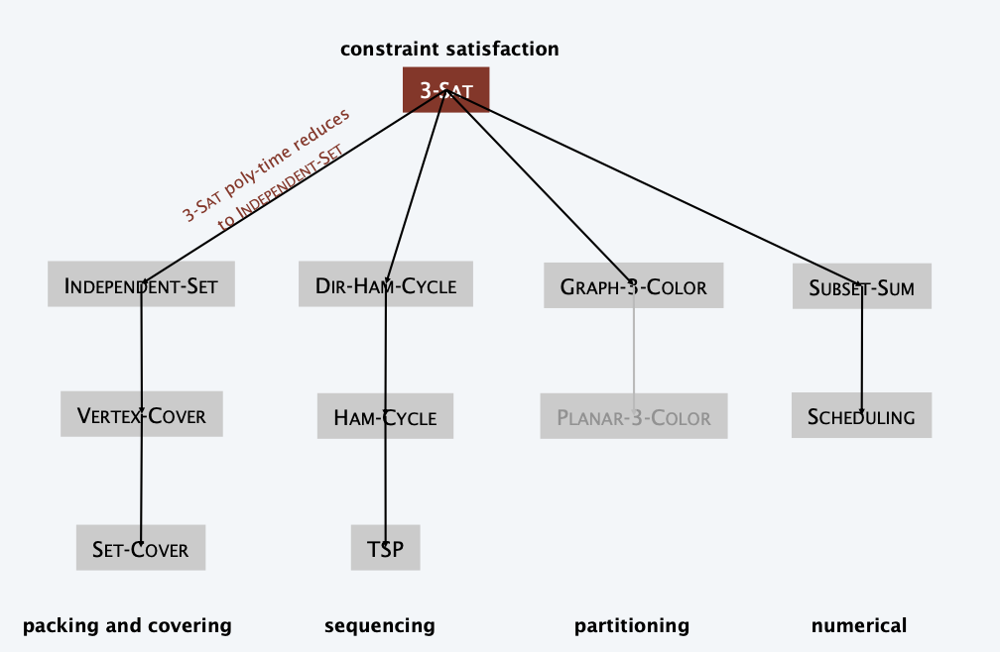

<!--more-->

[toc]

## Poly-time reductions

> Reduction: 规约

### Algorithm design patterns and antipatterns
- Algorithm design patterns.
  - Greedy.
  - Divide and conquer. 
  - Dynamic programming. 
  - Duality.
  - Reductions.
  - Local search. 
  - Randomization.
- Algorithm design antipatterns.
  - NP-completeness. $O(n^k)$ algorithm unlikely. 
  - PSPACE-completeness. $O(n^k)$ certification algorithm unlikely. 
  - Undecidability. No algorithm possible.

### Classify problems according to computational requirements

**Q**. Which problems will we be able to solve in practice?
**A working definition**. Those with polynomial-time algorithms.

**Theory**. Definition is broad and robust.
**Practice**. Poly-time algorithms scale to huge problems.

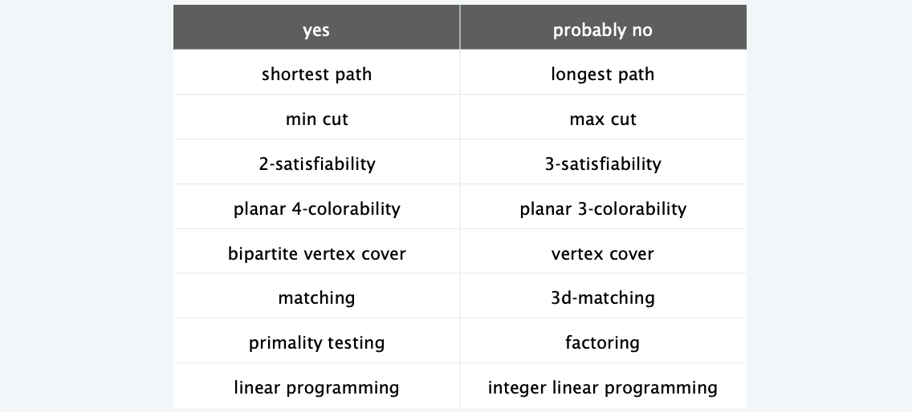
> 3 is a magic number

### Classic Problems

**Desiderata**. Classify problems according to those that can be solved in polynomial time and those that cannot.

**Provably requires exponential time.**
- Given a constant-size program, does it halt in at most k steps? 
- Given a board position in an n-by-n generalization of checkers, can black guarantee a win?

**Frustrating news**. Huge number of fundamental problems have defied classification for decades.

### Polynomial-time Reductions
> We can only gather these problems together
**Desiderata'**. Suppose we could solve X in polynomial-time. What else could we solve in polynomial time?

**Reduction**. Problem X **polynomial-time (Cook) reduces** to problem Y if arbitrary instances of problem X can be solved using:
- Polynomial number of standard computational steps, plus 
- Polynomial number of calls to oracle that solves problem Y.
  > In many cases, maybe call once is enough
> oracle: computational model supplemented by special piece of hardware that solves instances of Y in a single step
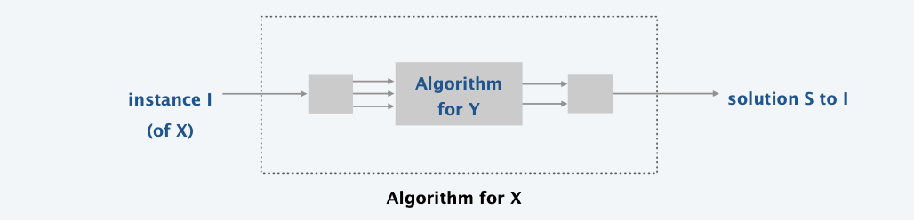

**Notation**. $X \le_{P} Y$.
**Note**. We pay for time to write down instances sent to oracle $\Rightarrow$
instances of Y must be of polynomial size. 

**Caveat**. Don't mistake $X \le_{P} Y$ with $Y \le_{P} X$

**Design algorithms**. 
- If $X \le_{P} Y$ and Y can be solved in polynomial time, then X can be solved in polynomial time.
- Establish intractability. If $X \le_{P} Y$ and X cannot be solved in polynomial time, then Y cannot be solved in polynomial time.
- Establish equivalence. If both $X \le_{P} Y$ and $Y \le_{P} X$ we use notation $X \mod_{P} Y$. In this case, X can be solved in polynomial time iff Y can be.

**Bottom line**. Reductions classify problems according to relative difficulty.

> We build the reduce relation for the following six sets of problems

## packing and covering problems 

### Independent Set

> Note the problem comes with a size $k$ and is a yes-or-no problem
**INDEPENDENT-SET**. Given a graph $G=(V, E)$ and an integer $k,$ is there a subset of vertices $S \subseteq V$ such that $|S| \geq k,$ and for each edge at most one of its endpoints is in $S ?$
> The greater k, the harder
Ex. Is there an independent set of size $\geq 6 ?$
Ex. Is there an independent set of size $\geq 7 ?$

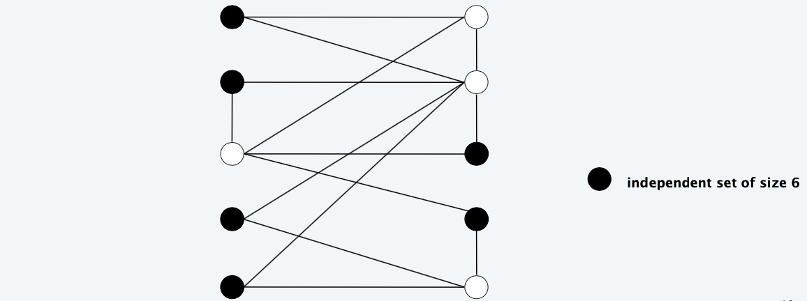

### Vertex Cover

**VERTEX-COVER**. Given a graph $G=(V, E)$ and an integer $k,$ is there a subset of vertices $S \subseteq V$ such that $|S| \leq k$, and for each edge, at least one of its endpoints is in $S ?$
> The smaller k the harder
Ex. Is there a vertex cover of size $\leq 4 ?$
Ex. Is there a vertex cover of size $\leq 3 ?$

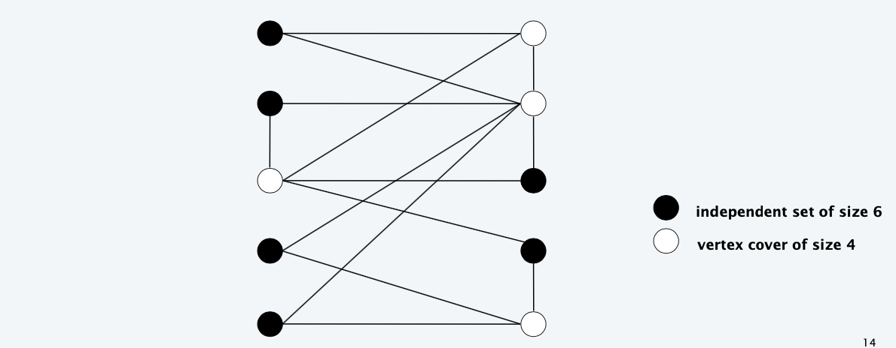
> Independ set and vertex cover are dual problems

### Vertex cover and independent set reduce to one another

**Theorem**. VERTEX-COVER $\equiv_{P}$ INDEPENDENT-SET.
**Pf**. We show $S$ is an independent set of size $k$ iff $V-S$ is a vertex cover
of size $n-k$
$\Rightarrow$
- Let $S$ be any independent set of size $k$.
- $V-S$ is of size $n-k$
- Consider an arbitrary edge $(u, v)$
- $S$ independent $\Rightarrow$ either $u \notin S$ or $v \notin S$ (or both)
  > by def of independent sets
  $\Rightarrow$ either $u \in V-S$ or $v \in V-S$ (or both).
  > Taking complement
- Thus, $V-S$ covers $(u, v)$
$\Leftarrow$
- Let $V-S$ be any vertex cover of size $n-k$
- $S$ is of size $k$
- Consider two nodes $u \in S$ and $v \in S$.
- Observe that $(u, v) \notin E$ since $V-S$ is a vertex cover.
- Thus, no two nodes in $S$ are joined by an edge $\Rightarrow S$ independent set.
> Proof by definition and basic set operation

### Set Cover

**SET-COVER**. Given a set $U$ of elements, a collection $S_{1}, S_{2}, \ldots, S_{m}$ of subsets of $U$, and an integer $k$, does there exist a collection of $\leq k$ of these sets whose union is equal to $U ?$
**Sample application**.
- $m$ available pieces of software.
- Set $U$ of $n$ capabilities that we would like our system to have.
- The $i^{t h}$ piece of software provides the set $S_{i} \subseteq U$ of capabilities.
**Goal**: achieve all $n$ capabilities using fewest pieces of software.

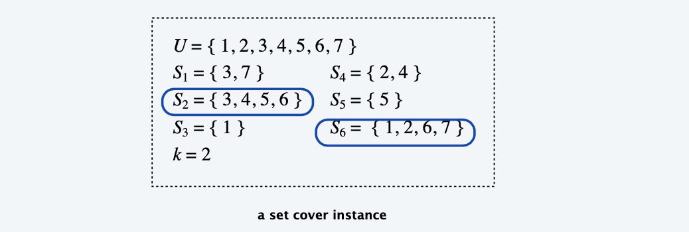

### Vertex Cover reduces to Set Cover

> Reverse, not, because in vertex cover, an edge has exactly 2 vertex, but in set cover, there is no such constraint.

**Theorem**. VERTEX-COVER $\leq_{P}$ SET-COVER.
**Pf**. Given a VERTEX-COVER instance $G=(V, E),$ we construct a SET-COVER
instance $(U, S)$ that has a set cover of size $k$ iff $G$ has a vertex cover of size $k$.

**Construction**.
- Universe $U=E$.
- Include one set for each node $v \in V: S_{v}=\{e \in E: e$ incident to $v\}$.
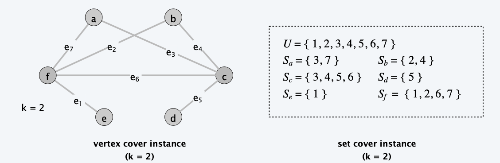

**Lemma**. $G=(V,E)$ contains a vertex cover of size $k$ iff $(U,S)$ contains a set cover of size $k$.
**Pf.** 
$\Rightarrow$ Let $X\subset V$ be a vertex cover of size $k$ in $G$.
- Then $Y = \{S_v: v\in X\}$ is a set cover of size k.
$\Leftarrow$ Let $Y\subset S$ be a set cover of size $k$ in $(U,S)$.
- Then $X = \{v: S_v\in Y\}$ is a vertex cover of size k.

## Constraint satisfaction problems 
> The core of intractability

### Satisfiability
**Literal**. A boolean variable or its negation.
$$
x_{i} \text { or } \bar{x}_{i}
$$

**Clause**. A disjunction of literals.
$$
C_{j}=x_{1} \vee \overline{x_{2}} \vee x_{3}
$$

**Conjunctive normal form**. A propositional formula $\Phi$ that is the conjunction of clauses.
$$
\Phi=C_{1} \wedge C_{2} \wedge C_{3} \wedge C_{4}
$$

**SAT**. Given CNF formula $\Phi$, does it have a satisfying truth assignment?

**3-SAT**. SAT where each clause contains exactly 3 literals (and each literal corresponds to a _different_ variable).
$$
\begin{array}{c}
\Phi=\left(\overline{x_{1}} \vee x_{2} \vee x_{3}\right) \wedge\left(x_{1} \vee \overline{x_{2}} \vee x_{3}\right) \wedge\left(\overline{x_{1}} \vee x_{2} \vee x_{4}\right) \\
\text { yes instance: } x_{1}=\text { true, } x_{2}=\text { true, } x_{3}=\text { false, } x_{4}=\text { false }
\end{array}
$$

**Key application.** Electronic design automation (EDA).
- Frontend Design, Synthesis

### 3-satisfiability reduces to independent set

**Theorem**. 3-SAT $\le_P$ INDEPENDENT-SET.
**Pf**. Given an instance $\Phi$ of 3-SAT, we construct an instance $(G, k)$ of INDEPENDENT-SET that has an independent set of size k iff $\Phi$ is satisfiable.

**Construction**.
- G contains 3 nodes for each clause, one for each literal. 
- Connect 3 literals in a clause in a triangle.
  > Clause is true $\iff$ any literal is true
  > Once one point is selected, the other set in the triangle needn't be selected
- Connect literal to each of its negations.
  > Once one assignment to a variable is selected, its negation mustn't be selected

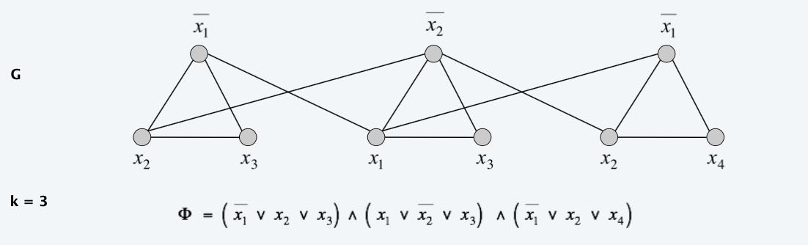

**Lemma**. $G$ contains independent set of size $k=|\Phi|$ iff $\Phi$ is satisfiable.
**Pf**. $\Rightarrow$ Let $S$ be independent set of size $k$.
- $S$ must contain exactly one node in each triangle.
- Set these literals to true (and remaining variables consistently).
- Truth assignment is consistent and all clauses are satisfied.
**Pf**. $\Leftarrow$ Given satisfying assignment, select one true literal from each triangle. This is an independent set of size $k$

### Review
**Basic reduction strategies**.
- Simple equivalence: INDEPENDENT-SET $\equiv{ }_{P}$ VERTEX-COVER.
- Special case to general case: VERTEX-COVER $\leq_{P}$ SET-COVER.
- Encoding with gadgets: 3-SAT $\leq_{P}$ INDEPENDENT-SET.
  
**Transitivity**. If $X \leq_{P} Y$ and $Y \leq_{P} Z$, then $X \leq_{P} Z$.
**Pf idea**. Compose the two algorithms.

**Ex**. 3-SAT $\leq$ p INDEPENDENT-SET $\equiv_{P}$ VERTEX-COVER $\leq_{P}$ SET-COVER.
> If we prove 3-SAT is NP, then all the following problems will be NP

### Search Problems
**Decision problem**. Does there exist a vertex cover of size $\le$ k ? 
**Search problem**. Find a vertex cover of size $\le$ k.

**Ex**. To find a vertex cover of size $\leq k$ :
- Determine if there exists a vertex cover of size $\leq k$
- Find a vertex $v$ such that $G-\{v\}$ has a vertex cover of size $\leq k-1$ (any vertex in any vertex cover of size $\leq k$ will have this property)
- Include $v$ in the vertex cover.
- Recursively find a vertex cover of size $\leq k-1$ in $G-\{v\}$.

**Bottom line**. VERTEX-COVER $\equiv_P$ FIND-VERTEX-COVER.

### Optimization Problems
**Decision problem**. Does there exist a vertex cover of size $\le$ k ? 
**Search problem**. Find a vertex cover of size $\le$ k.
**Optimization problem**. Find a vertex cover of minimum size.

**Ex**. To find vertex cover of minimum size: 
- (Binary) search for size $k^*$ of min vertex cover. 
- Solve corresponding search problem.

**Bottom line**. VERTEX-COVER $\equiv_P$ FIND-VERTEX-COVER $\equiv_P$ OPTIMAL-VERTEX-COVER.

## Sequencing problems

### Hamilton Cycle

#### Directed Hamilton Cycle reduces to Hamilton Cycle

**DIR-HAM-CYCLE**: Given a digraph G = (V, E), does there exist a simple directed cycle Γ that contains every node in V ?

**Theorem**. DIR-HAM-CYCLE $\le_{P}$ HAM-CYCLE.
**Pf**. Given a digraph $G = (V, E)$, construct a graph G' with $3n$ nodes.

> Encode direction by the color of additional nodes
> 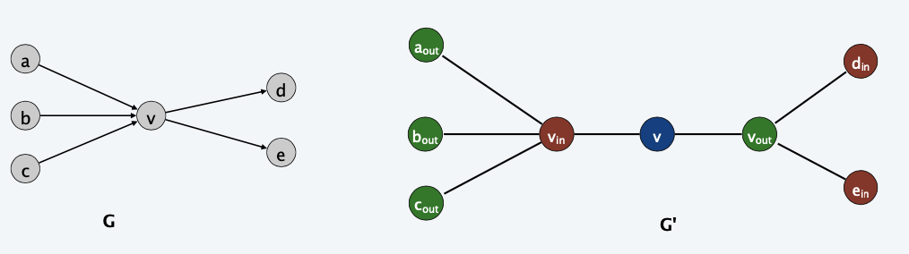

**Lemma**. G has a directed Hamilton cycle iff G' has a Hamilton cycle.
**Pf**. $\Rightarrow$
- Suppose $G$ has a directed Hamilton cycle $\Gamma$.

Then $G^{\prime}$ has an undirected Hamilton cycle (same order).

**Pf**. $\Leftarrow$

- Suppose $G^{\prime}$ has an undirected Hamilton cycle $\Gamma^{\prime}$
- $\Gamma^{\prime}$ must visit nodes in $G^{\prime}$ using one of following two orders:

$$
\begin{array}{l}
\ldots, B, G, R, B, G, R, B, G, R, B, \ldots \\
\ldots, B, R, G, B, R, G, B, R, G, B, \ldots
\end{array}
$$

Blue nodes in $\Gamma^{\prime}$ make up directed Hamilton cycle $\Gamma$ in $G$
or reverse of one.

#### 3-SAT reduces to directed hamilton cycle

**Theorem**. 3-SAT $\le_{p}$ DIR-HAM-CYCLE.
**Pf**. Given an instance $\Phi$ of 3-SAT, we construct an instance of DIR-HAM-CYCLE
that has a Hamilton cycle iff $\Phi$ is satisfiable.

**Construction**. First, create graph that has $2^n$ Hamilton cycles which correspond in a natural way to $2^n$ possible truth assignments.
Given 3-SAT instance $\Phi$ with n variables $x_i$ and k clauses.
- Construct G to have $2^n$ Hamilton cycles
- Intuition: traverse path i from left to right $\iff$ set variable $x_i$ = true
> Literal issue
> Only two directions, left-to-right is true, right-to-left is false
>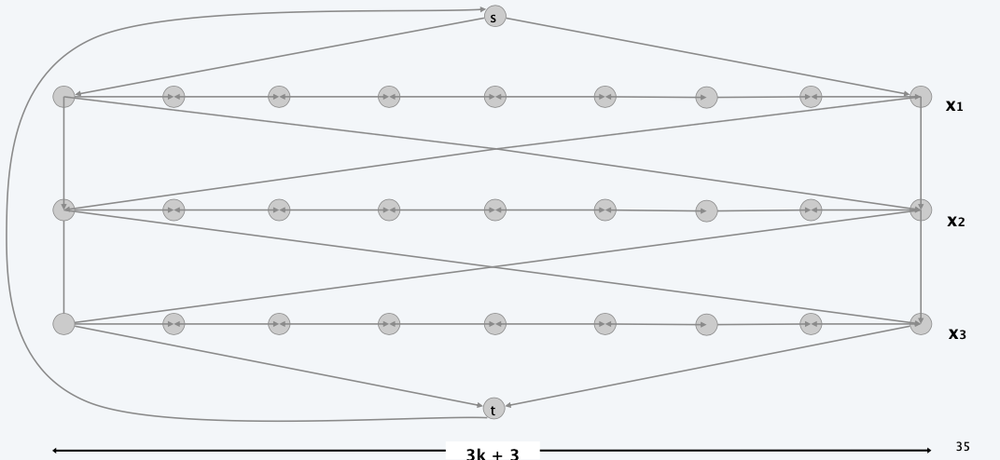
- For each clause, add a node and 6 edges.
> Clause Issue
> 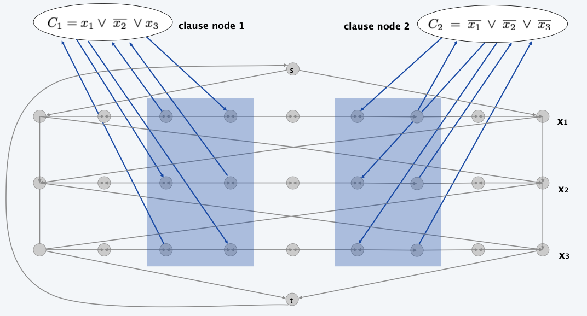

**Lemma**. $\Phi$ is satisfiable iff $G$ has a Hamilton cycle.
**Pf**. $\Rightarrow$
- Suppose 3 -SAT instance has satisfying assignment $x^{*}$.
- Then, define Hamilton cycle in $G$ as follows:
- if $x_{i}^{*}=$ true, traverse row $i$ from left to right
- if $x^{*}{ }_{i}=$ false, traverse row $i$ from right to left
- for each clause $C_{j},$ there will be at least one row $i$ in which we are going in "correct" direction to splice clause node $C_{j}$ into cycle (and we splice in $C_{j}$ exactly once)

**Pf**. $\Leftarrow$
- Suppose $G$ has a Hamilton cycle $\Gamma$.
- If $\Gamma$ enters clause node $C_{j},$ it must depart on mate edge.
  - nodes immediately before and after $C_{j}$ are connected by an edge $e \in E$
  - removing $C_{j}$ from cycle, and replacing it with edge $e$ yields Hamilton cycle on $G-\left\{C_{j}\right\}$
- Continuing in this way, we are left with a Hamilton cycle $\Gamma^{\prime}$ in $G-\left\{C_{1}, C_{2}, \ldots, C_{k}\right\}$
> Assignment can be found in this way
- Set $x^{*}{ }_{i}=$ true iff $\Gamma^{\prime}$ traverses row $i$ left to right.
- Since $\Gamma$ visits each clause node $C_{j},$ at least one of the paths is traversed in "correct" direction, and each clause is satisfied.

### Longest Path
> In the form of decision problem
**LONGEST-PATH**. Given a directed graph $G = (V, E)$, does there exists a simple path consisting of at least k edges?

#### 3-SAT reduces to Longest path

> Recall, in 3-SAT, every new clause -> extra 2 columns
> every literal -> new row
> i.e. **we can determine the number of nodes for every 3-SAT hamilton graph**
> we only need to set the lower bound to this number of nodes.

**Theorem**. 3-SAT $\le_{P}$ LONGEST-PATH.
**Pf 1**. Redo proof for DIR-HAM-CYCLE, ignoring back-edge from t to s. 
**Pf 2**. Show HAM-CYCLE $\le_{P}$ LONGEST-PATH.

### Traveling Salesperson Problem

**TSP**. Given a set of n cities and a pairwise distance function $d(u, v)$, is there a tour of length $\le D$ ?

> Similar to hamilton path, but we are not constraining the number of edges, but the total sum of distances, and not requires back to the original point

#### Hamilton Cycle reduces to TSP

**TSP**. Given a set of $n$ cities and a pairwise distance function $d(u, v)$
is there a tour of length $\leq D ?$
**HAM-CYCLE**. Given an undirected graph $G=(V, E),$ does there exist a simple
cycle $\Gamma$ that contains every node in $V ?$

**Theorem**. HaM-CYCLE $\leq_{P}$ TSP.
**Pf**.
- Given instance $G=(V, E)$ of HaM-CYCLE, create $n$ cities with distance function
  $$
  d(u, v)=\left\{\begin{array}{ll}
  1 & \text { if }(u, v) \in E \\
  2 & \text { if }(u, v) \notin E
  \end{array}\right.
  $$
- TSP instance has tour of length $\leq n$ iff $G$ has a Hamilton cycle.

**Remark**. TSP instance satisfies triangle inequality: $d(u, w) \leq d(u, v)+d(v, w)$
> The TSP problem has an authentic constraint on conditions

## partitioning problems

> Recall we have solved 2-d matching

### 3-dimensional matching
**3D-MATCHING.** Given n instructors, n courses, and n times, and a list of the possible courses and times each instructor is willing to teach, is it possible to make an assignment so that **all courses are taught at different times**?

More Formally, Given 3 disjoint sets $X, Y, and Z$, each of size $n$ and a set $T \subset X \times Y \times Z$ of triples,does there exist a set of n triples in T such that each element of $X \cup Y \cup Z$ is in exactly one of these triples?
> All elements are convered, and unique
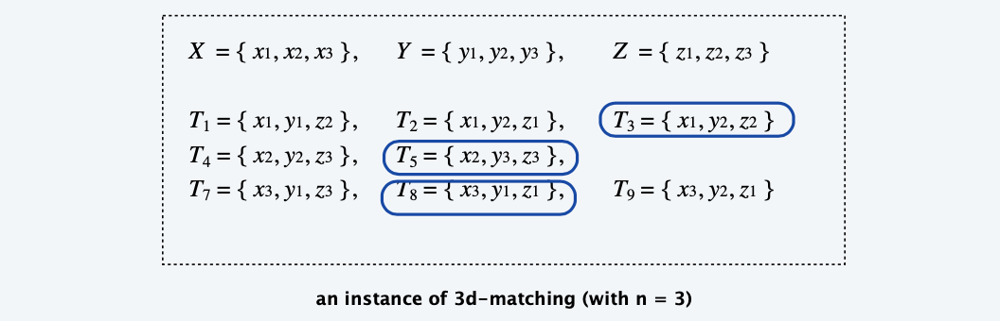

#### 3-SAT reduces to 3-d matching
**Theorem**. 3-SAT $\le_{P}$ 3D-MATCHING.
**Pf**. Given an instance Φ of 3-SAT, we construct an instance of 3D-MATCHING that has a perfect matching iff Φ is satisfiable.

**Construction**. (part 1)
> Literal issues
- Create gadget for each variable $x_i$ with 2k core elements and 2k tip ones.
- No other triples will use core elements.
- In gadget for xi, any perfect matching must use either all gray triples (corresponding to $x_i = true$) or all blue ones (corresponding to $x_i = false$).

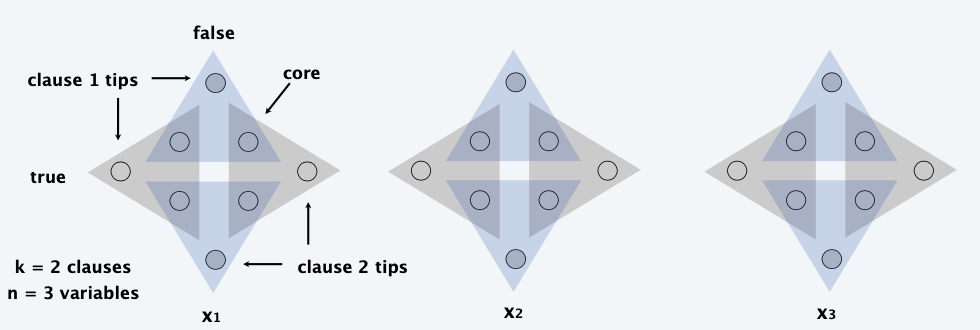
> Assume grey is true and blue is false
> i.e. if assignment to $x_1$ is true, we must cover the grey triangles

**Construction**. (part 2)
> Clause Issues
- Create gadget for each clause $C_j$ with two elements and three triples. 
- Exactly one of these triples will be used in any 3d-matching. 
- Ensures any perfect matching uses either ***ALL OF THE***
  1. grey core of $x_1$ or (true)
  2. blue core of $x_2$ or (false)
  3. grey core of $x_3$ (true)
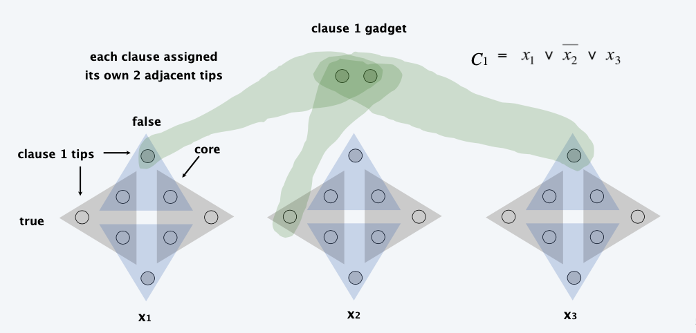

**Construction**. (part 3)
> Clean up Issues
- There are $2 n k$ tips: $n k$ covered by blue/gray triples; $k$ by clause triples.
- To cover remaining $(n-1) k$ tips, create $(n-1) k$ cleanup gadgets:
  same as clause gadget but with $2 n k$ triples, connected to every tip.
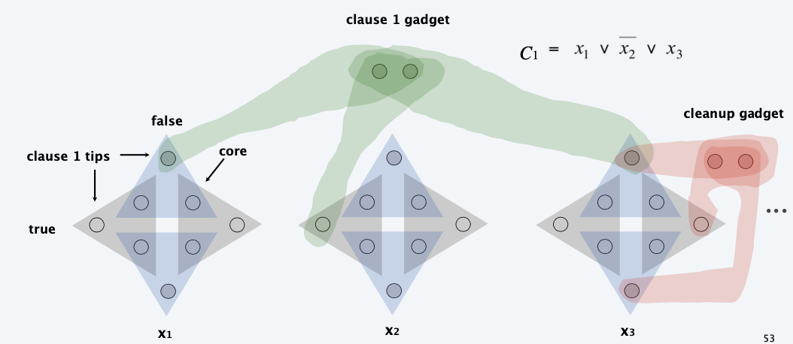

**Lemma**. Instance (X, Y, Z) has a perfect matching iff $\Phi$ is satisfiable. 

**Q**. What are X, Y, and Z?
**A**. X = red,Y = green,and Z = blue.
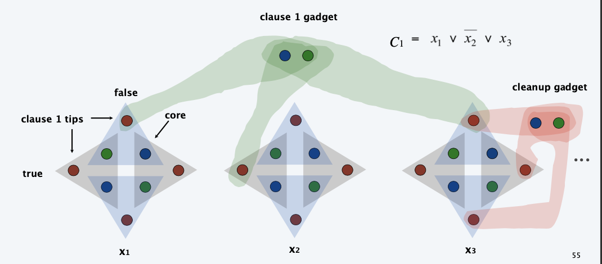

Lemma. Instance $(X, Y, Z)$ has a perfect matching iff $\Phi$ is satisfiable.
Pf. $\Rightarrow$ If $3 \mathrm{d}$ -matching, then assign $x_{i}$ according to gadget $x$.
Pf. $\Leftarrow$ If $\Phi$ is satisfiable, use any true literal in $C_{j}$ to select gadget $C_{j}$ triple.

## graph coloring

### 3-Colorability

**3-COLOR**. Given an undirected graph G, can the nodes be colored red, green, and blue so that no adjacent nodes have the same color?

**Register allocation**. Assign program variables to machine register so that no more than k registers are used and no two program variables that are needed at the same time are assigned to the same register.

**Interference graph**. Nodes are program variables names; edge between u and v if there exists an operation where both u and v are "live" at the same time.

**Observation**. [Chaitin 1982] Can solve register allocation problem iff interference graph is k-colorable.

**Fact**. 3-COLOR $\le_{P}$ K-REGISTER-ALLOCATION for any constant k ≥ 3.

### 3-SAT reduces to 3-colorability

**Theorem**. 3-SAT $\le_{P}$ 3-COLOR.
**Pf**. Given 3-SAT instance $\Phi$, we construct an instance of 3-COLOR that is 3-colorable iff $\Phi$ is satisfiable.

**Construction**.
1. Create a graph G with a node for each literal.
2. Connect each literal to its negation.
3. Create 3 new nodes T, F, and B; connect them in a triangle.
4. Connect each literal to B.
5. For each clause $C_j$, add a gadget of 6 nodes and 13 edges.

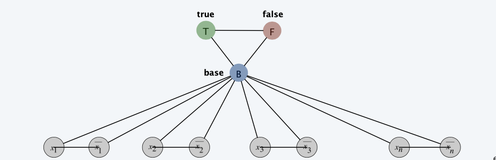

> We will assign green(true)/red(false) to every literal, it can be ensured that the color of a literal and its literal differs in red/green.

**Lemma**. Graph G is 3-colorable iff $\Phi$ is satisfiable.
**Pf**. $\ReftArrow$ Suppose graph G is 3-colorable.
- Consider assignment that sets all T literals to true. ・
  - (4) ensures each literal is T or F.
  - (2) ensures a literal and its negation are opposites.
  - (5) ensures at least one literal in each clause is T.
> To satisfy every clause, their negation can't be all hold
> 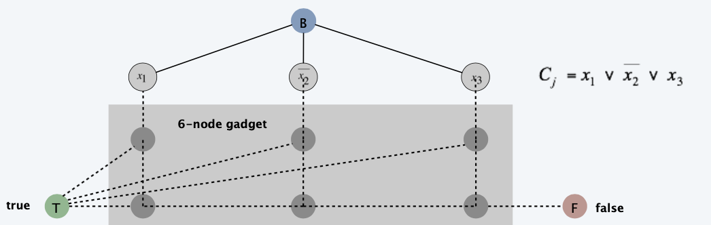
> 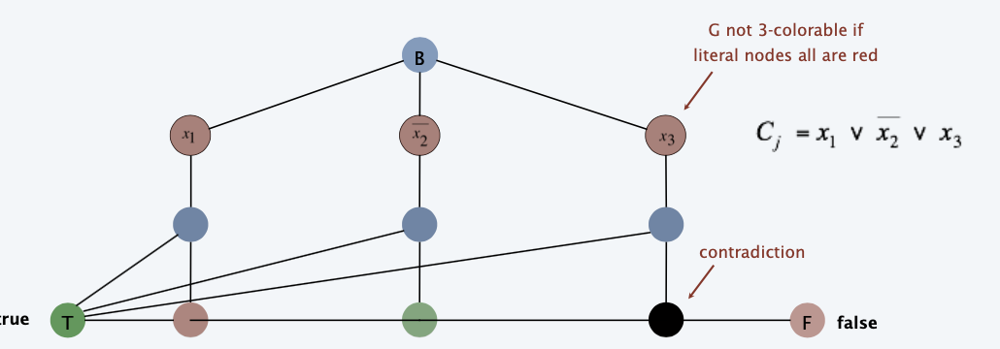
>
> Guaranteened by "GADGET"
**Pf**. 
$\Leftarrow$ Suppose 3-SAT instance $\Phi$ is satisfiable.
- Color all true literals T.
- Color node below green node F, and node below that B. 
- Color remaining middle row nodes B.
- Color remaining bottom nodes T or F as forced. 

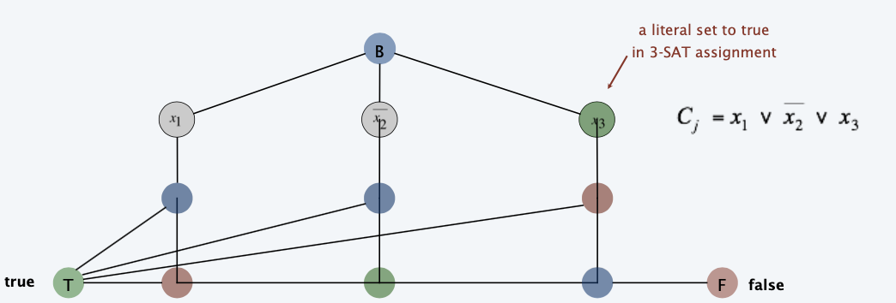
> we left two nodes uncolored, since they may be affected by others

## numerical problems

### Subset Sum

given natural numbers $w_1,...,w_n$, and an integer $W$, is there a subset that adds up to exactly $W$?

> Useful in coding secret-keys
> But the emergence of quantum computing have expose some methods to vulnerability

#### 3-SAT reduces to Subset Sum
> Encoded into binary subset sum problems

**Construction.** Given 3-SAT instance with n variables and k clauses, form 2n+2k decimal integers, each of n+k digits

- Include one digit for each variable x and for each clause c
- Include two numbers for each variable $x_i$
- Include two numbers for each clause $C_j$

Now, we let sum of each $x_i$ digit is 1; sum of each $C_j$ digit is 4.
- Choose 1 variables for clause, then add dummy 1 and 2
- Choose 2 variables for clause, then add dummy 2
- Choose 3 variables for clause, then add dummy 1

**Key property** No carries possible $\Rightarrow$ each digit yields one equation.

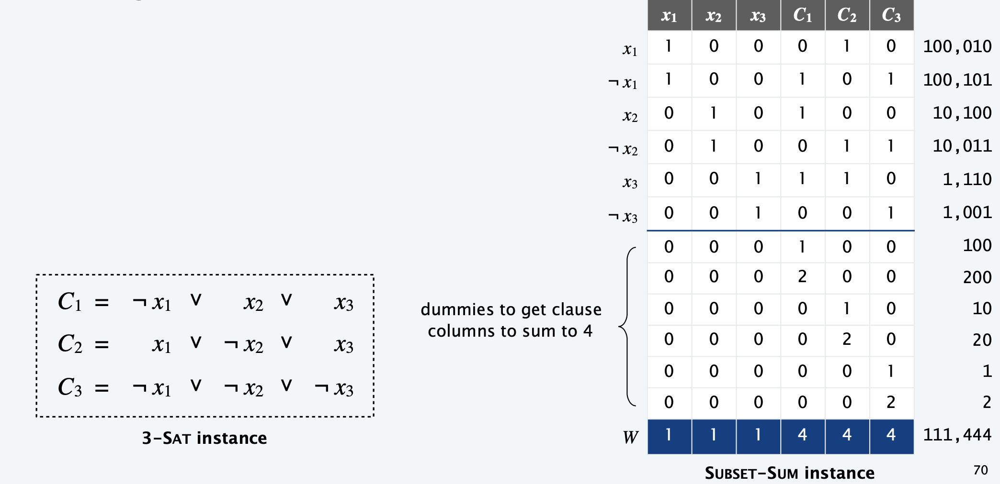

### Partition

**SUBSET-SUM.** Given natural numbers $w_{1}, \ldots, w_{n}$ and an integer $W,$ is there a subset that adds up to exactly $W ?$

**PARTITION**. Given natural numbers $v_{1}, \ldots, v_{m},$ can they be partitioned into two subsets that add up to the same value $1 / 2 \Sigma_{i} v_{i} ?$

#### Subset Sum reduces to Partition

**Theorem**. SUBSET-SUM $\leq_{P}$ PARTITION.
Pf. Let $W, w_{1}, \ldots, w_{n}$ be an instance of SUBSET-SUM.
- Create instance of PARTITION with $m=n+2$ elements.
  $$
  \text { - } v_{1}=w_{1}, v_{2}=w_{2}, \ldots, v_{n}=w_{n}, \quad v_{n+1}=2 \Sigma_{i} w_{i}-W, \quad v_{n+2}=\Sigma_{i} w_{i}+W
  $$
- Lemma: there exists a subset that sums to $W$ iff there exists a partition since elements $v_{n+1}$ and $v_{n+2}$ cannot be in the same partition.

> The light grey part is the original solutions of the subset sum

### Scheduling with Release Times

**SCHEDULE**. Given a set of n jobs with processing time $t_j$, release time $r_j$ , and deadline $d_j$, is it possible to schedule all jobs on a single machine such that job $j$ is processed with a contiguous slot of $t_j$ time units in the interval $[r_j, d_j ]$?

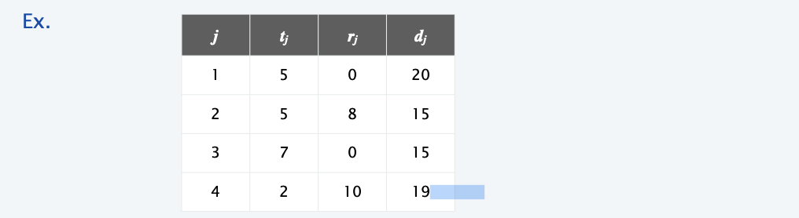

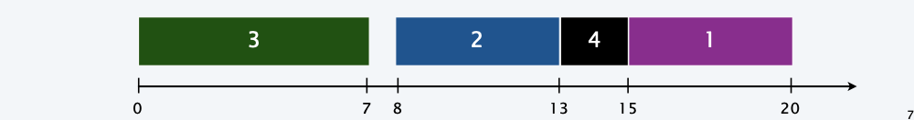

#### Subset-Sum reduces to Schedule

**Theorem**. SUBSET-SUM $\le_{P}$ SCHEDULE.
**Pf**. Given SUBSET-SUM instance $w_1, ..., w_n$ and target W, construct an instance of SCHEDULE that is feasible iff there exists a subset that sums to exactly W.

**Construction**.
- Create $n$ jobs with processing time $t_{j}=w_{j},$ release time $r_{j}=0$ and no deadline $\left(d_{j}=1+\Sigma_{j} w_{j}\right)$.
- Create job 0 with $t_{0}=1,$ release time $r_{0}=W,$ and deadline $d_{0}=W+1$
> To satisfy the condition of job 0, we have to find the subset that adds up exactly to W
- **Lemma**: subset that sums to $W$ iff there exists a feasible schedule.

> The significance of reduction relation is that if we can reduce 3-SAT into Scheduling problem, we don't have to bother to find a P-solution(dp/...) of the schedule problem.

#### 3d-matching reduces to Subset Sum

**Construction.** Let $X\cup Y\cup Z$ be a instance of 3d-matching with triplet set $T$. Let n=$|X|=|Y|=|Z|$ and $m=|T|$

- For each triplet $t=(x_i,y_j,z_k)\in T$, create an integer $w_t$ with $3n$ digits that has a 1 in position $t, n+j, 2n+k$.
- Perfect Matching iff some subet sums to $W=1111,...,1111$

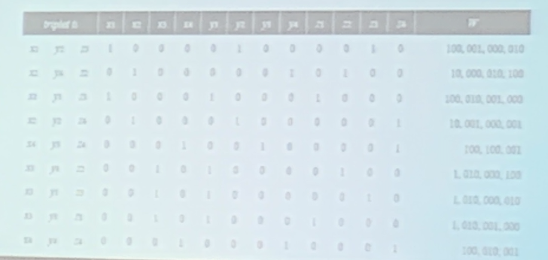

## Summary

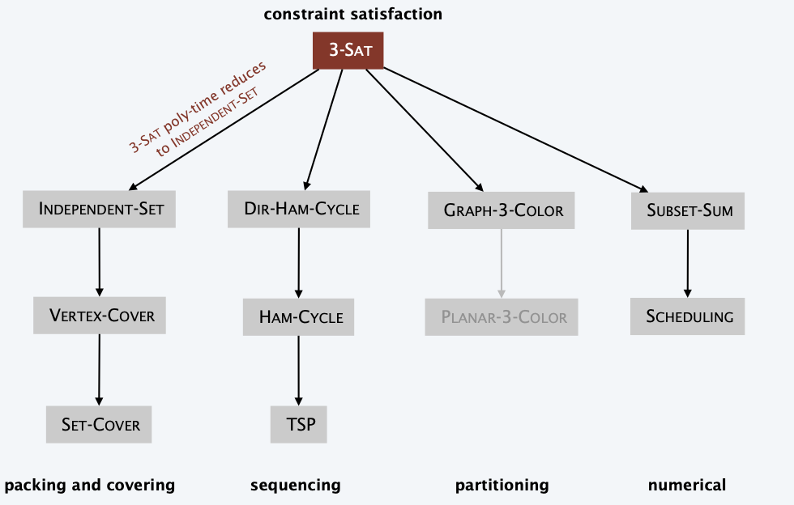

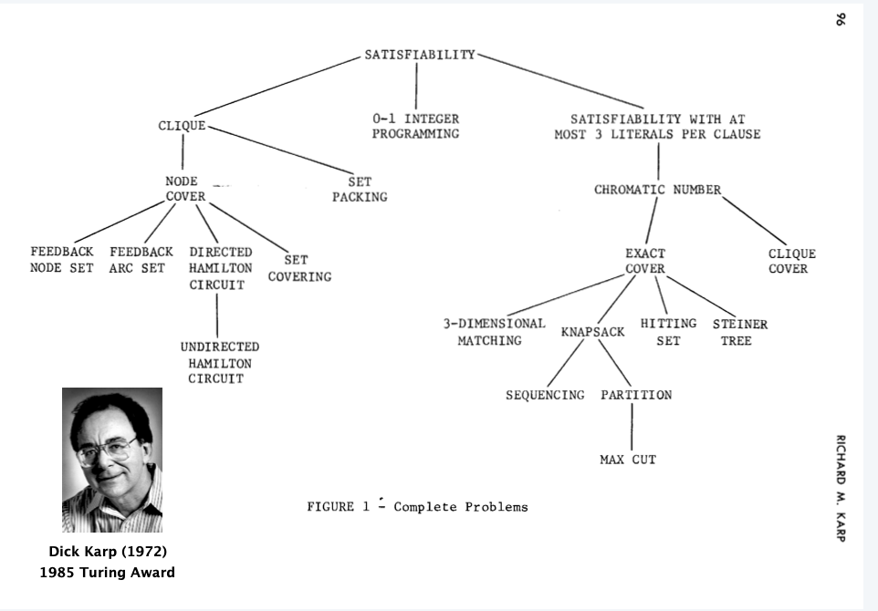