# Network Flow (III)

<!-----
title: 【Algorithm】Network Flow (III)
url: al-network3
date: 2020-11-09 13:02:26
tags: 
- Algorithm

categories: 
- Courses

---

<!--more-->

[toc]

## Assignment Problem

### Examples
1. Assignment Problem
   **Input**. Weighted, complete bipartite graph $G = (X \cup Y, E)$ with $| X | = | Y |$. 
   **Goal**. Find a perfect matching of min weight.
   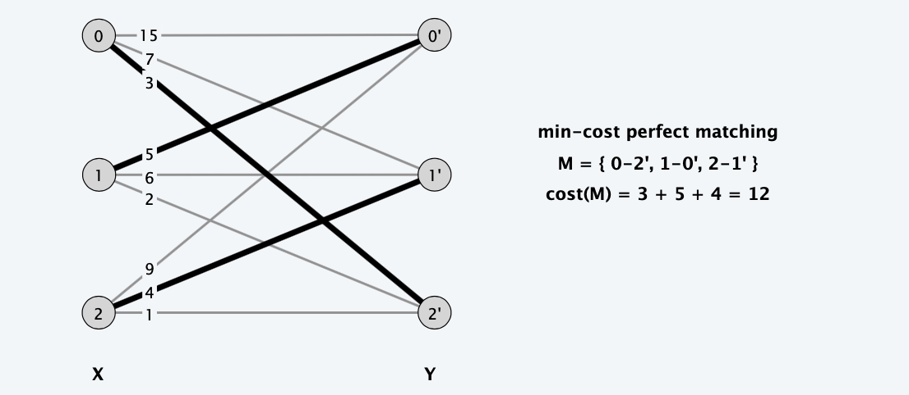
2. Princeton writing Seminars
   **Goal**. Given m seminars and n = 12m students who rank their top 8 choices, assign each student to one seminar so that:
   - Each seminar is assigned exactly 12 students. 
   - Students tend to be "happy" with their assigned seminar.
   > **Challenge**. What we are finding is not a matching, first reformulate the problem into min-matching.
   **Solution**.
   - Create one node for each student i and 12 nodes for each seminar j. 
   - Solve assignment problem where $c_{ij}$ is some function of the ranks:
        $$
        c_{i j}=\left\{\begin{array}{ll}
        f(\operatorname{rank}(i, j)) & \text { if } i \text { ranks } j \\
        \infty & \text { if } i \text { does not rank } j
        \end{array}\right.
        $$
   > What if want to relax constraint so that 10-12 students in each seminar? and students are $\le 12m$
   > Add some dummy students to fill the $12m$ positions, and assign 0-weight edge from every dummy students to the flexible seats
3. Locating Objects in space
   **Problem**. Given n objects in 3d space, locate them with 2 sensors.
   every sensor will return $n$ data, indicating the distance from the sensor to the object, how to pair them?
   - Each sensor computes line from it to each particle.
   - Let $c_{ij}$ = distance between line i from censor 1 and line j from sensor 2. 
   - Due to measurement errors, we might have $c_{ij} > 0$.
   - Solve assignment problem to locate n objects.
   **Goal**. Find a perfect matching of min weight

### Bipartite matching

**Bipartite matching**. Can solve via reduction to maximum flow.

**Flow**. During Ford-Fulkerson, all residual capacities and flows are 0-1; flow corresponds to edges in a matching M.

**Residual graph $G_M$ simplifies to**: 
- If (x, y) ∉ M, then (x, y) is in GM. 
- If (x, y) ∈ M, then (y, x) is in GM.
- 
**Augmenting path simplifies to**:
- Edge from s to an unmatched node x ∈ X,
- Alternating sequence of unmatched and matched edges, 
- Edge from unmatched node y ∈ Y to t.

### Alternating Path

**Def**. An alternating path P with respect to a matching M is an alternating sequence of unmatched and matched edges, starting from an unmatched node x ∈ X and going to an unmatched node y ∈ Y.

**Key property**. Can use P to increase by one the cardinality of the matching. Pf. Set `M'= M ⊕ P`.
> Symmetric Difference
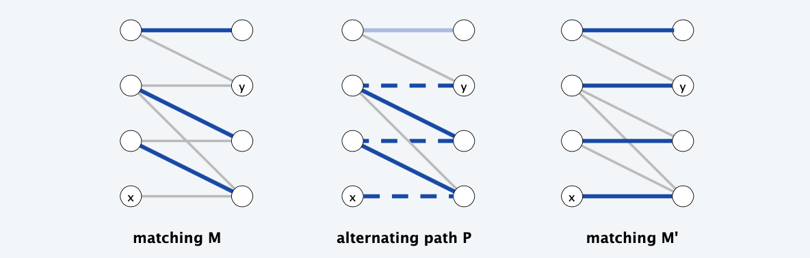

### Assignment Problem: Successive Shortest Path Algorithm
> The matching can be solved with max-flow and unit capacity
> to migrate min cost, ...

**Cost of alternating path.** Pay $c(x, y)$ to match $x-y$; receive $c(x, y)$ to unmatch.

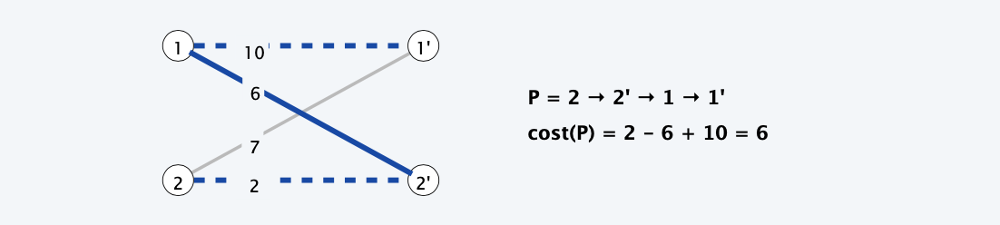

> Take the cost into record

**Shortest alternating path**. Alternating path from any unmatched node $x \in X$ to any unmatched node $y \in Y$ with smallest cost.

**Successive shortest path algorithm**.
- Start with empty matching.
- Repeatedly augment along a **shortest** alternating path.

### Finding the shortest alternating path

**Shortest alternating path**. Corresponds to minimum cost $s\sim t$ path in $G_M$.

**Concern**. Edge costs can be negative.

> However, negative costs are not genuinely in the original graph
**Fact**. If always choose shortest alternating path, then $G_M$ **contains no negative cycles**  ⇒ can compute using Bellman-Ford.
**Our plan**. Use **duality** to avoid negative edge costs (and negative cycles) ⇒ can compute using Dijkstra.

### Equivalent assignment problem

**Duality intuition**. Adding a constant $p(x)$ to the cost of every edge incident to node $x \in X$ does not change the *min-cost perfect matching(s)*.
> The overall result won't be changed, since ...
**Pf**. Every perfect matching uses exactly one edge incident to node $x$. 
> Only one edge will be used

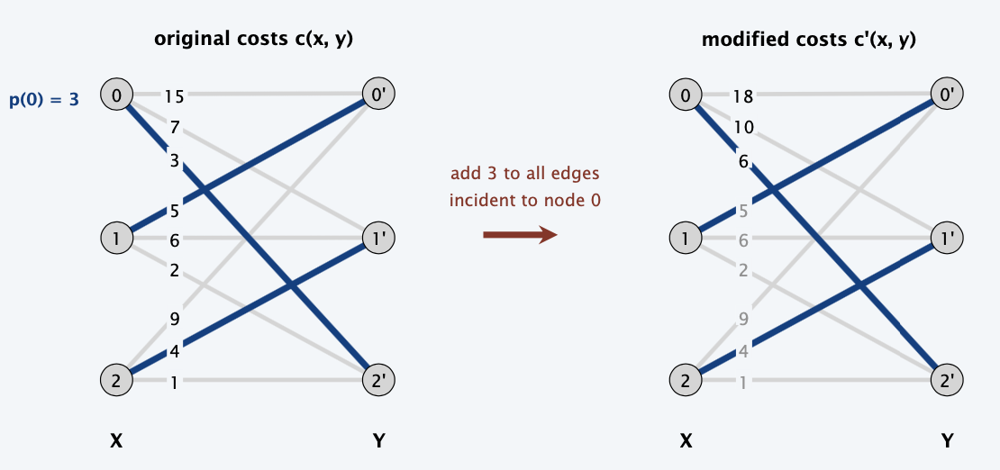

> In the original problem, the adding is not fair, since the out-edges for every node is different.
> However, here, we restrain that there is a unique out-edge for every node

**Duality intuition**. Subtracting a constant $p(y)$ to the cost of every edge incident to node $y \in Y$ does not change the min-cost perfect matching(s).
**Pf**. Every perfect matching uses exactly one edge incident to node $y$. 

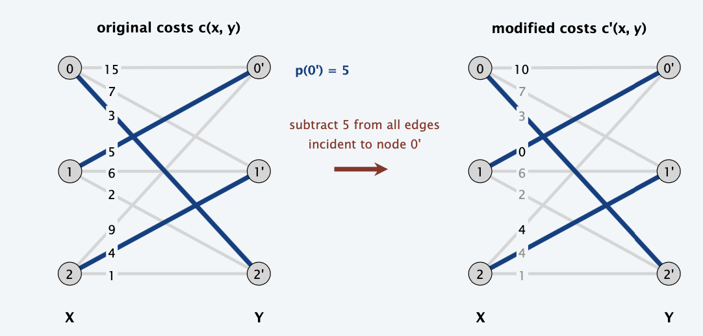

### Reduced Costs

**Reduced costs**. For $x \in X, y \in Y,$ define $c^{p}(x, y)=p(x)+c(x, y)-p(y)$

**Observation 1**. Finding a min-cost perfect matching with reduced costs is
equivalent to finding a min-cost perfect matching with original costs.

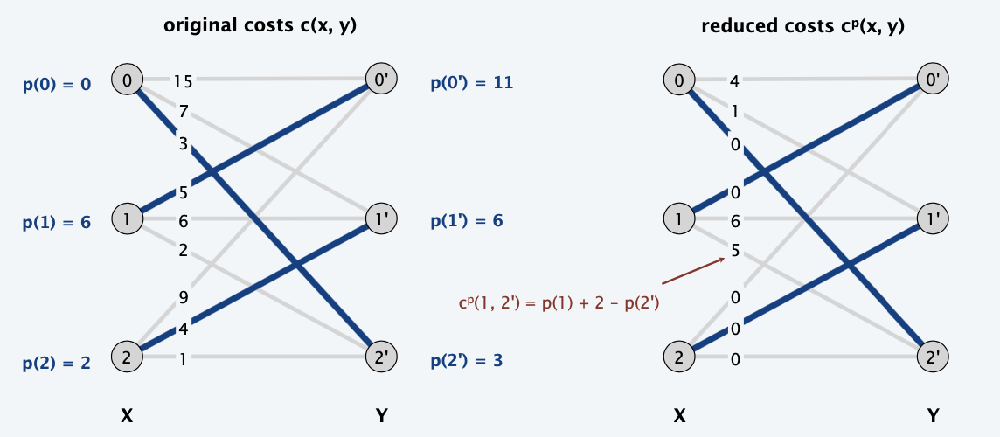

### Compatible Prices
**Compatible prices**. For each node $v \in X \cup Y,$ maintain prices $p(v)$ such that:
- $c^{p}(x, y) \geq 0$ for all $(x, y) \notin M$
- $c^{p}(x, y)=0$ for all $(x, y) \in M$

**Observation** $2 .$ If prices $p$ are compatible with a perfect matching $M$
then $M$ is a min-cost perfect matching.
**Pf**. Matching M has 0 cost. 

### Successive Shortest Path Algorithm

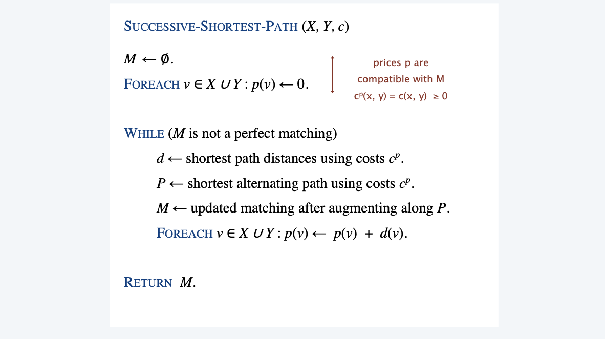

step | $d(v)$ | alternating path | reduced costs
----->- | -----  | ---------------- | -------------
0 | 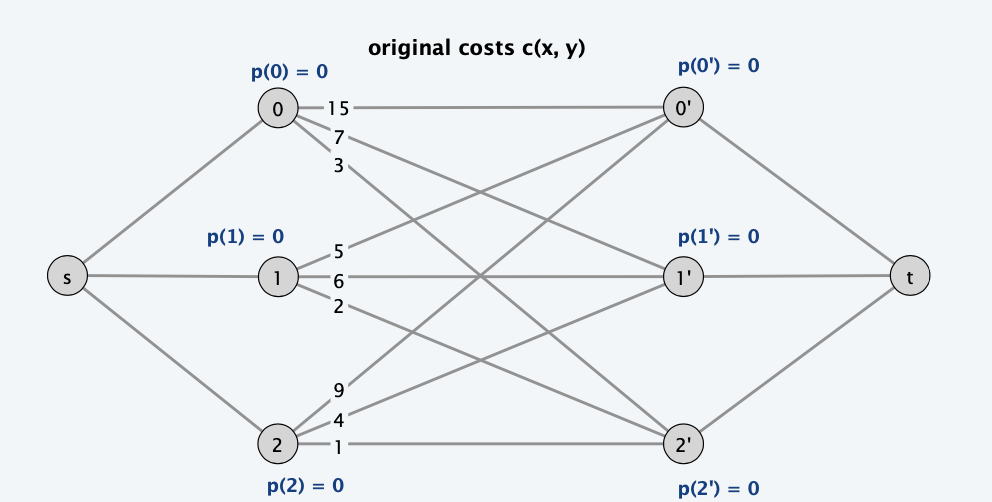 | | 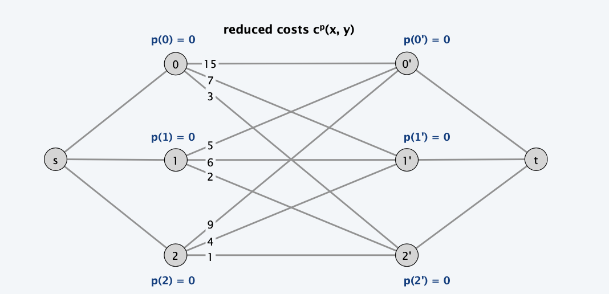
1 | 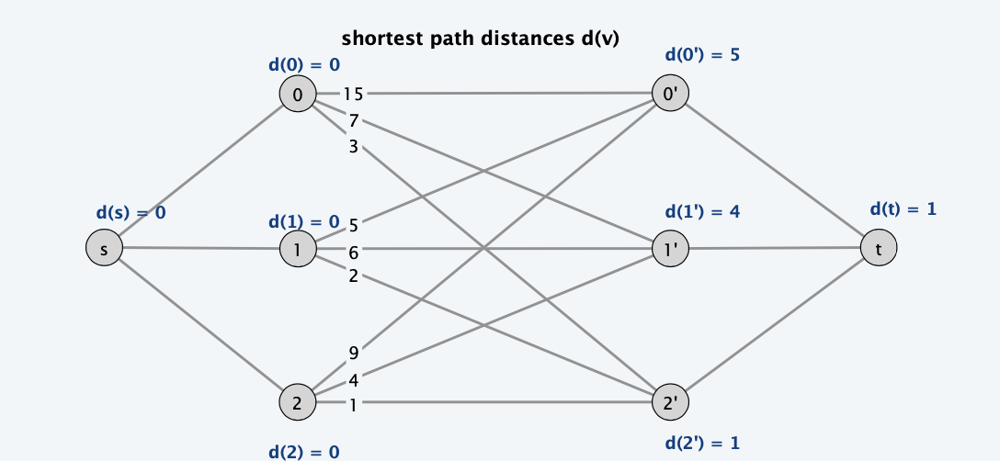 | 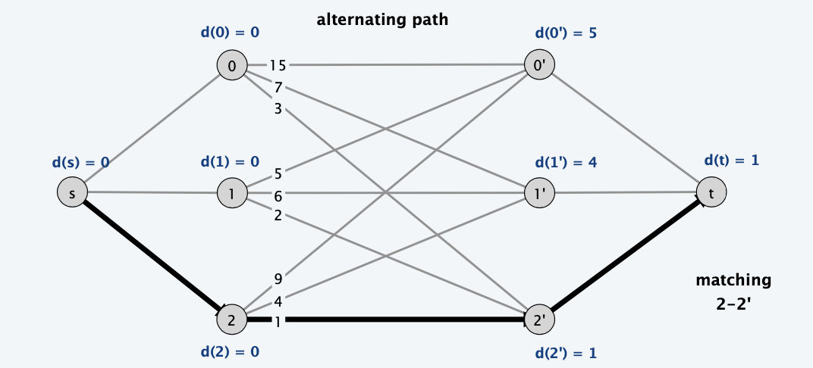 | 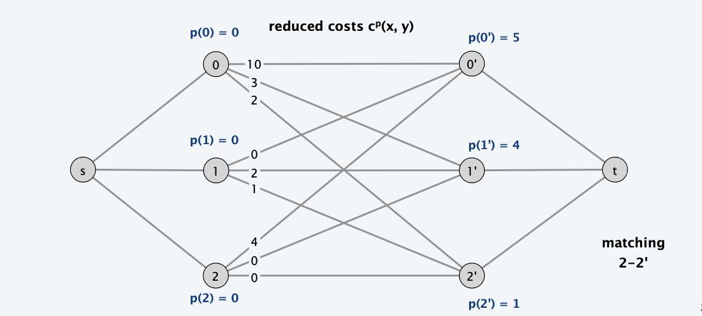
2 | 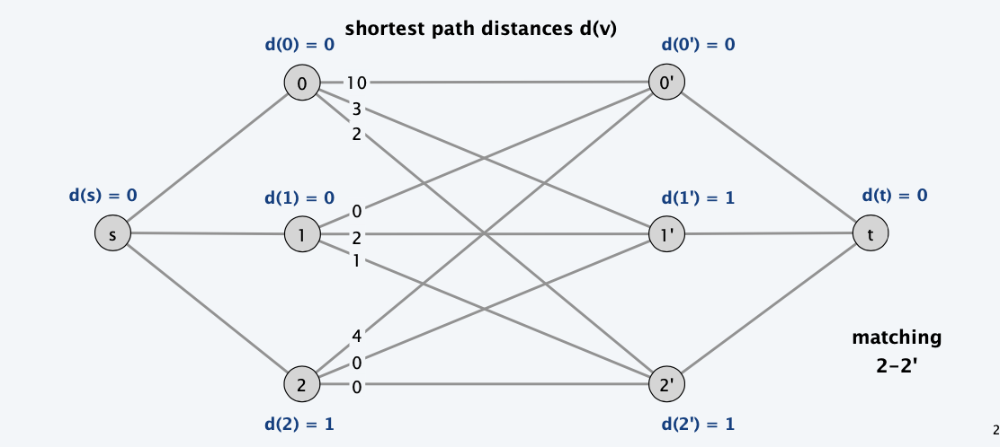 | 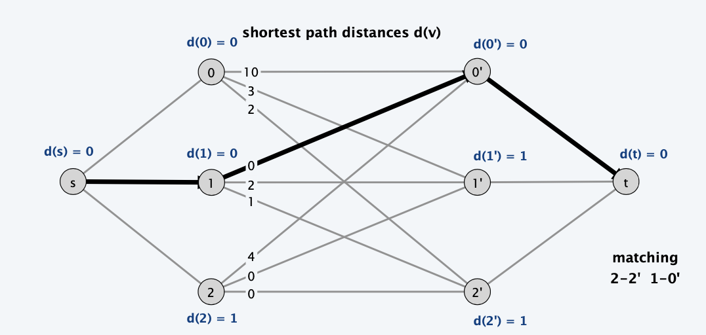 | 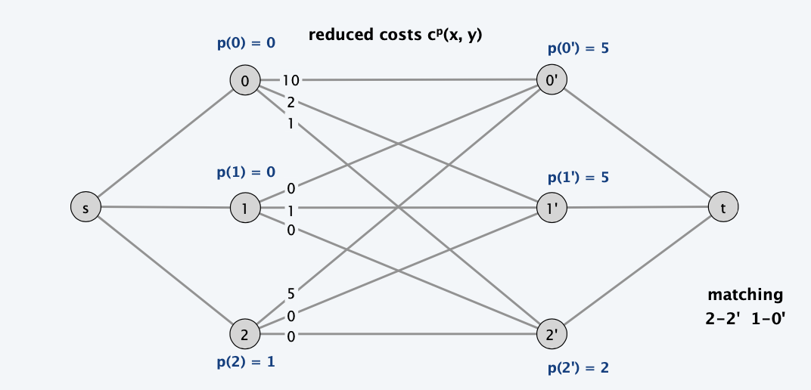
3 | 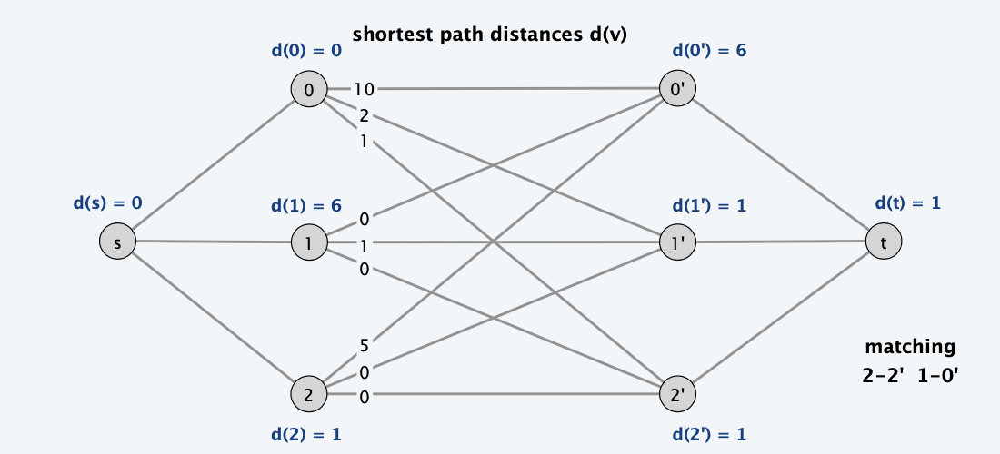 | 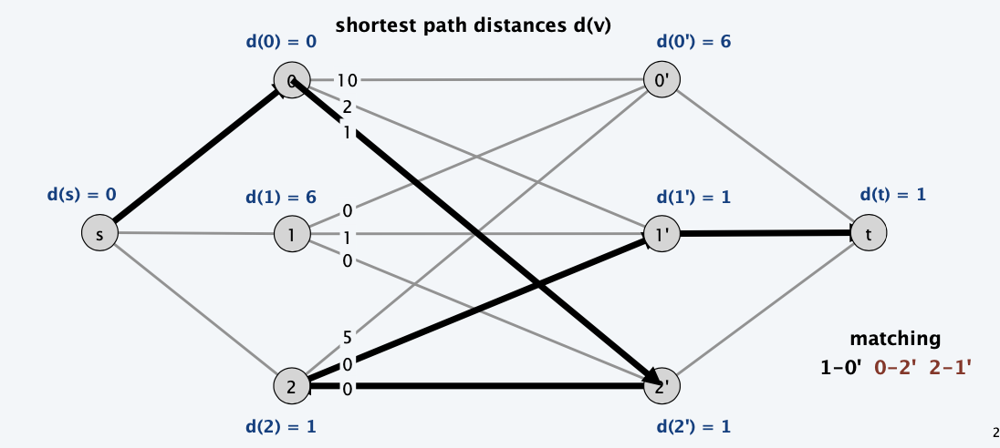 | 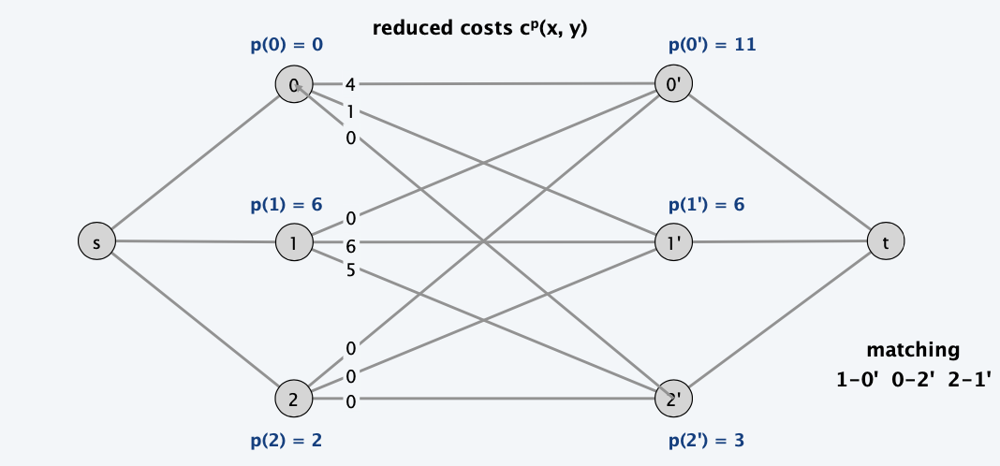
E | | | 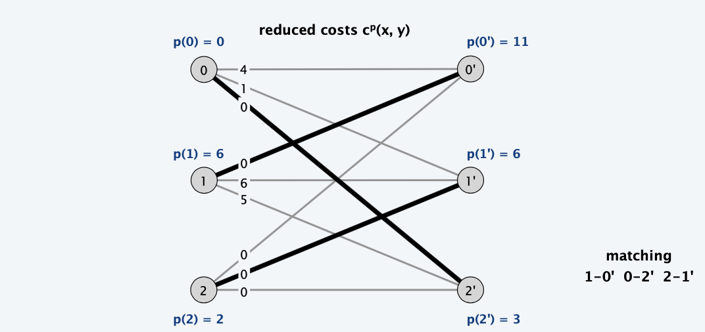

### Correctness

**Lemma** $1 .$ Let $p$ be compatible prices for $M .$ Let $d$ be shortest path
distances in $G_{M}$ with costs $c^{p} *(forward or reverse edges)* .$ All edges $(x, y)$ on shortest path have $c^{p+d}(x, y)= 0$
**Pf**. Let $(x, y)$ be some edge on shortest path.
- If $(x, y) \in M,$ then $(y, x)$ on shortest path and $d(x)=d(y)-c^{p}(x, y)$
  If $(x, y) \notin M,$ then $(x, y)$ on shortest path and $d(y)=d(x)+c^{p}(x, y)$
- In either case, $d(x)+c^{p}(x, y)-d(y)=0$.
- By definition, $c^{p}(x, y)=p(x)+c(x, y)-p(y)$
- Substituting for $c^{p}(x, y)$ yields $(p(x)+d(x))+c(x, y)-(p(y)+d(y))=0$
- In other words, $c^{p+d}(x, y)=0$

> Given prices $p,$ the reduced cost of edge $(x, y)$ is
> $$
> c^{p}(x, y)=p(x)+c(x, y)-p(y)
> $$

**Lemma** $2 .$ Let $p$ be compatible prices for $M .$ Let $d$ be shortest path
distances in $G_{M}$ with costs $c^{p} .$ Then $p^{\prime}=p+d$ are also compatible prices for $M$
**Pf**. $(x, y) \in M$
- $(y, x)$ is the only edge entering $x$ in $G_{M}$. Thus, $(y, x)$ on shortest path.
- By LEMMA $1, c^{p+d}(x, y)=0$
**Pf**. $(x, y) \notin M$
- $(x, y)$ is an edge in $G_{M} \Rightarrow d(y) \leq d(x)+c^{p}(x, y)$
- Substituting $c^{p}(x, y)=p(x)+c(x, y)-p(y) \geq 0$ yields
    $$
    (p(x)+d(x))+c(x, y)-(p(y)+d(y)) \geq 0
    $$
- In other words, $c^{p+d}(x, y) \geq 0$

> Prices $p$ are compatible with matching $M$ :
> - $c^{p}(x, y) \geq 0$ for all $(x, y) \notin M .$
> - $c^{p}(x, y)=0$ for all $(x, y) \in M .$

**Lemma** $3 .$ Let $p$ be compatible prices for $M$ and let $M^{\prime}$ be matching obtained by augmenting along a min cost path with respect to $c^{p+d} .$ Then $p^{\prime}=p+d$ are compatible prices for $M^{\prime}$.
**Pf**.
- By LEMMA $2,$ the prices $p+d$ are compatible for $M$
- since we augment along a min-cost path, the only edges $(x, y)$ that swap into or out of the matching are on the min-cost path.
- By LEMMA $1,$ these edges satisfy $c^{p+d}(x, y)=0$
- Thus, compatibility is maintained.

**Invariant**. The algorithm maintains a matching M and compatible prices p. 
**Pf**. Follows from LEMMA 2 and LEMMA 3 and initial choice of prices. ▪

**Theorem**. The algorithm returns a min-cost perfect matching.
**Pf**. Upon termination M is a perfect matching, and p are compatible prices. Optimality follows from OBSERVATION 2. ▪

**Theorem**. The algorithm can be implemented in O(n3) time. 
**Pf**.
- Each iteration increases the cardinality of M by 1 ⇒ n iterations. 
- Bottleneck operation is computing shortest path distances d.
- Since all costs are nonnegative, each iteration takes $O(n^2)$ time using (dense) Dijkstra. ▪

### Variant: Weight Bipartite Matching

**Weighted bipartite matching**. Given a weighted bipartite graph with $n$ nodes
and $m$ edges, find a _maximum cardinality matching_ of minimum weight.

**Theorem**. [Fredman-Tarjan 1987$]$ The successive shortest path algorithm solves the problem in $O\left(n^{2}+m n \log n\right)$ time using Fibonacci heaps.
**Theorem**. [Gabow-Tarjan 1989$]$ There exists an $O\left(m n^{1 / 2} \log (n C)\right)$ time algorithm for the problem when the costs are integers between 0 and $C$.
> Use similar idea like capacity scaling

## Input-queued Switching
> An application of assignment problem
- n input ports and n output ports in an n-by-n crossbar layout. 
- At most one cell can depart an input at a time.
- At most one cell can arrive at an output at a time.
- Cell arrives at input x and must be routed to output y.

**Application**. High-bandwidth switches.

**FIFO queueing**. Each input x maintains one queue of cells to be routed. 

**Head-of-line blocking (HOL)**. A cell can be blocked by a cell queued ahead
of it that is destined for a different output.

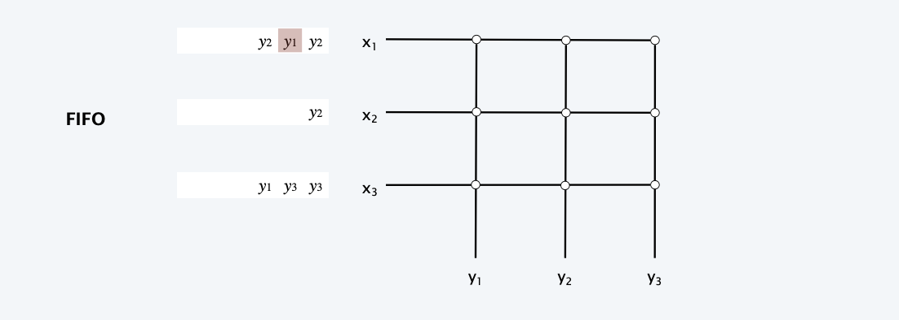

**Fact**. FIFO can limit throughput to 58% even when arrivals are *uniform* i.i.d.

### Virtual output queueing
> Physically, one queue, but scheduled as multiple queues

**Virtual output queueing (VOQ)**. Each input x maintains n queues of cells, one for each output y.

**Maximum size matching**. Find a max cardinality matching.

**Fact**. VOQ achieves 100% throughput when arrivals are uniform i.i.d. but can starve input-queues when arrivals are nonuniform.

### Variants: more constraints
> We might expect further...
**Max weight matching**. Find a min cost perfect matching between inputs x and outputs y, where c(x, y) equals:
- \[LQF\] The number of cells waiting to go from input x to output y. 
- \[OCF\] The waiting time of the cell at the head of VOQ from x to y.

**Theorem**. LQF and OCF achieve 100% throughput if arrivals are independent (even if not uniform).

**Practice**.
- Assignment problem too slow in practice. 
- Difficult to implement in hardware. 
- Provides theoretical framework: use maximal (weighted) matching.

> The network algorithm is usually hard to implement on HW, however, recent emergence of network chips can help facilitate such algorithms.