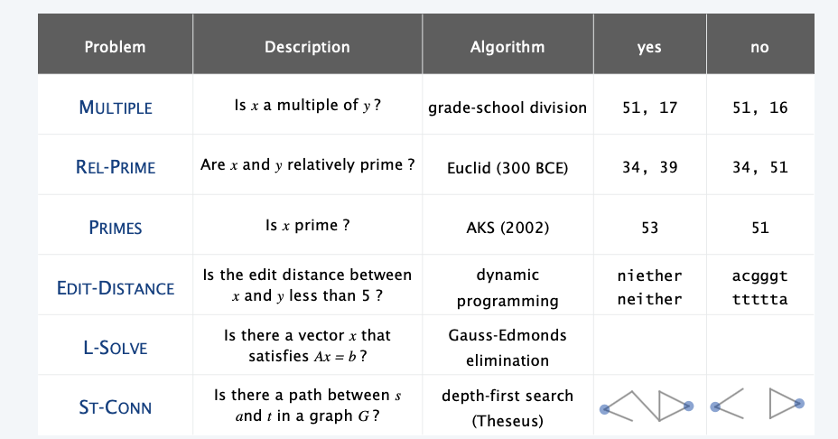
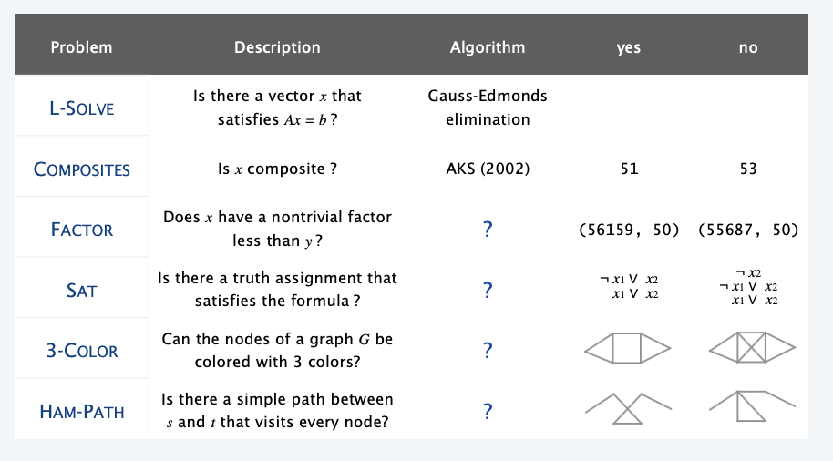
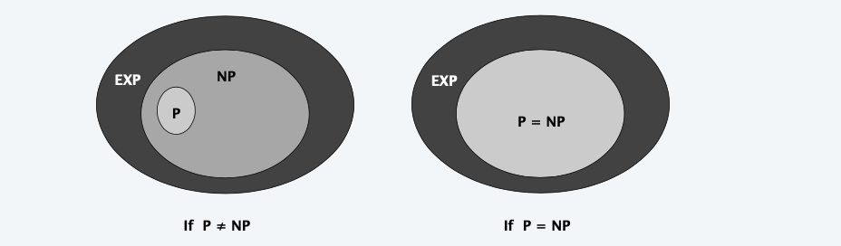
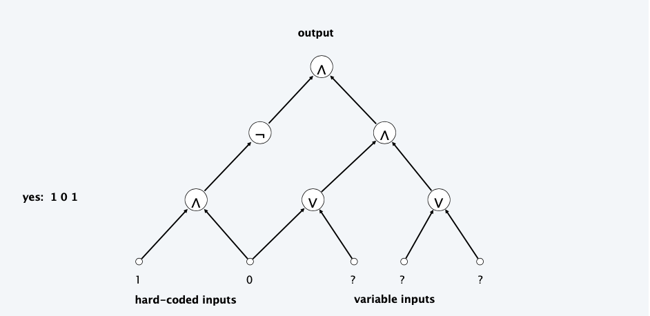
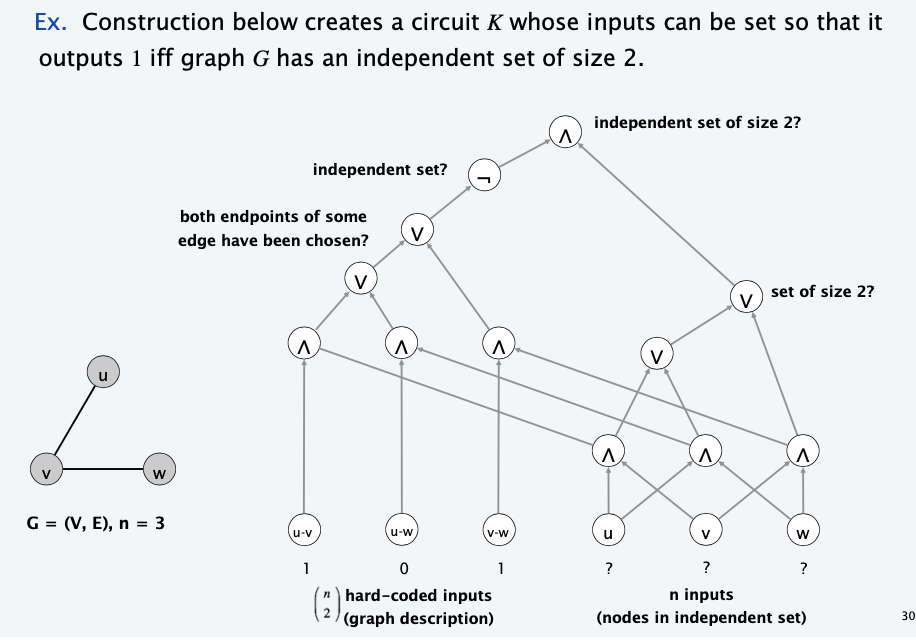

<!--more-->

[[toc]]

## P vs NP

### Decision problems

**Decision problem.**
・Problem X is a set of strings.
・Instance s is one string. 
・Algorithm A solves problem X: A(s)=yes iff $s\in X$.

**Def**. Algorithm A runs in **polynomial time** if for every string s, A(s) terminates in at most $p( | s | )$ "steps", where p(⋅) is some polynomial.

**Ex**.
- Problem PRIMES = { 2, 3, 5, 7, 11, 13, 17, 23, 29, 31, 37, .... }. 
- Instance s = 592335744548702854681.
- AKS algorithm PRIMES in $O( | s |^8 )$ steps.

### Definition of P

**P**. Decision problems for which there is a poly-time algorithm.

### Definition NP

**Certification algorithm intuition.**
・Certifier views things from "managerial" viewpoint. 
・Certifier doesn't determine whether $s\in X$ on its own; rather, it checks a proposed proof t that $s \in X$.

**Def**. Algorithm C(s, t) is a certifier for problem X if for every string s,
s ∈ X iff there exists a string t such that C(s, t) = yes. 
> t is called "certificate" or "witness"

**Def**. **NP** is the set of problems for which there exists a poly-time certifier. 
- C(s, t) is a poly-time algorithm.
- Certificate t is of poly nomial size: |t|≤ p(|s|) for some polynomial p(⋅)

**Remark**. NP stands for **nondeterministic**(不明确) polynomial time.
> Only exists poly certifier, but the method to find the certificate $t$ is not clear **(can poly and can not)**

**NP**. Decision problems for which there is a poly-time certifier.

> “ In an ideal world it would be renamed P vs VP. ” — Clyde Kruskal
> Sadly, we have not reached that world yet

### P, NP and EXP

**P**. Decision problems for which there is a poly-time algorithm.
**NP**. Decision problems for which there is a poly-time certifier.
**EXP**. Decision problems for which there is an exponential-time algorithm.

**Claim**. $P \subseteq NP$.
**Pf**. Consider any problem $X \in \mathbf{P}$.
- By definition, there exists a poly-time algorithm $A(s)$ that solves $X$.
- Certificate $t=\varepsilon,$ certifier $C(s, t)=A(s)$

**Claim**. $NP \subseteq EXP$.
**Pf**. Consider any problem $X \in \mathrm{NP}$.
- By definition, there exists a poly-time certifier $C(s, t)$ for $X$.
- To solve input $s$, run $C(s, t)$ on all strings $t$ with $|t| \leq p(|s|)$.
  > By running permutation
- Return yes if $C(s, t)$ returns yes for any of these potential certificates.

**Remark**. Time-hierarchy theorem implies $\mathbf{P} \subsetneq$ EXP.

### P vs NP

**Q**. How to solve an instance of 3-SAT with n variables? 
**A**. Exhaustive search: try all $2^n$ truth assignments.

**Q**. Can we do anything substantially more clever? 
**Conjecture**. No poly-time algorithm for 3-SAT.
> No poly-time algorithm ===> intractable

Does P = NP? [Cook 1971, Edmonds, Levin, Yablonski, Gödel] 
Is the decision problem as easy as the certification problem?

- If yes. Efficient algorithms for 3-SAT, TSP, 3-COLOR, FACTOR, ...
- If no. No efficient algorithms possible for 3-SAT, TSP, 3-COLOR, ...

**Consensus opinion**. Probably no.

## NP-complete

### Polynomial Transformation

> Reduction VS Transformation

**Def**. Problem X **polynomial (Cook) reduces** to problem Y if arbitrary instances of problem X can be solved using:
- Polynomial number of standard computational steps, plus 
- Polynomial number of calls to oracle that solves problem Y.

**Def**. Problem X **polynomial (Karp) transforms** to problem Y if given any input x to X, we can construct an input y such that x is a yes instance of X iff y is a yes instance of Y.
> we require |y| to be of size polynomial in |x|

> In reduction, multiple calls are allowed, while in transformation only one oracle is allowed

**Note**. Polynomial transformation is polynomial reduction with just one call to oracle for Y, exactly at the end of the algorithm for X. Almost all previous reductions were of this form.

**Open question**. Are these two concepts the same with respect to NP? 
> so that we can abuse notation $\le_{p}$ and blur distinction
> We abuse them since in most settings, we only use one oracle

### NP-complete

> How to say a poly time solution "does not exist"?
> We transform a problem into "NP-complete" set 

**NP-complete**. A problem $Y \in$ NP with the property that for every problem $X \in \mathrm{NP}, X \leq_{p} Y$

**Theorem**. Suppose $Y \in$ NP-complete. Then $Y \in \mathbf{P}$ iff $\mathbf{P}=\mathbf{N P .}$
**Pf**. $\Leftarrow$ If $\mathbf{P}=$ NP, then $Y \in \mathbf{P}$ because $Y \in$ NP.
**Pf**. $\Rightarrow$ Suppose $Y \in \mathbf{P}$.
- Consider any problem $X \in$ NP. Since $X \leq_{p} Y$, we have $X \in \mathbf{P}$.
- This implies NP $\subseteq$ P.
- We already know $P \subseteq$ NP. Thus $P=$ NP.

**Fundamental question**. Do there exist "natural" NP-complete problems?
> Where is the endpoint?
> In fact, back to 1970s, we have found a natural NP-complete problems

### Circuit Satisfiability

**CIRCUIT-SAT**. Given a combinational circuit built from AND, OR, and NOT gates, is there a way to set the circuit inputs so that the output is 1?

**Theorem**. CIRCUIT-SAT $\in$ NP-complete.
**Pf.**
- ・Clearly, CIRCUIT-SAT ∈ NP.
- Any algorithm that takes a fixed number of bits n as input and produces a yes or no answer can be represented by such a circuit. 
- Moreover, if algorithm takes poly-time, then circuit is of poly-size.
> sketchy part of proof; fixing the number of bits is important, and reflects basic distinction between algorithms and circuits
- Consider any problem $X \in$ NP. It has a poly-time certifier $C(s, t)$ : $s \in X$ iff there exists a certificate $t$ of length $p(|s|)$ such that $C(s, t)=$ yes.
- View $C(s, t)$ as an algorithm with $|s|+p(|s|)$ input bits and convert it into a poly-size circuit $K$
  - first $|s|$ bits are hard-coded with $s$
  - remaining $p(|s|)$ bits represent (unknown) bits of $t$
- Circuit $K$ is satisfiable iff $C(s, t)=$ yes.

