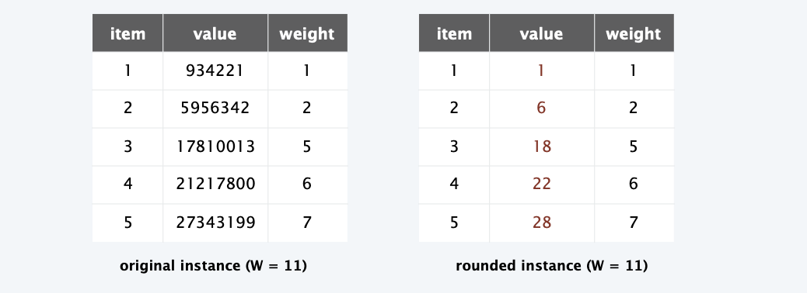

<!--more-->

## Coping with NP-completeness

**Q**. Suppose I need to solve an NP-complete problem. What should I do? 
**A**. Theory says you’re unlikely to find poly-time algorithm.

**Must sacrifice one of three desired features**.
- *Solve problem to optimality.* (_this lecture_)
- Solve problem in polynomial time. 
- Solve **arbitrary instances** of the problem.

**$\rho$-approximation algorithm**.
- Guaranteed to run in poly-time.
- Guaranteed to solve arbitrary instance of the problem 
- Guaranteed to find solution within ratio $\rho$ of true optimum.
  > $\rho \in (0,1)$ - max problem
  > $\rho \in (1,\infty)$ - min problem
  > It is easy to design an approx algorithm, but we need to learn how to analyze its $\rho$

**Challenge**. Need to prove a solution’s value is close to optimum, without even knowing what optimum value is

## load balancing

**Input**. $m$ identical machines; $n$ jobs, job $j$ has processing time $t_{j}$.  
- Job $j$ must run contiguously on one machine.
- A machine can process at most one job at a time.
  
**Def**. Let $S[i]$ be the subset of jobs assigned to machine $i$.
The **load** of machine $i$ is $L[i]=\Sigma_{j \in S[i]} t_{j}$

**Def**. The makespan is the maximum load on any machine $L=\max _{i} L[i] .$

**Load balancing**. Assign each job to a machine to minimize makespan.

> Useful in parallel computing, because we need to make sure that all tasks end as early as possible

### Load Balancing on 2 machines is NP-hard

> Recall: Number Partition, divide an array into 2 parts and check they are equal in sum

**Claim**. Load balancing is hard even if m = 2 machines. 
**Pf**. PARTITION $\le_{P}$ LOAD-BALANCE.

### List Scheduling

**List-scheduling algorithm.**
- Consider n jobs in some fixed order.
- Assign job j to machine i whose load is smallest so far.

**Implementation**. $O(n log m)$ using a priority queue for loads L[k].

### List Scheduling Analysis

**Theorem**. [Graham 1966] Greedy algorithm is a 2 -approximation.
- First worst-case analysis of an approximation algorithm.
- Need to compare resulting solution with optimal makespan $L^{*}$.

> A worst case analysis
**Lemma 1**. The optimal makespan $L^{*} \geq \max _{j} t_{j}$
**Pf**. Some machine must process the most time-consuming job.

> hint: A heruistic for ordering jobs: _lengthy jobs first_

**Lemma 2.** The optimal makespan $L^{*} \geq \frac{1}{m} \sum_{j} t_{j}$
**Pf**.
- The total processing time is $\Sigma_{j} t_{j}$
- One of $m$ machines must do at least a $1 / m$ fraction of total work.

**Theorem**. Greedy algorithm is a 2-approximation.
**Pf**. Consider load $L[i]$ of bottleneck machine $i$. (*machine that ends up with highest load*)
- Let $j$ be last job scheduled on machine $i$.
- When job $j$ assigned to machine $i, i$ had smallest load. (*According to greedy strategy*)
- Its load before assignment is $L[i]-t_{j} \Rightarrow L[i]-t_{j} \leq L[k]$ for all $1 \leq k \leq m$

- Sum inequalities over all $k$ and divide by $m$
  $$
  \begin{aligned}
  L[i]-t_{j} & \leq \frac{1}{m} \sum_{k} L[k] \\
  &=\frac{1}{m} \sum_{k} t_{k} \\
  \text { Lemma } 2 \longrightarrow & \leq L^{*} \\
  \text { Now, } L=L[i]=\underbrace{\left(L[i]-t_{j}\right.}_{\leq L^{*}(above)} & \underbrace{t_{j}}_{\leq L^{*}(Lemma\space1)} \leq 2 L^{*}
  \end{aligned}
  $$

> The 2 analysis is **tight** because we can find a certificate

- An example: m machines, m (m – 1) jobs length 1 jobs, one job of length m.
- Worst Case
  
- Optimal Case
  

### Longest Processing Time rule

Sort n jobs in decreasing order of processing times; then run list scheduling algorithm.

**Observation**. If bottleneck machine i has only 1 job, then optimal. 
**Pf**. Any solution must schedule that job. 

**Lemma 3**. If there are more than m jobs, $L^* \ge 2 t_{m+1}$ .
**Pf**.
- Consider processing times of first $m+1$ jobs $t_1 \ge t_2 \ge ... \ge t_{m+1}$. 
- Each takes at least $t_{m+1}$ time.
- There are m + 1 jobs and m machines, so by **pigeonhole principle,** at least one machine gets two jobs.

**Theorem**. LPT rule is a 3/2-approximation algorithm.
**Pf**. $[$ similar to proof for list scheduling $]$
- Consider load $L[i]$ of bottleneck machine $i$.
- Let $j$ be last job scheduled on machine $i $. 

$$
L=L[i]=\underbrace{\left(L[i]-t_{j}\right)}_{\text {as before } \rightarrow \leq L^{*}}+\underbrace{t_{j}}_{\le 1 / 2 L^{*} (Lemma \space 3, t_j \le t_{m+1})} \leq \frac{3}{2} L^{*}
$$

> Idea: make use of the $m+1$th job, i.e. the first job that can't be assigned at the beginning.

**Q**. Is our $3 / 2$ analysis tight?
**A**. No.
**Theorem**. [Graham 1969$]$ LPT rule is a 4/3-approximation.
**Pf**. More sophisticated analysis of same algorithm.

**Q**. Is Graham's $4 / 3$ analysis tight?
**A**. Essentially yes.
**Ex**.
- $\cdot m$ machines
- $n=2 m+1$ jobs
- 2 jobs of length $m, m+1, \ldots, 2 m-1$ and one more job of length $m$
- Then, $L / L^{*}=(4 m-1) /(3 m)$

## center selection

**Input**. Set of n sites $s_1, ..., s_n$ and an integer $k > 0$.
**Center selection problem**. Select set of k centers C so that maximum distance r(C) from a site to nearest center is minimized.

**Notation**. $r(C) = \max_i dist(s_i , C)$ = smallest covering radius.

**Goal**. Find set of centers C that minimizes r(C), subject to | C | = k.

**Remark**: search can be infinite!

### Greedy Algorithm

Choose site, Repeatedly choose next center to be site farthest from any existing center.

**Property**. Upon termination, all centers in C are pairwise at least r(C) apart. 
**Pf**. By construction of algorithm.

> How far is the greedy solution to the optimal ?

**Lemma**. Let $C^*$ be an optimal set of centers. Then $r(C) \le 2r(C^*)$.
**Pf**. _[by contradiction]_ Assume $r\left(C^{*}\right)<1 / 2 r(C)$.
- For each site $c_{i} \in C,$ consider ball of radius $1 / 2 r(C)$ around it.
- Exactly one $c_{i}^{*}$ in each ball; let $c_{i}$ be the site paired with $c_{i}^{*}$.
> **Tricky part** Exactly one $c_{i}^{*}$ <- since we are choosing sites as the greedy solution
- Consider any site $s$ and its closest center $c_{i}^{*} \in C^{\star}$
- $\operatorname{dist}(s, C) \leq \operatorname{dist}\left(s, c_{i}\right) \leq \operatorname{dist}\left(s, c_{i}^{*}\right)+\operatorname{dist}\left(c_{i}^{*}, c_{i}\right) \leq 2 r\left(C^{*}\right)$
- Thus, $r(C) \leq 2 r\left(C^{*}\right) . \uparrow$

**Theorem**. Greedy algorithm is a 2-approximation for center selection
problem.
**Remark**. Greedy algorithm always places centers at sites, but is still within a factor of 2 of best solution that is allowed to place centers anywhere.
> Though solution space is greatly shrinked (restricted to sites instead of infinite space), we can still get a 2-approx.
> A practical technique when solving intractable problems: **Shrink the solution space**

**Theorem**. Unless **P = NP**, there no ρ-approximation for center selection problem for any $\rho < 2$.

**Pf.**
> Dominating set problem is a proved NP-hard problem, show by reduction to dominating set problem

- Let $G=(V, E), k$ be an instance of DOMINATING-SET.
- Construct instance $G^{\prime}$ of CENTER-SELECTION with sites $V$ and distances
  - $\operatorname{dist}(u, v)=1$ if $(u, v) \in E$
  - $\operatorname{dist}(u, v)=2$ if $(u, v) \notin E$
- Note that $G^{\prime}$ satisfies the triangle inequality.
- $G$ has dominating set of size $k$ iff there exists $k$ centers $C^{*}$ with $r\left(C^{*}\right)=1$
  > If the covering ratio is 1, solution exists
  > Similar to proof of **TSP -> Hamilton Cycle**
- Thus, if $G$ has a dominating set of size $k,$ a $(2-\varepsilon)$ -approximation algorithm for CENTER-SELECTION would find a solution $C^{*}$ with $r\left(C^{*}\right)=1$ since it cannot use any edge of distance $2 .$

## pricing method: weighted vertex cover 

**Definition**. Given a graph G = (V, E), a vertex cover is a set $S \subset V$ such that each edge in E has at least one end in S.

**Weighted vertex cover**. Given a graph G with vertex weights, find a vertex cover of _minimum weight_.
> Instead of minimum cardinality

### Pricing method

**Pricing method**. Each edge must be covered by some vertex. 
- Edge $e = (i, j)$ pays price $p_e \ge 0$ to use both vertex i and j.
> Intuition: every time we cover an edge, it will pay its two nodes

**Fairness**. Edges incident to vertex i should pay $\le w_i$ in total.

> The total money received by a node should not exceed its weight

**Fairness lemma**. For any vertex cover $S$ and any fair prices $p_{e}: \Sigma_{e} p_{e} \leq w(S)$
Pf.
$$
\sum_{e \in E} p_{e} \leq \sum_{i \in S} \sum_{e=(i, j)} p_{e} \leq \sum_{i \in S} w_{i}=w(S)
$$
- each edge e covered by at least one node in S
- sum fairness inequalities for each node in S

### Algorithm

Set prices and find vertex cover simultaneously.

> All edges will be covered, otherwise there will be untight nodes and we can charge more from this not covered edge

> The algorithm will terminate since one node will be tight every iteration
> No more nodes will be selected if enough
> But the optimality will not be guaranteed since it relies on the order we select edge

### Analysis

**Theorem**. Pricing method is a 2 -approximation for WEIGHTED-VERTEX-COVER.
**Pf**.
- Algorithm terminates since at least one new node becomes tight after each iteration of while loop.
- Let $S=$ set of all tight nodes upon termination of algorithm. $S$ is a vertex cover: if some edge $(i, j)$ is uncovered, then neither $i$ nor $j$ is tight. But then while loop would not terminate.
- Let $S^{*}$ be optimal vertex cover. We show $w(S) \leq 2 w\left(S^{*}\right)$.
  $$
  w(S)=\sum_{i \in S} w_{i}=\sum_{i \in S} \sum_{e=(i, j)} p_{e} \leq \sum_{i \in V} \sum_{e=(i, j)} p_{e}=2 \sum_{e \in E} p_{e} \leq 2 w\left(S^{*}\right)
  $$
> equality1: all nodes in S are tight.
> inequality2: $S\subset V$, prices $\ge 0$
> equality3: each edge counted twice
> inequality4: Fairness Lemma

## LP rounding: weighted vertex cover

### ILP formulation
**Integer linear programming formulation**.
- Model inclusion of each vertex $i$ using a $0 / 1$ variable $x_{i}$.
  $$
  x_{i}=\left\{\begin{array}{ll}
  0 & \text { if vertex } i \text { is not in vertex cover } \\
  1 & \text { if vertex } i \text { is in vertex cover }
  \end{array}\right.
  $$
- Vertex covers in $1-1$ correspondence with $0 / 1$ assignments:
  $S=\left\{i \in V: x_{i}=1\right\}$
- Objective function: minimize $\Sigma_{i} w_{i} x_{i}$
- For every edge $(i, j),$ must take either vertex $i$ or $j$ (or both): $x_{i}+x_{j} \geq 1$.

$$
\begin{aligned}
(I L P) \min \sum_{i \in V} w_{i} x_{i} \\
\text { s.t. } \quad x_{i}+x_{j} \geq 1 &(i, j) \in E \\
x_{i} \in\{0,1\} \quad i \in V
\end{aligned}
$$

**Observation**. If $x^{*}$ is optimal solution to $I L P,$ then $S=\left\{i \in V: x_{i}^{*}=1\right\}$ is a min-weight vertex cover.

**Observation**. Vertex cover formulation proves that INTEGER-PROGRAMMING
 is an NP-hard search problem.

### Linear Programming
> Sometimes we use a relaxation to LP to solve ILP
- **Simplex algorithm**. [Dantzig 1947] Can solve LP in practice.  (not poly in theory)
- **Ellipsoid algorithm**. [Khachiyan 1979] Can solve LP in poly-time.
- **Interior point algorithms**. [Karmarkar 1984, Renegar 1988, ... ] Can solve LP both in poly-time and in practice.

**Observation**. Optimal value of LP is ≤ optimal value of ILP.
**Pf**. LP has fewer constraints.

**Note**. LP is not equivalent to weighted vertex cover. (even if all weights are 1)

### Apply LP in weighted vertex cover ILP: LP rounding algorithm

**Lemma**. If $x^{*}$ is optimal solution to $L P,$ then $S=\left\{i \in V: x_{i}^{*} \geq 1 / 2\right\}$ is a vertex cover whose weight is at most twice the min possible weight.

**Pf**. $[S$ is a vertex cover]
- Consider an edge $(i, j) \in E$. 
- since $x_{i}^{*}+x_{j}^{*} \geq 1,$ either $x_{i}^{*} \geq 1 / 2$ or $x_{j}^{*} \geq 1 / 2$ (or both) $\Rightarrow(i, j)$ covered.
  
**Pf**. $[S$ has desired cost $]$
Let $S^{*}$ be optimal vertex cover. Then
$$
\sum_{i \in S^{*}} w_{i} \geq \sum_{i \in S} w_{i} x_{i}^{*} \geq \frac{1}{2} \sum_{i \in S} w_{i}
$$

**Theorem**. The rounding algorithm is a 2-approximation algorithm. 
**Pf**. Lemma + fact that LP can be solved in poly-time.

### Weighted vertex cover inapproximability

**Theorem**. [Dinur–Safra 2004] If P ≠ NP, then no ρ-approximation for WEIGHTED-VERTEX-COVER for any ρ < 1.3606 (even if all weights are 1).

**Open research problem**. Close the gap.

## generalized load balancing

**Input**. Set of $m$ machines $M ;$ set of $n$ jobs $J .
- $ Job $j \in J$ must run contiguously on an authorized machine in $M_{j} \subseteq M$ (*This is new: jobs can only run on particular machine*)
- Job $j \in J$ has processing time $t_{j}$
- Each machine can process at most one job at a time.
  
**Def**. Let $J_{i}$ be the subset of jobs assigned to machine $i$
The load of machine $i$ is $L_{i}=\Sigma_{j \in J_{i}} t_{j}$

**Def**. The makespan is the maximum load on any machine $=\max _{i} L_{i}$

**Generalized load balancing**. Assign each job to an authorized machine to
minimize makespan.

### Integer Linear Programming and Relaxation

> In many cases, a delicate formulation of LP is helpful to the solver efficiency

**ILP formulation**. $x_{i j}=$ time machine $i$ spends processing job $j$.
$$
\begin{array}{lll}
(I P) \min & L \\
\text { s.t. } & \sum_{i} x_{i j}=t_{j} & \text { for all } j \in J \\
& \sum_{j} x_{i j} \leq L & \text { for all } i \in M
& x_{i j} \in\left\{0, t_{j}\right\} & \text{for all} j \in J$ \text{and} i \in M_{j} \\
& x_{i j}=0 & \text{for all} j \in J$ \text{and} i \notin M_{j} 
\end{array}
$$

**LP relaxation.**

$$
\begin{aligned}
(L P) \min & L \\
\text { s.t. } & \sum_{i} x_{i j}=t_{j} \quad \text { for all } j \in J \\
& \sum_{j} x_{i j} \leq L \text { for all } i \in M \\
& x_{i j} \quad \geq 0 & \text { for all } j \in J \text { and } i \in M_{j} \\
& x_{i j}=0 & \text { for all } j \in J \text { and } i \notin M_{j}
\end{aligned}
$$

### Generalized load balancing: lower bounds
**Lemma 1.** The optimal makespan $L^* \ge \max_j t_j$.
**Pf**. Some machine must process the most time-consuming job. ▪

**Lemma 2**. Let L be optimal value to the LP. Then, optimal makespan $L^* \ge L$.
**Pf**. LP has fewer constraints than ILP formulation. 

### Generalized load balancing: structure of LP solution

**Lemma 3**. Let x be solution to LP. Let G(x) be the graph with an edge between machine i and job j if $x_{ij} > 0$. Then G(x) is **acyclic**.
> can transform x into another LP solution where
 G(x) is acyclic if LP solver doesn’t return such an x

### Generalized load balancing: rounding

**Rounded solution**. Find $L P$ solution $x$ where $G(x)$ is a forest. Root forest $G(x)$ at some arbitrary machine node $r$.
- If job $j$ is a leaf node, assign $j$ to its parent machine $i$.
- If job $j$ is not a leaf node, assign $j$ to any one of its children.

**Lemma 4.** Rounded solution only assigns jobs to authorized machines.
**Pf**. If job $j$ is assigned to machine $i$, then $x_{i j}>0 .$ L $P$ solution can only assign positive value to authorized machines.

**Lemma 5.** If job $j$ is a leaf node and machine $i=\operatorname{parent}(j),$ then $x_{i j}=t_{j}$
**Pf**.
- since $i$ is a leaf, $x_{i j}=0$ for all $j \neq$ parent $(i)$
- LP constraint guarantees $\Sigma_{i} x_{i j}=t_{j}$

**Lemma 6.** At most one non-leaf job is assigned to a machine.
Pf. The only possible non-leaf job assigned to machine $i$ is parent(i).

**Theorem**. Rounded solution is a 2 -approximation.
**Pf**.
- Let $J(i)$ be the jobs assigned to machine $i$ 
- By LEMMA $6,$ the load $L_{i}$ on machine $i$ has two components:
  - leaf nodes:
    
  - parent:
    $t_{\text {parent }(i)} \leq L^{*}$ (lemma 1)
- Thus, the overall load $L_{i} \leq 2 L^{*}$.

<!--TODO: more proof--->

### Conclusion
**Running time**. The bottleneck operation in our 2-approximation is solving one LP with $m n + 1$ variables.

**Remark**. Can solve LP using flow techniques on a graph with $m + n + 1$ nodes: given $L$, find feasible flow if it exists. Binary search to find $L^{*}$.

**Extensions**: **unrelated parallel machines**. [Lenstra–Shmoys–Tardos 1990] 
- Job j takes $t_{ij}$ time if processed on machine i.
- 2-approximation algorithm via LP rounding.
  - If $P \neq NP$, then no no $\rho$-approximation exists for any $\rho < 3/2$.

## knapsack problem

### Polynomial-time approximation scheme
**PTAS**. (1 + ε)-approximation algorithm for any constant ε > 0. 
- Load balancing. [Hochbaum–Shmoys 1987] 
- Euclidean TSP. [Arora, Mitchell 1996]

**Consequence**. PTAS produces arbitrarily high quality solution,
 but trades off accuracy for time.

**This section**. PTAS for knapsack problem via rounding and scaling.

### Knapsack is NP-complete

**KNAPSACK**. Given a set $X,$ weights $w_{i} \geq 0,$ values $v_{i} \geq 0,$ a weight limit $W,$ and $a$
target value $V$, is there a subset $S \subseteq X$ such that:
$$
\begin{array}{l}
\sum_{i \in S} w_{i} \leq W \\
\sum_{i \in S} v_{i} \geq V
\end{array}
$$
> Note it is a decision problem, instead of a search/optimal problem

> Recall: subset-sum
**SUBSET-SUM**. Given a set $X,$ values $u_{i} \geq 0,$ and an integer $U,$ is there a subset $S$ $\subseteq X$ whose elements sum to exactly $U ?$

**Theorem**. SUBSET-SUM $\leq_{ P}$ KNAPSACK.
**Pf**. Given instance $\left(u_{1}, \ldots, u_{n}, U\right)$ of SUBSET-SUM, create KNAPSACK instance:
$$
\begin{array}{ll}
v_{i}=w_{i}=u_{i} & \sum_{i \in S} u_{i} \leq U \\
V=W=U & \sum_{i \in S} u_{i} \quad \geq U
\end{array}
$$

### Knapsack Problem : DP version 1
> Recall: The classical version: optimal on constraint of weight $W$
**Def**. $O P T(i, w)=$ max value subset of items $1, \ldots, i$ with weight limit $w$.

**Case 1.** $O P T$ does not select item $i$.
- $O P T$ selects best of $1, \ldots, i-1$ using up to weight limit $w$

**Case 2.** OPT selects item $i$.
- New weight limit $=w-w_{i}$
- $O P T$ selects best of $1, \ldots, i-1$ using up to weight limit $w-w_{i}$
  $$
  O P T(i, w)=\left\{\begin{array}{ll}
  0 & \text { if } \mathrm{i}=0 \\
  O P T(i-1, w) & \text { if } \mathrm{w}_{\mathrm{i}}>\mathrm{w} \\
  \max \left\{O P T(i-1, w), \quad v_{i}+O P T\left(i-1, w-w_{i}\right)\right\} & \text { otherwise }
  \end{array}\right.
  $$

**Theorem**. Computes the optimal value in $O(n W)$ time.
- Not polynomial in input size.
- Polynomial in input size if weights are small integers.

### Knapsack Problem : DP version 2
> Another DP version, optimal on constraint of value $V$

**Def**. $O P T(i, v)=$ min weight of a knapsack for which we can obtain a solution
of value $\geq v$ using a subset of items $1, \ldots, i$

**Note**. Optimal value is the largest value $v$ such that $O P T(n, v) \leq W$.

**Case 1.** $O P T$ does not select item $i$.
- $O P T$ selects best of $1, \ldots, i-1$ that achieves value $\geq v$

**Case 2.** OPT selects item $i$.
- Consumes weight $w_{i},$ need to achieve value $\geq v-v_{i}$ 
- OPT selects best of $1, \ldots, i-1$ that achieves value $\geq v-v_{i}$
  $$
  O P T(i, v)=\left\{\begin{array}{ll}
  0 & \text { if } v \leq 0 \\
  \infty & \text { if } i=0 \text { and } v>0 \\
  \min \left\{O P T(i-1, v), w_{i}+O P T\left(i-1, v-v_{i}\right)\right\} & \text { otherwise }
  \end{array}\right.
  $$

**Theorem**. Dynamic programming algorithm II computes the optimal value in $O\left(n^{2} v_{\max }\right)$ time, where $v_{\max }$ is the maximum of any value.
**Pf**.
- The optimal value $V^{*} \leq n v_{\max }$
- There is one subproblem for each item and for each value $v \leq V^{*}$.
- It takes $O(1)$ time per subproblem.
> (i.e. table size)

**Remark 1.** Not polynomial in input size! 
**Remark 2.** Polynomial time if values are small integers.

### Knapsack Problem : poly-time approximation scheme
**Intuition for approximation algorithm.**
- Round all values up to lie in smaller range.
- Run dynamic programming algorithm II on rounded/scaled instance. 
- Return optimal items in rounded instance.
> To accelarate DP

**Round up all values:**
- $0<\varepsilon \leq 1=$ precision parameter.
- $v_{\max }=$ largest value in original instance. 
- $\quad \bar{v}_{i}=\left\lceil\frac{v_{i}}{\theta}\right\rceil \theta, \quad \hat{v}_{i}=\left\lceil\frac{v_{i}}{\theta}\right\rceil$
- $\theta=$ scaling factor $=\varepsilon v_{\max } / 2 n$
> Scale up then down, equivalent, scale down then up, approximate

**Observation**. Optimal solutions to problem with $\bar{v}$ are equivalent to
optimal solutions to problem with $\hat{v}$

**Intuition**. $\bar{v}$ close to $v$ so optimal solution using $\bar{v}$ is nearly optimal; $\hat{v}$ small and integral so dynamic programming algorithm II is fast.

### Approximation Analysis

**Theorem**. If $S$ is solution found by rounding algorithm and $S^{*}$ is any other feasible solution, then $(1+\epsilon) \sum_{i \in S} v_{i} \geq \sum_{i \in S^{*}} v_{i}$

**Pf**. Let $S^{*}$ be any feasible solution satisfying weight constraint.

**Theorem**. For any $\varepsilon>0,$ the rounding algorithm computes a feasible solution whose value is within a $(1+\varepsilon)$ factor of the optimum in $O\left(n^{3} / \varepsilon\right)$ time.
**Pf**.
- We have already proved the accuracy bound.
- Dynamic program II running time is $O\left(n^{2} \hat{v}_{\max }\right),$ where
$$
\hat{v}_{\max }=\left\lceil\frac{v_{\max }}{\theta}\right\rceil=\left\lceil\frac{2 n}{\epsilon}\right\rceil
$$