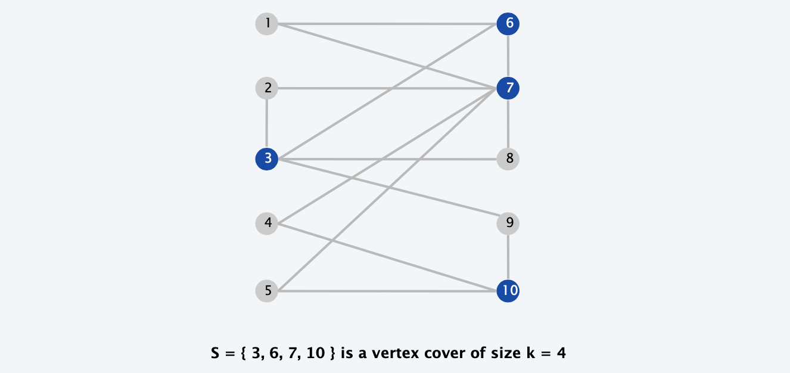
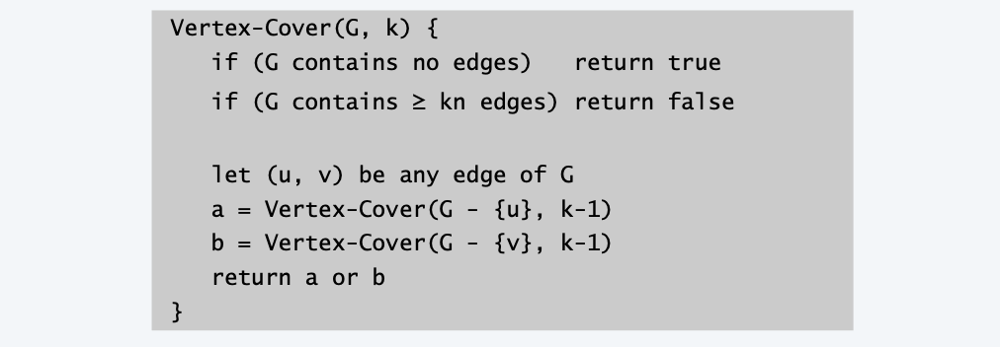
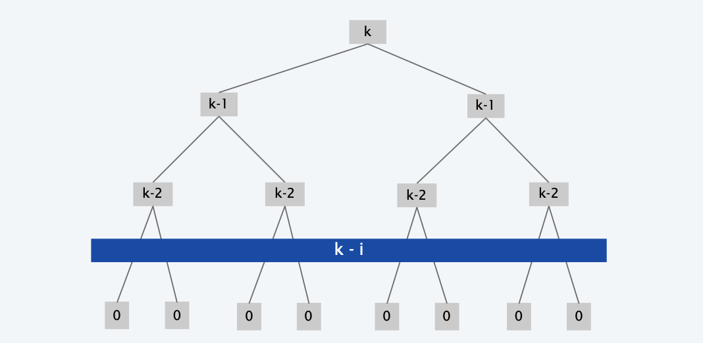
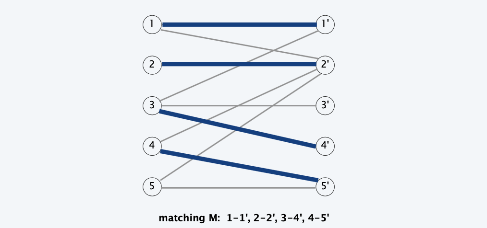
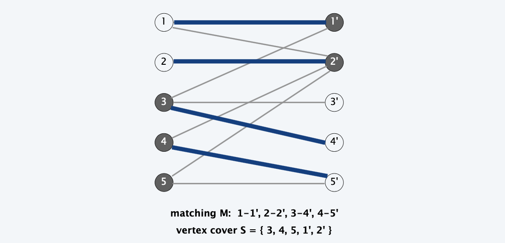
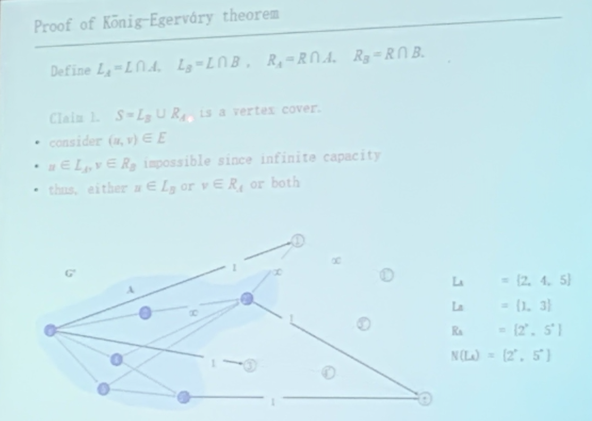

<!-- more -->

## Coping with NP-completeness

**Q**. Suppose I need to solve an NP-complete problem. What should I do? 
**A**. Theory says you’re unlikely to find poly-time algorithm.

**Must sacrifice one of three desired features**.
- Solve problem to optimality.
- Solve problem in polynomial time. 
  - local search
  - ai algorithm
- Solve **arbitrary instances** of the problem.
  - vertex cover in bipartite graph

**This lecture**. Solve some special cases of NP-complete problems.

## Finding small vertex covers

> A clever brute force method for small k

**Vertex Cover.** Given a graph $G=(V, E)$ and an integer $k,$ is there a subset of vertices $S \subseteq V$ such that $|S| \leq k,$ and for each edge $(u, v)$ either $u \in S$ or $v \in S$ or both?

**Q. VERTEX-COVER** is NP-complete. But what if $k$ is small?

**Brute force**. $O\left(k n^{k+1}\right)$
- Try all $C(n, k)=O\left(n^{k}\right)$ subsets of size $k$.
- Takes $O(k n)$ time to check whether a subset is a vertex cover.

**Goal**. limit exponential dependency on $k$, say to $\mathrm{O}\left(2^{k} \mathrm{k} n\right)$.

**Ex**. $n=1,000, k=10$
**Brute**. $\quad k n^{k+1}=10^{34} \Rightarrow$ infeasible.
**Better**. $2^{k} k n=10^{7} \Rightarrow$ feasible.

**Remark**. If $k$ is a constant, then the algorithm is poly-time; if $k$ is a small constant, then it's also practical.

### Foundation

**Claim**. Let $(u, v)$ be an edge of $G . G$ has a vertex cover of size $\leq k$ iff
at least one of $G-\{u\}$ and $G-\{v\}$ has a vertex cover of size $\leq k-1$ 

**Pf**. $\Rightarrow$
- Suppose $G$ has a vertex cover $S$ of size $\leq k$
- $S$ contains either $u$ or $v$ (or both). Assume it contains $u$.
- $S-\{u\}$ is a vertex cover of $G-\{u\}$

**Pf**. $\Leftarrow$
- Suppose $S$ is a vertex cover of $G-\{u\}$ of size $\leq k-1$
- Then $\mathrm{S} \cup\{\mathrm{u}\}$ is a vertex cover of $G$

> Pf by intuition: the subproblem is a tight bound

**Claim**. If $G$ has a vertex cover of size $k,$ it has $\leq k(n-1)$ edges.
Pf. Each vertex covers at most $n-1$ edges.

### Solution

**Claim**. The following algorithm determines if G has a vertex cover of size $\le$ k in $O(2^k kn)$ time.

**Pf**.
- Correctness follows from previous two claims.
- There are $\le 2k+1$ nodes in the recursion tree; each invocation takes O(kn) time

### Analysis

> Recursion Tree, use master theorem to decide time

$$
T(n, k) \leq\left\{\begin{array}{ll}
c & \text { if } k=0 \\
c n & \text { if } k=1 \quad \Rightarrow \quad T(n, k) \leq 2^{k} c k n \\
2 T(n, k-1)+c k n & \text { if } k>1
\end{array}\right.
$$

<!-- ## solving NP-hard problems on trees  -->

<!-- ## circular arc coverings -->

## vertex cover in bipartite graphs

> Poly solutino with constraint on the problem

### Foundation: Weak Duality

**Weak duality**. Let M be a matching, and let S be a vertex cover. Then, $|M| \le |S|$.

**Pf**. Each vertex can cover at most one edge in any matching.

### Foundation: König-Egerváry Theorem

**Theorem**. \[König-Egerváry\] In a **bipartite** graph, the max cardinality of a matching is equal to the min cardinality of a vertex cover.

> Max matching can be solved in poly time, resolved!

**Proof.**

- Suffices to find matching M and cover S such that $| M | = | S |.$ 
- Formulate max flow problem as for bipartite matching.
- Let M be max cardinality matching and let (A, B) be min cut.

**Claim 1**. $S=L_{B} \cup R_{A}$ is a vertex cover.
- consider $(u, v) \in E$
- $u \in L_{A}, v \in R_{B}$ impossible since infinite capacity
- thus, either $u \in L_{B}$ or $v \in R_{A}$ or both

**Claim 2**. $|M|=|S|$
max-flow min-cut theorem $\Rightarrow|M|=\mathrm{cap}(A, B)$
- only edges of form $(s, u)$ or $(v, t)$ contribute to $\mathrm{cap}(A, B)$
- $|M|=\mathrm{cap}(A, B)=\left|L_{B}\right|+\left|R_{A}\right|=|\mathrm{S}|$