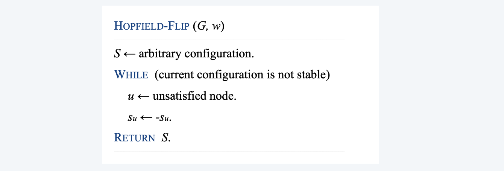
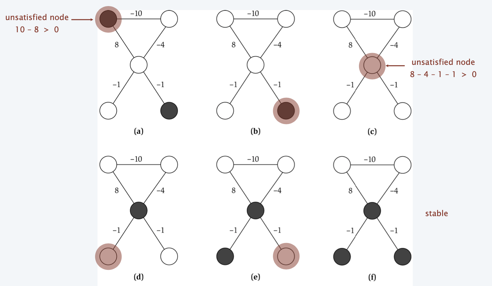

<!--more-->

## gradient descent

### Vertex Cover

**Vertex cover**. Given a graph $G=(V, E),$ find a subset of nodes $S$ of minimal
cardinality such that for each $(u, v) \in E,$ either $u$ or $v$ (or both) are in $S .$

**Neighbor relation**. $S \sim S^{\prime}$ if $S^{\prime}$ can be obtained from $S$ by adding or deleting a single node. Each vertex cover $S$ has at most $n$ neighbors.

**Gradient descent**. Start with $S=V .$ If there is a neighbor $S^{\prime}$ that is a vertex
cover and has lower cardinality, replace $S$ with $S^{\prime}$.

**Remark**. Algorithm terminates after at most $n$ steps since each update decreases the size of the cover by one.

> A classical approach in neural network training

> We need to deal with local optimal, how to jump out of that?

> Local optimal may or may not differ a lot to true optimal

### Local Search

**Local search**.  Algorithm that explores the space of possible solutions in sequential fashion, moving from a current solution to a "nearby" one.

**Neighbor relation**.  Let $S \sim S'$ be a neighbor relation for the problem.

**Gradient descent**.  Let S denote current solution. If there is a neighbor S ' of S  with strictly lower cost, replace S with the neighbor whose cost is as small as possible. Otherwise, terminate the algorithm.

## Metropolis algorithm

- Simulate behavior of a physical system according to principles of statistical mechanics
- Globally biased toward "downhill" steps, but occasionally makes "uphill" steps to break out of local minima

**Gibbs-Boltzmann function.** The probability of finding a physical system in a
state with energy $E$ is proportional to $e^{-E /(k T)},$ where $\mathrm{T}>0$ is temperature and $k$ is a constant.
- For any temperature $T>0,$ function is monotone decreasing function of energy $E$.
- System more likely to be in a lower energy state than higher one.
  - $T$ large: high and low energy states have roughly same probability
  - $T$ small: low energy states are much more probable

**Metropolis algorithm**.
- Given a fixed temperature $T,$ maintain current state $S$.
- Randomly perturb current state $S$ to new state $S^{\prime} \in N(S)$.
- If $E\left(S^{\prime}\right) \leq E(S),$ update current state to $S^{\prime}$. Otherwise, update current state to $S^{\prime}$ with probability $e^{-\Delta E /(k T)}$, where $\Delta E=E\left(S^{\prime}\right)-\mathrm{E}(\mathrm{S})>0$

> Better solution will always be taken
> Worse solution will have a probability of $e^{-\Delta E /(k T)}$ to be selected

**Theorem**. Let $f_{S}(t)$ be fraction of first $t$ steps in which simulation is in state $S .$ Then, assuming some technical conditions, with probability 1 :

$$
\begin{array}{l}
\lim _{t \rightarrow \infty} f_{S}(t)=\frac{1}{Z} e^{-E(S) /(k T)} \\
\text { where } Z=\sum_{S \in N(S)} e^{-E(S) /(k T)}
\end{array}
$$

**Intuition**. Simulation spends roughly the right amount of time in each state, according to Gibbs-Boltzmann equation.

> Problem: in Metropolis, T is fixed
> An improvement, from open to conservative

**Simulated annealing**.  
- T large $\Rightarrow$  probability of accepting an uphill move is large.
- T small  $\Rightarrow$  uphill moves are almost never accepted.
- Idea:  turn knob to control T.
- Cooling schedule:  $T = T(i)$ at iteration i.

**Physical analog.**
- Take solid and raise it to high temperature, we do not expect it to maintain a nice crystal structure.
- Take a molten solid and freeze it very abruptly, we do not expect to get a perfect crystal either.
- Annealing:  cool material gradually from high temperature, allowing it to reach equilibrium at succession of intermediate lower temperatures.

## Hopfield neural networks

**Hopfield networks**. Simple model of an associative memory, in which a large collection of units are connected by an underlying network, and neighboring units try to correlate their states.

**Input**: Graph $G=(V, E)$ with integer (positive or negative) edge weights $w$.

**Configuration**. Node assignment $s_{u}=\pm 1$

**Intuition**. If $w_{u \nu}<0,$ then $u$ and $v$ want to have the same state; if $w_{u v}>0$ then $u$ and $v$ want different states.

**Note**. In general, no configuration respects all constraints.

**Def**. With respect to a configuration $S,$ edge $e=(u, v)$ is **good** if $w_{e} s_{u} s_{v}<0 .$ That is, if $w_{e}<0$ then $s_{u}=s_{v} ;$ if $w_{e}>0,$ then $s_{u} \neq s_{v}$

**Def**. With respect to a configuration $S,$ a node $u$ is **satisfied** if the weight of incident good edges $\geq$ weight of incident bad edges.
$$
\sum_{v: e=(u, v) \in E} w_{e} s_{u} s_{v} \leq 0
$$

> Intuition: to describe what a memory (corresponding to node) is good

**Def**. A configuration is **stable** if all nodes are satisfied.

### Solution

**Goal**. Find a stable configuration, if such a configuration exists. 

**State-flipping algorithm**. Repeated flip state of an unsatisfied node.

### Example

### Correctness

**Theorem**. The state-flipping algorithm terminates with a stable
configuration after at most $W=\Sigma_{e}\left|w_{e}\right|$ iterations.
**Pf attempt**. Consider measure of progress $\Phi(S)=\#$ satisfied nodes.
> The weight of all good nodes will improve by at least 1 every iteration

**Pf**. Consider measure of progress $\Phi(S)=\Sigma_{e \text { good }}\left|w_{e}\right|$ 
- Clearly $0 \leq \Phi(S) \leq W$
- We show $\Phi(S)$ increases by at least 1 after each flip.
  When $u$ flips state:
  - all good edges incident to $u$ become bad
  - all bad edges incident to $u$ become good 
  - all other edges remain the same
    $$
    \Phi\left(S^{\prime}\right)=\Phi(S)-\sum_{e: e-(u, v) \in E}\left|w_{e}\right|+\sum_{e: e-(u, v) \in E}\left|w_{e}\right| \geq \Phi(S)+1 \quad \text{(u is unsatified)}
    $$

### Complexity of Hopfield neural network
**Hopfield network search problem**. Given a weighted graph, find a stable configuration if one exists.

**Hopfield network decision problem**. Given a weighted graph, does there exist a stable configuration?
> Solution: run the local search problem, after $\Sigma_{e}\left|w_{e}\right|$ iterations success?

**Remark**. The decision problem is trivially solvable (always yes), but there is no known poly-time(ploy in $n$ and $\log W$) algorithm for the search problem.

## maximum cut

**Maximum cut**. Given an undirected graph $G=(V, E)$ with positive integer edge weights $w_{e},$ find a cut $(A, B)$ such that the total weight of edges crossing the cut is maximized.
$$
w(A, B):=\sum_{u \in A, v \in B} w_{u v}
$$

**Toy application**.
- $n$ activities, $m$ people.
- Each person wants to participate in two of the activities.
- Schedule each activity in the morning or afternoon to _maximize number of people that can enjoy both activities_.
> Formulation
> Partition the activities, if $n$ people want to participate two activities at the same time, connect the activities with a capacity of $n$. 
> Goal: find the maximum cuts (the cut value will be the sum of people that can both enjoy two activities) 
> **Graph Partition** sometimes is reduced to maximum cut, sometimes minimum cut

**Real applications**. Circuit layout, statistical physics.
> Circuit should be cut into small blocks, so that pins can be defiend, and higher level of connection between blocks can be establised. The higher-level-capacity should be small --> A minimum cut problem.

### Solution

**Single-flip neighborhood**. Given a cut (A, B), move one node from A to B, or one from B to A if it improves the solution.

**Greedy Algorithm**

### Analysis: Approximation

**Theorem**. Let $(A, B)$ be a locally optimal cut and let $\left(A^{*}, B^{*}\right)$ be an optimal cut. Then $w(A, B) \geq 1 / 2 \Sigma_{e} w_{e} \geq 1 / 2 w\left(A^{*}, B^{*}\right)$ ( weights are nonnegative, so that the second $\ge$ holds)

**Pf**.
- Local optimality implies that for all $u \in A: \sum_{v \in A} w_{u v} \leq \sum_{v \in B} w_{u v}$
  > The edges that are not counted in the cut are less in weight than those contributing to the cut
  > Otherwise, we can improve by moving this "improving node"
- Adding up all these inequalities yields:
  $$
  2 \sum_{\{u, \nu\} \subseteq A} w_{u v} \leq \sum_{u \in A, v \in B} w_{u v}=w(A, B)
  $$
- Similarly
  $$
  2 \sum_{\{u, \nu\} \subseteq B} w_{u v} \leq \sum_{u \in A, v \in B} w_{u v}=w(A, B)
  $$
- Now, (each edge counted once)
$$
\sum_{e \in E} w_{e}={\sum_{\{u, v\} \subseteq A} w_{u v}}_{\leq \frac{1}{2} w(A, B)}+{\sum_{u \in A, v \in B} w_{u v}}_{w(A, B)}+{\sum_{\{u, \nu\} \subseteq A} w_{u v}}_{\leq \frac{1}{2} w(A, B)} \leq 2 w(A, B)
$$

### Improvement: Big Flips

**Local search**. Within a factor of 2 for MAX-CuT, but not poly-time!

**Big-improvement-flip algorithm**. Only choose a node which, when flipped, increases the cut value by at least $\frac{2 \varepsilon}{n} w(A, B)$
> Choose the most "rewarding" strategy
> Recall: scaling and rounding algorithm in Knapsack, epsilon tradeoff
> A similar conclusion can be formed here:

**Claim**. Upon termination, big-improvement-flip algorithm returns a cut $(A, B)$ such that $(2+\varepsilon) w(A, B) \geq w\left(A^{*}, B^{*}\right)$

**Pf idea**. Add $\frac{2 \varepsilon}{n} w(A, B)$ to each inequality in original proof.

**Claim**. Big-improvement-flip algorithm terminates after $\mathrm{O}\left(\varepsilon^{-1} n \log W\right)$ flips,
where $W=\Sigma_{e} w_{e}$
- Each flip improves cut value by at least a factor of $(1+\varepsilon / n)$
- After $n / \varepsilon$ iterations the cut value improves by a factor of 2 
  > if $x \ge 1$, $(1+1/x)^x \ge 2$
- Cut value can be doubled at most loga $W$ times.

### Further Reading

**Theorem. [Sahni-Gonzales 1976]** There exists a 1⁄2-approximation algorithm for MAX-CUT.
**Theorem**. There exists an 0.878-approximation algorithm for MAX-CUT. 
**Theorem**. Unless P = NP, no 0.942-approximation algorithm for MAX-CUT.

### K-Flip

**1 -flip neighborhood**. Cuts $(A, B)$ and $\left(A^{\prime}, B^{\prime}\right)$ differ in exactly one node.

**k-flip neighborhood**. Cuts $(A, B)$ and $\left(A^{\prime}, B^{\prime}\right)$ differ in at most $k$ nodes.

**KL-neighborhood.** [Kernighan-Lin 1970$]$$\quad$ 
- To form neighborhood of $(A,B)$
  - Iteration 1 : flip node from $(A, B)$ that results in best cut value $\left(A_{1}, B_{1}\right)$ and mark that node.
  > cut value of $\left(\mathrm{A}_{1}, \mathrm{~B}_{1}\right)$ may be worse than (A, B) To form neighborhood of $(A, B)$
  - Iteration $i$ : flip node from $\left(A_{i-1}, B_{i-1}\right)$ that results in best cut value $\left(A_{i}, B i\right)$ among all nodes not yet marked.
- Neighborhood of $(A, B)=\left(A_{1}, B_{1}\right), \ldots,\left(A_{n-1}, B_{n-1}\right)$
- Neighborhood includes some very long sequences of flips, but without the computational overhead of a $k$ -flip neighborhood.
- Practice: powerful and useful framework.
- Theory: explain and understand its success in practice.

## Nash equilibria

### Multicast Routing

**Multicast routing**. Given a directed graph $G=(V, E)$ with edge costs $c_{e} \geq 0,$ a source node $s,$ and $k$ agents located at terminal nodes $t_{1}, \ldots, t_{k}$
Agent $j$ must construct a path $P_{j}$ from node $s$ to its terminal $t_{j}$

**Fair share**. If $x$ agents use edge $e,$ they each pay $c_{e} / x .$

**Best response dynamics**. Each agent is continually prepared to improve its solution in response to changes made by other agents.
> every agent improves on its own reward

**Nash equilibrium**. Solution where no agent has an incentive to switch. 

**Fundamental question**. When do Nash equilibria exist?

**Ex**:
- Two agents start with outer paths. 
- Agent 1 has no incentive to switch paths (since 4 < 5 + 1), but agent 2 does (since 8 > 5 + 1). 
- Once this happens, agent 1 prefers middle path (since 4 > 5/2 + 1).
- Both agents using middle path is a Nash equilibrium.

### Nash equilibrium and local search

**Local search algorithm**. Each agent is continually prepared to improve its solution in response to changes made by other agents.

**Analogies**.
- Nash equilibrium : local search.
- Best response dynamics : local search algorithm.
  > difference is that the search at a state is determined by the strategy of other agents, and that the optimizing goal is not single 
- Unilateral move by single agent : local neighborhood.

**Contrast**. Best-response dynamics need not terminate since no single objective function is being optimized.

### Social Optimum

**Social optimum**. Minimizes total cost to all agent. 

**Observation**. In general, there can be many Nash equilibria.
Even when its unique, it does not necessarily equal the social optimum.

> For figure 1, we have two kinds of nash equilibriums, if the initial distribution is $k$ agents choosing $k$, then the value is 1.
> If someone choose $1+\epsilon$, no more agents will want to choose $k$, else all agents will shift to choose $1+\epsilon$ path. 
> For Figure 2, social optimum is not Nash Equilibrium

> How to connect the two concepts?
> ANS: Price of Stability
### Price of Stability

> How far is the Nash to Social optimum

**Price of stability**. Ratio of best Nash equilibrium to social optimum. 

**Fundamental question**. What is price of stability?

**Ex**: Price of stability = Θ(log k).
- Social optimum. Everyone takes bottom paths.
- Unique Nash equilibrium. Everyone takes top paths.
- Price of stability. H(k) / (1 + ε). Staring from a social optimum leads to a Nash equilibrium whose cost is greater by at most a factor .
> $H(k) = 1 + 1/2 + ... + 1/k$
> 

### 
**Theorem**. There is a Nash equilibrium for which the total cost to all agents exceeds that of the social optimum by at most a factor of H(k).
<!-- TODO: read the book for detail proof -->

> How to find a Nash equilibrium solution in poly time is still not resolved