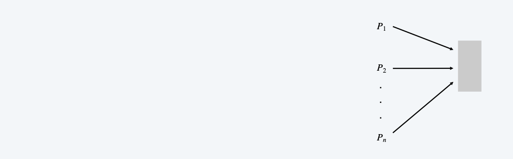
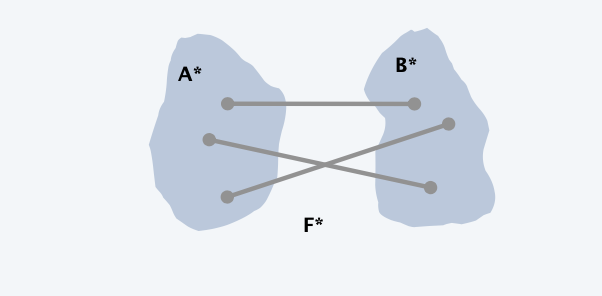

<!--more-->

[[toc]]

## Randomization
**Algorithmic design patterns**.
- Greedy. 
- Divide-and-conquer. 
- Dynamic programming. 
- Network flow. 
- **Randomization**.

**Randomization**. Allow fair coin flip in unit time.
> in practice, access to a pseudo-random number generator

**Why randomize?** Can lead to simplest, fastest, or only known algorithm for a particular problem.
> Suitable for parallelism, since no dependency

**Ex**. 
- Symmetry breaking protocols, *(Synchronization Problem, multiple tasks request access to a shared memory)*
- graph algorithms, 
- quicksort, *(choice of Middle reference)*
- hashing, load balancing, Monte Carlo integration, cryptography.

## content resolution
**Contention resolution**. Given n processes $P_1, ..., P_n$, each competing for access to a shared database. If two or more processes access the database simultaneously, all processes are locked out. Devise protocol to ensure all processes get through on a regular basis.

**Restriction**. Processes can't communicate. 

**Challenge**. Need **symmetry-breaking** paradigm.

> Slice the probability into pieces

### Randomized Protocal

**Protocol**. Each process requests access to the database at time $t$ with
probability $p=1 / n$

**Claim**. Let $S[i, t]=$ event that process $i$ succeeds in accessing the database at time $t$. Then $1 /(e \cdot n) \leq \Pr[S(i, t)] \leq 1 /(2 n)$

**Pf**. By independence, $\Pr[S(i, t)]=p(1-p)^{n-1}$
- p: process i requests access 
- ${(1-p)^{n-1}}$ none of remaining $\mathrm{n}-1$ processes request access
Setting $p=1 / n,$ we have $\Pr[S(i, t)]=1 / n(1-1 / n)^{n-1}$
- $1/n:$value that maximizes $\Pr[S(\mathrm{i}, \mathrm{t})] \quad$ 
- $RHS:$ between $1 / \mathrm{e}$ and $1 / 2$
  
**Useful facts from calculus**. As $n$ increases from $2,$ the function:
- $(1-1 / n)^{n} \quad$ converges monotonically from $1 / 4$ up to $1 / e$
- $(1-1 / n)^{n-1}$ converges monotonically from $1 / 2$ down to $1 / e$

**Claim**. The probability that process $i$ fails to access the database in
en rounds is at most $1 / e .$ After $e \cdot n(c \ln n)$ rounds, the probability $\leq n^{-c} .$

**Pf**. Let $F[i, t]=$ event that process $i$ fails to access database in rounds 1 through t. By independence and previous claim, we have $\Pr[F[i, t]] \leq(1-1 /(e n))^{t}$
- Choose $t=[e \cdot n]: \quad \Pr[F(i, t)] \leq\left(1-\frac{1}{e n}\right)^{[e n]} \leq\left(1-\frac{1}{e n}\right)^{e n} \leq \frac{1}{e}$
- Choose $t=\lceil e \cdot n\rceil\left\lceil_{c} \ln n\right\rceil: \quad \Pr[F(i, t)] \leq\left(\frac{1}{e}\right)^{c \ln n}=n^{-c}$

**Claim**. The probability that all processes succeed within $2 \mathrm{e} \cdot \mathrm{n}$ ln n rounds is $\geq 1-1 / n$

**Pf**. Let $F[t]=$ event that at least one of the $n$ processes fails to access database in any of the rounds 1 through $t$
$$
\Pr[F[t]]=\Pr\left[\bigcup_{i=1}^{n} F[i, t]\right] \leq \sum_{i=1}^{n} \Pr[F[i, t]] \leq n\left(1-\frac{1}{e n}\right)^{t}
$$
- $\le_1$union bound
- $\le_2$previous slide

Choosing $t=2 \left\lceil en \cdot {c \ln n}\right\rceil$ yields $\Pr[F[t]] \leq n \cdot n^{-2}=1 / n$

## global min cut

**Global min cut**. Given a connected, undirected graph G = (V, E), find a cut (A, B) of minimum cardinality.

> Challenge: hard to process large graphs using nwflow

**Contraction algorithm**. [Karger 1995]
- Pick an edge e = (u, v) uniformly at **random**. 
- **Contract** edge e.
  - replace u and v by single new super-node w
  - preserve edges, updating endpoints of u and v to w 
  - keep parallel edges, but delete self-loops
- Repeat until graph has just two nodes $v_1$ and $v_2$. 
- Return the cut (all nodes that were contracted to form $v_1$).
> Is there any possibility we get the global optimum?
> How many times should we try?

### Analysis
> What is the effect of a single run?
**Claim**. The contraction algorithm returns a min cut with prob $\geq 2 / n^{2}$.

**Pf**. Consider a global min-cut $\left(A^{*}, B^{*}\right)$ of $G$.
- Let $F^{*}$ be edges with one endpoint in $A^{*}$ and the other in $B^{*}$.
- Let $k=\left|F^{*}\right|=$ size of min cut.
> idea: In the optimal solution, edges between A and B in $F^*$ should never be contrated except in the final step
- In first step, algorithm contracts an edge in $F^{*}$ probability $k /|E|$
- Every node has degree $\geq k$ since otherwise $\left(A^{*}, B^{*}\right)$ would not be a min-cut $\Rightarrow|E| \geq 1 / 2 k n$
- Thus, algorithm contracts an edge in $F^{*}$ with probability $\leq 2 / n$.

- Let $E_j$ = event that an edge in $F^{*}$ is not contracted in iteration $j$.

$$
\begin{aligned}
\Pr\left[E_{1} \cap E_{2} \cdots \cap E_{n-2}\right] &=\Pr\left[E_{1}\right] \times \Pr\left[E_{2} \mid E_{1}\right] \times \cdots \times \Pr\left[E_{n-2} \mid E_{1} \cap E_{2} \cdots \cap E_{n-3}\right] \\
& \geq\left(1-\frac{2}{n}\right)\left(1-\frac{2}{n-1}\right) \cdots\left(1-\frac{2}{4}\right)\left(1-\frac{2}{3}\right) \\
&=\left(\frac{n-2}{n}\right)\left(\frac{n-3}{n-1}\right) \cdots\left(\frac{2}{4}\right)\left(\frac{1}{3}\right) \\
&=\frac{2}{n(n-1)} \\
& \geq \frac{2}{n^{2}}
\end{aligned}
$$

### Amplification

**Amplification**. To amplify the probability of success, run the contraction algorithm many times.
> How many times to run?

**Claim**. If we repeat the contraction algorithm $n^2 \ln n$ times,
> with independent random choices,
then the probability of failing to find the global min-cut is $\le 1 / n^2$.
Pf. By independence, the probability of failure is at most
$$
\left(1-\frac{2}{n^{2}}\right)^{n^{2} \ln n}=\left[\left(1-\frac{2}{n^{2}}\right)^{\frac{1}{2} n^{2}}\right]^{2 \ln n} \leq\left(e^{-1}\right)^{2 \ln n}=\frac{1}{n^{2}}
$$

### History

**Remark**. Overall running time is slow since we perform $\Theta\left(n^{2} \log n\right)$ iterations and each takes $\Omega(m)$ time.

**Improvement**. [Karger-Stein 1996$] \quad O\left(n^{2} \log ^{3} n\right)$
- Early iterations are less risky than later ones: probability of contracting an edge in min cut hits $50 \%$ when $n / \sqrt{2}$ nodes remain.
> Use deterministic algorithms such as NW flow when the graph is small in the later phase will be more efficient
- Run contraction algorithm until $n / \sqrt{2}$ nodes remain.
- Run contraction algorithm twice on resulting graph and return best of two cuts.

**Extensions**. Naturally generalizes to handle positive weights.
**Best known. [Karger 2000]** $O\left(m \log ^{3} n\right)$

## linearity of expectation 

### Expectation
**Expectation**. Given a discrete random variables $X,$ its expectation $E[X]$
is defined by:
$$
E[X]=\sum_{j=0}^{\infty} j \Pr[X=j]
$$

**Waiting for a first success**. Coin is heads with probability $p$ and tails with
probability $1-p .$ How many independent flips $X$ until first heads?
$$
E[X]=\sum_{j=0}^{\infty} j \cdot \Pr[X=j]=\sum_{j=0}^{\infty} j(1-p)^{j-1} p=\frac{p}{1-p} \sum_{j=0}^{\infty} j(1-p)^{j}=\frac{p}{1-p} \cdot \frac{1-p}{p^{2}}=\frac{1}{p}
$$

### Two properties

**Useful property**. If $X$ is a $0 / 1$ random variable, $E[X]=\Pr[X=1]$
**Pf**. $\quad E[X]=\sum_{j=0}^{\infty} j \cdot \Pr[X=j]=\sum_{j-0}^{1} j \cdot \Pr[X=j]=\Pr[X=1]$

**Linearity of expectation**. Given two random variables $X$ and $Y$ defined over the same probability space, $E[X+Y]=E[X]+E[Y]$
> X Y not necessarily independent

**Benefit**. _Decouples a complex calculation into simpler pieces._

### Guessing Cards

**Game**. Shuffle a deck of $n$ cards; turn them over one at a time;
try to guess each card.

**Memoryless guessing**. No psychic abilities; can't even remember what's
been turned over already. Guess a card from full deck uniformly at random.

**Claim**. The expected number of correct guesses is $1 .$
**Pf**. [ surprisingly effortless using linearity of expectation ]
- Let $X_{i}=1$ if $i^{t h}$ prediction is correct and 0 otherwise.
- Let $X=$ number of correct guesses $=X_{1}+\ldots+X_{n}$
- $E\left[X_{i}\right]=\Pr\left[X_{i}=1\right]=1 / n$
$\bullet$
- $E[X]=E\left[X_{1}\right]+\ldots+E\left[X_{n}\right]=1 / n+\ldots+1 / n=1$
> Make use of lineraity of Expectation !!

**Game**. Shuffle a deck of $n$ cards; turn them over one at a time;
try to guess each card.

**Guessing with memory**. Guess a card uniformly at random from cards
not yet seen.

**Claim**. The expected number of correct guesses is $\Theta(\log n)$
**Pf**.
- Let $X_{i}=1$ if $i^{t h}$ prediction is correct and 0 otherwise.
- Let $X=$ number of correct guesses $=X_{1}+\ldots+X_{n}$
- $E\left[X_{i}\right]=\Pr\left[X_{i}=1\right]=1 /(n-i-1)$
- $E[X]=E\left[X_{1}\right]+\ldots+E\left[X_{n}\right]=1 / n+\ldots+1 / 2+1 / 1=H(n)$
  - linearity of expectation
  - $\ln (n+1)<H(n)<1+\ln n$

### Coupon Collector
**Coupon collector**. Each box of cereal contains a coupon. There are $n$
different types of coupons. Assuming all boxes are equally likely to contain
each coupon, how many boxes before you have $\geq 1$ coupon of each type?

**Claim**. The expected number of steps is $\Theta(n \log n)$

**Pf**.
- Phase $j=$ time between $j$ and $j+1$ distinct coupons.
- Let $X_{j}=$ number of steps you spend in phase $j$
- Let $X=$ number of steps in total $=X_{0}+X_{1}+\ldots+X_{n-1}$
    $$
    E[X]=\sum_{j=0}^{n-1} E\left[X_{j}\right]=\sum_{j=0}^{n-1} \frac{n}{n-j}=n \sum_{i=1}^{n} \frac{1}{i}=n H(n)
    $$
- prob of success = $(n – j) / n$ ⇒ expected waiting time = $n / (n – j)$

> Application? Solve MAX 3-SAT

## max 3-satisfiability

**Maximum 3-satisfiability**. Given a 3-SAT formula, find a truth assignment that satisfies as many clauses as possible.

**Remark**. NP-hard search problem.

**Simple idea**. Flip a coin, and set each variable true with probability 1⁄2, independently for each variable.

### Probability of Single Assignment

**Claim**. Given a 3-SAT formula with $k$ clauses, the expected number of clauses satisfied by a random assignment is $7 k / 8$.

**Pf**. Consider random variable $Z_{j}=\left\{\begin{array}{ll}1 & \text { if clause } C_{j} \text { is satisfied } \\ 0 & \text { otherwise }\end{array}\right.$
- Let $Z=$ weight of clauses satisfied by assignment $Z_{j}$
$$
\begin{aligned}
E[Z]&=\sum_{j=1}^{k} E\left[Z_{j}\right] \\
&=\sum_{j=1}^{k} Pr[\text{clause Cj is satisfied}]\\
&=\frac{7}{8} k
\end{aligned}
$$

**Corollary**. For any instance of 3-SAT, there exists a truth assignment that satisfies at least a 7/8 fraction of all clauses.
**Pf**. Random variable is at least its expectation some of the time.
**Probabilistic method**. [Paul Erdös] Prove the existence of a non-obvious property by showing that a random construction produces it with positive probability!

### Algorithm Analysis

> Q. Can we turn this idea into a 7/8-approximation algorithm?
> A. Yes (but a random variable can almost always be below its mean).
**Lemma**. The probability that a random assignment satisfies $\geq 7 k / 8$ clauses is at least $1 /(8 k)$

**Pf**. Let $p_{j}$ be probability that exactly $j$ clauses are satisfied;
let $p$ be probability that $\geq 7 k / 8$ clauses are satisfied.
$$
\begin{aligned}
\frac{7}{8} k=E[Z] &=\sum_{j \geq 0} j p_{j} \\
&=\sum_{j<7 k / 8} j p_{j}+\sum_{j \geq 7 k / 8} j p_{j} \\
& \leq\left(\frac{7 k}{8}-\frac{1}{8}\right) \sum_{j<7 k / 8} p_{j}+k \sum_{j \geq 7 k / 8} p_{j} \\
& \leq\left(\frac{7}{8} k-\frac{1}{8}\right) \cdot 1+k p
\end{aligned}
$$
Rearranging terms yields $p \geq 1 /(8 k)$

**Johnson's algorithm.** Repeatedly generate random truth assignments until
one of them satisfies $\geq 7 k / 8$ clauses.
**Theorem**. Johnson's algorithm is a $7 / 8$ -approximation algorithm.
**Pf**. By previous lemma, each iteration succeeds with probability $\geq 1 /(8 k)$. By the waiting-time bound, the expected number of trials to find the
satisfying assignment is at most $8 k .$

### Variant: Maximum Satisfiability

**Extensions**.
- Allow one, two, or more literals per clause.
- Find max weighted set of satisfied clauses.

**Theorem**. [Asano-Williamson 2000$]$ There exists a 0.784-approximation algorithm for 3 -SAT.

**Theorem**. [Karloff-Zwick 1997, Zwick+computer 2002$]$ There exists a 7/8approximation algorithm for version of MAX-3-SAT where each clause has
at most 3 literals.

**Theorem**. [Håstad 1997$]$ Unless $\mathbf{P}=$ NP, no $\rho$ -approximation algorithm for MAX-3-SAT (and hence MAX-SAT) for any $\rho>7 / 8$.

### A Higher View: Monte Carlo vs. Las Vegas Algorithm
**Monte Carlo**. Guaranteed to run in poly-time, likely to find correct answer. 
**Ex**: Contraction algorithm for global min cut.
> It must end within a specified iterations, but no guarantee of optimal

**Las Vegas**. Guaranteed to find correct answer, likely to run in poly-time. 
**Ex**: Randomized quicksort, Johnson's MAX-3-SAT algorithm.
> may reduce to worst case :(

**Remark**. Can always convert a Las Vegas algorithm into Monte Carlo, but no known method (in general) to convert the other way.
> LAS VEGAS -> Monte Carlo : stop algorithm after a certain point

## RP and ZPP
**RP**. [Monte Carlo] Decision problems solvable with one-sided error in poly- time.

**One-sided error**.
- If the correct answer is no, always return no.
> can decrease probability of false negative to 2-100 by 100 independent repetitions
- If the correct answer is yes, return yes with probability ≥ 1⁄2.
> running time can be unbounded, but fast on average

**ZPP**. [Las Vegas] Decision problems solvable in expected poly-time. 

**Theorem**. $P \subset ZPP \subset RP \subset NP$.

**Fundamental open questions**. To what extent does randomization help? Does P=ZPP? Does ZPP=RP? Does RP=NP?

## 考试范围
PPT，基本问题
复杂证明、书上*不会考
判断题+作业大题（问题+算法+分析）

## Project

Submit
- Report
  - Background, Analysis
- Slides
- Code

Checkpoint
- Problem Formulation (before Ww14.1)
  - submit Slides, (discussion on Ww14.1)
  - no existing solution, modification required
  - should be new in algorithm
- Related work collection
- Solution construction
- good results (bad accepted)
- presentation (final check)
  - no typo

Projects Example
1. Vehicle
   - Vehicle Routing Problem with Time Windows
   - Ant Colony Optimization
   - Objective -> 2 folds
2. Max-flow improve detection pipeline
   - Assign pixels to people
   - Graph-Cut
3. CNN compression segmentation
   - Pruning
4. Scheduling Bus
   - integer programming

