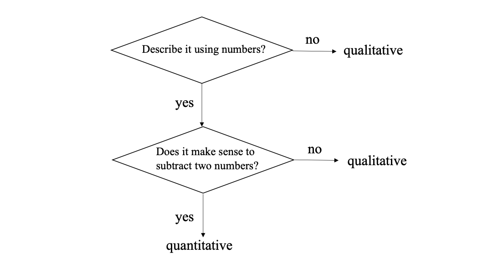
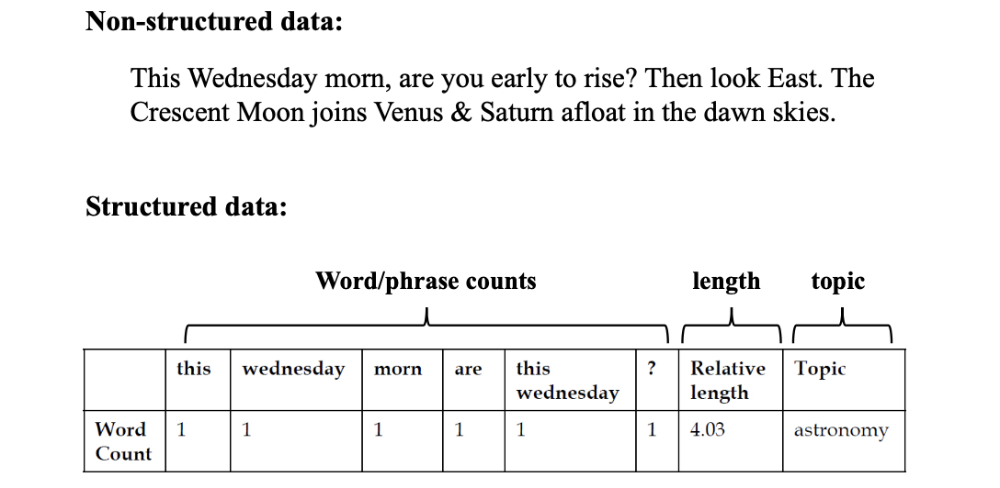
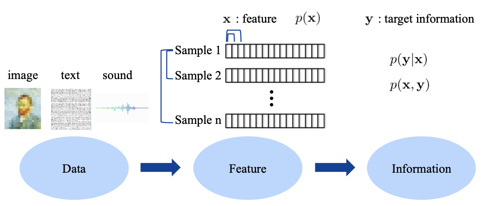

<!-- more -->

## Four levels of Data

|  Level     |  Meaningful Operation     |  Example     |       |
|  ---  |  ---  |  ---  |  ---  |
|  Nominal Level     |  Set     | Animal Name      |   Qualitative Level    |
|  Ordinal Level     |  Comparison (Ranking Order)    |  Grade      |  Qualitative Level     |
|  Interval Level     |  Subtraction     |  Celsius Temperature     | Quantitative Level      |
|  Ratio Level     | Division      |  Kelvin Temperature     |  Quantitative Level   |

> For Celsius Temperature, **meaningful** division does not exist, while for kelvin temperature, meaningful division can be obtained because it has absolute zero degree

## Quantitative Data

- Discrete or Continuous
- Structured or Non-structured
  - **Structured data** follow certain standard organization hierarchy (e.g., pair, triple, list, tree, *graph*)
  - **Non-structured (unorganized) data**: exists as a free entity and does not follow any standard organization hierarchy

> Example
> 
> Furthermore, we can divide a sentence into tokens. use $(v,p)$ to represent the value and position of each token, forming a matrix

::: tip
from non-structured to structured
1. what information to extract (percentage of extraction), 
2. whether the extracted information is critical (quality of extraction)
:::

## Math Annotation

Variable
- scalar: $\quad n=3$
- vector: $\mathbf{v}=[1,2]$
- matrix: $\mathbf{M}=\left[\begin{array}{ll}1 & 2 \\ 3 & 4\end{array}\right]$

Operation
- Transpose: $\quad \mathbf{M}^{T}=\left[\begin{array}{ll}1 & 3 \\ 2 & 4\end{array}\right]$
- Element-wise product: $\quad \mathbf{M} \circ \mathbf{M}=\left[\begin{array}{cc}1 & 4 \\ 9 & 16\end{array}\right]$

## About this course

- marginal/conditional/joint probability