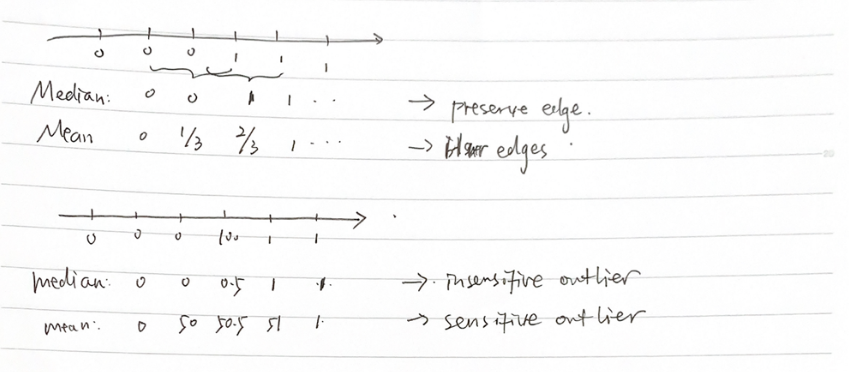
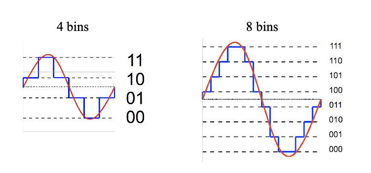

<!-- more -->

## Smooth Data

### Median Filter

- Use the median of the sliding window
  - for margin, usually take the same value
- Preserve edges, insensitive to outliers
- slow, unsmooth

### Mean Filter
- Fast, smooth
- Blur edges, sensitive to outlier

> A trade-off against edge/outlier

## Remove Outliers

### Statistical Methods

- use a model (e.g. Gaussian) to fit the distribution of all data
- use two models to fit the distributions of non-outliers and outliers separately

### Distance Based Methods

- the density within a neighborhood
  > the fewer the outlier
- the distance from a nearest neighbor

### Learning based Methods
- clustering, the smallest cluster is likely to contain outliers
- one-class classifier
  > learn a superhyperplane to cover the datapoints for unlabeled data
- binary classifier
  > become a special (unbalanced) two-classifying problem
  - e.g. naive Bayes for spam filtering, weighted binary SVM

## Fill in Missing Data

- Fill in a constant(e.g. Mean Value)
- Fill in estimated values (e.g. Regression)

## Quantize Data

- Map continuous values to binary values (2bins)
- Map continuous values to discrete calues (more than 2 bins) (closest discrete value)
  
- Map $x$ to its closest codebook
- Map $x$ to multiple concatenations of closet codebook

