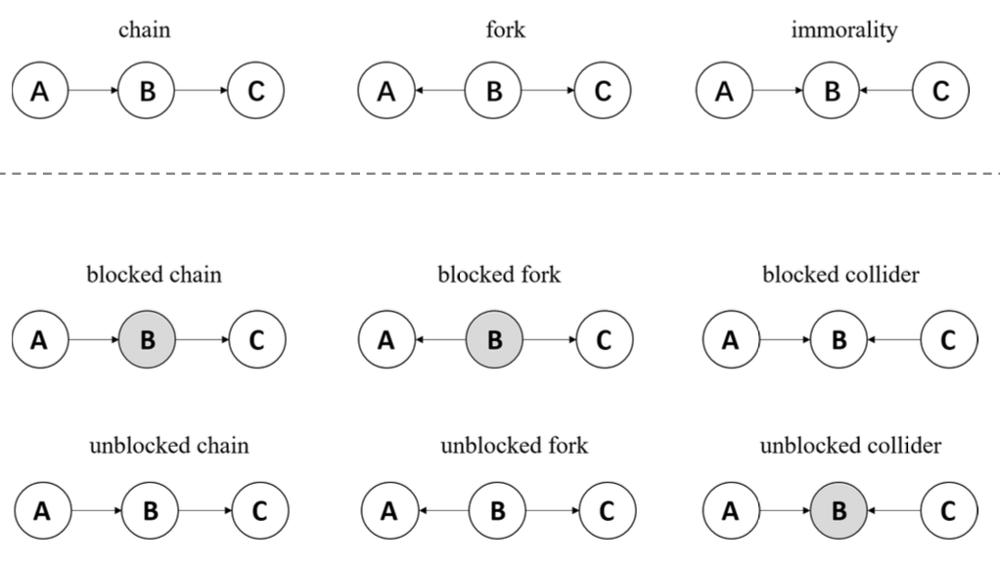
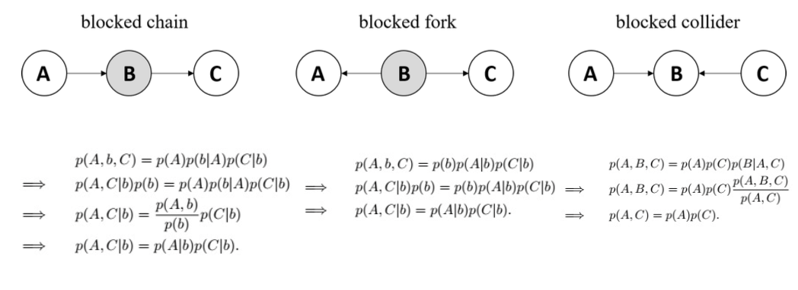
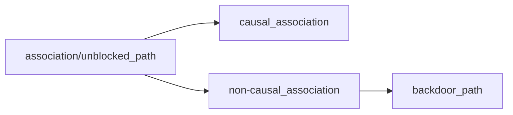
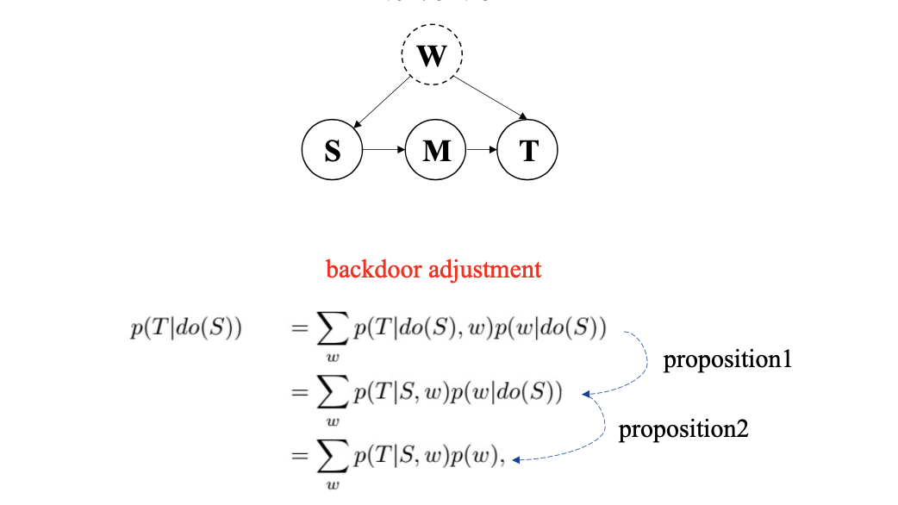
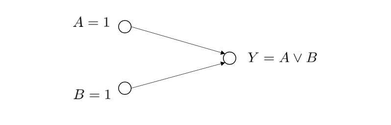

<!-- more -->

## Correlation

### Co-occurrence

$x = [x_1,x_2,\ldots,x_n]$, $y = [y_1,y_2,\ldots,y_n]$, $S = \{(x_1,y_1),\ldots, (x_n,y_n)\}$

e.g. x is height of n students, y is weight of n students, or, x and y are two pictures, $x_n$, $y_n$ are value of features

How many times $x'$ and $y'$ co-occur in S?

### Frequent Itemset

Problem. frequency of (a,b) co-occur in a transaction

Definitions.
- Itemset
- Support of X, frequency of an itemset X
- frequent itemset, if support $\ge$ threshold

Solution. [Apriori Algorithm](../EE359/10_freqitem#Apriori)

### Correlation

$$
corr(\mathbf{x},\mathbf{y}) = \frac{cov(\mathbf{x},\mathbf{y})}{\sigma_x\sigma_y}
$$

### Canonical Correlation Analysis

> What if each sample is a vector instead of a scalar? Dataset: $\mathbf{X},\mathbf{Y}$
>
> e.g. $X = [\mathbf{x}_1, \mathbf{x}_2,\ldots, \mathbf{x}_n]$, $Y = [\mathbf{y}_1, \mathbf{y}_2,\ldots, \mathbf{y}_n]$, where $\mathbf{x}_1$ represents visual feature of video1, $\mathbf{y}_1$ represents audio feature of video1.

1. Decentralize $X$ and $Y$.
2. Learn projection $w_x$ and $w_y$ to maximize the correlation between X and Y.

$$\tilde{X} = \mathbf{w}_{x,1\times d}^T \mathbf{X}_{d\times n}, \tilde{Y} = \mathbf{w}_y^T \mathbf{Y}$$

3. then we can use the correlation in the previous section

$$
\max _{\mathbf{\tilde{X} }, \tilde{\mathbf{Y} }} \frac{\tilde{\mathbf{X} } \tilde{\mathbf{Y} }^{T} }{\sqrt{\left(\tilde{\mathbf{X} } \mathbf{X}^{T}\right)\left(\tilde{\mathbf{Y} } \mathbf{Y}^{T}\right)} } \quad \Longrightarrow \max _{\mathbf{w}_{x}, \mathbf{w}_{y} } \frac{\mathbf{w}_{x}^{T} \mathbf{X} \mathbf{Y}^{T} \mathbf{w}_{y} }{\sqrt{\left(\mathbf{w}_{x}^{T} \mathbf{X} \mathbf{X}^{T} \mathbf{w}_{x}\right)\left(\mathbf{w}_{y}^{T} \mathbf{Y} \mathbf{Y}^{T} \mathbf{w}_{y}\right)} }
$$

### Kernel Canonical Correlation Analysis (KCCA)

> What if each sample is a vector with infinite dimension?
> 
> Kernel method, representation theorem

$\phi(X) = [\phi(x_1),\ldots,]$

For $\phi(\mathbf{X})$ and $\phi(\mathbf{Y})$, we cannot use $\mathbf{w}_{x}$ and $\mathbf{w}_{y}$
Representation theorem: $\mathbf{w}_{x} \leftarrow \phi(\mathbf{X}) \mathbf{\alpha}_{x}, \mathbf{w}_{y} \leftarrow \phi(\mathbf{Y}) \mathbf{\alpha}_{y}$
$$\max _{\mathbf{w}_{x}, \mathbf{w}_{y} } \frac{\mathbf{w}_{x}^{T} \phi(\mathbf{X}) \phi(\mathbf{Y})^{T} \mathbf{w}_{y} }{\sqrt{\left(\mathbf{w}_{x}^{T} \phi(\mathbf{X}) \phi(\mathbf{X})^{T} \mathbf{w}_{x}\right)\left(\mathbf{w}_{y}^{T} \phi(\mathbf{Y}) \phi(\mathbf{Y})^{T} \mathbf{w}_{y}\right)} }$$

$$
\begin{aligned}
\max _{\alpha_{x}, \alpha_{y} } & \frac{\mathbf{\alpha}_{x}^{T} \phi(\mathbf{X})^{T} \phi(\mathbf{X}) \phi(\mathbf{Y})^{T} \phi(\mathbf{Y}) \mathbf{\alpha}_{y} }{\sqrt{\left(\mathbf{\alpha}_{x}^{T} \phi(\mathbf{X})^{T} \phi(\mathbf{X}) \phi(\mathbf{X})^{T} \phi(\mathbf{X}) \mathbf{\alpha}_{x}\right)\left(\mathbf{\alpha}_{y}^{T} \phi(\mathbf{Y})^{T} \phi(\mathbf{Y}) \phi(\mathbf{Y})^{T} \phi(\mathbf{Y}) \alpha_{y}\right)} } \\
&=\frac{\mathbf{\alpha}_{x}^{T} K(\mathbf{X}) K(\mathbf{Y}) \mathbf{\alpha}_{y} }{\sqrt{\left(\mathbf{\alpha}_{x}^{T} K(\mathbf{X}) K(\mathbf{X}) \alpha_{x}\right)\left(\alpha_{y}^{T} K(\mathbf{Y}) K(\mathbf{Y}) \alpha_{y}\right)} }
\end{aligned}
$$

### Misc

- Independence, $p(x,y)=p(x)p(y)$
  -  $\Rightarrow$ Uncorrelation ($E(X)E(Y)=E(XY)$)
- Conditional Independence $x \bot y | z$
  - $p(x,y|z)=p(x|z)p(y|z)$,
  - $p(x|y,z) = p(x|z)$

## Causation

"The book of Why", "Causality" (Text book)

### When can we infer conditional independence

**Unblocked** paths are called **associations**. 

Only unblocked paths like P2 are called **causal path** (combined by chains)

The **non-causal path** (rest of cases) with incoming edge to the source node is called **backdoor path** (e.g., P1).

We can find a set of nodes $\mathcal{W}$ which satisfies the following two criteria:
1. $\mathcal{W}$ blocks all backdoor paths from the source node $\mathrm{S}$ to the target node $\mathrm{T}$.
2. $\mathcal{W}$ does not contain any descendants of the source node $\mathrm{S}$.
Such set $\mathcal{W}$ is called sufficient adjustment set. （混淆因子）

> such $\mathcal{W}$ should be summed over when we evaluate $P(\cdot|do(\cdot)$ later

### Intervention

> How to compute $p(T|do(S))$

> Can consider backdoor adjustment as an equivalent transformation

**Proposition 1.**
$$
p(T \mid d o(S), w)=p(T \mid S, w)
$$
if $\mathcal{W}$ blocks all backdoor paths from the source node $S$ to the target node $T .$ One special case is that there are only causal paths from $S$ to $T$, that is, $\mathcal{W}=\emptyset .$ In this case,
$$
p(T \mid \mathrm{do}(S))=p(T \mid S)
$$
Intuitively, as all non-causal associations are cut off, analyzing association is equivalent to analyzing causal association.

**Proposition 2.**
$$
p(T \mid d o(S))=p(T)
$$
if there is no causal path from $S$ to $T$.
Intuitively, if there is no causal path from $S$ to $T, S$ should have no causal impact on $T .$

### Causation

- $\mathbf{x}$ is a cause of $\mathbf{y}: \exists x_{1} \neq x_{2} \quad p\left(\mathbf{y} \mid d o\left(\mathbf{x}=x_{1}\right)\right) \neq p\left(\mathbf{y} \mid d o\left(\mathbf{x}=x_{2}\right)\right)$
- $\mathrm{x}$ is a direct cause of $\mathrm{y}$ relative to $\mathrm{z}$ iff

$$\exists z, x_{1} \neq x_{2} \quad p\left(\mathbf{y} \mid d o\left(\mathbf{x}=x_{1}\right), d o(\mathbf{z}=z)\right) \neq p\left(\mathbf{y} \mid d o\left(\mathbf{x}=x_{2}\right), d o(\mathbf{z}=z)\right)$$

### Counterfactual

$\neg X \Rightarrow \neg Y$ If $\mathrm{not} X$, then not $Y: X$ is the counterfactual cause of $Y$

### Actual Cause

A variable $X$ is an actual cause of an effect $Y$ if there exists a contingency that makes $X$ counterfactual for $Y$.

$A$ is an actual cause of $Y$ under the contingency $B=0$
When $B=0, \quad \neg A \Rightarrow \neg Y$

### Responsibility

> How to measure various kinds of causes?

Responsibility measures the contribution of a cause to an outcome
$$
\rho=\frac{1}{1+\min _{\Gamma}|\Gamma|}
$$
$\Gamma:$ contingency set
Example: $Y=A \wedge(B \vee C)$
$A$ is a counterfactual cause of $Y$
$\neg A \Rightarrow\neg Y$
$$
\min _{\Gamma}|\Gamma|=0  \Rightarrow\rho=1
$$
$B$ is an actual cause of $Y$, with contingency $C=0$
When $C=0, \neg B \Rightarrow\neg Y$
$$\min _{\Gamma}|\Gamma|=1  \Rightarrow \rho=0.5$$

### Summary

How to infer causation:
- intervention
- counterfactual

premise:
- draw the cause-effect DAG