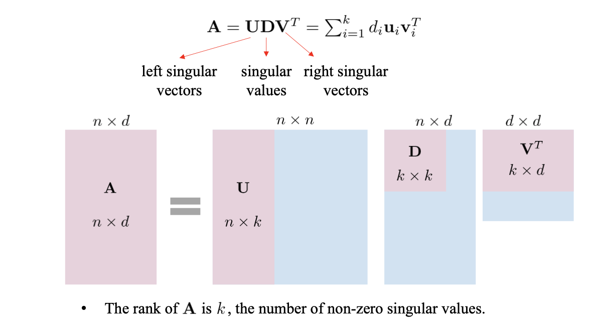
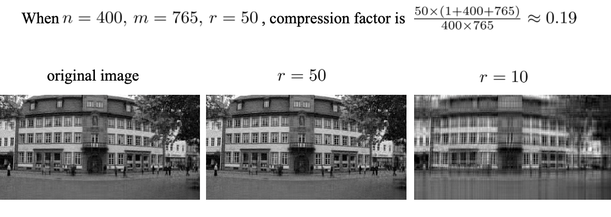

<!-- more -->

**Best fitting line**, maximize the sum of squared projections of n points to a projection $v$

## SVD

### Relation with other Concepts

**Recall PCA**.  maximum variance direction: when $A$ is decentralized, then the value of SVD of A is same as PCA

**Relation to Eigen Decomposition**. $||Av||^2 = \lambda$, we are actually finding the maximal $\lambda$ (eigen value), and its corresponding eigen vector
> solution for SVD: find the maximal eigen decomposition

### Solution of SVD

> A greedy algorithm, but can find the global optimum

find a subspace (a set of orthogonal best fitting lines)

Note, when $k=r(\mathbf{A})+1$, reach null space, i.e. $\max_{v \bot v_1,\ldots, v_{k-1}, ||v||=1} ||\mathbf{Av}||^2 = 0$

### Details of SVD

- projection direction $V$
- norm of projection $D$ (diag)
- normalized projection $U$

$$
\mathbf{A} = \mathbf{UDV^T} = \sum_{i=1}^{k} d_i \mathbf{u_i v_i^T}
$$

## Properties of SVD

Lemma : Matrices Aand $\mathrm{B}$ are identical if and only if for all vectors $\mathbf{v}, \mathbf{A} \mathbf{v}=\mathbf{B v}$

Theorem: 
$\mathbf{A}=\mathbf{U D V}^{T}=\sum_{i=1}^{k} d_{i} \mathbf{u}_{i} \mathbf{v}_{i}^{T}$

Proof.

$$
\sum_{i=1}^{k} d_{i} \mathbf{u}_{i} \mathbf{v}_{i}^{T} \mathbf{v}_{j}=d_{j} \mathbf{u}_{j}
$$

because  $\mathbf{v}_{i}^{T} \mathbf{v}_{j}=0$ and $\mathbf{v}_{i}^{T} \mathbf{v}_{i}=1$, then since

$$
\mathbf{u}_{j}=\frac{1}{d_{j}} \mathbf{A} \mathbf{v}_{j}
$$

We have

$$
\sum_{i=1}^{k} d_{i} \mathbf{u}_{i} \mathbf{v}_{i}^{T} \mathbf{v}_{j}=\mathbf{A} \mathbf{v}_{j}
$$

Any $\mathrm{v}$ can be represented by a linear combination of $\left\{\mathbf{v}_{1}, \ldots, \mathbf{v}_{k}\right\}$ and $\tilde{\mathbf{v}}$ in the null space, i.e., $\tilde{\mathbf{v}} \perp \mathbf{v}_{1}, \ldots, \mathbf{v}_{k}$ and $\mathbf{A} \tilde{\mathbf{v}}=\mathbf{0}$
Therefore, $\sum_{i=1}^{k} d_{i} \mathbf{u}_{i} \mathbf{v}_{i}^{T} \mathbf{v}=\mathbf{A} \mathbf{v}$ for any $\mathbf{v}$

from lemma

$$
\mathbf{A}=\sum_{i=1}^{k} d_{i} \mathbf{u}_{i} \mathbf{v}_{i}^{T}
$$

## Applications

### Norm based on SVD and Normalization

$$
\begin{array}{c}
\mathbf{A}=\mathbf{U D V}^{T}=\sum_{i=1}^{k} d_{i} \mathbf{u}_{i} \mathbf{v}_{i}^{T} \\
\mathcal{N}_{p}(\mathbf{A})=\left(\sum_{i=1}^{k} d_{i}^{p}\right)^{\frac{1}{p}}
\end{array}
$$
- $p=0 \quad$ :rank of $\mathbf{A}$
- $p=1 \quad:$ nuclear norm $\|\mathbf{A}\|_{*}=\sum_{i=1}^{k} d_{i}$
- $p=2 \quad:$ Frobenius norm $\|\mathbf{A}\|_{F}=\sqrt{\mathrm{tr}\left(\mathbf{A} \mathbf{A}^{T}\right)}=\sqrt{\sum_{i=1}^{k} d_{i}^{2}}$
  > $||A||_F = \sqrt{\sum_{m=1}^M \sum_{n=1}^N a_{mn}^2} = \sqrt{\mathrm{tr}(AA^T)}$
- $p=\infty:$ spectral norm $\|\mathbf{A}\|_{2}=\max _{i} d_{i}$

> With norm defined, we can define Lp-normalization for a matrix.

> Spectral normalization is very useful for DL

### Rank-K Approximation

$\tilde{\mathbf{A}}$ is a rank-k matrix that is the closest rank-k matrix to the original matrix $\mathbf{A}$
$$
\begin{aligned}
\min _{\tilde{\mathbf{A}}} &\|\tilde{\mathbf{A}}-\mathbf{A}\|_{F}^{2} \\
\text { s.t. } & \mathrm{rank}(\tilde{\mathbf{A}})=r 
\end{aligned}
$$

- Step1: $\mathbf{A}=\mathbf{U D V}^{T}$
- Step2: Change $\mathbf{D}$ to $\tilde{\mathbf{D}}$ by setting $r+1, \ldots, k$ singular values to 0 .
- Step3: $\tilde{\mathbf{A}}=\mathbf{U} \tilde{\mathbf{D}} \mathbf{V}^{T}$

> Why the solution of optimization is exactly the trmming of SVD (See proof in Foundations in Data Science by John Hopcroft)

### Image Compression

Compress an image of size $n \times m$, the same as rank-k approximation.
$$
\begin{array}{ll}
\min _{\tilde{\mathbf{A}}} & \|\tilde{\mathbf{A}}-\mathbf{A}\|_{F}^{2} \\
\text { s.t. } & \mathrm{rank}(\tilde{\mathbf{A}})=r \\
& \tilde{\mathbf{A}}=\mathbf{U} \tilde{\mathbf{D}} \mathbf{V}^{T}
\end{array}
$$

- Original size: $\quad n \times m$
- Compressed size: $r \times(1+n+m)$

### Latent Semantic Analysis

$$A = UDV^T$$

