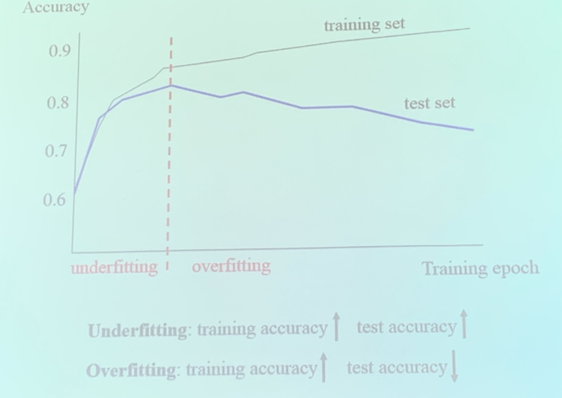
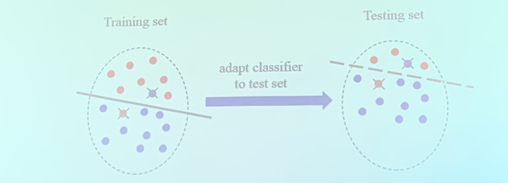

<!-- more -->

Discriminative Model $p(y|x)$

Generative Model, train $p(x|y)$, and $p(y|x) = \frac{p(xy)}{p(x)}  = \frac{p(x|y)p(y)}{p(x)}$

## Source domain and Target domain

$$
\begin{array}{l}
\mathcal{S}=\left\{\mathbf{x}^{s}, \mathbf{y}^{s}\right\} \\
\mathcal{T}=\left\{\mathbf{x}^{t}, \mathbf{y}^{t}\right\}
\end{array}
$$
- Training on training set (source domain): $p^{s}\left(\mathbf{y}^{s} \mid \mathbf{x}^{s}\right)$
- Testing on test set (target domain): $p^{s}\left(\mathbf{y}^{t} \mid \mathbf{x}^{t}\right)$

### Classification as example

- Bias: use a classifier to fit the training set, but not all training samples are classfied correctly

- No Bias: if the model is more complexed, bias may be eliminated, this is called no bias. But the ultimate goal of training set is not to fit the training set well

- Variance: if a "no bias" model makes a lot of mistakes on the testing set, we call it variance. (or equivalently, the same model applies to different data sets, and getting varied performance)

**The goal of training**, __**strike the balance between bias and variance**__ "泛化性能"

***

- Underfitting, the model can't fit the training set well (AKA bias)

- Overfitting, good on training and bad on testing (AKA variance)

- Appropriate, balance between bias and variance

### How?

compare training/testing accuracy w.r.t several factors (e.g. training epoch),

- Address underfitting
  - increase model parameters
  - decrease training set
- Address overfitting
  - reduce model parameters (e.g. regularization parameter)
  - enlarge training set

## Data Distribution Mismatch

$\begin{array}{rl}p^{s}\left(\mathbf{x}^{s}, \mathbf{y}^{s}\right)=p^{s}\left(\mathbf{y}^{s} \mid \mathbf{x}^{s}\right) p^{s}\left(\mathbf{x}^{s}\right) & p^{t}\left(\mathbf{x}^{t}, \mathbf{y}^{t}\right)=p^{t}\left(\mathbf{y}^{t} \mid \mathbf{x}^{t}\right) p^{t}\left(\mathbf{x}^{t}\right) \end{array}$

1. $p^{s}\left(\mathbf{x}^{s}\right) \text { v.s. }  p^{t}\left(\mathbf{x}^{t}\right)$: the two data-set may not be in the same category (more common in reality)
2. $p^{s}\left(\mathbf{y}^s|\mathbf{x}^{s}\right) \text { v.s. }  p^{t}\left(\mathbf{y}^t|\mathbf{x}^{t}\right)$: the sample can be controversial, and labels may be wrong. The same/similar item has different label on the training/testing set.

## Domain Adaptation

**Motivation**. modern datasets usually involve different homogeneous domains (e.g. data source website, capture devices, camera viewpoints, cross-modality ...)

### Aplication
- autonomous driving, the driving environment changes in a continually evolving way,
  - driving envrionments can vary (be innumerable), peak/off-peak, daytime/night, etc
  - what if we train on day 1 and want to adapt it to day 2

- Medical diagnosis
  - patient A -> patient B

- Video Surveillance
  - adapt between different kinds of cameras

### Domain generalization

- Domain adaptation: **unlabeled** target domain is seen in the training stage
- Domain generalization: **unlabeled** target domain is **unseen** in the training stage
  - the trainer may also mine several *latent domain*s (e.g. the real image set and the cartoon image set may both occur and undistinguishable during the training phase)
  - or train based on shared information

