<!-- more -->

## Traditional Era

> SA recommended

### Projection to common subspace

> Baktashmotlagh, et al. "Unsupervised domain adaptation by domain invariant projection", ICCV 2013

> We want to learn a projection for $n_s$ source samples and $n_t$ target samples, where the samples are "closer" after projection.
>
> What is the measure of "close"? MMD (max mean distance), as a simple solution

$$
\mathbf{X}_{s}=\left[\mathbf{x}_{1}^{s}, \mathbf{x}_{2}^{s}, \ldots, \mathbf{x}_{n_{s}}^{s}\right] \quad \mathbf{X}_{t}=\left[\mathbf{x}_{1}^{t}, \mathbf{x}_{2}^{t}, \ldots, \mathbf{x}_{n_{t}}^{t}\right]
$$

$$
\begin{array}{c}
d\left(\mathbf{W}^{T} \mathbf{X}_{s}, \mathbf{W}^{T} \mathbf{X}_{t}\right)^{2}=\left\|\frac{1}{n_{s}} \sum_{i=1}^{n_{s}} \phi\left(\mathbf{W}^{T} \mathbf{x}_{i}^{s}\right)-\frac{1}{n_{t}} \sum_{i=1}^{n_{t}} \phi\left(\mathbf{W}^{T} \mathbf{x}_{i}^{t}\right)\right\|^{2} \\
=\mathrm{tr}\left(\mathbf{K}_{\mathbf{W}} \mathbf{L}\right) \\
\mathbf{K}_{\mathbf{W}}=\left[\begin{array}{ll}
\mathbf{K}_{s s} & \mathbf{K}_{s t} \\
\mathbf{K}_{t s} & \mathbf{K}_{t t}
\end{array}\right] L_{i, j}=\left\{\begin{array}{ll}
\frac{1}{n_{s}^{2}}, & \text { if } i, j \in \mathcal{S} \\
\frac{1}{n_{t}^{2}}, & \text { if } i, j \in \mathcal{T} \\
-\frac{1}{n_s {n_{t}},}, & \text { otherwise }
\end{array}\right.
\end{array}
$$

> $\phi$ is not necessary, sometimes a wise $\phi$ may help. It has been proved that can be reduced to $\mathrm{tr}\left(\mathbf{K}_{\mathbf{W}} \mathbf{L}\right)$, $\mathbf{K}$ is simply a shared kernel function for the source and target domain, $\mathbf{L}$ is an indicating matrix to simplify the expression (no actual meaning)

#### Domain Invariant Projection

DIP problem

$$
\begin{aligned}
& \min _{\mathbf{W}} & \mathrm{tr}\left(\mathbf{K}_{\mathbf{W}} \mathbf{L}\right) \\
& \text { s.t. } & \mathbf{W}^{T} \mathbf{W}=\mathbf{I} .
\end{aligned}
$$

DIP-CC problem (with class clustering constraint)

$$
\begin{array}{l}
\min _{\mathbf{W}} \quad \mathrm{tr}\left(\mathbf{K}_{\mathbf{W}} \mathbf{L}\right)+ \lambda \sum_{\mathbf{c=1}}^{\mathbf{C}} \sum_{i=1}^{n_{c}}\left\|\mathbf{W}^{T} \mathbf{x}_{i, c}^{s}-\mathbf{\mu}_{c}\right\|^{2} \\
\text { s.t. } \quad \mathbf{W}^{T} \mathbf{W}=\mathbf{I}
\end{array}
$$

After obtaining $\mathrm{W}$, use $\phi\left(\mathbf{W}^{T} \mathbf{X}_{s}\right)$ and $\phi\left(\mathbf{W}^{T} \mathbf{X}_{t}\right)$

#### Transfer Component Analysis (TCA)

We still use the previous definition of "close"

$$
\begin{array}{c}
d\left(\mathbf{W}^{T} \mathbf{X}_{s}, \mathbf{W}^{T} \mathbf{X}_{t}\right)^{2}=
=\mathrm{tr}\left(\mathbf{K}_{\mathbf{W}} \mathbf{L}\right) \\
\mathbf{K}_{\mathbf{W}}=\left[\begin{array}{ll}
\mathbf{K}_{s s} & \mathbf{K}_{s t} \\
\mathbf{K}_{t s} & \mathbf{K}_{t t}
\end{array}\right] L_{i, j}=\left\{\begin{array}{ll}
\frac{1}{n_{s}^{2}}, & \text { if } i, j \in \mathcal{S} \\
\frac{1}{n_{t}^{2}}, & \text { if } i, j \in \mathcal{T} \\
-\frac{1}{n_s {n_{t}},}, & \text { otherwise }
\end{array}\right.
\end{array}
$$

Use $\tilde{K}$ to replace the original kernel $K$

$$
\mathbf{K}=\left(\mathbf{K K}^{-\frac{1}{2}}\right)\left(\mathbf{K}^{-\frac{1}{2}} \mathbf{K}\right)=\tilde{\phi}\left(\mathbf{X}_{s t}\right)^{T} \tilde{\phi}\left(\mathbf{X}_{s t}\right)
$$
Introduce transformation matrix $\tilde{\mathbf{W}}$ for **fake representation** $\tilde{\phi}\left(\mathbf{X}_{s t}\right)$
$$
\begin{array}{c}
\tilde{\mathbf{K}}=\left(\tilde{\phi}\left(\mathbf{X}_{s t}\right)^{T} \tilde{\mathbf{W}}\right)\left(\tilde{\mathbf{W}}^{T} \tilde{\phi}\left(\mathbf{X}_{s t}\right)\right)=\mathbf{K} \mathbf{W} \mathbf{W}^{T} \mathbf{K}, \text { in } \  \text{ which } \mathbf{W}=\mathbf{K}^{-\frac{1}{2}} \tilde{\mathbf{W}} \\
\mathrm{tr}(\tilde{\mathbf{K}} \mathbf{L})=\mathrm{tr}\left(\mathbf{K W} \mathbf{W}^{T} \mathbf{K L}\right)=\mathrm{tr}\left(\mathbf{W}^{T} \mathbf{K L K W}\right)
\end{array}
$$

The last transformation is based on the "shift invariance" property of trace.

$$
\begin{array}{cl}
\min _{\mathbf{W}} & \mathrm{tr}\left(\mathbf{W}^{T} \mathbf{K L K} \mathbf{W}\right) \\
\text { s.t. } & \mathbf{W}^{T} \mathbf{W}=\mathbf{I} .
\end{array}
$$

$$
\begin{array}{cl}
\mathrm{TCA} \quad \min _{\mathbf{W}} & \mathrm{tr}\left(\mathbf{W}^{T} \mathbf{W}\right)+\mathrm{tr}\left(\mathbf{W}^{T} \mathbf{K L K W}\right) \\
& \text { s.t. } \mathbf{W}^{T} \mathbf{K H K} \mathbf{W}=\mathbf{I} . \quad \text { normalization constraint } \\
& \mathbf{H}=\mathbf{I}-\frac{1}{n_{s}+n_{t}} \mathbf{1} 1^{T}
\end{array}
$$
After obtaining $\mathbf{W}$, use the new kernel $\tilde{\mathbf{K}}=\mathbf{K} \mathbf{W} \mathbf{W}^{T} \mathbf{K}$

> The idea behind DIP and TCA are simple (minimize the central distance), their difference is in ...

DIP: apply projection $\mathbf{W}$ before kernelization
$d\left(\mathbf{W}^{T} \mathbf{X}_{s}, \mathbf{W}^{T} \mathbf{X}_{t}\right)^{2}=\left\|\frac{1}{n_{s}} \sum_{i=1}^{n_{s}} \phi\left(\mathbf{W}^{T} \mathbf{x}_{i}^{s}\right)-\frac{1}{n_{t}} \sum_{i=1}^{n_{t}} \phi\left(\mathbf{W}^{T} \mathbf{x}_{i}^{t}\right)\right\|^{2}$

TCA: apply projection $\tilde{\mathbf{W}}$ after kernelization
$\tilde{\mathbf{K}}=\left(\tilde{\phi}\left(\mathbf{X}_{s t}\right)^{T} \tilde{\mathbf{W}}\right)\left(\tilde{\mathbf{W}}^{T} \tilde{\phi}\left(\mathbf{X}_{s t}\right)\right)=\mathbf{K} \mathbf{W} \mathbf{W}^{T} \mathbf{K}$

#### Subspace Alignment (SA)

> When you are not sure which traditional method to use, you can use SA

> We have source domain feature, and PCAed, and destination domain feature, How to alignment?

$$
\begin{aligned}
& \min _{\mathbf{M}}\left\|\mathbf{M} \mathbf{P}_{s}-\mathbf{P}_{t}\right\|_{F}^{2} \\
=& \min _{\mathbf{M}}\left\|\mathbf{M} \mathbf{P}_{s} \mathbf{P}_{s}^{T}-\mathbf{P}_{t} \mathbf{P}_{s}^{T}\right\|_{F}^{2} \\
=& \min _{\mathbf{M}}\left\|\mathbf{M}-\mathbf{P}_{t} \mathbf{P}_{s}^{T}\right\|_{F}^{2}
\end{aligned}
$$

$$
\mathbf{M}=\mathbf{P}_{t} \mathbf{P}_{s}^{T}
$$

The solution becomes explicit

> If we want to reduce the dimension (take first P)

Keep leading vectors in $\mathbf{P}_{s}$ and $\mathbf{P}_{t}$, get $\overline{\mathbf{P}}_{s}$ and $\overline{\mathbf{P}}_{t}$
$$
\mathbf{M}=\overline{\mathbf{P}}_{t} \overline{\mathbf{P}}_{s}^{T}
$$
Aligned source subspace: $\quad \mathbf{M} \overline{\mathbf{P}}_{s}=\overline{\mathbf{P}}_{t} \overline{\mathbf{P}}_{s}^{T} \overline{\mathbf{P}}_{s}$
$$
\tilde{\mathbf{X}}_{s}=\tilde{\mathbf{P}}_{t} {\tilde{\mathbf{P}}_{s}^{T}} \tilde{\mathbf{P}}_{s} \mathbf{X}_{s} \quad \tilde{\mathbf{X}}_{t}=\tilde{\mathbf{P}}_{t} \mathbf{X}_{t}
$$

> Note: direction: from source domain to target domain, thus we have different transformation expressions

#### LSSA: Landmarks Selection-based Subspace Alignment

>  Aljundi, Rahaf, et al. "Landmarks-based kernelized subspace alignment for unsupervised domain adaptation." CVPR, 2015.

Diffference is highlighted in red. With kernel projection and landmark selection

> Intuition: Landmark should be chosen first. (the points that help the most for narrowing the gap between source domain and target domain)

**Landmarks selection**
$$
K\left(\mathbf{x}_{i}^{s}, \mathbf{a}_{j}\right)=\exp \left(-\frac{\left\|\mathbf{x}_{i}^{s}-\mathbf{a}_{j}\right\|^{2}}{2 \delta^{2}}\right) \quad K\left(\mathbf{x}_{i}^{t}, \mathbf{a}_{j}\right)=\exp \left(-\frac{\left\|\mathbf{x}_{i}^{t}-\mathbf{a}_{j}\right\|^{2}}{2 \delta^{2}}\right)
$$
For each $\mathbf{a}_{j}$, we have $\mathcal{S}_{s}=\left\{\left.K\left(\mathbf{x}_{i}^{s}, \mathbf{a}_{j}\right)\right|_{i=1} ^{n_{s}}\right\}$ and $\mathcal{S}_{t}=\left\{\left.K\left(\mathbf{x}_{i}^{t}, \mathbf{a}_{j}\right)\right|_{i=1} ^{n_{t}}\right\}$
Select those $\mathbf{a}_{j}$ for which the distributions $\mathcal{S}_{s}$ and $\mathcal{S}_{t}$ have the largest overlap.

> The idea of "overlap" can be implemented in various ways

**Kernel projection**
$$
\begin{aligned}
\mathbf{k}_{i}^{s} &=\left[K\left(\mathbf{x}_{i}^{s}, \mathbf{a}_{1}\right), K\left(\mathbf{x}_{i}^{s}, \mathbf{a}_{2}\right), \ldots, K\left(\mathbf{x}_{i}^{s}, \mathbf{a}_{n_{a}}\right)\right] \\
\mathbf{k}_{i}^{t} &=\left[K\left(\mathbf{x}_{i}^{t}, \mathbf{a}_{1}\right), K\left(\mathbf{x}_{i}^{t}, \mathbf{a}_{2}\right), \ldots, K\left(\mathbf{x}_{i}^{t}, \mathbf{a}_{n_{a}}\right)\right]
\end{aligned}
$$
the number of landmarks can be set as a hyper parameter.

Replace the original $x_i^s$ by $k_i^s$. Treat the landmarks as the new features for later operations (then apply SA)

#### CORrelation ALignment (CORAL)

$\mathbf{C}_{s}$ and $\mathbf{C}_{t}:$ covariance matrices of $\mathbf{X}_{s}$ and $\mathbf{X}_{t}$

$\hat{\mathbf{C}}_{s}:$ covariance matrix of $\mathbf{A}^{T} \mathbf{X}_{s}$

align two covariance matrices, has an explicit solution
$$
\begin{aligned}
& \min _{\mathbf{A}}\left\|\hat{\mathbf{C}}_{s}-\mathbf{C}_{t}\right\|_{F}^{2} \\
=& \min _{\mathbf{A}}\left\|\mathbf{A}^{T} \mathbf{C}_{s} \mathbf{A}-\mathbf{C}_{t}\right\|_{F}^{2} \\
\mathbf{C}_{s} &=\mathbf{U}_{s} \mathbf{\Sigma}_{s} \mathbf{U}_{s}^{T} \quad \mathbf{C}_{t}=\mathbf{U}_{t} \mathbf{\Sigma}_{t} \mathbf{U}_{t}^{T}
\end{aligned}
$$
> since $C_s$ and $C_t$ are cov matrix, they are symmetric, we can SVD them into above form

The optimal solution $\mathbf{A}^{*}=\mathbf{U}_{s} \mathbf{\Sigma}_{s}^{-\frac{1}{2}} \mathbf{U}_{s}^{T} \mathbf{U}_{t}[1: r] \mathbf{\Sigma}_{t}[1: r]^{\frac{1}{2}} \mathbf{U}_{t}[1: r]^{T}$
$$
r=\min \left(\mathrm{rank}\left(\mathbf{C}_{s}\right), \mathrm{rank}\left(\mathbf{C}_{t}\right)\right)
$$
After obtaining $\mathbf{A}^{*}$, use $\mathbf{A}^{* T} \mathbf{X}_{s}$ and $\mathbf{X}_{t}$

#### Relation Between DIP and CORAL

- DIP: align first-order information (mean vector)
$d\left(\mathbf{W}^{T} \mathbf{X}_{s}, \mathbf{W}^{T} \mathbf{X}_{t}\right)^{2}=\left\|\frac{1}{n_{s}} \sum_{i=1}^{n_{s}} \phi\left(\mathbf{W}^{T} \mathbf{x}_{i}^{s}\right)-\frac{1}{n_{t}} \sum_{i=1}^{n_{t}} \phi\left(\mathbf{W}^{T} \mathbf{x}_{i}^{t}\right)\right\|^{2}$
- CORAL: align second-order information (covariance matrix)
$d\left(\mathbf{A}^{T} \mathbf{X}_{s}, \mathbf{X}_{t}\right)^{2}=\left\|\mathbf{A}^{T} \mathbf{C}_{s} \mathbf{A}-\mathbf{C}_{t}\right\|_{F}^{2}$

#### Summary

$$
\begin{array}{c}
d\left(\phi\left(\mathbf{X}_{s}\right), \phi\left(\mathbf{X}_{t}\right)\right) \\
\min _{\mathbf{W}_{s}, \mathbf{W}_{t}} d\left(\mathbf{W}_{s} \phi\left(\mathbf{X}_{s}\right), \mathbf{W}_{t} \phi\left(\mathbf{X}_{t}\right)\right)
\end{array}
$$
- When $\mathbf{W}_{s}=\mathbf{W}_{t}$, symmetric projection
- When $\mathbf{W}_{s} \neq \mathbf{W}_{t}$, asymmetric projection
- the $d-$ can also vary, (e.g. KL-divergence, MMD, ... can all be $d$)

### interpolation on the manifold

#### Sampling Geodesic Flow (SGF)

> insert values between source domain space to target domain space, the number of values vary from 5 ~ 10, as a hyper-parameter

$$
\begin{array}{l}
\hat{\mathbf{X}}_{s}=\left[\Phi(0)^{T} ; \Phi(0.1)^{T} ; \ldots, \Phi(1)^{T}\right] \mathbf{X}_{s} \\
\hat{\mathbf{X}}_{t}=\left[\Phi(0)^{T} ; \Phi(0.1)^{T} ; \ldots, \Phi(1)^{T}\right] \mathbf{X}_{t}
\end{array}
$$

> $\phi(0)^T X_s$ is just the PCA result of the source domain. $\phi(1)^TX_t$ is just the PCA result of the target domain. By expanding them with inserted values, we can unify them into the same space
>
> A discrete inserting idea, while GFK is an inserting method for continuous

#### Geodesic Flow Kernel (GFK)

> The idea works like a "kernel", the detailed derivation of $G$ is omitted, the final use will be based on the kernel result

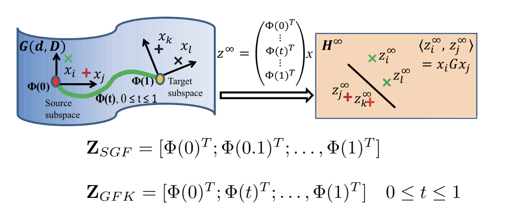
$$
\begin{array}{c}
\mathbf{Z}_{S G F}=\left[\Phi(0)^{T} ; \Phi(0.1)^{T} ; \ldots, \Phi(1)^{T}\right] \\
\mathbf{Z}_{G F K}=\left[\Phi(0)^{T} ; \Phi(t)^{T} ; \ldots, \Phi(1)^{T}\right] \quad 0 \leq t \leq 1 \\
\hat{\mathbf{X}}_{s}=\mathbf{Z}_{G F K} \mathbf{X}_{s} \quad \Rightarrow \quad \hat{\mathbf{X}}_{s}^{T} \hat{\mathbf{X}}_{s}=\mathbf{X}_{s}^{T}  {\mathbf{Z}_{G F K}^{T}} \mathbf{Z}_{G F K} \mathbf{X}_{s}=\mathbf{X}_{s}^{T} \mathbf{G} \mathbf{X}_{s} \\
\hat{\mathbf{X}}_{t}=\mathbf{Z}_{G F K} \mathbf{X}_{t} \quad \Rightarrow \quad  \mathbf{X}_{t}^{T} \hat{\mathbf{X}}_{t}=\mathbf{X}_{t}^{T} \mathbf{Z}_{G F K}^{T} \mathbf{Z}_{G F K} \mathbf{X}_{t}=\mathbf{X}_{t}^{T} \mathbf{G} \mathbf{X}_{t}
\end{array}
$$

### sample selection

> The above methods make transformations to all samples, while SS select samples from domains. The problem becomes: how to decide which sample to select

#### Kernel Mean Matching (KMM)

$$
\begin{array}{l}
d\left(\mathbf{X}_{s}, \mathbf{X}_{t}\right)^{2}=\left\|\frac{1}{n_{s}} \sum_{i=1}^{n_{s}} \phi\left(\mathbf{x}_{i}^{s}\right)-\frac{1}{n_{t}} \sum_{i=1}^{n_{t}} \phi\left(\mathbf{x}_{i}^{t}\right)\right\|^{2} \\
\text { Step 1: } \quad \min _{\beta_{i}}\left\|\frac{1}{n_{s}} \sum_{i=1}^{n_{s}} \beta_{i} \phi\left(\mathbf{x}_{i}^{s}\right)-\frac{1}{n_{t}} \sum_{i=1}^{n_{t}} \phi\left(\mathbf{x}_{i}^{t}\right)\right\|^{2} \\
\text { Step 2: } \quad \min _{\mathbf{w}, b, \xi_{i}} \quad \frac{1}{2}\|\mathbf{w}\|^{2}+C \sum_{i} \beta_{i} \xi_{i} \\
\text { s.t. } \quad y_{i}\left(\mathbf{w}^{T} \phi\left(\mathbf{x}_{i}\right)+b\right) \geq 1-\xi_{i}, \quad \forall i, \\
\xi_{i} \geq 0, \quad \forall i .
\end{array}
$$

>  $\beta_i \in [0,1]$ assign weights to every sample in the domain. phase 1 will decide on this parameter. Usually with extra constaints such as $\sum \beta_i > \gamma$
>
> Phase 2 makes use of the learned $\beta_i$ to train a model. We introduce **weighted loss** into SVM to use $\beta_i$

> Data points closer to the target domain will be selected and thus assigned greater weighted loss

> The two illustrations above are equivalent

#### Selective Transfer Machine (STM)

> Some methods try to unify the two phases. STM adds the two phases together

$$
\begin{array}{rll}
\min _{\mathbf{w}, b, \xi_{i}, \beta_{i}} & \frac{1}{2}\|\mathbf{w}\|^{2}+C \sum_{i} \beta_{i} \xi_{i}+\left\|\frac{1}{n_{s}} \sum_{i=1}^{n_{s}} \beta_{i} \phi\left(\mathbf{x}_{i}^{s}\right)-\frac{1}{n_{t}} \sum_{i=1}^{n_{t}} \phi\left(\mathbf{x}_{i}^{t}\right)\right\|^{2} \\
\text { s.t. } & y_{i}\left(\mathbf{w}^{T} \phi\left(\mathbf{x}_{i}\right)+b\right) \geq 1-\xi_{i}, \quad \forall i, \\
& \xi_{i} \geq 0, \quad \forall i, \\
& \beta_{i} \geq 0, \\
& \sum_{i} \beta_{i}=1
\end{array}
$$

Alternating solution: (交替优化)
- Fix $\mathrm{w}$, update $\beta_{i}$, Quadratic Programming (QP) problem
- Fix $\beta_{i}$, update $\mathbf{w}$, weighted SVM problem

#### Domain Adaptation SVM (DASVM)

1. Train the model based on source model
2. Sample some confident data (far from hyperplane, marked by dotted line in Fig 1) from target domain
3. Retrain the model, repeat 2

> The choice of "confidence", batch size matters to the performance of adaptation

### domain-invariant dictionary

> Idea: learn a **common** dictionary for source/target domain

#### Shared Domain-adapted Dictionary Learning (SDDL)

> $\bar{P_s^T}X_S$ - projected feature
>
> $D$ - dictionary, Standard Dictonary Learning: $\min||X - DR||_F^2$
>
> $R_s$ - dictionary-based representation
>
> The last two terms work like auto encoder: the transformation can reconstruct $X$

### low-rank reconstruction

#### Robust Domain Adaptation with Low-rank Reconstruction (RDALR)

> L-2,1 norm (grouped LASSO, expecting **column sparse**): $|| [x_{ij}]_{m\times n} ||_{2,1} = \sum_{j=1}^n\sqrt{\sum_{i=1}^{n}x_{ij}^2}$, the L2-norm of column, and then the L1-norm of the L2-norm results

>  By enforcing rank constraint on Z, we can solve a Z where grouping information about X can be revealed
>
> E: every column corresponds to a sample, we expect it to be sparse, so that outliers can be eliminated 
>
> How to solve? omitted

Adapt LRR into domain adaptation, find an extra $W$

#### Low-rank Transfer Subspace Learning (LTSL)

### Summary

So many methods, how to choose? (Meta-Learning, learn how to learn, not only learn to transfer, but also learn how to transfer better) 

$l_i$ performance improvement, $S_i$ source, $T_i$ target, $W_i$ model. 

general idea: Use the best model to do domain adaptation

## Early Deep Era

### Deep feature + traditional method

- deep learning feature + SGF
- deep learning feature + GFK/SA

### Deep network + traditional idea

> Zeng, Xingyu, et al. "Deep learning of scene-specific classifier for pedestrian detection." European Conference on Computer Vision. Springer, Cham, 2014.

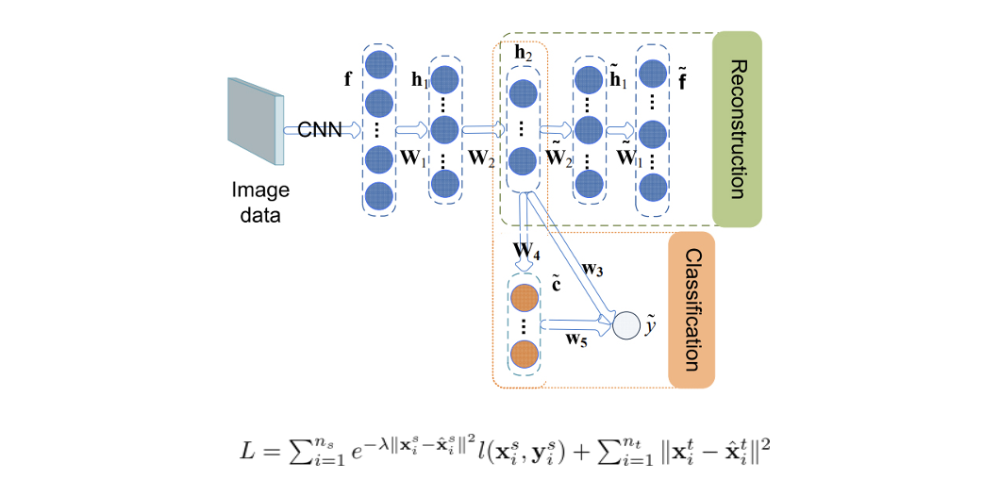

Use **reconstruction loss** to guide the classifier to assign larger weights $e^{-\lambda ||x_i^s  - \tilde{x_i^s}||^2}$  to the important source domain samples

> Reconstruction is very useful. Recall that we can train an auto-encoder to minimize the reconstruction loss and detect outliers

***

> Long, Mingsheng, et al. "Learning transferable features with deep adaptation networks." arXiv preprint arXiv:1502.02791(2015).

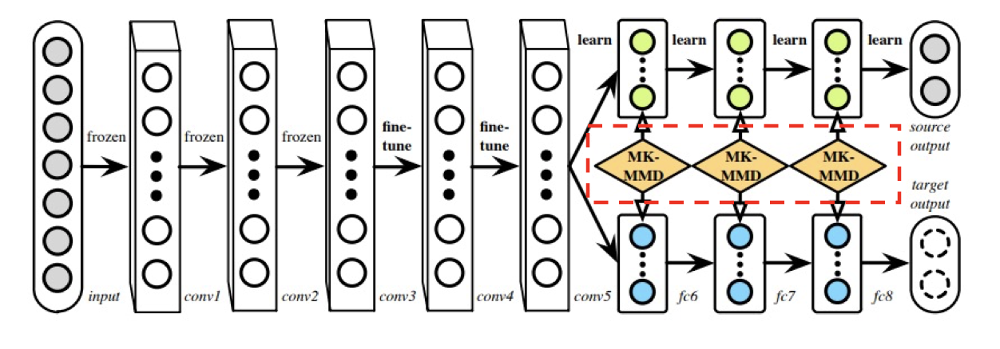

Idea: divide the last layers into two branches, (source domain + target output), for labeled source domain, train it based on labels. For target branch, use some additional constraints. Also use (Multiple-Kernel) MMD loss to ensure that the trained source domain is close to target domain.

***

> Deep CORAL , Sun, Baochen, and Kate Saenko. "Deep coral: Correlation alignment for deep domain adaptation." ECCV, 2016.

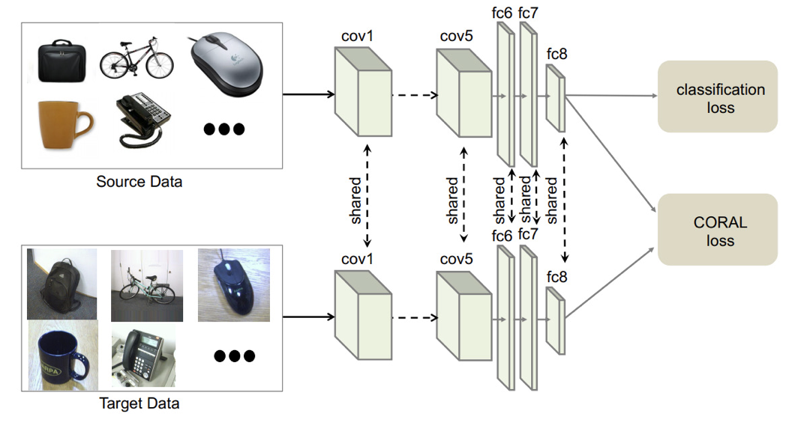

Idea: use the CORAL loss in deep learning (shared features + diversed feature)

> MMD - first order distance, CORAL - second order distance

***

> Domain Separation Networks, Bousmalis, Konstantinos, et al. "Domain separation networks." NIPS, 2016.

Use Shared/Private Src/Tgt encoder and decoder

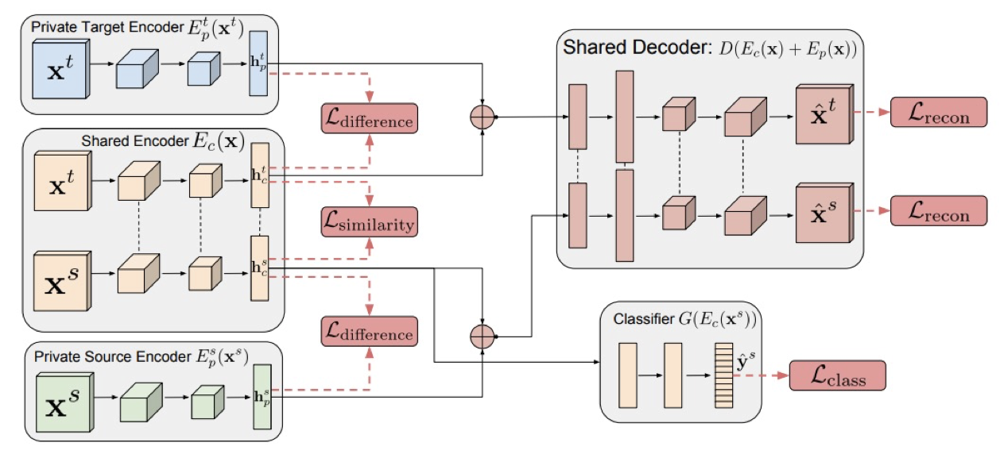

Idea: the classifier should always use domain-independent features to train.

### Batch normalization based

> For domain adpatation problems, batch normalization layer should be carefully designed

#### Z-Score Normalization

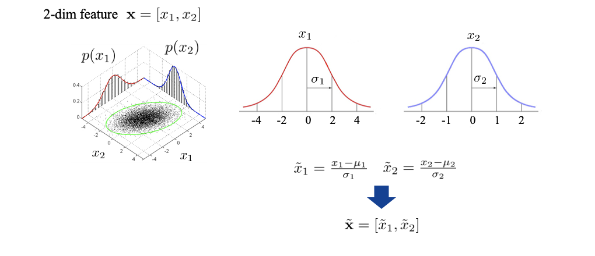

To resolve the discrepency between different dimensions/features

Batch normalization works like Z-score, but operates on batches

#### Domain Adaptive Batch Normalization

> Cariucci, Fabio Maria, et al. "Autodial: Automatic domain alignment layers." ICCV, 2017.

For normal CNN, since little gap exists in train/test set, BN layer can be directly used

However, for domain adaptive problems, since the network will record the moving average of the training data and directly use them for the testing set, it will cause error.

A direct idea is to also record testing avg and sqr-err when testing the dataset( $\epsilon$ is used to avoid div-0).

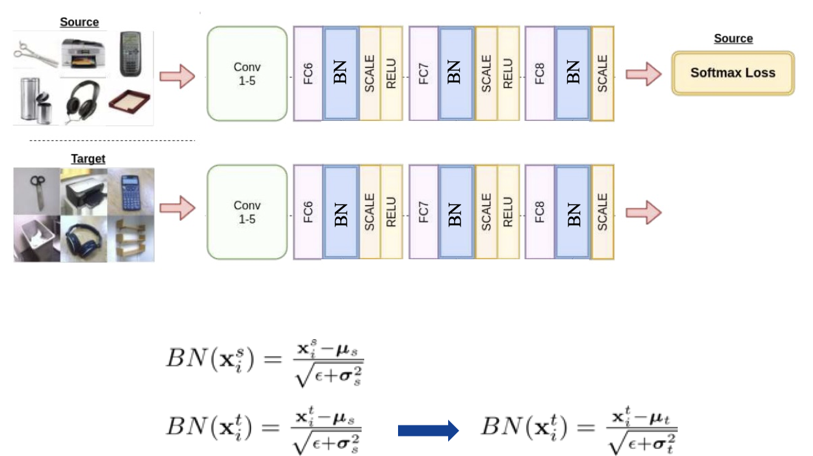

 Another idea is to insert values with $\alpha$ and $1-\alpha$ to coordinate between the BNs on two domains.  $q_{st}$ can be considered as $\mu$ or $\sigma$. 

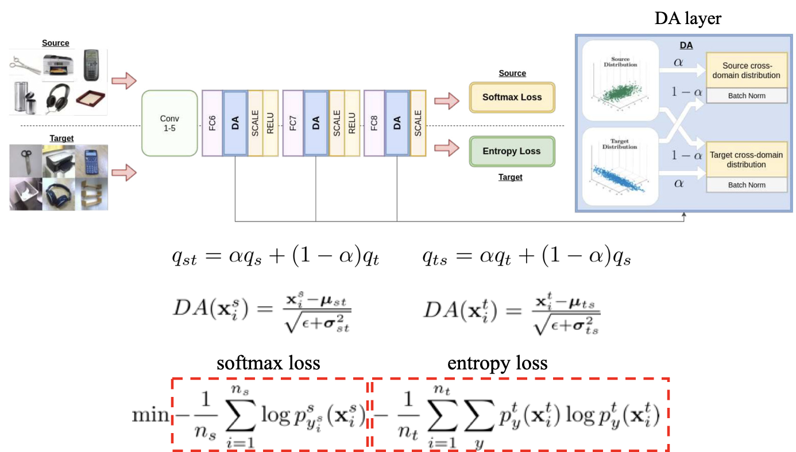

> By enforcing the low entropy loss, we ensure that the target  domain can perform classification instead of distribute the samples uniformly

### Adversarial learning

**Idea: Not only classify categories (category classifier) but also classify domains(domain classifier)**

> Tzeng, Eric, et al. "Simultaneous deep transfer across domains and tasks." ICCV, 2015.

- domain classifier loss - ensure that the model can distinguish between the source domain and target domain

- domain confusion loss - but on the other hand, when generating the feature, we should not rely on domain-specific features. We need to confuse them (**adversial**)

  > Adversarial loss can always be considered as an equivalence to the distance (e.g. KLD) of the distributions of two domains

***

> Ganin, Yaroslav, and Victor Lempitsky. "Unsupervised domain adaptation by backpropagation." arXiv preprint arXiv:1409.7495 (2014).

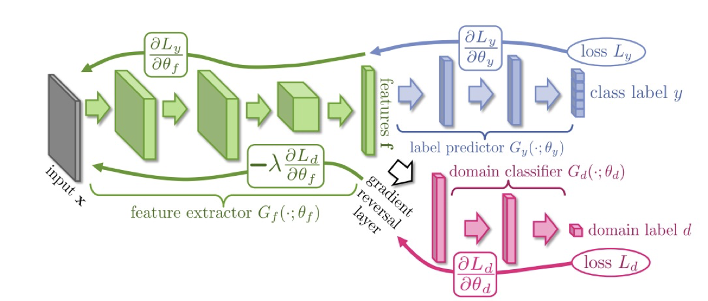

> Similar idea, category classifier + domain classifier, The domain loss needs adversarial back propagation (gradient reversal layer, avoid alternating optimization, simplify training process, some theories about gradient reversal layer are also proposed in this paper). 

## GAN Era

> 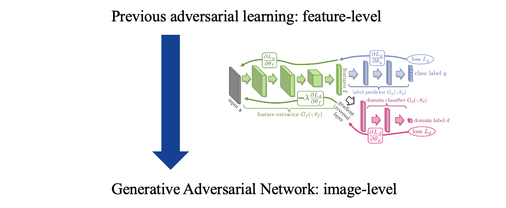
>
> by lifting the idea from feature-level adversarial to image-level, GAN outperforms many models (e.g. VAE) in generating images tasks 

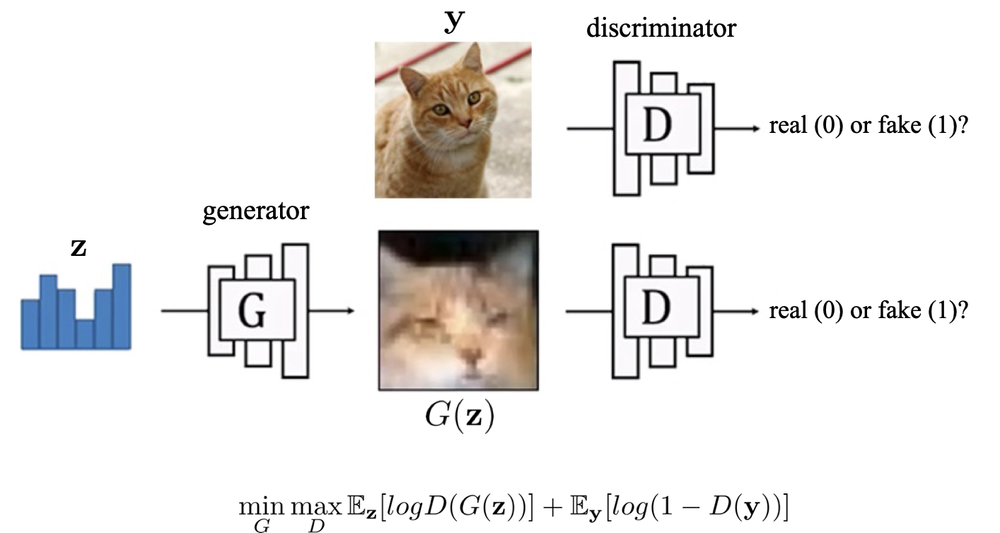

### Conditional GAN

if the input is not a vector but an image (conditional information)

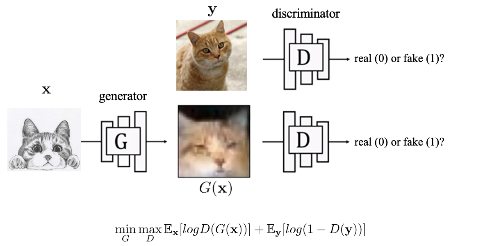

> Two concrete application of GAN

### Paired GAN - pix2pix

The first two losses are same as the conditional GAN, the last term is the reconstruction error of $y$ and $G(X)$. (l1-loss makes the picture more sharp)

Note, the input image come in pairs (given a photo, it has its corresponding cartoon).

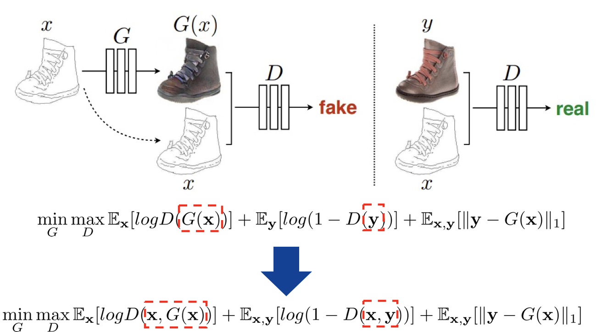

The discriminator is also changed by taking $y$ into consideration. When we train the discriminator, we not only have the generated image but also the input image, so that the discriminator is stronger. 

>  (**Trick: Conditional Discriminator**, when the discriminator of GAN can't work well, it may help if we introduce the conditional information)

Training process: train D and G alternatingly

Application:

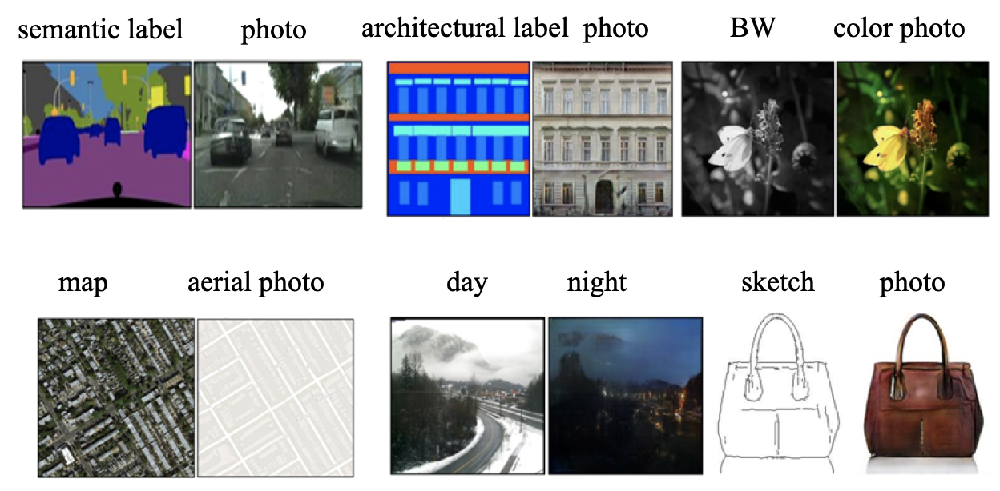

### Unpaired GAN

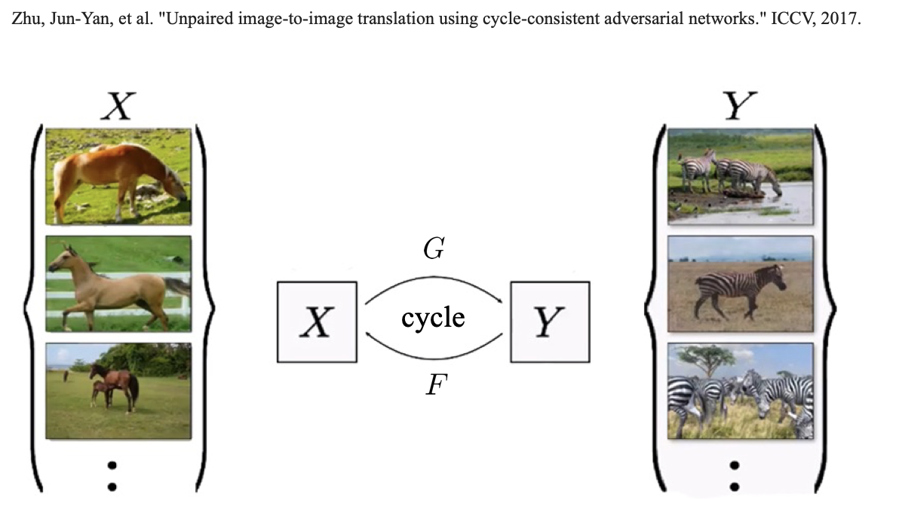

Idea, for an image of X, transform it using G, although we don't know which Y it falls in, but we know that F(G(X)) should still be X

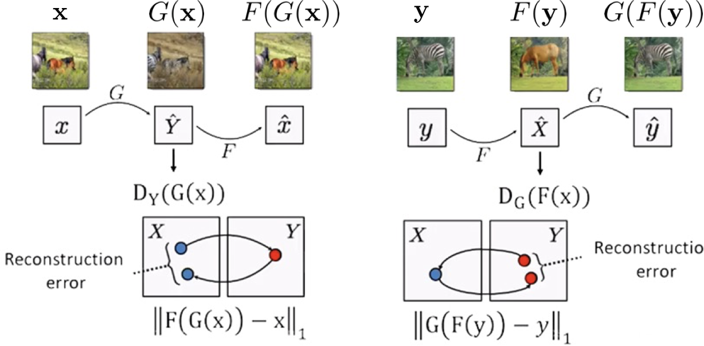

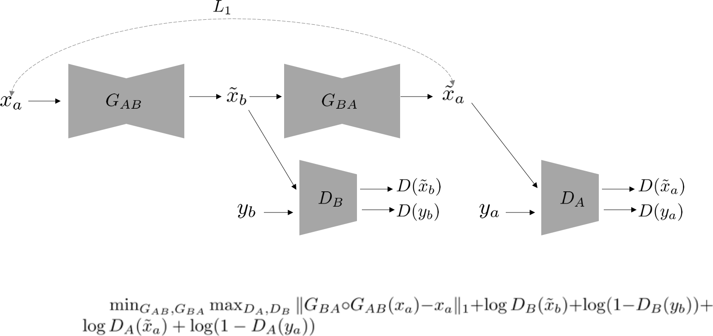

loss = 1 generator (reconstruction loss) + 2 discriminators