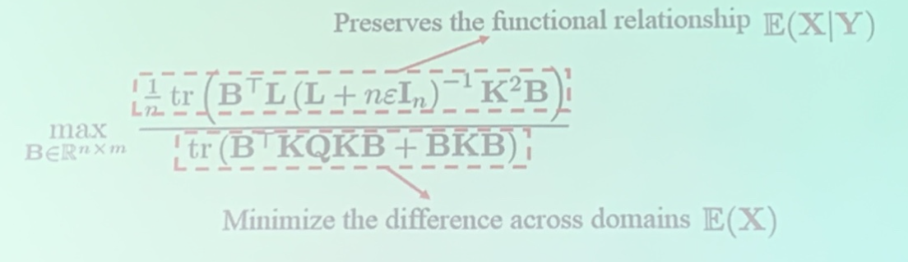
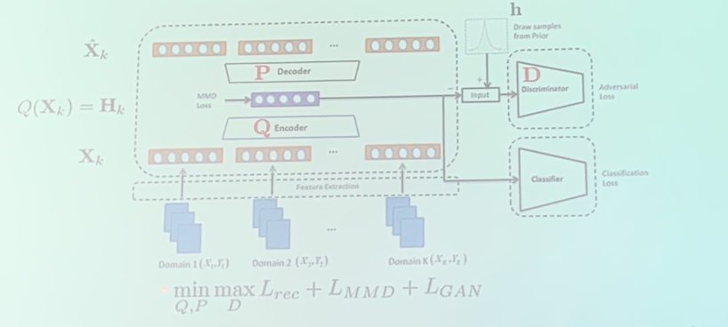
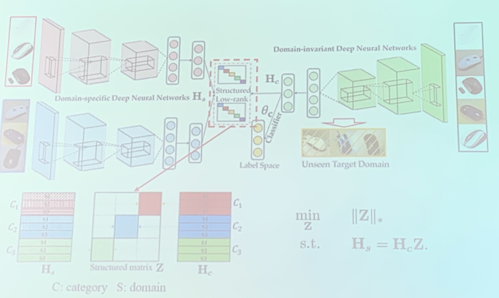
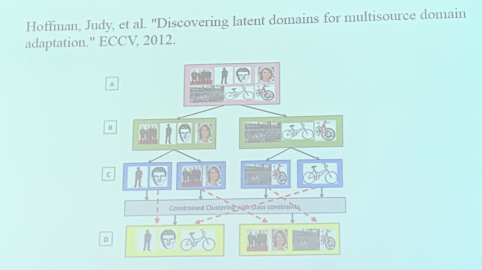

- Domain adaptation: **unlabeled** target domain is seen in the training stage
- Domain generalization: **unlabeled** target domain is **unseen** in the training stage
  - the trainer may also mine several *latent domain*s (e.g. the real image set and the cartoon image set may both occur and undistinguishable during the training phase)
  - or train based on shared information

<!-- more -->

## Latent Domain labels are known

i.e. we know where data in the monolithic source domain come from

### Domain Invariant Component Analysis

Earliest domain generaliation method

After obtaining $B$, the kernel after projection $\tilde{K} = KBB^TK$

### Representative works of Early Domain Generalization

reconstruction loss + MMD loss + GAN loss
$$
\begin{array}{l}
L_{r c c}=\sum_{k=1}^{K}\left\|\hat{\mathbf{X}}_{k}-\mathbf{X}_{k}\right\|_{F}^{2} \quad L_{M M D}=\sum_{k_{1} \neq k_{2}}\left\|\mathbf{H}_{k_{1}}-\mathbf{H}_{k_{2}}\right\|_{F}^{2} \\
L_{G A N}=\mathbb{E}_{\mathrm{h} \sim p(\mathbf{h})}[\log D(\mathbf{h})]+\mathbb{E}_{\mathbf{x} \sim p(\mathbf{x})}[\log (1-D(Q(\mathbf{x})))]
\end{array}
$$
Now we have multiple domains (unlike source + target in domain adaptation problem), we assume that the encoded feature conforms a prior distribution $h$

***

Idea: apply low rank into representation

- domain specific NN + domain invariant NN
- expecting $H_s$ has a low-rank representation $H_c$ (c ~ category, s ~ domain, i.e. every domain has its own category)
- A low-rank matrix can be transformed into a simple diag-form (where domain+category are grouped)
- similar to LRR
- The transformed matrix treat domains in the same category as the same, so that the model can classify categories, and has generalization power among domains

> However, this optimization problem is not easy to combine with NN, so in practical, alternating training (3 networks vs. low rank) is used.

## Latent Domain labels are unknown

### By mining labels

Solution. First mine latent domains (discover multiple latent domains in the source domain)

***

- First group according to category, then group according to domain. into $C\times K$ clusters
- K-Means + extra constraints (every domain contains only a single local cluster from each category) to find domains

***

Idea: inverse of MMD, mine the latent domains by maximizing the distance between potential domains.

$z_{m k}:$ the probability that $m$ -th sample belongs to the $k$ -th latent domain

**Goal** max sum of | mean of $k$ -th latent domain - mean of $k^{\prime}$ -th latent domain |
$$
\begin{array}{ll}
\max _{z_{m k}} & \sum_{k \neq k^{\prime}} \mid \frac{1}{\mathrm{M}_{k}} \sum_{m} \phi\left(\mathbf{x}_{m}\right) z_{m k}-\frac{1}{{\mathrm{M}_{k}^{\prime}}} \sum_{m} \phi\left(\mathbf{x}_{m}\right) z_{m k} \mid ^ 2 \\
\text { s.t. } & \sum_{k=1}^{K} z_{m k}=1, \quad \forall m, \\
& \frac{1}{\mathrm{M}_{k}} \sum_{m=1}^{\mathrm{M}} z_{m k} y_{m c}=\frac{1}{\mathrm{M}} \sum_{m=1}^{\mathrm{M}} y_{m c}, \quad \forall c, \forall k
\end{array}
$$
**s.t**. (1) prob is normalized, (2) categories are balanced (the assumption may fail in some datasets where clusters within different domains themselves are not balanced)

> cons: concave optimization, more difficult