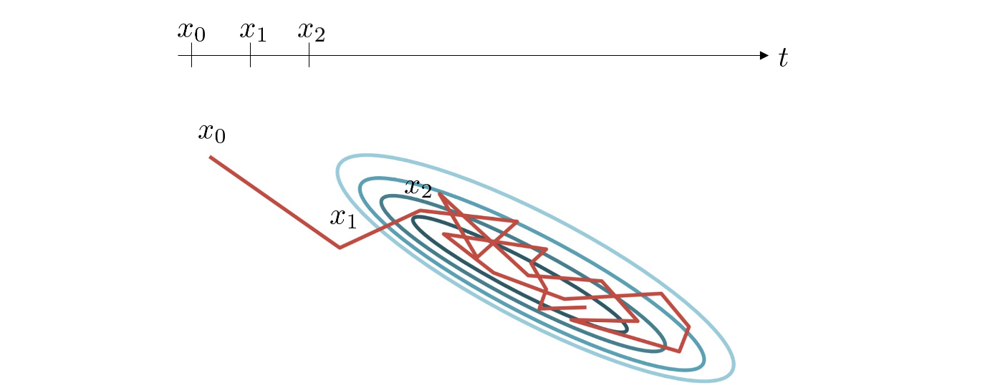

<!-- more -->

- Compute distributions from samples

- Sample from data distributions

In most applications, assume normal distribution / GMM

## From sample to distribution

How to decide $\theta$

- Prior Information = distribution + counting

  > How we get the data from idd experiments? e.g. Coin toasting, 10 times, p = $\frac{1}{2}$

- Prior information = distribution

  > unbalanced coin, unknown times, need to compute

- Know nothing about the samples

  > Complex data, e.g. extract feature from images

  **We need to make assumptions, even if unaccurate**

### Maximum Likelihood Estimation

$$
\begin{array}{l}
p\left(x_{1}, x_{2}, \ldots, x_{N} \mid \theta\right)=\prod_{i=1}^{N} p\left(x_{i} \mid \mu, \sigma\right)=\prod_{i=1}^{N}\left(\frac{1}{2 \pi \sigma^{2}}\right)^{\frac{N}{2}} \exp \left(-\frac{\sum_{i=1}^{N}\left(x_{i}-\mu\right)^{2}}{2 \sigma^{2}}\right) \\
\qquad \begin{array}{l}
\frac{\partial \log p\left(x_{1}, x_{2}, \ldots, x_{N} \mid \theta\right)}{\partial \mu}=0 \quad \Rightarrow &\hat{\mu}=\frac{1}{N} \sum_{i=1}^{N} x_{i} \\
\frac{\partial \log p\left(x_{1}, x_{2}, \ldots, x_{N} \mid \theta\right)}{\partial \sigma}=0 \quad \Rightarrow & \hat{\sigma}^{2}=\frac{1}{N} \sum_{i=1}^{N}\left(x_{i}-\hat{\mu}\right)^{2}
\end{array}
\end{array}
$$

**Biased Estimation**
$$
\hat{\sigma}^{2}=\frac{1}{N} \sum_{i=1}^{N}\left(x_{i}-\hat{\mu}\right)^{2}=\frac{1}{N} \sum_{i=1}^{N} x_{i}^{2}-\frac{1}{N^{2}} \sum_{i=1}^{N} \sum_{j=1}^{N} x_{i} x_{j}
$$
Ground-truth mean and variance: $\mu$ and $\bar{\sigma}$
Define $\lambda_{i}=\mu-x_{i}$, then $\mathbb{E}\left[\lambda_{i}\right]=0, \mathbb{E}\left[\lambda_{i}^{2}\right]=\sigma^{2}$
$$
\hat{\sigma}^{2}=\frac{1}{N} \sum_{i=1}^{N}\left(\mu-\lambda_{i}\right)^{2}-\frac{1}{N^{2}} \sum_{i=1}^{N} \sum_{j=1}^{N}\left(\mu-\lambda_{i}\right)\left(\mu-\lambda_{j}\right)
$$

$$
\mathbb{E}\left[\hat{\sigma}^{2}\right]=\frac{N-1}{N}\sigma^2
$$

> The bias of sampling comes from **finite** smapling

### Gaussian Mixture Model

GMM parameters: $\mathbf{\theta}=\left\{\pi_{1}, \mu_{1}, \sigma_{1} ; \pi_{2}, \mu_{2}, \sigma_{2} ; \ldots ; \pi_{K}, \mu_{K}, \sigma_{K}\right\}$
$$
p\left(x_{1}, x_{2}, \ldots, x_{N} \mid \mathbf{\theta}\right)=\prod_{i=1}^{N} p\left(x_{i} \mid \mathbf{\theta}\right), in\ which\ p\left(x_{i} \mid \mathbf{\theta}\right)=\sum_{k=1}^{K} p\left(x_{i} \mid \mathbf{\theta}_{k}\right) p\left(\mathbf{\theta}_{k}\right) =\sum_{k=1}^{K} p\left(x_{i} \mid \mu_{k}, \sigma_{k}\right) \pi_{k}
$$
Hidden variable $\gamma_{i}(k):$ the probability that the $i$ -th sample belongs to the $k$ -th Gaussian model
Due to hidden variable, we use EM algorithm to estimate $\gamma_{i}(k)$ and $\theta=\left\{\pi_{1}, \mu_{1}, \sigma_{1} ; \pi_{2}, \mu_{2}, \sigma_{2} ; \ldots ; \pi_{K}, \mu_{K}, \sigma_{K}\right\}$
In each iteration:
Expectation-step: estimate the hidden variable
$$
\gamma_{i}(k)=\frac{\pi_{k} p\left(x_{i} \mid \theta_{k}\right)}{\sum_{k^{\prime}=1}^{K} \pi_{k^{\prime}} p\left(x_{i} \mid \theta_{k^{\prime}}\right)}
$$
Maximization-step: maximum likelihood estimation
$$
\pi_{k}=\frac{\sum_{i=1}^{N} \gamma_{i}(k)}{N} \quad \mu_{k}=\frac{\sum_{i=1}^{N} \gamma_{i}(k) x_{i}}{\sum_{i=1}^{N} \gamma_{i}(k)} \quad \sigma_{k}^{2}=\frac{\sum_{i=1}^{N} \gamma_{i}(k)\left(x_{i}-\mu_{k}\right)^{2}}{\sum_{i=1}^{N} \gamma_{i}(k)}
$$

### GMM VS K-Means

GMM is probabilistic clustering or soft clustering

**K-Means**

Expectation-step: estimate the hidden variable
$$
\gamma_{i}(k)=\left\{\begin{array}{ll}
1, & \text { if } k=\arg \min _{k}\left(x_{i}-\mu_{k}\right)^{2} \\
0, & \text { otherwise }
\end{array}\right.
$$
Maximization-step: maximum likelihood estimation
$$
\mu_{k}=\frac{\sum_{i=1}^{N} \gamma_{i}(k) x_{i}}{\sum_{i=1}^{N} \gamma_{i}(k)}
$$

## From Distribution to Sample

For uniform distribution $x = v_l + rand(0,1)(v_r-v_l)$

### Standard Distribution

Assume we know $p(y)$ given $y$, How to sample $y$?

Solution: assume $y = f(z)$ with $z$ uniformly distributed over the interval $[0,1]$

$p(y) = p(z)\frac{dz}{dy}, z=f^{-1}(y)$

Step1: Since $p(z) = 1$, $z=h(y)=\int_{-\infty}^{y}p(\hat{y}) d\hat{y}$

Step2: $y=h^{-1}(z)$

Now we can obtain $y$ based on $z~u(0,1)$

### Rejection Sampling

> What if it is hard to compute inverse/integral?

Goal: sample $z \sim p$
Step 1: Find an envelope distribution $k q(z) \geq p(z)$
Step 2: sample $z_{0} \sim q$
Step 3: accept $z_{0}$ with the ratio $\frac{h_{1}}{h_{0}+h_{1}}=\frac{p\left(z_{0}\right)}{k q\left(z_{0}\right)}$

### Adaptive Rejection Sampling

> What if it is hard to find an envelope

Find the piecewise exponential envelope distribution
$q(z)=k_{i} \lambda_{i} \exp \left\{-\lambda_{i}\left(z-z_{i-1}\right)\right\}, \quad z_{i-1}<z \leq z_{i}$

A concave function can always find an envelop by locating a few points, we can then construct this curve (i.e. determine $\lambda_i, z_i$from the points)

### Importance Sampling

> Sometimes, we do not need sample $x \sim p$,
> just need expectation $\mathbb{E}_{x \sim p}[f(x)]$

$$
\begin{aligned}
\int f(x) p(x) d x &=\int f(x) \frac{p(x)}{q(x)} q(x) d x \\
& \approx \frac{1}{S} \sum_{s=1}^{S} f\left(x^{s}\right) \frac{p\left(x^{s}\right)}{q\left(x^{s}\right)}
\end{aligned}
$$
$\mathbb{E}[f(x)]$ with $x \sim p$ can be calculated as the weighted $\mathbb{E}\left[f\left(x^{s}\right)\right]$ with $x^{s} \sim q$

> $\frac{p(x^s)}{q(x^s)}$ is the weight

### Markov Chain Monte Carlo (MCMC)

> For previous methods, we need to make strong assumptions about $p$ or find a envelop, which is challenging for general purposes

**Goal**: Draw approximate correlated samples from a target distribution p(x) 

**MCMC**: Performs a **biased** random walk to explore the distribution 

#### Example1: Metropolis-Hastings Algorithm (unit-variate)

Goal: $p(x)$
1. Initialize
   1. Pick an initial state $x_{0}$
   2. Set $t=0$
2. Iterate
   1. Generate: randomly generate a candidate state $x^{\prime}$ according to $g\left(x^{\prime} \mid x_{t}\right)$
   2. Calculate the acceptance probability $A\left(x^{\prime}, x_{t}\right)=\min \left(1, \frac{p\left(x^{\prime}\right)}{p\left(x_{t}\right)} \frac{g\left(x_{t} \mid x^{\prime}\right)}{g\left(x^{\prime} \mid x_{t}\right)}\right)$
   3. generate a uniform random number $u \in[0,1]$, if $u \leq A\left(x^{\prime}, x_{t}\right), x_{t+1}=x^{\prime}$, otherwise $x_{t+1}=x_{t}$
   4. $t=t+1$

#### Example2: Gibbs Sampling

Goal: $p(\mathbf{x}) \quad$ the $i$ -th sample $\mathbf{x}_{i}=\left(x_{i}^{1}, x_{i}^{2}, \ldots, x_{i}^{d}\right)$

Goal: $p(\mathbf{x}) \quad$ the $i$ -th sample $\mathbf{x}_{i}=\left(x_{i}^{1}, x_{i}^{2}, \ldots, x_{i}^{d}\right)$
1. Initialize
   1. Pick an initial state $\mathbf{x}_{0}=\left(x_{0}^{1}, x_{0}^{2}, \ldots, x_{0}^{d}\right)$
   2. Set $t=0$
2. Iterate
   1. $\mathrm{j}=\bmod (\mathrm{t}, \mathrm{d})$
   2. randomly generate $x_{t+1}^{j}$ according to $p\left(x^{j} \mid x_{t}^{1}, \ldots, x_{t}^{j-1}, x_{t}^{j+1}, \ldots, x_{t}^{d}\right)$
   3. $\mathbf{x}_{t+1}=\left(x_{t}^{1}, \ldots, x_{t}^{j-1}, x_{t+1}^{j}, x_{t}^{j+1}, \ldots, x_{t}^{d}\right)$
   4. $t=t+1$

> Generate samples B from samples A (s.t. B ~ A) (Any generative model falls into either one of the two frameworks)
>
> Method 1. Auto regression A to a data distribution X and sample B from X
>
> Method 2. Bypass the "distribution", e.g. by training a GAN to generate sample B

