<!-- more -->

Traditionally, each training/testing sample has one type of feature.

Actually, each training/testing samples could have multiple types of features (given an image, we can extract different features, we don't know which is better or we want to combine them)

Actually, each training/testing sample could have multiple types of features (for different modularities, visual feature + texture feature)

## Multi View Learning

Training feature $X_a^s$, $X_b^s$,  ...

Testing feature $X_a^t$, $X_b^t$ ...

### Consensus Principle

The information between multiple views should be consistent, w.r.t. (e.g.) features, ...

### Canonical Correlation Analysis (CCA)

Recall, first decentralize, and then learn a projection to maximize the correlation between $X_a^s$, $X_b^s$,

### SVM-2K

SVM single-view:
$$
\begin{aligned}
\min _{\mathbf{w}, b, \xi_{i}} & & \frac{1}{2}\|\mathbf{w}\|^{2}+C \sum_{i=1}^{N} \xi_{i} & \\
\text { s.t. } & & y_{i}\left(\mathbf{w}^{T} \mathbf{x}_{i}+b\right) \geq 1-\xi_{i}, \quad \forall i, \\
& & \xi_{i} \geq 0, \quad \forall i .
\end{aligned}
$$

$$
\begin{array}{lr}
\min_{w^{a}, b^{a}, \varepsilon_{i}, n_{i}, \mathbf{w}^{b}, b^{b}, \xi_{i}^{b} } & \frac{1}{2}\left\|\mathbf{w}^{a}\right\|^{2}+\frac{1}{2}\left\|\mathbf{w}^{b}\right\|^{2}+C \sum_{i=1}^{N}\left(\xi_{i}^{a}+\xi_{i}^{b}\right)+\gamma \sum_{i=1}^{N} \eta_{i} \\
\text { s.t. } & y_{i}\left(\mathbf{w}^{a T} \mathbf{x}_{i}^{a}+b^{a}\right) \geq 1-\xi_{i}^{a}, \quad \forall i, \\
& y_{i}\left(\mathbf{w}^{b T} \mathbf{x}_{i}^{b}+b^{b}\right) \geq 1-\xi_{i}^{b}, \quad \forall i, \\
& \left|\mathbf{w}^{a T} \mathbf{x}_{i}^{a}+{b}^{a}-\mathbf{w}^{b T} \mathbf{x}_{i}^{b}-b^{b}\right| \leq \eta_{i}, \quad \forall i, \\
&\xi_{i}^{a} \geq 0, \xi_{i}^{b} \geq 0, \eta_{i} \geq 0, \quad \forall i,
\end{array}
$$

Testing stage: $\frac{1}{2}\left[\left(\mathbf{w}^{a T} \mathbf{x}_{i}^{a}+b^{a}\right)+\left(\mathbf{w}^{b T} \mathbf{x}_{i}^{b}+b^{b}\right)\right]$

>  third constraint: decision values on two views are consistent
>
> If both views are informative, the model can have a good performance

### Complementary Principle

The information among multiple views are complementary

- **Early fusion**. concatenate features

  Train one classifier based on concatenated feature

- **Late Fusion** fuse decision values

  <!--TODO-->

- **View Selection** assign different weights on different views

### Multiple-Kernel Learning

Recall SVM 

$\min _{\mathbf{w} } \quad \frac{1}{2}\|\mathbf{w}\|^{2}$
s.t. $\quad y_{i} \mathbf{w}^{T} \mathbf{x}_{i} \geq 1, \quad \forall i .$

Now we assign different weights on different views
$$
\begin{aligned}
\text { MKL } \min _{\mathbf{w}^{v}, \mathbf{d}} & \frac{1}{2} \sum_{v=1}^{V} \frac{\left\|\mathbf{w}^{v}\right\|^{2}}{ {d}^{v} } \\
\text { s.t. } \quad & y_{i} \sum_{v=1}^{V} \mathbf{w}^{v T} \mathbf{x}_{i}^{v} \geq 1, \quad \forall i, \\
& \mathbf{1}^{T} \mathbf{d}=1, \quad \mathbf{d} \geq \mathbf{0} .
\end{aligned}
$$
Langrange:
$$
\begin{array}{c}
\mathcal{L}_{\mathrm{w}^{v}, \alpha}=\frac{1}{2} \sum_{v} \frac{\left\|\mathbf{w}^{v}\right\|^{2}}{d^{v}}-\sum_{i} \alpha_{i}\left(y_{i} \sum_{v} \mathbf{w}^{v T} \mathbf{x}_{i}^{v}-1\right) \\
\frac{\partial \mathcal{L}_{\mathbf{w}} v, \alpha}{\partial \mathbf{w}^{v}}=0 \Longrightarrow \mathbf{w}^{v}=d^{v} \mathbf{X}^{v}(\mathbf{\alpha} \circ \mathbf{y})
\end{array}
$$
 Dual form: 
$$
\begin{aligned}
 \min _{\mathbf{d}} \max _{\mathbf{\alpha}} &-\frac{1}{2} \sum_{v=1}^{V} d^{v} \mathbf{\alpha}^{T}\left(\mathbf{K}^{v} \circ\left(\mathbf{y} \mathbf{y}^{T}\right)\right) \mathbf{\alpha}+\mathbf{1}^{T} \mathbf{\alpha} \\
\text { s.t. } & \mathbf{\alpha} \geq \mathbf{0}, \\
& \mathbf{1}^{T} \mathbf{d}=1, \quad \mathbf{d} \geq \mathbf{0}
\end{aligned}
$$
Solution: alternating optimization

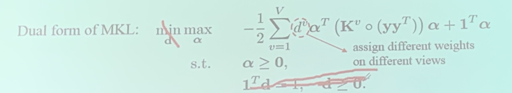

Solution: Update $\mathrm{d}$ and $\alpha$ alternatingly.
1. Update $\alpha$ : Quadratic Programming (QP) problem
$$
\begin{array}{ll}
\max _{\mathbf{\alpha}} & -\frac{1}{2} \mathbf{\alpha}^{T}\left[\sum_{v=1}^{V} d^{v}\left(\mathbf{K}^{v} \circ\left(\mathbf{y} \mathbf{y}^{T} \right)\right] \mathbf{\alpha}+\mathbf{1}^{T} \mathbf{\alpha}\right. \\
\text { s.t. } & \mathbf{\alpha} \geq \mathbf{0} .
\end{array}
$$
2. Update d: close-form solution

$$
\mathcal{L}_{w^{v}, d}=\frac{1}{2} \sum_{v} \frac{\left\|\mathbf{w}^{v}\right\|^{2}}{d^{v}}+\lambda\left(1^{T} \mathbf{d}-1\right)
$$

$$
\frac{\partial \mathcal{L}_{\mathbf{w}^{v}, \mathrm{~d}}}{\partial d^{0}}=0 \Longrightarrow d^{v}=\frac{\left\|\mathbf{w}^{v}\right\|}{\sqrt{2 \lambda}}
$$

$$
d^{v}=\frac{\left\|\mathbf{w}^{v}\right\|}{\sum_{v=1}^{V}\left\|\mathbf{w}^{v}\right\|}
$$

## Learning with Privileged Information

What if the testing feature don't have as much information as training samples?

Training feature $X_a^s$, $[X_b^s,\ldots]$ ~ privileged information

> e.g. Shape feature + Depth feature

Testing feature $X_a^t$,

> e.g. only Shape feature
>
> priviledged information is impossible/hard to obtain for testing images

1. same as multi-view learning, but not use PI for test images
2. Generate pseudo PI for test images
3. Use PI to control the training process

### Adapted Multi-view Learning

#### CCA

<!--TODO-->

#### SVM-2K

$$
\begin{array}{rlr}
\min _{w^{a}, b^{a}, \xi_{i}^{a}, n_{i},\mathbf{w}^{b}, b^{b}, \xi_{i}^{b} } & \frac{1}{2}\left\|\mathbf{w}^{a}\right\|^{2}+\frac{1}{2}\left\|\mathbf{w}^{b}\right\|^{2}+C \sum_{i=1}^{N}\left(\xi_{i}^{a}+\xi_{i}^{b}\right)+\gamma \sum_{i=1}^{N} \eta_{i} \\
\text { s.t. } & y_{i}\left(\mathbf{w}^{a T} \mathbf{x}_{i}^{a}+b^{a}\right) \geq 1-\xi_{i}^{a}, \quad \forall i \\
& y_{i}\left(\mathbf{w}^{b T} \mathbf{x}_{i}^{b}+b^{b}\right) \geq 1-\xi_{i}^{b}, \quad \forall i \\
& \left|\mathbf{w}^{a T} \mathbf{x}_{i}^{a}+b^{a}-\mathbf{w}^{b T} \mathbf{x}_{i}^{b}-b^{b}\right| \leq \eta_{i}, \quad \forall i \\
& \xi_{i}^{a} \geq 0, \xi_{i}^{b} \geq 0, \eta_{i} \geq 0, \quad \forall i
\end{array}
$$

> Same training process, PI helps training, but only use one kind of feature for testing

Testing stage: $\mathbf{w}^{a T} \mathbf{x}_{i}^{a}+b^{a}$

### Generate Pseudo PI

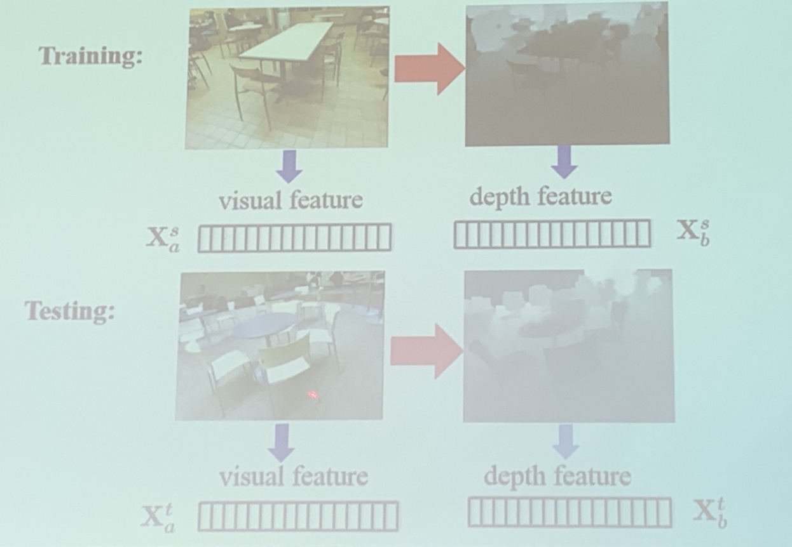

- image to image translation: conditional GAN (pix2pix)

  > for some tasks, we may not actually need the "depth map" for the result (e.g. for classification) and the generated map may be inaccurate, thus we have the following walkaround

  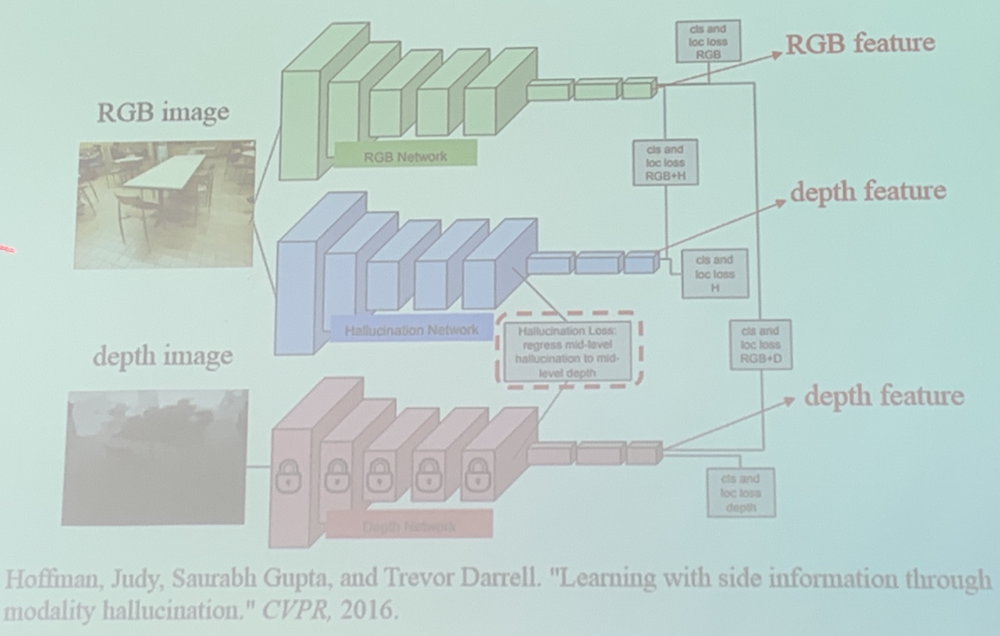

- Hallucination network: learn the mapping from RGB image to **depth feature**

  > first train the depth network, then
  >
  > fix the depth network when training the above feature
  >
  > hallucination loss ~ H-net and D-net should be close

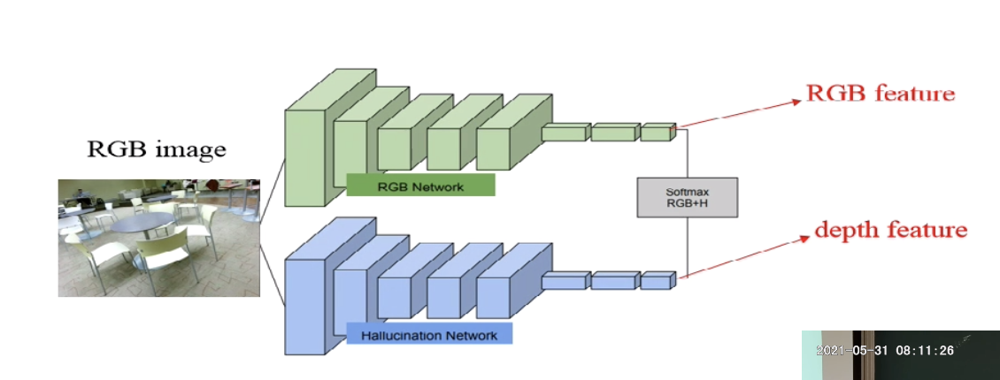

## Use PI to control the  training process

### SVM+

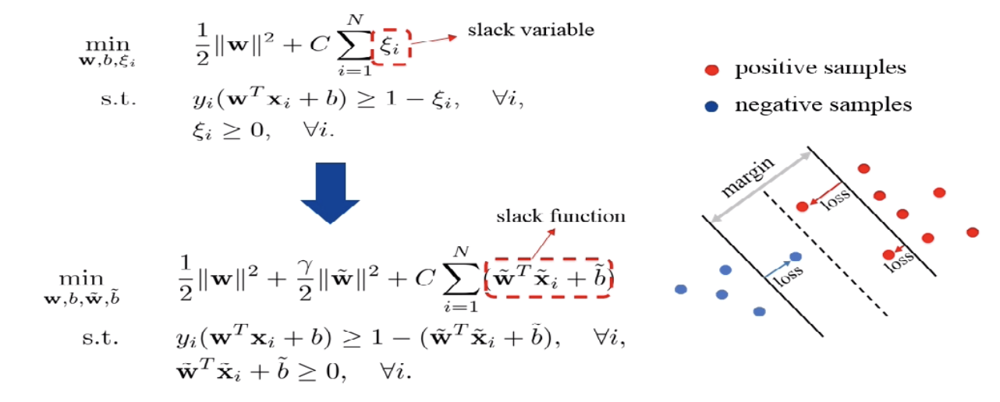

> use priviledged view information to simulate slack variable

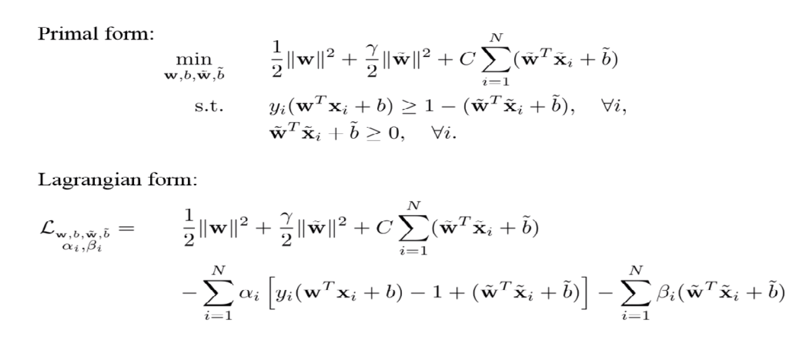

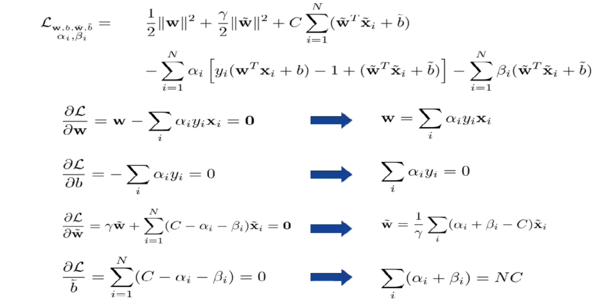

> 期末考试：推导SVM变种的dual form, lagrange

both $w$ and $\tilde{w}$ are linear combination of $X_i$

Some of them used as constraints, while others put into optimizing function

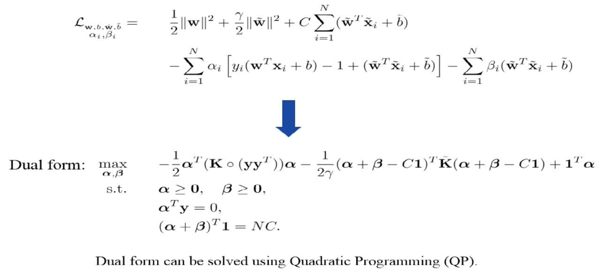

In practice, concatenate $\alpha$ and $\beta$, then optimize QP, feasible

> if joint opt fails, try alternating opt

### What is left

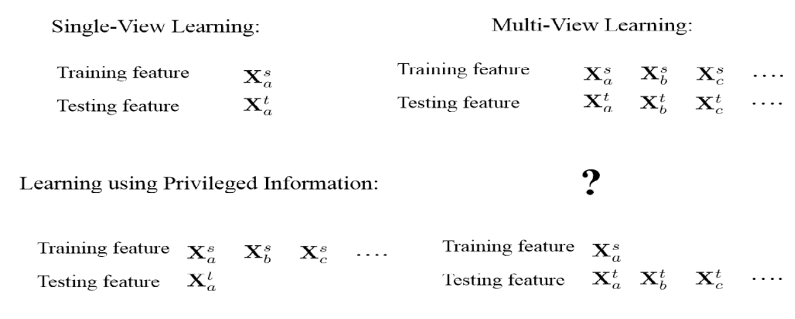

> What if testing feature is more than training feature

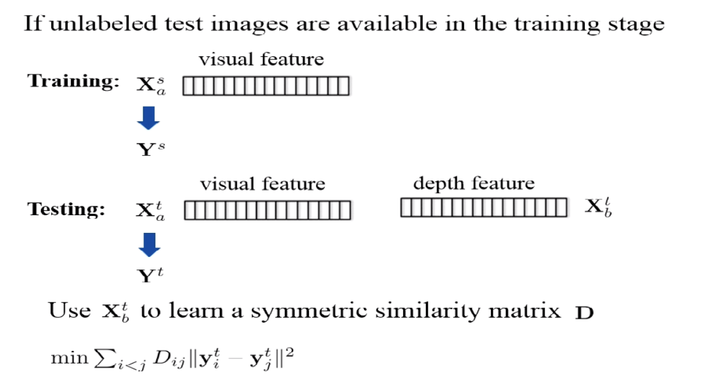

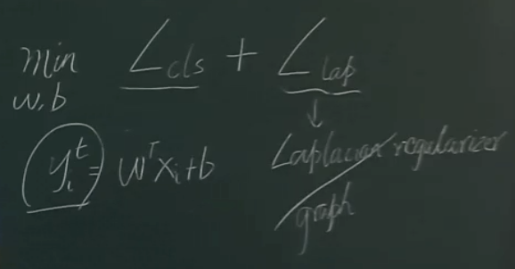

> so that our prediction can be smoother

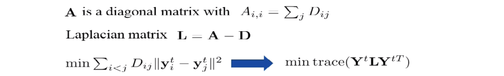

> 期末考试：左推右

