<!-- more -->

What if tags differ? e.g. training has cat/dog, testing has dog/others

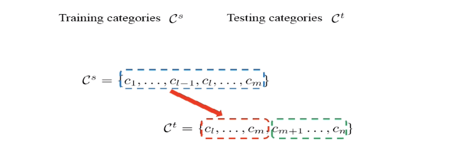

- For extra category in training binary classifiers, won't cause problem
  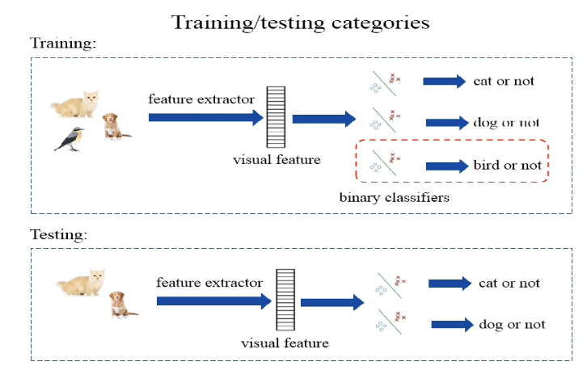

- For extra category in training multi-class classifiers. may cause ambuiguity, but introducing extra classes will help. Still not a problem, as long as testing set is a subset of training set

  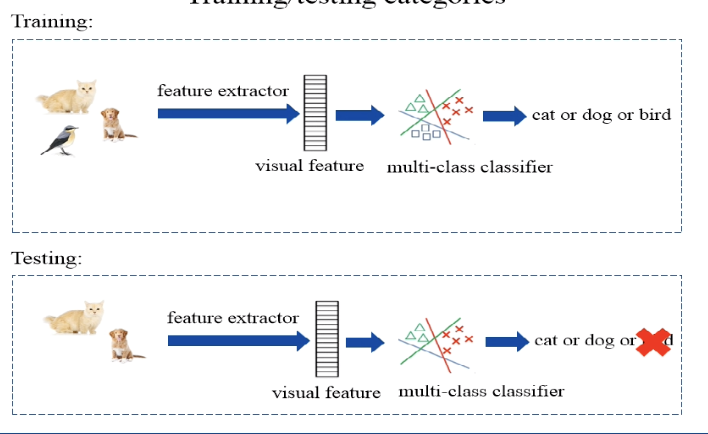

## Zero-shot learning Basics

### Problem

Training/testing(unseen) categories
Training categories $\mathcal{C}^{s}$ Testing categories $\mathcal{C}^{t}$
$$
\begin{array}{l}
\mathcal{C}^{s}=\left\{1,2, \ldots, c_{s}\right\} \\
\mathcal{C}^{t}=\left\{c_{s}+1, c_{s}+2, \ldots, c_{s}+c_{t}\right\}
\end{array}
$$
Training categories and testing categories have no overlap.
In other words, we have zero training samples for testing categories.

### Semantic Space

Use category-level semantic information to bridge the gap between seen categories and unseen categories

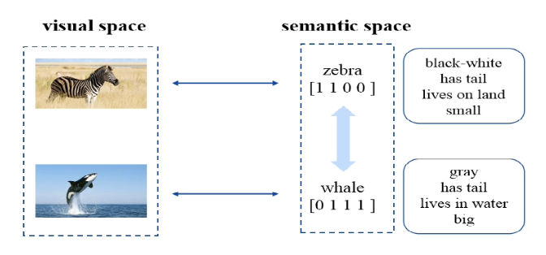

What are category-level semantic informations?

> 种类级别的语义信息

#### Manually annotated attribute vector

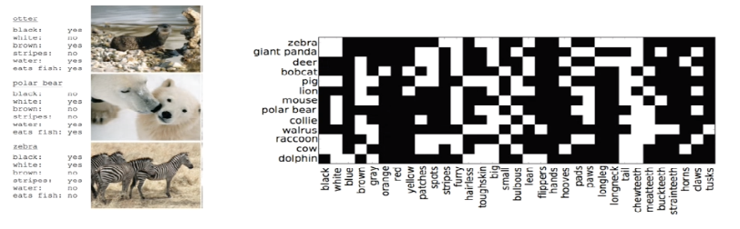

determine and assign different attributes to different categories (e.g. through a binary map)

- **Pros:** accurate and informative
- **Cons**: manual annotation effort

#### Free Category-level information

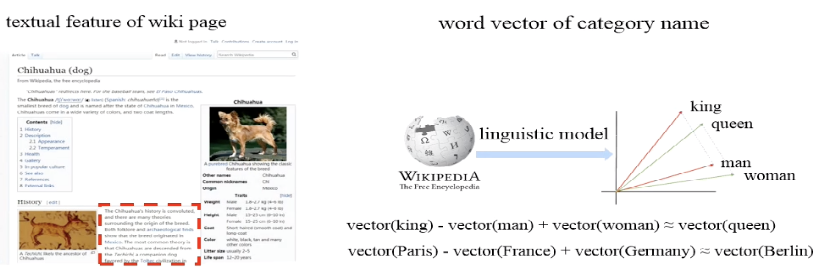

word vector can represent a lot of semantic informations (see example in the figure)

- **Pros** automatic/free
- **Cons** less informative than attributes, and noisy

### Learning Overview

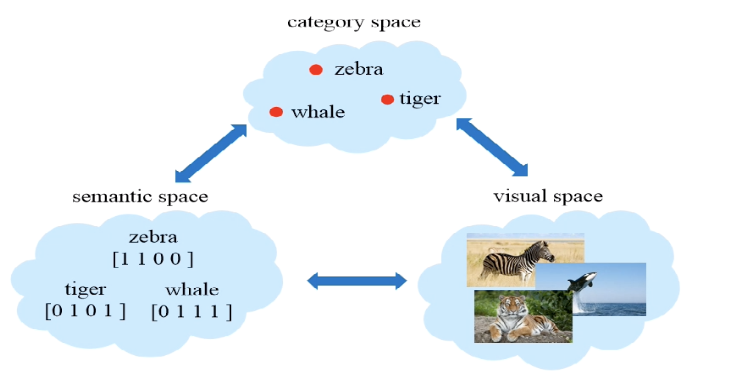

> with three spaces ready, we can explore the link between every two of them，
>
>  we introduce three representative types of them

## Semantic relatedness methods

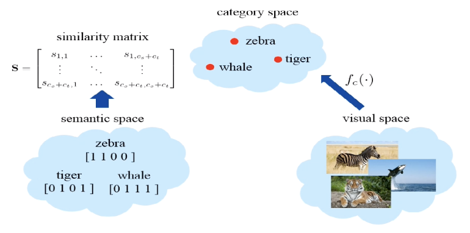
$$
\mathbf{S}=\left[\begin{array}{ccc}
s_{1,1} & \ldots & s_{1, c_{o}+c_{t}} \\
\vdots & \ddots & \vdots \\
s_{c_{*}+c_{t}, 1} & \ldots & s_{c_{s}+c_{t}, c_{x}+c_{t}}
\end{array}\right]
$$
Classifiers for seen categories

> known: $\left\{f_{1}(\cdot), \ldots, f_{c_{s}}(\cdot)\right\}$

Classificrs for unscen catcgorics

> for inference

$$
f_{c_{s}+k}(\cdot)=\sum_{i=1}^{c_{s}}\left(s_{c_{s}+k, i}\right) f_{i}(\cdot)
$$

> weighted mean on similarity matrix
>
> strong assumption: classifier is exactly consistent with the semantic information

## Semantic embedding methods

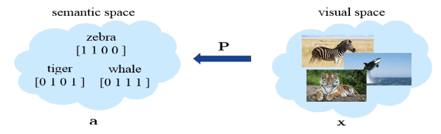

 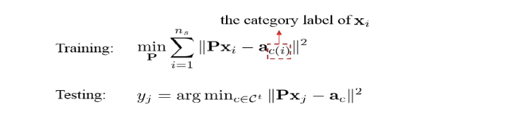

Alternatively, can learn a bi-directional mapping (works like metric learning $\mathbf{M}$)

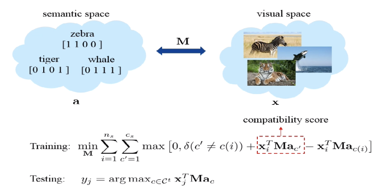

$a_{c(i})$ the ground truth label

expecting $\mathbf{x}_{i}^{T} \mathbf{M} \mathbf{a}_{c(i)}$(compatibility with ground truth) larger at least one unit than others $\mathbf{x}_{i}^{T} \mathbf{M} \mathbf{a}_{c'}$  (compatibility with other labels)

## Synthetic metods

Synthesize training samples for unseen categories and convert to tranditional classification

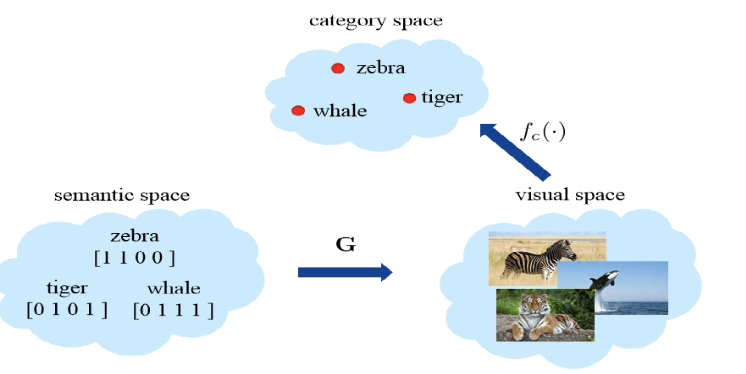

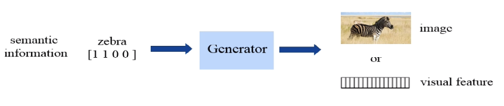

> visual feature may suffice

Generate visual features from semantic information

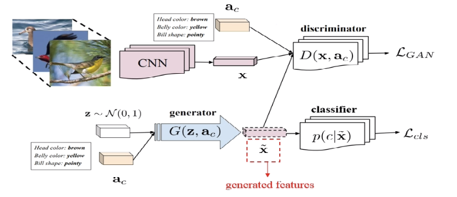

> conditional discriminator: D takes not only x but also $a_C$

## Problems in zero-shot learning

> Common problems for three methods

### Projection domain shift

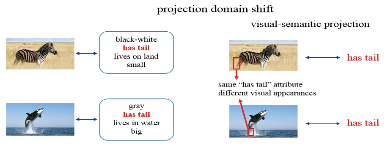

"projection": attribute to visual apperance (visual to semantic)

> there exists gap in projection
>
> In practice, projection may not be adapted from seen category to unseen category
>
> e.g. both categories have tails attribute, but have different semantics. If we learn a projection for zebras, we can't adapt them easily for whales

**Solution**: use unlabeled test samples to **adapt visual semantic projection** to unseen categories

### Hubness Problem

There are a small set of “hub” unseen categories that become the nearest neighbors to the majority of testing samples.

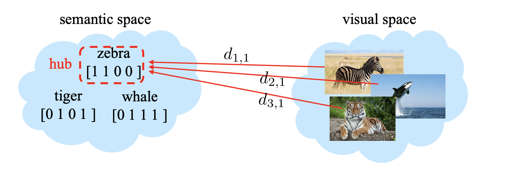

> Also stems from the failure in adapting from seen to unseen categories
>
> $d_{k,c}$ ~ k sample to  c category

**Solution1**: normalize the distance $\tilde{d}_{k c}=\frac{d_{k c}}{\sqrt{\sum_{i} d_{i c}^{2}}}$
$$
\tilde{y}_{k}=\arg \min _{c} \tilde{d}_{k c}
$$

> normalize w.r.t. data and argmin w.r.t. category

**Solution2**: use ranking $\mathrm{ranking}\left(c, \mathbf{x}_{k}\right)=\sum_{i} \delta\left(d_{i c}<d_{k c}\right)$
$$
\tilde{y}_{k}=\arg \min _{c} \mathrm{ranking}\left(c, \mathbf{x}_{k}\right)
$$

> Both methods aims at transforming absolute distance to relative distance

## Generalized Zero-shot Learning

define the problem as

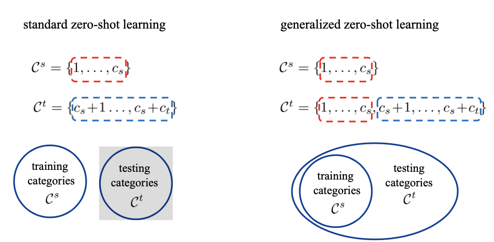

> All three representative methods can fall into generalized zero-shot learning

**Problem**. the prediction of test samples is biased towards seen categories.

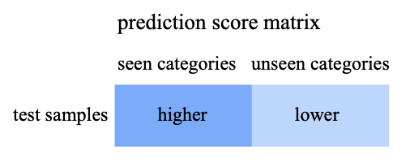

> Despite domain adaptation, since our model is trained by seen categories, it will be biased against seen categories

**Solution**

1. Deduct the prediction scores on seen categories by a constant
2. Hierarchical prediction: first predict whether seen categories or unseen categories, then predict specific category.

### From zero shot learning to zero-shot domain adaptation

- Zero-Shot learning: category attribute vector
- Zero-Shot domain adaptation: domain attribute vector

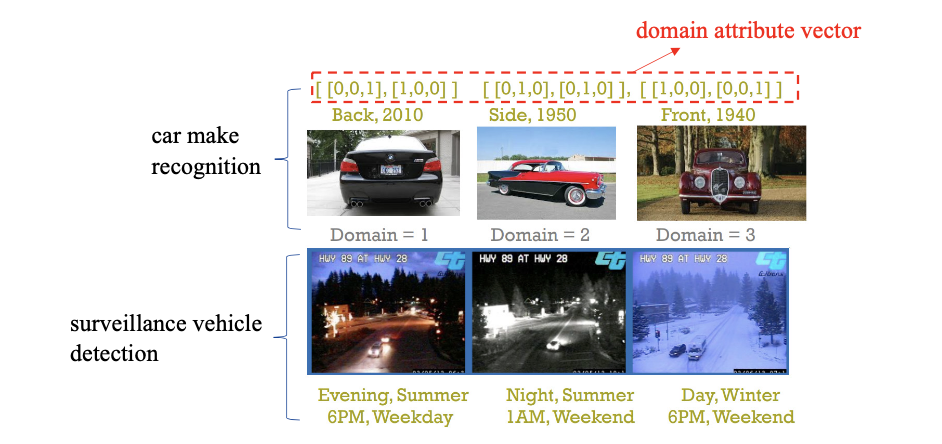

> Use domain attribute vector to encode domain information (e.g. viewpoint, age)
>
> By using the idea in zero-shot learning, we can perform adaptation by taking the domain attribute vector for source/target domains. We can classify the target domain based on weighted classifier from the source domain

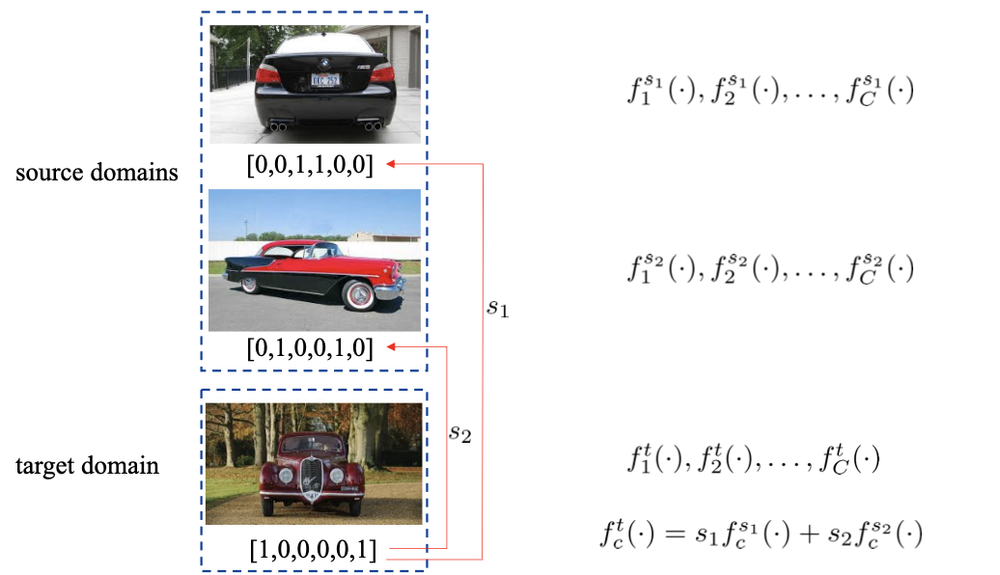

