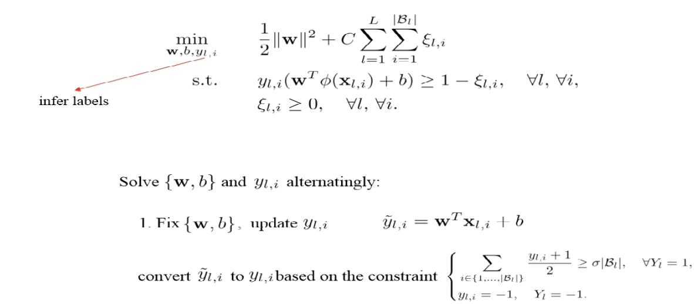

<!-- more -->

## Multi-instance Learning

- weakly supervised learning

- arranged in sets, called bags

- A label is provided for entire bags but not for instances

  

> We don't know $y_{l,i}$ exactly, but are given the constraints about them

> bag sizes can vary
>
> positive samples ~ can open the door, negative samples ~ cannot, concept ~ can open or not?

> sometimes classify based on bags, sometimes wrt instances

### Relaxed MIL

> The above restrition too strict

The standard MIL assumption is too restrictive. MIL can be **relaxed** as:
- A bag is positive when it contains a sufficient number of positive instances.

  > can control the definition through $\sigma_p,\sigma_n$
  >
  > reduced standard MIL when $\sigma_p = \frac{1}{|\mathcal{B}_l|}$, $\sigma_n = 0$

- A bag is negative when it contains a certain number of negative instances.

- Positive and negative bags differ by their positive/negative distributions.

$$
\left\{\begin{array}{l}
\sum_{i \in\left\{1, \ldots,\left|\mathcal{B}_{l}\right|\right\}} \frac{y_{l, i}+1}{2} \geq \sigma_{p}\left|\mathcal{B}_{l}\right|, \quad \forall Y_{l}=1 \\
\sum_{i \in\left\{1, \ldots,\left|\mathcal{B}_{l}\right|\right\}} \frac{y_{l, i}+1}{2} \leq \sigma_{n}\left|\mathcal{B}_{l}\right|, \quad \forall Y_{l}=-1
\end{array}\right.
$$

## MIL Applications

### Image Classification

> What if we are given non-labeled data, common practice: crawl images, but the search engine may not fit(20% error, for instance), so we mark related instances as positive bags, and make negative bags through unrelated querys

### Objective Localization in Image

> If we know in advance that the object is in the image, then there must exists a few positive bags (of proposals) that contains the objective

- **Objective**
- **Bags**
- **Instances**
- **Jusitifaction**

### Medical Image Diagnosis

- **Objective**: predict if a subject is diseased or healthy

- **Bags**: Collection segments or patches extracted from a medical image

  > Only given the whole image's label
  >
  > For healthy patients, all negative bags
  >
  > For diseased patients, at least one negative instance in the bag

- **Instances**: Image segments or patches

- **Jusitifaction**: A large quantity of images can be used to train. Only a diagnosis is required per image. Expert local annotation are no longer required

### Text Sentiment Analysis

> Only know paragraph labels, we can predict for segments by MIL

## Methods

### Bag-level Method

#### Problem Definition

Group training samples into bags and make assumptions on each bag.

(if the problem naturally consists of bags, then no need)

assumption on each bag: $\left\{\begin{array}{l}\sum_{i \in\left\{1, \ldots,\left|\mathcal{B}_{l}\right|\right\}} \frac{y_{l, i}+1}{2} \geq{\sigma}\left|\mathcal{B}_{l}\right|, \quad \forall Y_{l}=1, \\ y_{l, i}=-1, \quad Y_{l}=-1\end{array}\right.$

> $\sigma$ is a prior parameter (e.g. by statistics)

#### Method

Embed the content of bags in a single feature vector, thus transforming the problem into supervised learning

**Pros**.

- Can model distributions and relation between instances

  > by construting extra feature vectors
  
- Deal with unclassifiable instances

- Can be faster than instance-based

- often more accurate for bag classifiaction tasks

**Cons.**

- Cannot be directly used for Instance level

#### SVM->sparse MIL

> Compared with SVM, $z_l$ is the bag level feature (can be various, e.g. averaged bag feature), $\rho$ is **determined by positive ratio** ($\sigma$ ~ positive instance margin, $-(1-\sigma)$ negative instance margin )

### Instance-level Method

uncover the true nature of each instance in order to make a decision on bag levels

**Pros.**

- Can be directly used for instance classification takss

**Cons.**

- Do not work when instances have no precise classes
- Usually less accurate than bag space methods

#### Mi-SVM

> Also optimize $y_{l,i}$, the label of each instance
>
> No difference with standard SVM, except that the label should also be inferred

> How to make use of the bag label?
>
> based on the constraint, $\tilde{y_{l,i}} \in [0,1] \Rightarrow y_{l,i} \in \{0,1\}$

Then , fix $y_{l,i}$, update $w, b$, solve standard SVM

### Deep Multi-instance Learning Method

> treat each image as instance, and group them together as a bag, learn the weights

> Assign each pixel with a weight, learn spatial attention for each input image (localize the object), cdot the feature map => aggregate the bag
>
> not only image, but can also determine each pixel(instance) as positive/negative

