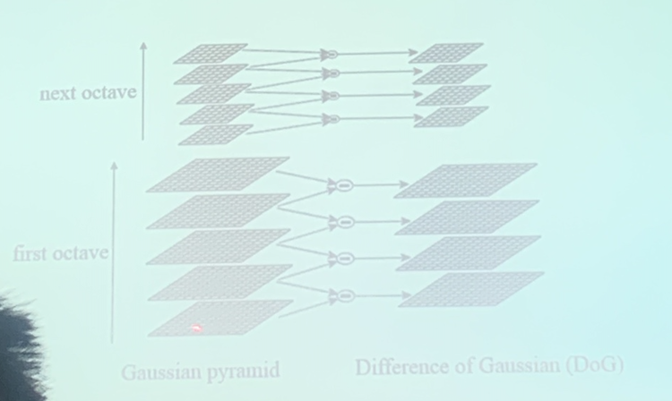
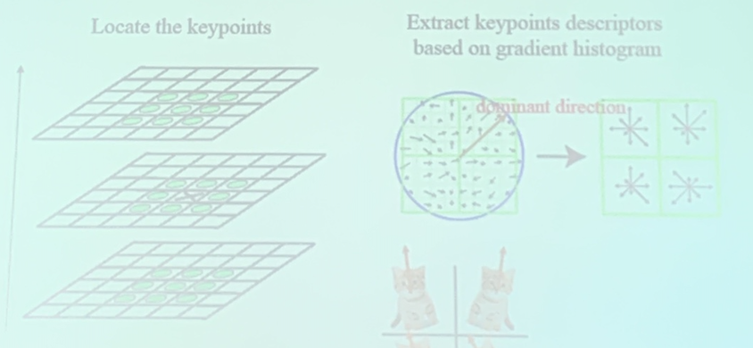

<!-- more -->

We need to first convert non-structured data (e.g. image) into structured data (e.g. pixel-represented matrix intrinsic for image) so that we can get information (perform tasks) through **models**.

::: tip
**Traditional Machine Learning v.s. Deep Learning**

- Input -> Feature Extraction -> Classification -> Output
  - **hand-craft** feature, not end-to-end
  - in machine learning contexts, feature extraction matters more than classification, but feature extraction is ill-founded
  - before deep learning, feature extraction was devoted to contests while classification was given more academic emphasis
- Input -> Feature Extraction + Classification -> Output
  - **learnable** feature, end-to-end
  - **the component crafted by human is more abstract and advanced**
  - bridging the gap between industry and theory
:::

::: tip
Different Modalities(模态) have different types of features
:::

::: details Examples

- For Images
  - SIFT/SURF/GIST/...
  - edge/turning-point information is the main focus
- For text
  - TF-IDT (key word frequency, normalization)
  - LSA/Topic model (find topic of texts)
- For sound
  - MFCC

:::

## Feature

::: tip
Features are (**Task-defined**) key information
:::

The naive feature is **redundant** and **noisy**

We need to design a feature extractor.

::: tip
Feature should be robust with scale, rotation, etc *(factors that should be unrelated to tasks)*
:::

How to extract robust features?

1. **Data Augmentation**
   
   e.g. enlarged training set, from the data's perspective

   > deep learning is exploring this topic from the model's perspective
2. **Scale-invariance** and **Rotation-invariance**
   
   e.g. SIFT
   
   

   repeatedly apply Gaussian blur to drop detail information, use difference to obtain the dropped information (under different scales, i.p. blurring status).

   > DoG can reflect the margins of different regions

   Then we can find key-points from **Difference of Gaussian(DoG)** (w.r.t. local extremes). Around the key-points, we can extract their **local descriptors**

   
   
   Quantify gradients into several directions, find the dominant direction

