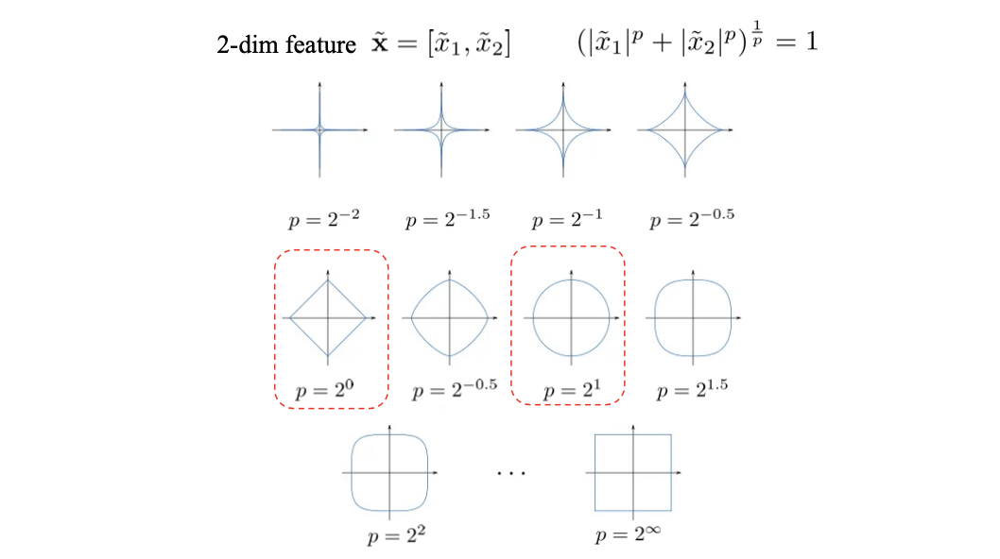
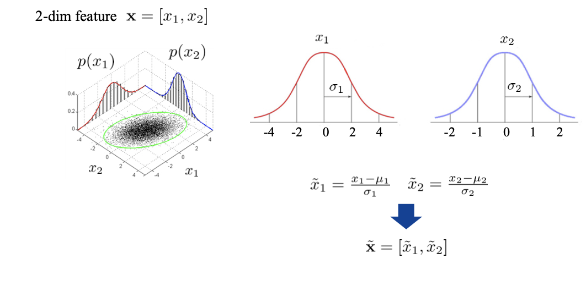
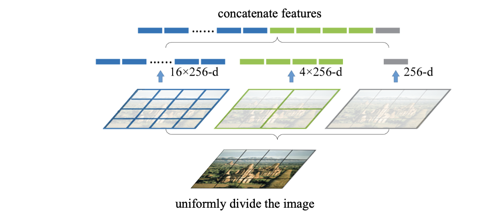

<!-- more -->


We need to first convert non-structured data (e.g. image) into structured data (e.g. pixel-represented matrix intrinsic for image) so that we can get information (perform tasks) through **models**.

::: tip
**Traditional Machine Learning v.s. Deep Learning**

- Input -> Feature Extraction -> Classification -> Output
  - **hand-craft** feature, not end-to-end
  - in machine learning contexts, feature extraction matters more than classification, but feature extraction is ill-founded
  - before deep learning, feature extraction was devoted to contests while classification was given more academic emphasis
- Input -> Feature Extraction + Classification -> Output
  - **learnable** feature, end-to-end
  - **the component crafted by human is more abstract and advanced**
  - bridging the gap between industry and theory
:::

::: tip
Different Modalities(模态) have different types of features
:::

::: details Examples

- For Images
  - SIFT/SURF/GIST/...
  - edge/turning-point information is the main focus
- For text
  - TF-IDT (key word frequency, normalization)
  - LSA/Topic model (find topic of texts)
- For sound
  - MFCC


| Modalities      |  Spatial     |  Temporal     |
|  ---  |  ---  |  ---  |
|  Image     |    Y   |       |
|  Vedio     |   Y    |  Y     |
|  Sound     |       |    Y   |
|  Text     |       |    Y   |


:::


## Feature

::: tip
Features are (**Task-defined**) key information
:::

The naive feature is **redundant** and **noisy**

We need to design a feature extractor.

::: tip
Feature should be robust with scale, rotation, etc *(factors that should be unrelated to tasks)*
:::

How to extract robust features?

1. **Data Augmentation**
   
   e.g. enlarged training set, from the data's perspective

   > deep learning is exploring this topic from the model's perspective
2. **Scale-invariance** and **Rotation-invariance**
   
   e.g. SIFT
   
   

   repeatedly apply Gaussian blur to drop detail information, use difference to obtain the dropped information (under different scales, i.p. blurring status).

   > DoG can reflect the margins of different regions

   Then we can find key-points from **Difference of Gaussian(DoG)** (w.r.t. local extremes). Around the key-points, we can extract their **local descriptors**

   
   
   Quantify gradients into several directions, find the dominant direction

> SIFT descriptor is designed to be scale-invariant, the phase 2 is added to make (normalize) the feature to rotation-invariant

> Now we replace these complex features with neural networks

> Whether the convolution layer is robust to scale/rotation is still not settled

## Post-processing on Features

> For traditional machine learning, feature extraction and classifier are two separate phases. Therefore, post processing on features is necessary

### Lp Normalization

- Feature norm is the distance between $\mathbf{x}=\left[x_{1}, x_{2}, \ldots, x_{n}\right]$ and $\mathbf{0}$
- $L p$ norm: $\quad\left(\sum_{i}\left|x_{i}\right|^{p}\right)^{\frac{1}{p}}$
- $L p$ normalization: $\tilde{\mathbf{x}}=\frac{\mathbf{x}}{\left(\sum_{i}\left|x_{i}\right|^{p}\right)^{\frac{1}{p}}}$
- After $L p$ normalization, $L p$ norm of $\tilde{\mathbf{x}}$ is 1

::: tip

$L_0$-norm : the number of non-zero elements

$L_{\infty}$-norm: the maximal absolute value of entries

e.g. $\mathbf{x}=[1,0,-1,-2,3]$ has $L_0$norm 4, $L_\infty$norm 3

:::

> Any 2-dim features will fall onto the line after normalization
> 
> 

### Z-score Normalization

Different feature entries may vary a lot in range, we should **normalize the different dimensions into one unified distribution**.

Here, we assume Gaussian distribution of $x_1$ and $x_2$, with distinct mean and variance.




### Spatial Pyramid


SIFT features (with simply pooling the keypoint descriptors) will **lose spatial information**.

In deep learning features, global avearge pooling at the last layer will also lose spatial information. (Exchanging quarters will result in same pooling result)

**Spatial Pyramid** can maintain spatial features of the input.



> E.g. combine SIFT with spatial pyramids,
> 
> Take the average of feature vectors (256 dims) of all the keypoints in the area as spatial feature.
> 
> For level 1, $[\frac{1}{2}(x_1+x_2)]$, 256 dim
> 
> For level 2, $[0,x_1,x_2,0]$, 4*256 dim


Another solution, **sliding window**, where divisions can overlap.

**Trade-off**, the **more information** is maintained, the **larger the feature** size


For other modalities, we can make a **Spatial-Temporal Pyramid/Temporal Pyramid** to cut the input into "cubes".


### Position Embedding

**Feature** = $[\mathbf{z},x,y]$, where $\mathbf{z}$ is the feature vector of the pixel at $[x,y]$

Use a position encoding, such as triangle functions to represent $[x,y]$ as a vector

Alternatively, maintain a **Learnable Dictionary** while training, mapping from $[x_i,y_i]$ to a vector $\mathbf{d}$. (learn a position encoding), then the feature will be $[\mathbf{d},\mathbf{z}]$ for every pixel

> The embedding can be designed w.r.t. absolute/relative positions


### Sequential Model

e.g. Markov, HMM, ..., 

An internal order of input exists in the model.

```
        ┌──┐   ┌──┐  ┌───┐  ┌───┐
init  ──►  ├───►  ├──►   ├──►   ├──► feature
        └──┘   └──┘  └───┘  └───┘
         ▲       ▲      ▲     ▲
         │       │      │     │
         v1      v2     v3    v4
```
