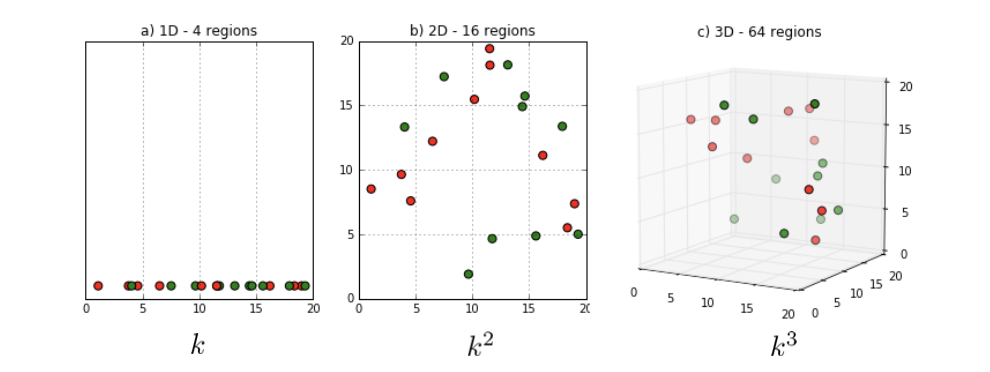

<!-- more -->

“Curse of dimensionality” was first used by R. Bellman in the introduction of his book “Dynamic programming” in 1957

## Curse of Dimensionality

1. storage cost and time cost
2. Require more training samples to fill in the space
   > Assume every dimension has k regions, then at least $k^n$ samples are required to cover all the space
   >
   > 
   >
   > In practice, only critical space regions will be covered
3. From another perspective, feature dimension represents model complexity.

### Overfitting and Underfitting   
High model complexity, few training samples - **overfitting** 
> the model fit the samples too much, can only fit training set but not testing set
- We see that the model fit the training set well, but bad at testing set

Low model complexity, abundant training samples - **underfitting**
> the model is intrinsically unable (a not very expressive model) to fit so many samples
- We see that the model is unable to fit the training set

| Under-fitting  | Overfitting |
| -------------  | ----------- |
|  |  |
| a simple model, linear, but unfer fitting for abundant traning samples | a powerful model, but unable to discriminate between boundaries due to few samples,  |

With fixed number of training samples, **high dimension can easily cause overfitting**.

> A similar figure can be obtained when 
> - fixed training sample numbers and dimensions, the performance is evaluated w.r.t. the training time.
>   - which leads to a training strategy - **early stopping**
> - fixed feature dimensions, the performance is evaluated w.r.t. how "small" the number of samples are 

### Volume near surface

For a high-dimensional object, most of its volume is near the surface.

Given a $d$-dim volume, shrink this volume by a small amount $\epsilon$

$$
\lim _{d \rightarrow \infty} \frac{V_{d}(1-\epsilon)}{V_{d}(1)}=\lim _{d \rightarrow \infty}(1-\epsilon)^{d}=0
$$

::: tip

The larger the dimension, the less weight of the core w.r.t. the whole volume

:::

In another word, to capture a fraction s of the volume, you need the edge length (半径) to be:

$$s=r^d\rightarrow r=s^{1/d}$$

### Mean Square Distance

$\mathbf{x}, \mathbf{y}$ are two independent variables, with uniform distribution on $[0,1]^{d}$. The mean square distance $\|\mathbf{x}-\mathbf{y}\|^{2}$ satisfies $\mathbb{E}\left[\|\mathbf{x}-\mathbf{y}\|^{2}\right]=\sqrt{\frac{d}{6}}$

> which is consistent of our observation of "volume near surface"

> Bad news for classification task, despite large distance, but many still aggregate

- Distances to near and to far neighbors become more and more similar with increasing dimensionality. Therefore, distance metric starts losing their effectiveness to measure dissimilarity in high-dim space.
- Since classifiers depend on these distance metrics, it is more difficult to learn a good classifier.

> KNN will fail for extreme number of dimensions, since the distance between A and other points will become very large and more undiscriminable

## Solution to Curse of Dimensionality

1. Sample enough training data
2. Reduce feature dimensionality