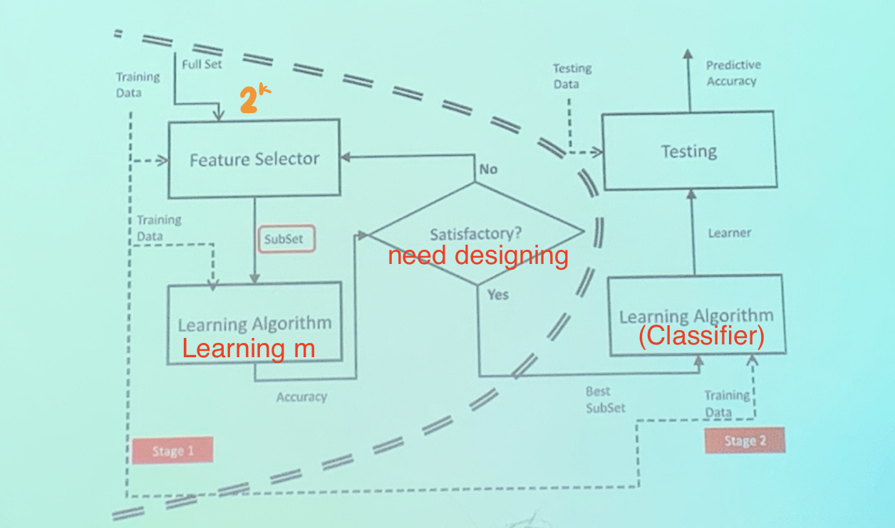
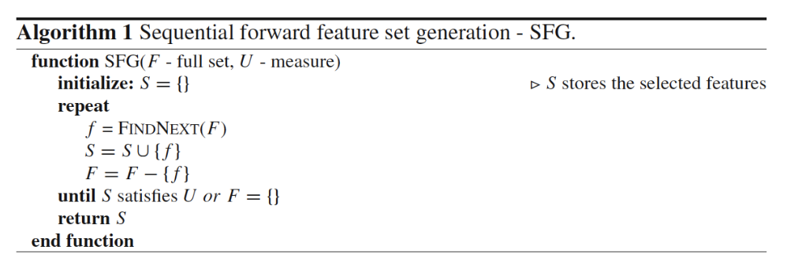
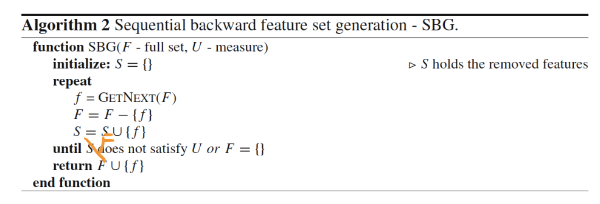
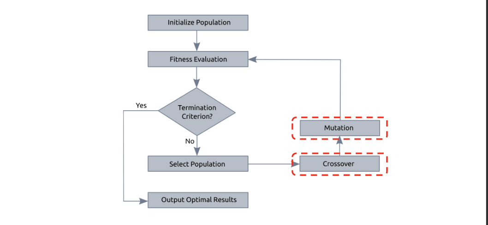
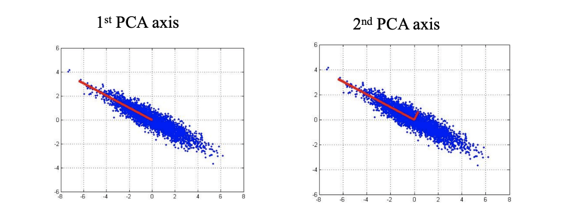
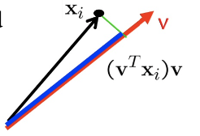

Motivation
1. Reduce time and space complexity
2. Remove redundant and noisy information
3. Bypass the curse of dimensionality

<!-- more -->

- Feature Selection $f' = m\circ f$
  > Choosing some dimensions from $f$, a special case of Feature Projection
- Feature Projection $f' = Pf$
- Feature Learning $f' = \min_{f'}L(f,f')$
  > The difference between projection and learning is that
  > - Feature projection is minimizing $P$ for $L(f,P)$, and we obtain $f'$ by $Pf$ 
  > - Feature learning is minimizing $f'$ for $L(f,f')$, and we obtain $f'$ directly

## Feature Selection

$f' = m \circ f$, where mask is a binary $m = [1,0,0,...,1]$. Choosing $m$ becomes an optimizing problem. for $k$-dim, $2^k$ searching space for $m$.

### Forward Selection

repeatedly use `FINDNEXT(F)` to add a new feature to the subset `S` and remove a feature from full set `F`, until `S` satisfies the measure or `F` is empty.

> With more features added, the performance of the classifier is expected to grow, until `F` reaches the standard

### Backward Selection

repeatedly use `FINDNEXT(F)` to remove a new feature from `F`, until `F` **does not satisfy** the measure or `F` is empty, 

### Genetic Algorithm

## Feature Projection

1. Linear Projection $f' = Pf$
   - Principle Component Analysis (PCA)
   - Linear Discriminative Analysis (LDA)
   > Though effective, not expressive enough

2. Nonlinear Projection $f' = p(f)$
   - Kernel PCA 
   - Auto-encoder

### Principle Component Analysis (PCA)

> What is Principle Component?
> 
> 

**Two Interpretations of PCA**
1. **Maximum variance direction**, when X is **decentralized**, we want to find a projection to maximize the variance of every sample vector (so that abundant information can be retained)
   > decentralize: let the mean of every dimension to be 0, apply $x_{ij} -\bar{x_i}$ to every entry,
   > 
   > after decentralization, the mean is still zero
$$
\max \frac{1}{n} \sum_{i=1}^{n}\left(\mathbf{v}^{T} \mathbf{x}_{i}\right)^{2}=\frac{1}{n} \mathbf{v}^{T} \mathbf{X} \mathbf{X}^{T} \mathbf{v}
$$

2. **Minimum Reconstruction Error**, 
   > The green line below is the reconstruction error
   >
   > 
$$
\min \frac{1}{n} \sum_{i=1}^{n}\left\|\mathbf{x}_{i}-\left(\mathbf{v}^{T} \mathbf{x}_{i}\right) \mathbf{v}\right\|^{2}
$$

**Solution to PCA**.

$$
\begin{array}{cl}
\frac{1}{n} \sum_{i=1}^{n}\left(\mathbf{v}^{T} \mathbf{x}_{i}\right)^{2} & =\frac{1}{n} \mathbf{v}^{T} \mathbf{X} \mathbf{X}^{T} \mathbf{v} \\
\max _{\mathbf{v}} & \mathbf{v}^{T} \mathbf{X} \mathbf{X}^{T} \mathbf{v} \\
\text { s.t. } & \mathbf{v}^{T} \mathbf{v}=1
\end{array}
$$

Lagrangian form, 
$$
\mathcal{L}_{\mathbf{v}}=\mathbf{v}^{T} \mathbf{X} \mathbf{X}^{T} \mathbf{v}+\lambda\left(1-\mathbf{v}^{T} \mathbf{v}\right) \quad (\lambda \ge 0)
$$

$$
\begin{array}{c}
\frac{\partial \mathcal{L}_{\mathrm{v}}}{\partial \mathbf{v}}=\mathbf{X X}^{T} \mathbf{v}-\lambda \mathbf{v}=\mathbf{0} \\
\mathbf{X X}^{T} \mathbf{v}=\lambda \mathbf{v}
\end{array}
$$