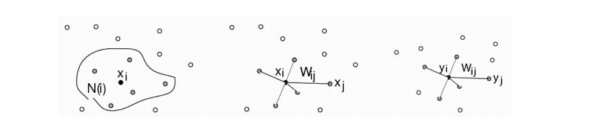
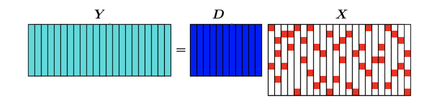

Motivation
1. Reduce time and space complexity
2. Remove redundant and noisy information
3. Bypass the curse of dimensionality

<!-- more -->

- Feature Selection $f' = m\circ f$
  > Choosing some dimensions from $f$, a special case of Feature Projection
- Feature Projection $f' = Pf$
- Feature Learning $f' = \min_{f'}L(f,f')$
  > The difference between projection and learning is that
  > - Feature projection is minimizing $P$ for $L(f,P)$, and we obtain $f'$ by $Pf$ 
  > - Feature learning is minimizing $f'$ for $L(f,f')$, and we obtain $f'$ directly

## Feature Selection

$f' = m \circ f$, where mask is a binary $m = [1,0,0,...,1]$. Choosing $m$ becomes an optimizing problem. for $k$-dim, $2^k$ searching space for $m$.

### Forward Selection

repeatedly use `FINDNEXT(F)` to add a new feature to the subset `S` and remove a feature from full set `F`, until `S` satisfies the measure or `F` is empty.

> With more features added, the performance of the classifier is expected to grow, until `F` reaches the standard

### Backward Selection

repeatedly use `FINDNEXT(F)` to remove a new feature from `F`, until `F` **does not satisfy** the measure or `F` is empty, 

### Genetic Algorithm

## Feature Projection

1. Linear Projection $f' = Pf$
   - Principle Component Analysis (PCA)
   - Linear Discriminative Analysis (LDA)
   > Though effective, not expressive enough

2. Nonlinear Projection $f' = p(f)$
   > $p$ can be non-linear
   - Kernel PCA 
   - Auto-encoder

### Principle Component Analysis (PCA)

> What is Principle Component?
> 
> 

**Two Interpretations of PCA**
1. **Maximum variance direction**, when X is **decentralized**, we want to find a projection to maximize the variance of every sample vector (so that abundant information can be retained)
   > decentralize: let the mean of every dimension to be 0, apply $x_{ij} -\bar{x_i}$ to every entry,
   > 
   > after decentralization, the mean is still zero
$$
\max \frac{1}{n} \sum_{i=1}^{n}\left(\mathbf{v}^{T} \mathbf{x}_{i}\right)^{2}=\frac{1}{n} \mathbf{v}^{T} \mathbf{X} \mathbf{X}^{T} \mathbf{v}
$$

2. **Minimum Reconstruction Error**, 
   > The green line below is the reconstruction error
   >
   > 
$$
\min \frac{1}{n} \sum_{i=1}^{n}\left\|\mathbf{x}_{i}-\left(\mathbf{v}^{T} \mathbf{x}_{i}\right) \mathbf{v}\right\|^{2}
$$

**Solution to PCA**.

$$
\begin{array}{cl}
\frac{1}{n} \sum_{i=1}^{n}\left(\mathbf{v}^{T} \mathbf{x}_{i}\right)^{2} & =\frac{1}{n} \mathbf{v}^{T} \mathbf{X} \mathbf{X}^{T} \mathbf{v} \\
\max _{\mathbf{v}} & \mathbf{v}^{T} \mathbf{X} \mathbf{X}^{T} \mathbf{v} \\
\text { s.t. } & \mathbf{v}^{T} \mathbf{v}=1
\end{array}
$$

Lagrangian form, 
$$
\mathcal{L}_{\mathbf{v}}=\mathbf{v}^{T} \mathbf{X} \mathbf{X}^{T} \mathbf{v}+\lambda\left(1-\mathbf{v}^{T} \mathbf{v}\right) \quad (\lambda \ge 0)
$$

$$
\begin{array}{c}
\frac{\partial \mathcal{L}_{\mathrm{v}}}{\partial \mathbf{v}}=\mathbf{X X}^{T} \mathbf{v}-\lambda \mathbf{v}=\mathbf{0} \\
\mathbf{X X}^{T} \mathbf{v}=\lambda \mathbf{v}
\end{array}
$$

> Treat $XX^T$ as a whole and decompose it to get its eigen value and their corresponding eigen vectors. We choose the first $d$ largest eigen values, then the reduced feature will be
> $$\bar{x_i} = [v_1^Tx_i, v_2^Tx_i, \ldots, v_d^Tx_i,] $$
> where $x_i$ and $v_i$ are both k-dim.

### Kernel PCA

$$
\begin{array}{l}
\phi(\mathbf{X})=\left[\phi\left(\mathbf{x}_{1}\right), \phi\left(\mathbf{x}_{2}\right), \ldots, \phi\left(\mathbf{x}_{n}\right)\right] \\
\mathbf{v}=\phi(\mathbf{X}) \mathbf{\alpha}
\end{array}
$$

> Idea, first use the kernel to transform the features, then we perform PCA on the kernel matrix.

$$
\begin{aligned}
& \mathbf{X X}^{T} \mathbf{v}=\lambda \mathbf{v} \\
\Longrightarrow & \phi(\mathbf{X}) \phi(\mathbf{X})^{T} \phi(\mathbf{X}) \mathbf{\alpha}=\lambda \phi(\mathbf{X}) \mathbf{\alpha} \\
\Longrightarrow & \phi(\mathbf{X})^{T} \phi(\mathbf{X}) \phi(\mathbf{X})^{T} \phi(\mathbf{X}) \mathbf{\alpha}=\lambda \phi(\mathbf{X})^{T} \phi(\mathbf{X}) \mathbf{\alpha} \\
\Longrightarrow & \mathbf{K K} \mathbf{\alpha}=\lambda \mathbf{K} \mathbf{\alpha} \\
\Longrightarrow & \mathbf{K} \mathbf{\alpha}=\lambda \mathbf{\alpha}
\end{aligned}
$$

### Linear Discriminative Analysis (LDA)

LDA as a classification method. LDA as a (**supervised**) dimensionality reduction method.

Find the projection so that 
- different categories of data can be discriminated AMAP.
  - $\max\left(\mathbf{v}^{T} \mathbf{\mu}_{1}-\mathbf{v}^{T} \mathbf{\mu}_{2}\right)^{2}$
- same category of data can be aggregated AMAP.
  - $\min \mathbf{\sigma'}_{1}^{2}+\mathbf{\sigma'}_{2}^{2}$

$$
\begin{aligned}
J(\mathbf{v}) &=\frac{\left(\mathbf{v}^{T} \mathbf{\mu}_{1}-\mathbf{v}^{T} \mathbf{\mu}_{2}\right)^{2}}{\mathbf{\sigma}_{1}^{2}+\mathbf{\sigma}_{2}^{2}} \\
&=\frac{\left(\mathbf{v}^{T} \mathbf{\mu}_{1}-\mathbf{v}^{T} \mathbf{\mu}_{2}\right)^{2}}{\sum_{i=1}^{C_{1}}\left(\mathbf{v}^{T} \mathbf{x}_{1, i}-\mathbf{v}^{T} \mathbf{\mu}_{1}\right)^{2}+\sum_{i=1}^{C_{2}}\left(\mathbf{v}^{T} \mathbf{x}_{2, i}-\mathbf{v}^{T} \mathbf{\mu}_{2}\right)^{2}}
\end{aligned}
$$

> column vector * column vector = matrix, 1 & 2 here is just a mark of group

### Auto-encoder

First project the features into the bottleneck, then reconstruct from bottleneck.

Given data, parameters of auto-encoder can be learned.

> Note. combination of linear encoders are still a layer of linear encoder.

### Variational Auto-encoder

> For most feature projection applications, auto-encoder can suffice, though

> a probability version of auto-encoder

The encoded feature is presented in a probabilistic way, usally assuming Gaussian Distribution. The output of encoder/decoder is not a value, but a probability distribution.

> The sampling process is $z = \mu_z + \epsilon \delta_{z}$, $\epsilon \in [0,1]$
> - $p(z)$ is usually designed to be a simple distribution e.g. $N(0,1)$
> 
> Reconstruction is based on $\mu_x,\delta_x,x^i$, 
> - we want the input x to fit the decoded curve AMAP, so $\max \log p_{\theta_1}(x_i|z_i)$

## Feature Learning

The optimization goal is the reduced feature itself.

### Stochastic Neighborhood Embedding (SNE)

Obtain $\tilde{\mathbf{x}}$ from $\mathbf{x}: \mathbf{x} \rightarrow \tilde{\mathbf{x}},$ maintain the relative distance.

> Here, $p(i|j)$ is just designed to be a measure of similarity between samples

$$
\begin{array}{l}
p(j \mid i)=\frac{\exp \left(-\left\|\mathbf{x}_{i}-\mathbf{x}_{j}\right\|^{2}\right)}{\sum_{k \neq i} \exp \left(-\left\|\mathbf{x}_{i}-\mathbf{x}_{k}\right\|^{2}\right)} \\
q(j \mid i)=\frac{\exp \left(-\left\|\tilde{\mathbf{x}}_{i}-\tilde{\mathbf{x}}_{j}\right\|^{2}\right)}{\sum_{k \neq i} \exp \left(-\left\|\tilde{\mathbf{x}}_{i}-\tilde{\mathbf{x}}_{k}\right\|^{2}\right)} \\
p(j \mid i) \text{ should be close to } q(j \mid i)
\end{array}
$$
$$
L=\sum_{i} K L\left(P_{i} \| Q_{i}\right)=\sum_{i} \sum_{j} p(j \mid i) \log \frac{p(j \mid i)}{q(j \mid i)}
$$

> Here $P_i$ is shorthand for $[p(1|i),p(2|i),\ldots,p(N|i)]$

Note, in the $L$ above, only $\tilde{x},\tilde{y}$ are unknown. The optimizaiton result is the reduced feature directly

### SNE with t-distribution (t-SNE)

t-SNE: SNE with t-distribution, replace Gaussian distribution with t-distribution (degree of freedom is 1)

> Robust to outliers

> Why replace?
> 
> If we want to contain the outliers, we should use the thin tail, otherwise heavy tail should be preferred

> Application: Data Visualization
> 
> 

### Local Linear Embedding (LLE)

We want $x_i$ to be a linear combination of its neighbors. 

> Note $x_i - \sum w_{ij} x_j$ is just another representation of similarity
>
> Similar to the idea in SNE, except that SNE wants $p(j|i)$ to remains the same.
> ,while LLE expects $w_{ij}$ remains the same

First, solve $W$

$$
\begin{array}{ll}
\min _{\mathbf{W}} & \left\|\mathbf{x}_{i}-\sum_{j \in N(i)} w_{i j} \mathbf{x}_{j}\right\|^{2} \\
\text { s.t. } & \sum_j w_{i j}=1
\end{array}
$$

Then, use the $W$ above and optimize $Y$ to maintain local relationship

$$
\begin{array}{ll}
\min _{\mathbf{Y}} & \left\|\mathbf{y}_{i}-\sum_{j \in N(i)} w_{i j} \mathbf{y}_{j}\right\|^{2} \\
\text { s.t. } & \mathbf{Y}^{T} \mathbf{Y}=\mathbf{I}
\end{array}
$$

> LLE consider local neighborhood, while SNE consider the global difference of probabilities

### Sparse Coding

> We want to reconstruct Y using the dictionary by training a sparse X (which is  achieved by minimizing the l1-norm)

> Note: l1-norm can help achieve a sparse representation

Use sparse $\mathbf{X}$ to represent $\mathbf{Y}: \min _{\mathbf{X}}\|\mathbf{Y}-\mathbf{D} \mathbf{X}\|_{F}^{2}+ \lambda\|\mathbf{X}\|_{1}$

> The solution of the above goal is tough and tricky, though. (D can be known or unknown)
Update $\mathrm{X}$ and $\mathrm{D}$ alternatingly
1. Fix $\mathbf{X}$, update $\mathbf{D}$
2. Fix $\mathrm{D},$ update $\mathrm{X}$
3. repeat (if needed)

### Multi Dimensional Scaling (MDS)

We have $\left\{\left.\mathbf{x}_{i}\right|_{i=1} ^{n}\right\}$ with $\mathbf{x}_{i}=\left[x_{i 1} ; x_{i 2} ; \ldots ; x_{i d}\right]$

By denoting $\mathbf{B}=\mathbf{X}^{T} \mathbf{X}$

$$
\begin{aligned}
d_{i j}^{2} &=\left\|\mathbf{x}_{i}-\mathbf{x}_{j}\right\|^{2}=\mathbf{x}_{i}^{T} \mathbf{x}_{i}+\mathbf{x}_{j}^{T} \mathbf{x}_{j}-2 \mathbf{x}_{i}^{T} \mathbf{x}_{j} \\
&=b_{i i}+b_{j j}-2 b_{i j}
\end{aligned}
$$

If $\left\{\left.\mathbf{x}_{i}\right|_{i=1} ^{n}\right\}$ are decentralized

$$
\begin{aligned}
& \sum_{i=1}^{n} x_{i k}=0 \\
\Rightarrow \quad & \sum_{i=1}^{n} b_{i j}=\sum_{i=1}^{n} \sum_{k=1}^{d} x_{i k} x_{j k}=\sum_{k=1}^{d} x_{j k} \sum_{i=1}^{n} x_{i k}=0
\end{aligned}
$$

$$
\begin{aligned}
&\left\{\begin{array}{l}
d_{i j}^{2}=b_{i i}+b_{j j}-2 b_{i j} \\
\sum_{i=1}^{n} b_{i j}=0
\end{array} \quad \Rightarrow \quad \left[\begin{array}{l}
\sum_{i=1}^{n} d_{i j}^{2}=\sum_{i=1}^{n} b_{i i}+n b_{j j} \\
\sum_{j=1}^{n} d_{i j}^{2}=\sum_{i=1}^{n} b_{i i}+n b_{i i} \\
\sum_{i=1}^{n} \sum_{j=1}^{n} d_{i j}^{2}=2 n \sum_{i=1}^{n} b_{i i}
\end{array}\right.\right.\\
&b_{i j}=-\frac{1}{2}\left(d_{i j}^{2}-\frac{1}{n} \sum_{i=1}^{n} d_{i j}^{2}-\frac{1}{n} \sum_{j=1}^{n} d_{i j}^{2}+\frac{1}{n^{2}} \sum_{i=1}^{n} \sum_{j=1}^{n} d_{i j}^{2}\right)
\end{aligned}
$$

$$
b_{i j}=-\frac{1}{2}\left(d_{i j}^{2}-\frac{1}{n} \sum_{i=1}^{n} d_{i j}^{2}-\frac{1}{n} \sum_{j=1}^{n} d_{i j}^{2}+\frac{1}{n^{2}} \sum_{i=1}^{n} \sum_{j=1}^{n} d_{i j}^{2}\right)
$$

$\mathbf{B}=-\frac{1}{2} \mathbf{H} \overline{\mathbf{D}} \mathbf{H} \quad$ with $\bar{D}_{i j}=d_{i j}^{2}$ and $\mathbf{H}=\mathbf{I}-\frac{1}{n} \mathbf{1 1}^{T}$

Given distance matrix $\overline{\mathrm{D}},$ we can calculate $\mathbf{B},$ and then obtain $\tilde{\mathbf{X}}$ based on $\mathbf{B}=\tilde{\mathbf{X}}^{T} \tilde{\mathbf{X}}$

> If we want a set of features $\tilde{X}$ given certain sets of distances $\tilde{D}$
> 
> Can be used for visualization (reduce high dim data to low, while maintaining their distance)

### ISOMap

> An application of MDS

> We want the Euclidean Distance in the new space be equivalent to the distance on the manifold.