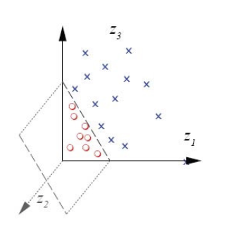

For some samples, the dimensions of features may not suffice in using a linear classifier.

Kernel Tricks are to elevate low dimension to high dimension to make non-seoarable data separable.

<!-- more -->

## SVM

Primal Form of SVM

::: warning

Primal Form & Dual Form

i.e. $\min ||\mathbf{w}||^2$, and $\max$ margin $\frac{2}{||\mathbf{w}||}$

:::

$$
\begin{aligned}
\min_{w,b} \quad &\frac{1}{2} ||\mathbf{w}||^2 \\
    s.t. \quad & y_i (\mathbf{w}^T \mathbf{x}_i + b) \ge 1, \forall i
\end{aligned}
$$

> $y_i = 1/-1$, For positive samples, we expect $\mathbf{w}^T \mathbf{x}_i + b \ge 1$. For negative samples, we expect $\mathbf{w}^T \mathbf{x}_i + b \le -1$
>
> The greater $||\mathbf{w}||$, the more complex the model.

Some times the hard margin is difficult for the data samples.

$$
\begin{aligned}
\min_{w,b,\xi_i} \quad &\frac{1}{2} ||\mathbf{w}||^2 + C \sum_{i} \xi_i \\
    s.t. \quad & y_i (\mathbf{w}^T \mathbf{x}_i + b) \ge 1 - \xi_i, \forall i, \\
    \quad & \xi_i \ge 0, \forall i
\end{aligned}
$$

## Kernel SVM

|  Before Kernel     |  After Kernel     |
|  ---  |  ---  |
|       |       |

Primal form of kernel SVM:
$$
\begin{aligned}
\min _{\mathbf{w}, b, \xi_{i}} \quad & \frac{1}{2}\|\mathbf{w}\|^{2}+C \sum_{i} \xi_{i} \\
\text { s.t. } \quad & y_{i}\left(\mathbf{w}^{T} \phi\left(\mathbf{x}_{i}\right) + b\right) \geq 1-\xi_{i}, \quad \forall i \\
& \xi_{i} \geq 0, \quad \forall i
\end{aligned}
$$
Lift to higher dimension so that a hyperplane can separate positive samples from negative samples.
$$
\mathbf{x}_{i} \rightarrow \phi\left(\mathbf{x}_{i}\right)
$$

## How to choose kernel

1. Elevate to finite dimension:
   
   > to enable interactions between features
2. Elevate to infinite dimension:
   > The key idea of kernel
   > 
   > No explicit form for $\phi(\mathbf{x})$ 
   > 
   > Instead, we compute kernel $K(\mathbf{x}, \mathbf{y})=\phi(\mathbf{x})^{T} \phi(\mathbf{y})$ (we don't expect to split out what exactly $\phi(x)$ or $\phi(y)$ are like)
   - Linear(or No) kernel: $K(\mathbf{x},\mathbf{y}) = \mathbf{x}^T\mathbf{y}$
   - Polynomial kernel: $K(\mathbf{x}, \mathbf{y})=\left(\mathbf{x}^{T} \mathbf{y}+c\right)^{d}$
   - Gaussian kernel: $\quad K(\mathbf{x}, \mathbf{y})=\exp \left(-\frac{\|\mathbf{x}-\mathbf{y}\|^{2}}{2 \sigma^{2}}\right) \quad$ Radial Basis Function (RBF)
   - Sigmoid kernel: $\quad K(\mathbf{x}, \mathbf{y})=\tanh \left(\alpha \mathbf{x}^{T} \mathbf{y}+c\right)$
   - Inverse multi-quadratic kernel: $\quad K(\mathbf{x}, \mathbf{y})=\frac{1}{\sqrt{\|\mathbf{x}-\mathbf{y}\|} 2 \sigma^{2}+c^{2}}$

## How to solve SVM

Lagrangian form:
$$
\left.\max\mathcal{L}_{\mathbf{w}, b, \xi_{i}}=\frac{1}{2}\|\mathbf{w}\|^{2}+C \sum_{i} \xi_{i}-\sum_{i} \alpha_{i}\left(y_{i}\left(\mathbf{w}^{T} \phi\left(\mathbf{x}_{i}\right)+b\right)-1+\xi_{i}\right)\right)-\sum_{i} \beta_{i} \xi_{i}
$$

where $\alpha_i \ge 0, \beta_i \ge 0, \forall i$

Solution

$$
\begin{array}{ll}
\frac{\partial \mathcal{L}}{\partial \mathbf{w}}=\mathbf{w}-\sum_{i} \alpha_{i} y_{i} \phi\left(\mathbf{x}_{i}\right)=\mathbf{0} \quad & \Rightarrow \quad \mathbf{w}=\sum_{i} \alpha_{i} y_{i} \phi\left(\mathbf{x}_{i}\right) \\
\frac{\partial \mathcal{L}}{\partial b}=-\sum_{i} \alpha_{i} y_{i}=0 & \Rightarrow \quad  \sum_{i} \alpha_{i} y_{i}=0 \\
\frac{\partial \mathcal{L}}{\partial \xi_{i}}=C-\alpha_{i}-\beta_{i}=0 & \Rightarrow \quad \alpha_{i}+\beta_{i}=C
\end{array}
$$

Now we replace the terms in the original Lagrangian form using the three sets of equations above.

$$
\begin{array}{ll}
\min _{\alpha_{i}} & \frac{1}{2} \sum_{i} \sum_{j} \alpha_{i} \alpha_{j} y_{i} y_{j} {K}\left(\mathbf{x}_{i}, \mathbf{x}_{j}\right) -\sum_{i} \alpha_{i} \\
\text { s.t. } & \sum_{i} \alpha_{i} y_{i}=0, \\
& 0 \leq \alpha_{i} \leq C, \quad \forall i
\end{array}
$$

where 
$$
K\left(\mathbf{x}_{i}, \mathbf{x}_{j}\right)=\phi\left(\mathbf{x}_{i}\right)^{T} \phi\left(\mathbf{x}_{j}\right)
$$

> A Quadratic Programming Problem

After solving the optimization problem, we can obatin

$$
w^T\phi(x) + b = \sum_{i} \alpha_i y_i \phi(x_i)^T \phi(x) + b
$$
As for the value of $b$, it can be estimated from $y_{i}\left(\mathbf{w}^{T} \phi\left(\mathbf{x}_{i}\right) + b\right) \geq 1-\xi_{i},  \forall i$ 

$$
b = \frac{1}{N} \sum_{i} \frac{1}{y_i} \left[ 1 - w^T \phi(x) \right]
$$

or we can also use LP to solve $b - \xi_i$ precisely.

> For kernel SVM, we can only solve it in its dual form

