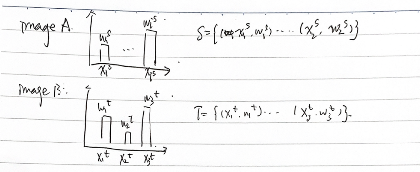
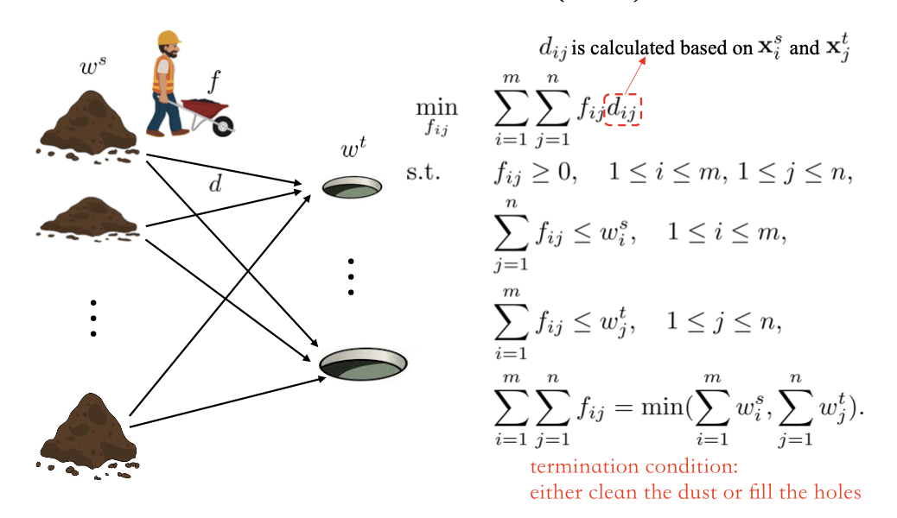
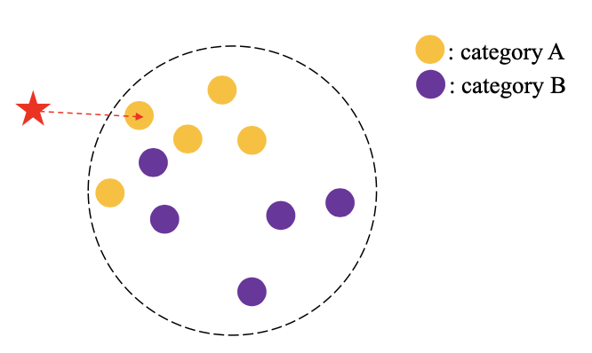
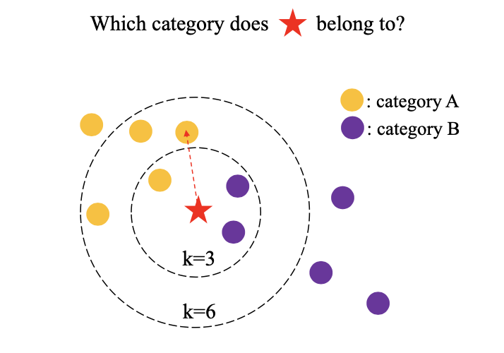
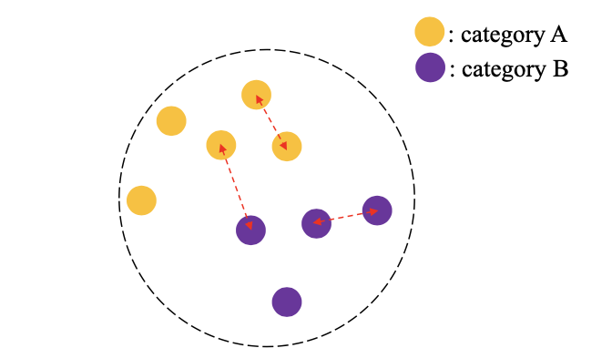
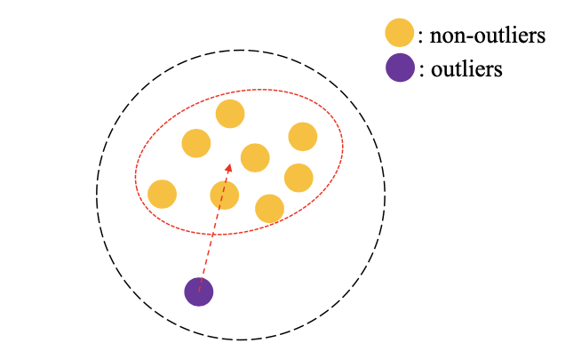
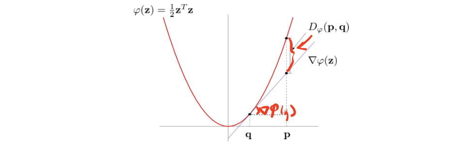
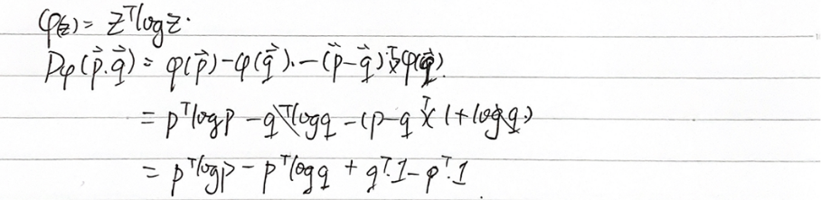
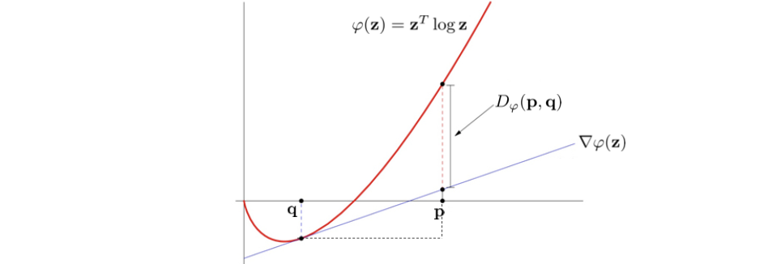

How to measure the distance?

<!-- more -->

## Distance between Samples

### Minkowski(Lp) Distance

$$
\begin{array}{c}
d(\mathbf{x}, \mathbf{y})=\left(\sum_{i}\left|x_{i}-y_{i}\right|^{p}\right)^{\frac{1}{p}} \\
=\left(\sum_{i}\left|d_{i}\right|^{p}\right)^{\frac{1}{p}} \\
\mathbf{x}=\left[x_{1}, x_{2}\right] \quad \mathbf{y}=\left[y_{1}, y_{2}\right] \\
\left(\left|d_{1}\right|^{p}+\left|d_{2}\right|^{p}\right)^{\frac{1}{p}}=1
\end{array}
$$

- $p=\infty$, Chebyshev distance $d(x,y) = \max_i |x_i - y_i|$
- $p=2$, Euclidean distance $d(x,y) = \sqrt{\sum_i |x_i - y_i|^2}$
- $p=1$, Manhattan distance $d(x,y) = \sum_i |x_i - y_i|$

### Cosine Distance

$d_{{euc }}(\mathbf{x}, \mathbf{y})=\|\mathbf{x}-\mathbf{y}\|=\sqrt{\|\mathbf{x}\|^{2}+\|\mathbf{y}\|^{2}-2 \mathbf{x}^{T} \mathbf{y}}$
$$
\mathrm{Sim}_{\cos }(\mathbf{x}, \mathbf{y})=\frac{\mathbf{x}^{T} \mathbf{y}}{\|\mathbf{x}\|\|\mathbf{y}\|}
$$
When $\|\mathbf{x}\|=1,\|\mathbf{y}\|=1 \quad d_{\text {euc }}(\mathbf{x}, \mathbf{y})=\sqrt{2-2 \mathbf{x}^{T} \mathbf{y}}=\sqrt{2-2 \operatorname{sim}_{\cos }(\mathbf{x}, \mathbf{y})}$

::: tip

- Similarity / Affinity / Proximity
- Dissimilarity / Distance

:::

### What if two samples are hetrogeneous

- Hetrogeneous Features
  - normalization
- Hetrogeneous Modularities
  - e.g. visual feature + texture feature
  - application. cross-modularity information retrieval

#### Metric Learning

Project $\mathbf{x}$ and $\mathbf{y}$ to a common space $d(\mathbf{x},\mathbf{y})\Leftarrow d(\mathbf{Px},\mathbf{Py})$ 

Mahalanobis distance: extension of Euclidean distance

$d(\mathbf{Px},\mathbf{Py}) = ||\mathbf{Px} - \mathbf{Py} || = \sqrt{(x^T-y^T)P^TP(x-y)} = \sqrt{(x^T-y^T)M(x-y)}$

> We can learn $M$ directly instead of the projection $P$

Goal of learning $M$: enhance cluster coherence and separation

$$
\begin{array}{ll}
\max _{\mathbf{M}} & \sum_{\left(\mathbf{x}_{i}, \mathbf{x}_{j}\right) \in \mathcal{D}} d_{M}^{2}\left(\mathbf{x}_{i}, \mathbf{x}_{j}\right) \\
\text { s.t. } & \sum_{\left(\mathbf{x}_{i}, \mathbf{x}_{j}\right) \in \mathcal{S}} d_{M}^{2}\left(\mathbf{x}_{i}, \mathbf{x}_{j}\right) \leq 1 \\
& \mathbf{M} \succeq \mathbf{0} .
\end{array}
$$

> Max the distance between clusters, while maintaining distance within cluster small $\le 1$ or $\le C$ learnable
> $\mathbf{M}$ should be semi-definite because it is $P^TP$

> Research going on in optimizaiton this problem

### Earth Mover's Distance (EMD) 推土距离

> The distance between two clusters of data $\mathcal{S}$, $\mathcal{T}$, every datapoint $x_i^{s/t}$ has a weight $w_i^{s/t}$
> 
> The distance between $x$s can be calculated

e.g. How to compute the distance between Image A and Image B based on color histogram

> every $x$ corresponds to a range of colors, $w$ corresponds to its histogram height (pixel counts)

> Minimize the work(功) it requries to move earth from source to distance

### Application

|  Retrieval     |  Classification: KNN     |
|  ---  |  ---  |
|   Which samples are closest to $\star$?    |  Which category does $\star$ belong to?     |
|  |  |

|  Verification     |  Outlier detection     |
|  ---  |  ---  |
|   Does each pair of samples belong to the same category?   |  Which sample is an outlier?  |
| |  |

> We may try different distance metrics for different tasks

## Distance between Distributions

### Compare two Histograms

- Canberra distance: $d(\mathbf{p}, \mathbf{q})=\sum_{i=1}^{d} \frac{\left|p_{i}-q_{i}\right|}{p_{i}+q_{i}}$
- Chi-Square distance: $d(\mathbf{p}, \mathbf{q})=\sum_{i=1}^{d} \frac{\left(p_{i}-q_{i}\right)^{2}}{p_{i}}$
- Intersection between two histograms: $d(\mathbf{p}, \mathbf{q})=\sum_{i=1}^{d} \min \left(p_{i}, q_{i}\right)$

### Maximum Mean Discrepancy (MMD)

$$
D_{M M D}=\left[\sum_{i} x_{i} p\left(x_{i}\right)-\sum_{i} x_{i} q\left(x_{i}\right)\right]^{2}
$$

> Simple but common

### KL-Divergence

$$
\begin{aligned}
D_{K L}(p \mid q) &=\sum_{i} p\left(x_{i}\right) \log \frac{p\left(x_{i}\right)}{q\left(x_{i}\right)} \\
&=-\sum_{i} p\left(x_{i}\right) \log q\left(y_{i}\right)+\sum_{i} p\left(x_{i}\right) \log p\left(x_{i}\right) \\
&=CP(p || q)-\mid H(p) 
\end{aligned}
$$

> Some symmetry versions of KL Divergence, by exchanging and sum

Jeffreys divergence:
$$
\begin{aligned}
D_{J D} &=D_{K L}(p \| q)+D_{K L}(q \| p) \\
&=\sum_{i} p\left(x_{i}\right) \log \frac{p\left(x_{i}\right)}{q\left(x_{i}\right)}+\sum_{i} q\left(x_{i}\right) \log \frac{q\left(x_{i}\right)}{p\left(x_{i}\right)}
\end{aligned}
$$

Jensen-Shannon (JS) divergence:
$$
\begin{aligned}
D_{J D} &=\frac{1}{2} D_{K L}\left(p \| \frac{1}{2}(p+q)\right)+\frac{1}{2} D_{K L}\left(q \| \frac{1}{2}(p+q)\right) \\
&=\sum_{i} \frac{1}{2} p\left(x_{i}\right) \log \frac{p\left(x_{i}\right)}{\frac{1}{2}\left(p\left(x_{i}\right)+q\left(x_{i}\right)\right)}+\frac{1}{2} \sum_{i} q\left(x_{i}\right) \log \frac{q\left(x_{i}\right)}{\frac{1}{2}\left(p\left(x_{i}\right)+q\left(x_{i}\right)\right)}
\end{aligned}
$$

### Bregman divergence
> A general form

$$
\begin{array}{c}
\mathbf{p}=\left[p\left(x_{1}\right), p\left(x_{2}\right), \ldots, p\left(x_{n}\right)\right] \\
\mathbf{q}=\left[q\left(x_{1}\right), q\left(x_{2}\right), \ldots, q\left(x_{n}\right)\right] \\
D_{\varphi}(p, q)=\varphi(\mathbf{p})-\varphi(\mathbf{q})-(\mathbf{p}-\mathbf{q})^{T} \nabla \varphi(\mathbf{q})
\end{array}
$$

#### Bregman Divergence to Euclidean Distance

When $\varphi(\mathbf{z})=\frac{1}{2} \mathbf{z}^{T} \mathbf{z}$
$$
\begin{aligned}
  D_{\varphi}(\mathbf{p}, \mathbf{q})&=\varphi(\mathbf{p})-\varphi(\mathbf{q})-(\mathbf{p}-\mathbf{q})^{T} \nabla \varphi(\mathbf{q})\\
&=\frac{1}{2}p^\top p - \frac{1}{2} q^\top q - (p-q)^\top q\\
&=\frac{1}{2}p^\top p - p^\top q + \frac{1}{2} q^\top q\\
&=\frac{1}{2}\|\mathbf{p}-\mathbf{q}\|^{2}
\end{aligned}
$$

Euclidean distance

#### Bregman Divergence to KL Divergence

