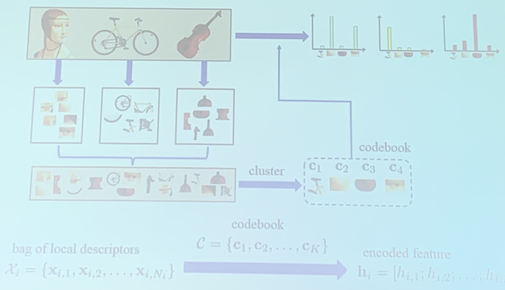
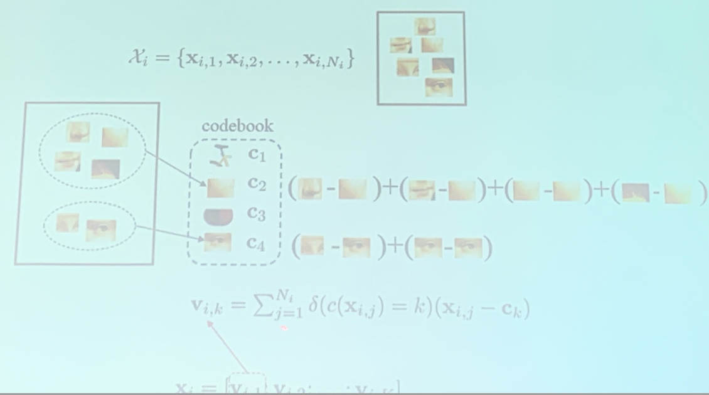
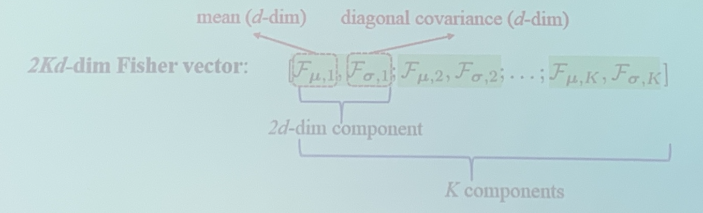

<!-- more -->

## Local Descriptors

An image or video can be treated as a bag of local descriptors
- Image: sptial pyramid/SIFT descriptor
- A video: trajectories (trace of point, used in action detection)
  - Dense Trajectory (DT)
  - Improved Desnse Trajectory (IDT)

## Feature Encoding, General Framework

- Encode each bag of local features into a feature vector based on codebook
  - Learn a codebook
    > We want the codebook to be global, we first need to aggregate the local features of all pictures, typically through clustering methods
  - transform global features into local features by codebook
    > Every local feature can be transformed into an encoded feature according to the codebook, we can get a histogram of codes {c1:n1, c2:n2, c3:n3}

> Images, -> extract feature proposals -> clustering -> a codebook
> 
> New Images -> extract feature proposals -> codebook -> feature encoding

## Bag of Word (0-order encoding)

> - common local features, such as wheels will fall into one category of codebook
> - count the frequency of local descriptors in the codebook (w.r.t. share the most similarty), obtain the histogram as an encoding

zero order information because we select the "most similarity" index

## VLAD: Vector of Locally Aggregated Descriptors (1-order encoding)

When we have chosen a most similarity codebook, we calculate the difference of the local descriptor and the codebook (like a de-centralization) and add them together (**1-order**)

Locally - Local descriptors
Aggregated - minus codebook + aggregate
One order -

The final encoding is a **concatenation** of all codebooks (still 1-order)

> Sometimes need to combine with 0-order information, so that when $x_{i,j} - c_k \approx 0$, it will not diminish

> $x_{i,j}-c_k$ should not be treated as similarity, but as a feature (which can be made use of and contains information)

> In practice, $v_{i,k}$ maybe normalized w.r.t. $N_i$

## Fisher Vector (2-order encoding)

> GMM : soft-clustering w.r.t. K-Means (Mixed Gaussian Model)

GMM described by $\theta$

$$
\mathbf{\theta}=\left\{\pi_{1}, \mathbf{\mu}_{1}, \mathbf{\sigma}_{1} ; \ldots ; \pi_{K}, \mathbf{\mu}_{K}, \mathbf{\sigma}_{K}\right\}
$$

$\pi$ is the weight of every discribution

Max Log-likelihood, $\mathcal{F}_{\theta}^{\mathcal{X}_{i}}$ reflects the effect of changing $\theta$ on the model performance.

$$
\mathcal{F}_{\theta}^{\mathcal{X}_{i}}=\frac{1}{N_{i}} \sum_{j=1}^{N_{i}} \nabla_{\theta} \log p\left(\mathbf{x}_{i, j} ; \mathbf{\theta}\right)
$$

Define:

$$
\begin{array}{l}
\mathcal{F}_{\mu, k}^{\mathcal{X}_{i}}=\frac{\partial \mathcal{F}_{\theta}^{\mathcal{X}_{i}}}{\partial \mu_{k}}=\frac{1}{N_{i} \sqrt{\pi_{k}}} \sum_{j=1}^{N_{i}} \gamma_{i, j}(k)\left(\frac{\mathbf{x}_{i, j}-\mu_{k}}{\sigma_{k}}\right) \\
\mathcal{F}_{\sigma, k}^{\mathcal{X}_{i}}=\frac{\partial \mathcal{F}_{\theta}^{\mathcal{X}_{i}}}{\partial \sigma_{k}}=\frac{1}{N_{i} \sqrt{2 \pi_{k}}} \sum_{j=1}^{N_{i}} \gamma_{i, j}(k)\left[\left(\frac{\left(\mathbf{x}_{i, j}-\mathbf{\mu}_{k}\right)^{2}}{\sigma_{k}^{2}}\right)-1\right]
\end{array}
$$

$\gamma_{i,j}(k)$ probability pf  sample $x_{i,j}$ in cluster $k$

$$
\gamma_{i, j}(k)=\frac{\pi_{k} \mathcal{N}\left(\mathbf{x}_{i, j} ; \mathbf{\mu}_{k}, \sigma_{k}\right)}{\sum_{\tilde{k}=1}^{K} \pi_{\tilde{k}} \mathcal{N}\left(\mathbf{x}_{i, j} ; \mathbf{\mu}_{\tilde{k}}, \sigma_{\bar{k}}\right)}
$$

> $F_{\mu,k}^{X_i}$ expression is similar to VLAD expression, if $\pi_k =1$, $\sigma_k =1$, $\gamma$ becomes a hard classifier, 1-order information
> 
> $F_{\sigma,k}^{X_i}$ represents second order information

## Summary

- BOW (0-order information): $[\gamma(1) ; \gamma(2) ; \ldots ; \gamma(K)] \quad K$ -dim
- VLAD (1-order information): $\quad\left[\mathcal{F}_{u, 1}, \mathcal{F}_{\sigma, 2} ; \ldots ; \mathcal{F}_{\sigma, K}\right] \quad K d$ -dim
- Fisher vector:(1-order + 2-order information) $\left[\mathcal{F}_{\boldsymbol{\mu}, 1}, \mathcal{F}_{\sigma, 1} \mathcal{F}_{\mu, 2}, \mathcal{F}_{\sigma, 2} ; \ldots ; \mathcal{F}_{\mu, K}, \mathcal{F}_{\sigma, K}\right] 2 K d$ -dim
- Super vector (0-order + 1-order information) may suffice
