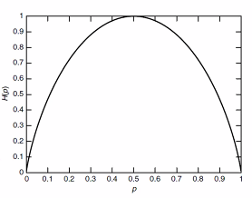

Week 1 of 2020 Spring. Entropy

**KeyWords**: Entropy, Joint Entropy, Conditional Entropy

<!--more-->

[toc]

## Entropy: Definition

### Notation:

- Let $X$ be a _discrete random variable_(离散随机变量) with alphabet(字母表/样本空间) $\mathcal{X}$ and **probability mass function** $p(x)=Pr(X=x), x\in \mathcal{X}$. (abbrev. $p_{\mathcal{X}}(x)$)

- The entropy of $X$ is defined by $$H(X)=-\sum_{x \in \mathcal{X}} p(x) \log p(x)$$

- Remark:
    - $0 \log{0} \rightarrow 0$
    - 我们有时也直接用概率分布函数表示字母表,因为$H(X)$仅与$p(x)$有关
    - $H(X) \geq 0$
    - 当$X$均匀分布时,$H(X)=\log{|X|}$,在离散情况下熵是最大的
    - $H_{b}(X)=\log _{b}{a} H_{a}(X)$
        - 对数底取$e$时,entropy is measured in nats
        - 对数取$2$时,entropy is measured in bits
    - 本课程中,主要讨论有限字母表的问题

### Examples:

- Binary entropy function 
$$\text { Let } X=\left\{\begin{array}{ll}1 & \text { with probablity } p \\ 0 & \text { with probability } 1-p\end{array}\right.$$
$$H(X)=-p \log p-(1-p) \log (1-p)$$
> 

- 用期望的形式表达熵, 熵是随机变量$\log \frac{1}{p(X)}$的期望
$$\begin{aligned} E_{p} g(X) &=\sum_{x \in x} g(x) p(x) \\ H(X) &=E_{p} \log \frac{1}{p(X)} \end{aligned}$$

### Properties

> **Theorem** For any discrete random variable $X$ $0 \leq H(X) \leq \log |X|$
> **Pf.** 非负,trivial
> Note. $f(x)=-x \log x$ is concave in $x$ (by second-derivative). and that $\sum_{X} p(x)=1$.
> By applying the concavity of $f(x)$, 
$$\frac{1}{|\mathcal{X}|} \sum_{x \in \chi}-p(x) \log p(x) \leq-\frac{1}{|\mathcal{X}|} \log \frac{\sum_{x} p(x)}{|x|}=\frac{1}{|x|} \log |\mathcal{X}|$$
>> Recall: Concavity.
>> $$\sum_{i} p_{i} f\left(x_{i}\right) \leq f\left(\sum_{i} p_{i} x_{i}\right)$$

> **Lemma: 均匀分布最大化离散熵** equality holds iff $p(x)=1 /|\mathcal{X}|$

## More Entropies

- 我们会定义更多熵, 条件熵/联合熵...
- 熵的定义只与概率密度有关, 和字母表的取值具体情况无关. 
- 对多个随机变量, 我们可以定义
    - 联合分布 $p\left(x_{i}, x_{j}\right)$
    - 条件分布 $p\left(x_{i} | \dots\right)$
    - 都可以计算出熵
- 概率论中基本定律
    - Chain Rule $p\left(x_{1}, x_{2}, \ldots, x_{n}\right)=p\left(x_{n}\right) p\left(x_{n-1} | x_{n}\right) \ldots p\left(x_{1} | x_{2}, \ldots, x_{n-1}\right)$
    - Bayesian Rule $p(y) p(x | y)=p(x) p(y | x)$
    - 这些基本准则的存在, 表明熵也可能存在特殊的结构

### Joint Entropy

Facts: 多个随机变量的字母表可以组合成一个字母表

> **Definition** The joint entropy $H(X,Y)$ of a pair of discrete random variable $(X,Y)$ with joint distribution $p(x,y)$ is defined as $$H(X, Y)=-\sum_{x \in X} \sum_{y \in Y} p(x, y) \log p(x, y)$$

Propositions:
1. $H(X,X)=H(X)$, 可以理解成本质上是同一件事, 只是多次实验而已
2. $H(X,Y)=H(Y,X)$
3. 联合熵也可以写成联合期望的形式 $$H\left(X_{1}, X_{2}, \ldots, X_{n}\right)=-\sum p\left(x_{1}, x_{2}, \ldots, x_{n}\right) \log p\left(x_{1}, x_{2}, \ldots, x_{n}\right)=-E \log p\left(X_{1}, \ldots, X_{n}\right)$$

### Conditional Entropy

两种计算方式

- 先对fixed $X$算条件熵, 再对所有条件熵加权求和.
    - Entropy for $p(Y|X=x)$ $$H(Y | X=x)=\sum_{y}-p(y | X=x) \log p(y | X=x)=- E \log p(Y | X=x)$$
    - Entropy for $p(Y|X)$
    $$H(Y|X) = \sum_{x} p(x) H(Y|X=x)$$

- 也可以通过直接根据以下推导, 直接计算$\log p(Y | X)$的期望. $$\begin{aligned} H(Y | X) &=\sum_{x \in \mathcal{X}} p(x) H(Y | X=x) \\ &=-\sum_{x \in \mathcal{X}} p(x) \sum_{y \in \mathcal{Y}} p(y | x) \log p(y | x) \\ &=-\sum_{x \in X} \sum_{y \in y} p(x, y) \log p(y | x) \\ &=-E \log p(Y | X) \end{aligned}$$

> **Proposition** $H(Y | X) \leq H(Y)$
> 直观理解, 条件熵(在X已知的情况下,Y的不确定度)会比原始系统的熵要低, 条件降低了系统的不确定度.

> **Remark** Example中两个有意思的结论, 后续给出证明
> $$\begin{array}{c}\boldsymbol{H}(X | \boldsymbol{Y}) \neq \boldsymbol{H}(\boldsymbol{Y} | \boldsymbol{X}) \\ \boldsymbol{H}(\boldsymbol{X} | \boldsymbol{Y})+\boldsymbol{H}(\boldsymbol{Y})=\boldsymbol{H}(\boldsymbol{Y} | \boldsymbol{X})+\boldsymbol{H}(\boldsymbol{X})=\boldsymbol{H}(\boldsymbol{X}, \boldsymbol{Y})\end{array}$$
> 直观理解, 两件事的先后发生的不确定性不具有对称性, 两件事的不确定性之和可以理解为两件事(带条件)先后发生的不确定性之和.

### Chain Rule

Recall: 概率论中, $p(x, y)=p(x | y) p(y)=p(y | x) p(x)$. 因此我们有$\log p(x, y)=\log p(x | y)+\log p(y)=\log p(y | x)+\log p(x)$.

考虑上节中定义的条件熵, $$\begin{aligned} & E-\log p(x, y) \\=& E-\log p(x | y)+E-\log p(y) \\=& E-\log p(y | x)+E-\log p(x) \end{aligned}$$

> **Theorem: Chain Rule** $H(X, Y)=H(Y)+H(X | Y)=H(X)+H(Y | X)$

**Proposition**
1. 如果X和Y独立,那么$H(X,Y)=H(X)+H(Y)$.
2. 如果X是关于Y的函数,那么$H(X,Y)=H(Y)$.
3. 贝叶斯公式: $H(X, Y | Z)=H(X | Z)+H(Y | X, Z)$
  **Pf.** Note $$ p(x,z)p(y|x,z)=p(x,y,z) = p(z)p(x,y|z)$$
   and that $$p(x,z)=p(x|z)p(z)$$
   it follows that $p(x, y | z)=p(x | z) p(y | x, z)$.

### Venn Diagram

我们如何高效地整理信息量的关系?

> $H(X, Y)=H(Y)+H(X | Y)=H(X)+H(Y | X)$
> 

### Zero Entropy

如果随机变量的条件熵为0, 那么Y是X的一个函数 (i.e., for all $x$ with $p(x)>0$, there is only one possible value of $y$ with $p(x,y)>0$.

Zero Entropy在网络分析/人工智能的推理上具有很大的应用. 当我们遇到条件关系时, 可以考虑用这种方式解决它.

**Pf.** By condition we have $$H(Y|X) = \sum_{x} p(x) H(Y|X=x) = 0$$
Note that $p(x)>0$, thus for any $x$, we have $H(Y|X=x)=0$.

It follows that when $x$ is determined, the distribution of $Y$ is a single value.

## References
[信息熵最大值的详细证明](https://blog.csdn.net/feixi7358/article/details/83861858)
