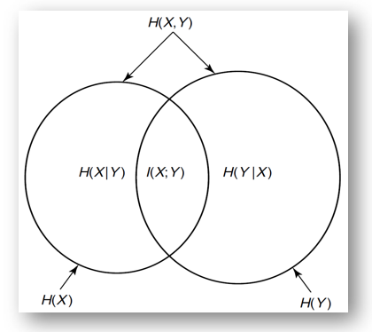
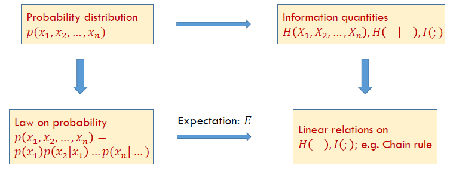

Week 2 of 2020 Spring. More about Entropy

**KeyWords**: Relative Entropy, Mutual Information

<!--more-->

[toc]

## Relative Entropy

相对熵, 度量两种分布之间的距离 (K-L distance), 假定$p(x)$, $q(x)$具有相同的维数(over the same alphabet $\mathcal{X}$), 我们有
$$\begin{aligned} D(p \| q)=& \sum_{x \in \mathcal{X}} p(x) \log \frac{p(x)}{q(x)} \\ &=E_{p} \log \frac{p(X)}{q(X)} \end{aligned}$$

注意, 仅对p求期望, 我们还有以下规定或性质
- $0 \log _{0}^{0}=0,0 \log \frac{0}{q}=0, p \log \frac{p}{0}=\infty$
- 若存在事件x, 使得$p(x)>0$且$q(x)=0$, 那么$D(p \| q)=\infty$
- $D(p \| q) \geq 0$
- $D(p \| q)=E_{p}(-\log q(x))-E_{p}(-\log p(x))=E_{p}(-\log q(x))-H(p)$, 相对熵可写作一个关于p分布的期望减去一个p的熵的形式

### Relative Entropy is NOT Metric
> A metric d: $X,Y \mapsto R^{+}$ between two distributions should satifsy
> - $d(X, Y) \geq 0$
> - $d(X, Y) \equiv d(Y, X)$
> - $d(X, Y)=0$ if and only if $X=Y$
> - $d(X, Y)+d(Y, Z) \geq d(X, Z)$

- Euclidean distance is a metric
- KL distance is not a metric
  - $D(p\| p)= 0$
  - but $D(p|\ q) \neq D(q|\ p)$
  - distance but not metric
- **Variational Distance(差分/变分距离)** between $p$ and $q$ is denoted as
$$
V(p, q)=\sum_{x \in \mathcal{X}}|p(x)-q(x)|
$$
- Pinsker's Inequality: 相对熵是差分距离的一个上界
$$
D(p \| q) \geq \frac{1}{2 \ln 2} V^{2}(p, q)
$$

### Conditional Relative Entropy
条件相对熵 = 计算两种单个条件概率分布相对熵, 再对p取平均. 该计算方法也可改写成期望的形式

$$\begin{aligned}
D(p(y | x) \| q(y | x)) &=\sum_{x} p(x) \sum_{y} p(y | x) \log \frac{p(y | x)}{q(y | x)} \\
&=\sum_{x} \sum_{y} p(x) p(y | x) \log \frac{p(y | x)}{q(y | x)} \\
&=E_{p(x, y)} \log \frac{p(Y | X)}{q(Y | X)}
\end{aligned}$$

性质: Chain Rule $D(p(x, y) \| q(x, y))=D(p(x) \| q(x))+D(p(y | x) \| q(y | x))$.
**Proof.** By Definition
$$\begin{array}{l}
D(p(x, y) \| q(x, y))=\sum_{x} \sum_{y} p(x, y) \log \frac{p(x, y)}{q(x, y)}=\sum_{x} \sum_{y} p(x, y) \log \frac{p(x) p(y | x)}{q(x) q(y | x)} \\
=\sum_{x} \sum_{y} p(x, y)\left(\log \frac{p(x)}{q(x)}+\log \frac{p(y | x)}{q(y | x)}\right)
\end{array}$$

## Mutual Information
$$
\begin{aligned} I(X ; Y) &=\sum_{x} \sum_{y} p(x, y) \log \frac{p(x, y)}{p(x) p(y)} \\ &=D(p(x, y) \| p(x) p(y)) \\ &=E_{p(x, y)} \log \frac{p(X, Y)}{p(X) p(Y)} \end{aligned}
$$

互信息的性质:
- $I(X;Y)=I(Y;X)$
- $I(X;X)=H(X)$ 随机变量的熵就是它本身互信息的值
- $X$和$Y$独立, $I(X;Y)=0$. 没有关联的随机变量互信息为0
- 注意Notation: $I(X;Y)$ $H(X,Y)$
- 我们通常用关系式计算信息量

### Mutual Information and Entropy

 
 
$$\begin{array}{c}I(X ; Y)=H(X)-H(X | Y) \\I(X ; Y)=H(Y)-H(Y | X) \\I(X ; Y)=H(X)+H(Y)-H(X, Y) \\I(X ; Y)=I(Y ; X) \\I(X ; X)=H(X)\end{array}$$

Note: 面积可能为负, 所以$I(X;Y)$部分必不可少
**Proof.** Recall $p(X, Y)=p(X) p(Y | X)=p(Y) p(X | Y)$
To Prove $I(X ; Y)=H(X)+H(Y)-H(X, Y)$, Since 
$$\log \frac{p(X, Y)}{p(X) p(Y)}=-\log p(X)-\log p(Y)+\log p(X, Y)$$
By taking Expectation of $p(x,y)$ and using $E(X_1 +X_2) = E(X_1) + E(X_2)$, we get $I(X ; Y)=H(X)+H(Y)-H(X, Y)$

Proposition:
If $X$ and $Y$ are independent, then
$$H(X,Y)=H(X)+H(Y)$$
$$I(X;Y) = H(X)+H(Y)-H(X,Y)$$
or vice versa.

### Conditional Mutual Information
$$\begin{aligned}
I(X ; Y | Z) &=H(X | Z)-H(X | Y, Z) \\
&=E_{p(x, y, z)} \log \frac{p(X, Y | Z)}{p(X | Z) p(Y | Z)}
\end{aligned}$$

> Chain Rule is a decomposition

$$I\left(X_{1}, X_{2}, \ldots, X_{n} ; Y\right)=\sum_{i=1}^{n} I\left(X_{i} ;  Y | X_{i-1}, X_{i-2}, \ldots, X_{1}\right)$$

**Proof.** $I\left(X_{1}, X_{2}, \ldots, X_{n} ; Y\right)=H\left(X_{1}, \ldots, X_{n}\right)-H\left(X_{1}, \ldots, X_{n} | Y\right)$
Apply Chain Rule for entropy respectively, then bind the $\sum$ together, rewrite in the mutual information form.

信息度量的好处是用单一值避免随着随机变量的增多,样本空间指数型的上升

## Propositions About Information Quantities

### Nonnegative Mutual Information
> **Information inequality** Let $p(x),q(x),x\in X$ be two probability mass functions. Then 
> $$D(p\| q)\ge 0$$
> with equality iff $p(x)=q(x)$ for all $x$.

**Proof.**
- By convexity: $$-D(p \| q)=\Sigma p \log \frac{q}{p} \leq \log \Sigma p \frac{q}{p}=\log \Sigma q \leq \log 1=0$$
- Using $\log x \le x - 1$when $x>0$ $$-D(p \| q)=\Sigma p \log \frac{q}{p} \leq \Sigma p\left(\frac{q}{p}-1\right)=\Sigma q-\Sigma p \leq 0$$
  $\sum q$可能取不到1, 因为$p=0$而$q\neq0$时相对熵被定义为0, 此时这一项q就被消去了. 实际参与运算的$q$之和$\le 1$

### More Properties
- $D(p \| q)=0$ iff $p(x)=q(x)$
- $I(X;Y) \ge 0$, with equality iff $X$ and $Y$ are independent
- $D(p(y|x)\| q(y|x))\ge 0$ with equality iff $p(y|x)=q(y|x)$ for all $x$ and $y$ such that $p(x)>0$
- $I(X;Y|Z)\ge 0$ with equality iff $X$ and $Y$ are conditionally independent given $Z$.
- Let $u(x)=\frac{1}{|x|}$ be the uniform probability mass fuction over $X$, and let $p(x)$ be the probability mass function for $X$, Then
  $$0\le D(p\| u)= \log |\mathcal{X}|-H(X)$$
- (Conditioning reduces entropy) (Information can't hurt)
  $$H(X|Y) \le H(X)$$
  with equality iff $X$ and $Y$ are independent
  hint: relation with $I(X;Y)$