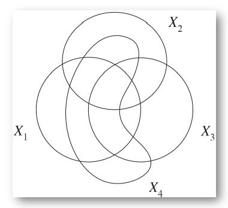
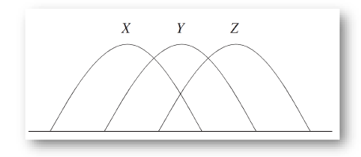

Week 2 of 2020 Spring. More about entropy

**KeyWords**: Entropy

<!-- more -->

## Independence Bound on Entropy

From intuition to math expression.
Let $X_1,X_2,\cdots,X_n$ be drawn according to $p(x_1,x_2,\cdots,x_n)$. Then
$$H\left(X_{1}, X_{2}, \ldots, X_{n}\right) \leq \sum_{i=1}^{n} H\left(X_{i}\right)$$
with equality if and only if the $X_i$ are independent.

**Pf.** by chain rule and conditioning reduces entropy
$$H\left(X_{1}, X_{2}, \ldots, X_{n}\right)=\sum_{i=1}^{n} H\left(X_{i} | X_{i-1}, \ldots, X_{1}\right) \leq \sum_{i=1}^{n} H\left(X_{i}\right)$$

## Markov Chain
$$ p(x,y,z) = p(x)p(y|x)p(z|y) \text{denoted as} X \rightarrow Y\rightarrow Z$$
i.e. $p(z|y,x)=p(z|y)$

Prop about markov chain
-  $X \rightarrow Y \rightarrow Z$ iff $X$ and $Z$ are conditionally independent given $Y$.
- 时间可逆 $X \iff Y \iff Z$
  - an easy interpretation is that in the mutual information $I(X ; Z | Y)$, $X$ and $Z$ can be switched.
- 仿射 if$Z=f(Y)$ then $X \rightarrow Y \rightarrow Z$.
- 体现在信息度量上, if $X \rightarrow Y\rightarrow Z$, then $I(X;Z|Y)=0$ i.e. $Y$ and $Z$ are conditionally independent given $Y$.
  **Pf.** from the probability formula we have
  $$I(X ; Z | Y )=E_{p(x, y, z)} \log \frac{p(X, Y | Z)}{p(X | Z) p(Y | Z)}$$

## Data Processing Inequality
马尔科夫系统的信息是如何演化的? 马尔可夫链实际上相当于数据分步处理的过程
Theorem : If  $X \rightarrow Y \rightarrow Z$, Then $I(X;Y)\ge I(X;Z)$
信息处理得越多,信息丢失的越多
**Pf.** $I(X;Y,Z)=I(X;Z)+I(X;Y|Z)=I(X;Y)+I(X;Z|Y)$
Since $I(X;Z|Y)=0$, we have
$$I(X;Z)+I(X;Y|Z)=I(X;Y)$$

- In particular, if $Z=g(Y)$, then $I(X;Y)\ge I(X;g(Y))$
- Collary: If  $X \rightarrow Y \rightarrow Z$, $I(X;Y|Z)\le I(X;Y)$, 对三个随机变量而言, **条件互信息不一定小于等于互信息(与条件熵不同)**

### I(X;Y;Z)
有关上面Remark的一个反例:

Assume $X,Y$ are two independent random variables uniformly distributed on {0,1}.
  $$Z=X+Y (mod 2)$$
  We can find that $I(X;Y|Z)> I(X;Y)$. 

从问题中, $X,Y,Z$任意两个都能决定剩下一个, 分布都相同, 且两两相互独立(by def $p(X,Z)=p(X)p(Z)$).

$$\begin{aligned}
I(X ; Y | Z) &=H(X | Z)-H(X | Y, Z) \\
&=H(X | Z) \\
&=H(X) \\
&=1
\end{aligned}$$
$$1=I(X;Y|Z)>I(X;Y)=0$$
**Intuition:** 当你知道$Z$之后,$X$和$Y$之间可以解出更多信息出来. 熵就不具备这一性质.
**Denote:** $I(X;Y;Z)=I(X;Y)-I(X;Y|Z)$ 仅仅是符号意义, 不具有互信息的意义, 因为它可能小于0.

## Information Diagram

### 2RVs to more

| 2RVs | 3RVs| 4RVs
| --| --| --|
| | | 
| **Virtual Circles** | Area are all nonnegative except $I(X;Y;Z)$| All areas can be expressed in combinations of (conditional) entropy/mutual info  |

Circles are not representing any entities, for independent variables, unintersected circles are not allowed, since values can be negative.
Only items like $H(X|Y)$, $I(X;Y|Z)$ are nonnegative
Reference: Ch. 3, Information Theory and Network Coding, R. W. Yeung

### Markov Chain

| $X\rightarrow Y\rightarrow Z$ | $X_1\rightarrow \cdots \rightarrow X_n$ |
|--|--|
| | |
|用半圆表示,保证相互相交,**保证每块非负**  | 更一般的情况, n个相互相交的半圆|
|共6块,**三者互信息=X与Z的互信息** |保证第一个和最后一个有明显相交 |

### Examples: Use Info Diagram to Prove Inequalities

$$\begin{array}{c}
H(X, Y, Z) \leq \frac{H(X, Y)+H(Y, Z)+H(Z, X)}{2} \leq H(X)+H(Y)+H(Z) \\
H(X | Y, Z)+H(Y | X, Z)+H(Z | X, Y) \leq \frac{H(X, Y | Z)+H(Y, Z | X)+H(Z, X | Y)}{2} \leq H(X, Y, Z)
\end{array}$$
With graphical interpretation:
$$a+c+e \le \frac{(a+b+c)+(c+d+e)+(a+f+e)}{2} \le a+b+\cdot +g $$
***Note, some areas can be negative! Take signals into account***

## Practical Examples

### Causality(因果推断)
我们将系统中的因素用图表示,计算信息量,写出信息量之间的相互关系,推导信息之间是否具有一定关系
e.g. Given: $X \perp Y | Z$ and $X \perp Z$ and Prove: $X \perp Y$

### Perfect Secrecy(完美安全模型)

明文由秘密和密钥生成: $H(Y|X,Z)=0$
接收端可以通过明文和密钥生成:$H(X|Y,Z)=0$
我们可以由此推出: $I(X;Y)\ge H(X)-H(Z)$
假设窃听者与秘密之间毫无关联$I(X;Y) = 0$
那么如果要使$I(X;Y)=0$, 我们需要$H(X)\le H(Z)$, 即信息长度小于密钥长度.

## Fano's Inequality: Estimation

### Background

- Suppose that we wish to estimate a random variable 𝑋with a distribution $𝑝(𝑥)$.
- We observe a random variable $𝑌$ that is related to 𝑋by the conditional distribution $𝑝(𝑦|𝑥)$.
- From 𝑌, we calculate a function $𝑔(𝑌)=\hat{X}$, where $\hat{X}$ 𝑋is an estimate of 𝑋and takes on values in $\hat{X}$.
  - We will not restrict the alphabet $\hat{X}$ to be equal to 𝑋, and we will also allow the function 𝑔(𝑌)to be random.
- We wish to bound the probability that $\hat{X}$≠𝑋. We observe that 𝑋→𝑌→$\hat{X}$ forms a Markov chain. Define the probability of error
  $P_e=Pr(\hat{X} \neq X)$
- When 𝐻(𝑋|𝑌)=0, we know that $P_e=0$. How about $𝐻(𝑋|𝑌)$,as $P_e\rightarrow 0$?

> **Theorem (Fano’s Inequality)** For any estimator $\hat{X}$ such that $X \rightarrow Y \rightarrow \hat{X}$ with $P_e = \Pr(\hat{X}\neq X)$ we have
> $$H\left(P_{e}\right)+P_{e} \log |\mathcal{X}| \geq H(X | \hat{X}) \geqslant H(X | Y)$$
> Or can be weakened to
> $$1+P_{e} \log |\mathcal{X}| \geqslant H(X | Y) \text{ or } P_{e} \geqslant \frac{H(X| Y)-1}{\log |x|}$$
> 
> 后者是data-processing 不等式, 前者是法诺不等式的核心部分.

### Proof

Define an error random variable 
$$E=\left\{\begin{array}{ll}
0, & \text { if } \hat{X}=X \\
1, & \text { if } \hat{X} \neq X
\end{array}\right.$$
Then
$$\begin{aligned}
H(E, X | \hat{X}) &=H(X | \hat{X})+H(E | X, \bar{X}) \\
&=H(E | \hat{X})+H(X | E, \hat{X})
\end{aligned}$$

- 马尔可夫链implies$H(E | X, \hat{X})=0$
- 第二步,  $H(X|\hat{X},E=1)<=H(x)=H(P_e)$, 熵永远小于字母表的对数值
- 此外, $H(X | E, \hat{X}) \leq P_{e} \log |x|$ 因为
$$\begin{aligned}
H(X | E, \hat{X}) &=\Pr(E=0) H(X | \hat{X}, E=0)+\Pr(E=1) H(X | \hat{X}, E=1) \\
& \leq\left(1-P_{e}\right) 0+P_{e} \log |\mathcal{X}|
\end{aligned}$$

**Corollary** Let $P_{e}=\Pr(X \neq \hat{X})$, and let $\hat{X}: y \rightarrow x$; then $H\left(P_{e}\right)+P_{e} \log (|x|-1) \geq H(X | Y)$, 由于已知$X$和$\hat{X}$不等, 在估计时, 熵的上界可以调小 (corollary)

直观理解:
$P_e \rightarrow 0$ implies $H(P_e) \rightarrow 0$ implies $H(X|Y)\rightarrow 0$ 错误率趋向于0时, X和Y的关系趋向确定.

Recall: binary entropy function
$H(p)=-plogp-(1-p)log(1-p)$ 实际是简写的记号, 计算的是两点分布的熵

## Convexity/ Concavity of Information Measures

**Log Sum Inequality** for nonnegative $a_1, \cdots, a_n$ and $b_1, \cdots, b_n$,
$$\sum_{i=1}^{n} a_{i} \log \frac{a_{i}}{b_{i}} \geq\left(\sum_{i=1}^{n} a_{i}\right) \log \frac{\sum_{i=1}^{n} a_{i}}{\sum_{i=1}^{n} b_{i}}$$
with equality if and only if $\frac{a_i}{b_i}=const$.
Pf. by moving $\left(\sum_{i=1}^{n} a_{i}\right)$ to the left, the coefficient can be regarded as a probability distribution.

Corollaries:
- Concavity of $H(P)$
- $(X,Y)~p(x,y)=p(x)p(y|x)$, then $I(X;Y)$is a concave function of $p(x)$ for fixed $p(y|x)$ and a convex function of$p(y|x)$ for fixed $p(x)$ 
  - Note given $p(x)$, $p(y|x) \rightarrow p(x,y) \rightarrowp(y)$
- Convexity of relative entropy. $D(p\|q)$is a convex function for pair $(p,q)$.
- 可以把 $p(x), p(y)$等看作高维空间上的一个点, 而不是概率分布. for $X ={1, 2,3...,n}$, define $\mathbb{x}_1 = p_1, \mathbb{x}_2= p_2, ..$
