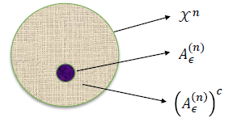

Week 3 of 2020 Spring

<!--more-->

[[toc]]

## Law of Large Numbers

随机变量的收敛性
1. **In probability** if for every $\epsilon > 0$, $\Pr\{|X_n-X|>\epsilon \} \rightarrow 0$
2. **In mean square** if $E(X_n-X)^2 \rightarrow 0$
3. **With probability 1**(almost surely) if $\Pr\{\lim_{n\rightarrow \infty} X_n = X\}$
Note $(2)\rightarrow(1)$ $(3)\rightarrow(1)$, proof by Malkov and Chebshev.

强大数定律: For i.i.d random variables, $\bar{X_n} \rightarrow E(X_1)$ with probability 1.
弱大数定律: For i.i.d random variables, $\bar{X_n} \rightarrow E(X_1)$ in probability.

## AEP (Asymptotic Equipartition Property)
渐进均分性, 大数定律在信息论中的体现.
**Theorem** If $X_{1}, X_{2}, \dots$ are i.i.d. $\sim p(x)$, then
$$\begin{aligned}
-\frac{1}{n} \log p\left(X_{1}, X_{2}, \ldots, X_{n}\right) &=-\frac{1}{n} \sum_{i} \log p\left(X_{i}\right) \\
& \rightarrow-E \log p(X) \text { in probability } \\
&=H(X)
\end{aligned}$$

**Proof.** 
AEP应用于数据压缩算法中, 我们用极限的语言写出证明:
 
$$\begin{aligned}
H(X)-\epsilon & \leq-\frac{1}{n} \log p\left(X_{1}, X_{2}, \ldots, X_{n}\right) \leq H(X)+\epsilon \\
2^{-n(H(X)+\epsilon)} & \leq p\left(X_{1}, X_{2}, \ldots, X_{n}\right) \leq 2^{-n(H(X)-\epsilon)} \Rightarrow A_{\epsilon}^{(n)}
\end{aligned}$$
Reason:
- Functions of independent random variables are also independent random variables.
- Since the $X_i$ are i.i.d., so are $\log p\left(X_{i}\right)$
- By the weak law of large numbers

将极限的定义展开, 我们可以通过如下方式导出并定义典型集

$$H(X)-\epsilon \leq-\frac{1}{n} \log p\left(X_{1}, X_{2}, \ldots, X_{n}\right) \leq H(X)+\epsilon$$
也即
$$2^{-n(H(X)+\epsilon)} \leq p\left(X_{1}, X_{2}, \dots, X_{n}\right) \leq 2^{-n(H(X)-\epsilon)} \Rightarrow A_{\epsilon}^{(n)}$$
导出典型集的概念.

## Typical Set
**Definition**样本空间中,所有满足$2^{-n(H(X)+\epsilon)} \leq p\left(X_{1}, X_{2}, \ldots, X_{n}\right) \leq 2^{-n(H(X)-\epsilon)}$的$\left(x_{1}, x_{2}, \ldots, x_{n}\right)$

**Properties**
1. If $\left(x_{1}, x_{2}, \ldots, x_{n}\right) \in A_{e}^{(n)},$ then $H(X)-\epsilon \leq-\frac{1}{n} \log p\left(x_{1}, x_{2}, \ldots, x_{n}\right) \leq H(X)+\epsilon$
   **Proof.** 见上一节的概念导出
2. 典型集中所有元素概率之和接近于1. $\Pr\left\{A_{\epsilon}^{(n)}\right\} \geq 1-\epsilon$ for $n$ sufficiently large.
   **Proof.** 由AEP, 我们知道给定任意$\epsilon$, 对任意$\delta > 0$, 存在$n_0$,对任意$n>n_0$, 
   $$\Pr\left\{\left| -\frac{1}{n} \log p\left(X_{1}, X_{2}, \ldots, X_{n}\right)-H(X) \right| > \epsilon\right\} < \delta$$
   equivalently,

   $$\Pr\left\{\left|-\frac{1}{n} \log p\left(X_{1}, X_{2}, \ldots, X_{n}\right)-H(X)\right|<\epsilon\right\}>1-\delta$$

   注意典型集的定义, 有
   $$\Pr\left\{A_{\epsilon}^{(n)}\right\}= \Pr\left\{\left|-\frac{1}{n} \log p\left(X_{1}, X_{2}, \ldots, X_{n}\right)-H(X)\right|<\epsilon\right\}$$
   Setting $\delta=\epsilon$,
   $$\Pr\left\{A_{\epsilon}^{(n)}\right\} \geq 1-\epsilon$$
3. 典型集的大小存在上界:$\left|A_{e}^{(n)}\right| \leq 2^{n(H(X)+\epsilon)},$ where $|A|$ denotes the number of elements in the set $A$
   **Proof.**
   $$\begin{aligned}
    1 &=\sum_{x \in \mathcal{X}^{n}} p(x) \\
    & \geq \sum_{x \in A_{\epsilon}^{(n)}} p(x) \\
    & \geq \sum_{x \in A_{\epsilon}^{(n)}} 2^{-n(H(X)+\epsilon)} \\
    &=2^{-n(H(X)+\epsilon)}\left|A_{e}^{(n)}\right|_{(X)}
    \end{aligned}$$
    Thus, $\left|A_{\epsilon}^{(n)}\right| \leq 2^{n(H(X)+\epsilon)}$
    进一步, 我们可以说明
    $$\frac{\left|\boldsymbol{A}_{\epsilon}^{(\boldsymbol{n})}\right|}{\left|x^{n}\right|} \leq \mathbf{2}^{n(\boldsymbol{H}(\boldsymbol{X})-\log |\boldsymbol{x}|)} \rightarrow \mathbf{0}$$
    (在X非均匀分布时,$H(X)<\log{|X|}$)
    Recall:性质2实质说明了$\Pr\left(x^{n}\right) \approx \Pr\left(A_{\epsilon}^{(n)}\right)$, 结合这两点我们可以获得如图所示的典型集的直观理解.
    
4. $\left|A_{\epsilon}^{(n)}\right| \geq(1-\epsilon) 2^{n(H(X)-\epsilon)}$ for $n$ sufficiently large.
   **Proof.** For sufficiently large $n, \Pr\left\{A_{\epsilon}^{(n)}\right\}>1-\epsilon,$ so that
   $$\begin{aligned}
    & 1-\epsilon<\Pr\left\{A_{e}^{(n)}\right\} \\
    \leq & \sum_{x \in A_{\epsilon}^{(n)}} 2^{-n(H(X)-\epsilon)} \\
    =& 2^{-n(H(X)-e)}\left|A_{e}^{(n)}\right|
    \end{aligned}$$
    Thus $\left|A_{\epsilon}^{(n)}\right| \geq(1-\epsilon) 2^{n(H(X)-\epsilon)}$

### High Probability Set
给出更宽泛的定义, 高概率集
**Definition** For each $n=1,2, \ldots,$ let $B_{\delta}^{(n)} \subseteq x^{n}$ be the smallest set with
$$\Pr\left\{B_{\delta}^{(n)}\right\} \geq 1-\delta$$

**Theorem** 高概率集元素大小的下界 Let $X_{1}, X_{2}, \ldots, X_{n}$ be i.i.d $\sim p(x) .$ For $\delta<\frac{1}{2}$ and any $\delta^{\prime}>0,$ if $\Pr\left\{B_{\delta}^{(n)}\right\} \geq 1-\delta,$ then 
$$\frac{1}{n} \log \left|B_{\delta}^{(n)}\right|>H-\delta^{\prime}$$
for $n$ sufficiently large.

高概率集和$2^{nH}$是同阶的, 我们可以说典型集可能是最小的高概率集.

**Intuition** As $A_{\epsilon}^{(n)}$ has $2^{n(H \pm \epsilon)}$ elements, $\left|B_{\delta}^{(n)}\right|$ and $\left|A_{\epsilon}^{(n)}\right|$ are equal to the first order in the exponent
Idea: 高概率集和典型集的概率分布的交集应该也是很大的, 否则缺失会比较严重, 会与1有明显的差距. 因此我们的证明就是研究$\Pr\left(A_{\epsilon}^{(n)} \cap B_{\delta}^{(n)}\right)$

**Proof.** For any two sets $A, B,$ if $\Pr(A) \geq 1-\epsilon_{1} \Pr(B) \geq 1-\epsilon_{2},$ then $\Pr(A \cap B)>1-\epsilon_{1}-\epsilon_{2}$ 首先从概率意义上得到一个trivial的结论

$$\begin{array}{l}
1-\epsilon-\delta \leq \Pr\left(A_{\epsilon}^{(n)} \cap B_{\delta}^{(n)}\right)=\sum_{A_{\epsilon}^{(n)} \cap B_{\delta}^{(n)}} p\left(x^{n}\right) \leq \sum_{A_{\epsilon}^{(n)} \cap B_{\delta}^{(n)}} 2^{-n(H-\epsilon)} \\ 
=\left|A_{\epsilon}^{(n)} \cap B_{\delta}^{(n)}\right| 2^{-n(H-\epsilon)} \leq\left|B_{\delta}^{(n)}\right| 2^{-n(H-\epsilon)}
\end{array}$$
得出结论: 高概率集必定占据了典型集大部分的空间
$$\left|B_{\delta}^{(n)}\right| \geq\left|A_{\epsilon}^{(n)} \cap B_{\delta}^{(n)}\right| \geq 2^{n(H-\epsilon)}(1-\epsilon-\delta)$$

## Data Compression
数据源(iid) $X^n = (X_1,...,X_n)$ ----> Encoder ----m bits --> Decoder --> $\hat{X}^n$

### Problem Formulation
- Source: $X_{1}, X_{2}, \ldots,$ are i.i.d. $\sim p(X) .$数据源, iid的假设虽然有时对实际问题过于强, 但理论上是需要的
- Source sequences: $X^{n}=\left(X_{1}, \ldots, X_{n}\right)$ denotes the $n$ -tuple that represents a sequence of $n$ source symbols
- Alphabet: $x=\{1,2, \ldots,|x|\}-$ the possible values that each $X_{i}$ can take on 
- Encoder and decoder are a pair of functions $f, g$ such that $$f: x \rightarrow\{0,1\}^{*}$ and $g:\{0,1\}^{*} \rightarrow x$$ 
- Probability of error $P_{e}=P\left(X^{n} \neq \bar{X}^{n}\right)$ 我们通过解码器获得信息, 希望解码后的错误率能够在n很大时,无穷趋向于0
  - If $P_{e}=0,$ "lossless" 无损编码, otherwise "lossy" 有损编码
- The rate of a scheme 码率: $R=\frac{m}{n}(R=\log |X| \text { is trivial! })$ n个随机变量用m个码来编, 这里的R不一定是最优的, 我们希望找到尽可能小的R.(及其对应的encoder,decoder)
ToDo: Find an encoder and decoder pair such that $P_{e} \rightarrow 0$, as $n \rightarrow \infty$

### Procedure

实际中, 我们没有必要给每个样本相同的编码长度, 我们要对样本空间进行划分. 比如, 对典型集等高概率集区分开来
- 非典型集中, 我们至少需要 $n\log|\mathcal{X}| + 1 + 1$ 1个bit凑整,另一个bit用以区分非典型集
- 典型集需要 $n(H+\epsilon) + 1 + 1$区分

Divide and conquer: $x^{n} \in A_{\epsilon}^{(n)}$ and $x^{n} \notin A_{\epsilon}^{(n)}$
- $x^{n} \in A_{\epsilon}^{(n)}:$
  - since there are $\leq 2^{n(H+\epsilon)}$ sequences in $A_{\epsilon}^{(n)},$ the indexing requires no more than $n(H+$ $\left.e^{\epsilon}\right)+1$ bits. $[\text { The extra bit may be necessary because } n(H+\epsilon)$ may not be an integer.] 
- $x^{n} \notin A_{\epsilon}^{(n)}:$
  - Slimilarly, we can index each sequence not in $A_{\epsilon}^{(n)}$ by using not more than $n \log |X|+1$ bits.
- To deal with overlap in the $\{0,1\}$ sequences, 但这样的编码可能会带来冲突, 比如{0,0},{0,0}, 所以我们在起始位置再加一位进行区分
  - We prefix all these sequences by a 0 , giving a total length of $\leq n(H+\epsilon)+2$ bits to represent each sequence in $A_{\epsilon}^{(n)}$
  - Prefixing these indices by 1 , we have a code for all the sequences in $X^{n}$.

### Analysis

分析一下期望长度.
$$\begin{aligned}
E\left(l\left(X^{n}\right)\right) &=\sum_{x^{n}} p\left(x^{n}\right) l\left(x^{n}\right) \\
&=\sum_{x^{n} \in A_{\epsilon}^{(n)}} p\left(x^{n}\right) l\left(x^{n}\right)+\sum_{x^{n} \in A_{\epsilon}^{(n)}} p\left(x^{n}\right) l\left(x^{n}\right) \\
& \leq \sum_{x^{n} \in A_{\epsilon}^{(n)}} p\left(x^{n}\right)(n(H+\epsilon)+2)+\sum_{x^{n} \in A_{\epsilon}^{(n)}} p\left(x^{n}\right)(n \log |x|+2) \\
&=\Pr\left\{A_{\epsilon}^{(n)}\right\}(n(H+\epsilon)+2)+\Pr\left\{\left(A_{\epsilon}^{(n)}\right)^{c}\right\}(n \log |x|+2) \\
& \leq n(H+\epsilon)+\epsilon n(\log |x|)+2 \\
&=n\left(H+\epsilon^{\prime}\right) 
\end{aligned}$$
($\epsilon^{\prime}$是另一个同样一阶的无穷小量)

导出平均长度的期望值是以$H(X)$为上界的
$$E\left[\frac{1}{n} l\left(X^{n}\right)\right] \leq H(X)+\epsilon$$

Thus, we can represent sequences $X^n$ using $nH(X)$ bits on the average. 才能保证恢复

为了说明这一点, 我们还要说明H(X)是最小的码率
**Converse** For any scheme with rate $r<H(X), P_{e} \rightarrow 1$ 不仅不趋向于0, 而且直接趋向于1
**Proof.** Let $r=H(X)-\epsilon .$ For any scheme with rate $r,$ it can encode at most $2^{n r}$ different symbols in $\mathcal{X}^{n} .$ The correct decoding probability is $\approx 2^{n r} 2^{-n H}=2^{-n(H-r)} \rightarrow 0$
Thus, $P_e \rightarrow 1$