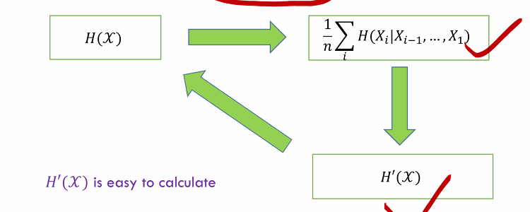

Week 3 of 2020 Spring

<!--more-->

[toc]

AEP研究了独立同分布的随机变量列, 我们希望得到更广泛的结论.

## Stochastic Process

### Introduction
A stochastic process $\left\{X_{i}\right\}$ is an indexed sequence of random variables.

一个例子: 赌徒的破产.
- 下一局的输赢概率与上一局无关
- p概率得1元,1-p概率丢一元
- 得到 $X_{i+1}=X_{i} \pm 1$
- Thus $X_{i}$ 's are not i.i.d.

### Stationary Process
**Definition** A stochastic process is said to be
stationary (稳态) if the **joint distribution** of _**any subset**_ **of the sequence of random variables is invariant** with respect to shifts in the time
index; that is, 任意随机变量的分布按照时间平移,得到的联合概率分布是不变的.
$$\begin{aligned}
& \operatorname{Pr}\left\{X_{1}=x_{1}, X_{2}=x_{2}, \ldots, X_{n}=x_{n}\right\} \\
=& \operatorname{Pr}\left\{X_{1+l}=x_{1}, X_{2+l}=x_{2}, \ldots, X_{n+l}=x_{n}\right\}
\end{aligned}$$
for every $n$ and every shift $l$ and for all $x_{1}, x_{2}, \ldots, x_{n} \in X$

**性质**:
1. 平移不变性:
   - $p\left(X_{1}\right)=p\left(X_{2}\right)=\cdots=p\left(X_{n}\right)$
   - $p\left(X_{1}, X_{3}\right)=p\left(X_{2}, X_{4}\right) \dots$
2. 高斯过程是一个稳态过程
3. 达到稳定状态后的马尔可夫链, 同分布而不独立
4. 我们的定义中只说明了稳态的分布, 这是强稳态, 与之相对应的是弱稳态. 在使用时, 两者没有严格的推出关系

通过稳态分布的定义, 我们可以证明一些结论.
**Theorem** 时间单向性, Time's arrow. Let $\left\{X_{i}\right\}_{i=-\infty}^{\infty}$ be a stationary stochastic process. Prove that
$$H\left(X_{0} | X_{-1}, X_{-2}, \dots, X_{-n}\right)=H\left(X_{0} | X_{1}, X_{2}, \dots, X_{n}\right)$$
即时间上的前后行动对系统没有影响.

**Proof.** 平移不变性, 首先有相同分布$H\left(X_{-n}, \dots, X_{0}\right)=H\left(X_{0}, \dots, X_{n}\right)$, $H\left(X_{-n}, \ldots, X_{-1}\right)=H\left(X_{1}, \ldots, X_{n}\right)$. 相减得证.

### Markov Chain

The Markov chain is said to be **time invariant** if the conditional probability $p\left(x_{n+1} | x_{n}\right)$ does not depend on $n ;$ that is, for $n=1,2, \ldots$
$$\operatorname{Pr}\left\{X_{n+1}=b | X_{-} n=a\right\}=\operatorname{Pr}\left\{X_{2}=b | X_{1}=a\right\} \quad \text{for all } a, b \in X$$
We will assume that the Markov chain **is time invariant unless otherwise stated**
A time-invariant Markov chain is characterized by its initial state =and a probability transition matrix $P=\left[P_{i j}\right], i, j \in\{1,2, \ldots, m\},$ where
$$P_{i j}=\operatorname{Pr}\left\{X_{n+1}=j | X_{n}=i\right\}$$
Example:
- Gambler's ruin
- Random Walk

### Stationary Distribution of MC
- By the definition of stationary, a Markov chain is stationary iff $p\left(X_{n+1}\right)=p\left(X_{n}\right)$
- If the probability mass function at time $n$ is $p\left(x_{n}\right)$, then
$$
p\left(x_{n+1}\right)=\sum_{x_{n}} p\left(x_{n}\right) P_{x_{n} x_{n+1}} \text { or } x^{T} P=x^{T}
$$
- If the initial state of a Markov chain is drawn according to a stationary distribution, the Markov chain is stationary
- Example: Consider a two state Markov chain with a probability transition matrix
$$P=\left[\begin{array}{cc}1-\alpha & \alpha \\ \beta & 1-\beta\end{array}\right]$$

$$\left(\mu_{1}, \mu_{2}\right)\left[\begin{array}{cc}
1-\alpha & \alpha \\
\beta & 1-\beta
\end{array}\right]=\left(\mu_{1}, \mu_{2}\right)$$

另解, 对小规模的网络, 由最大流-最小割定理, 考虑任意割集之间的流进与流出概率为0, For stationary distribution, the net probability flow across any cut set in zero
$$\mu_{1} \alpha=\mu_{2} \beta$$
$$\begin{array}{c}
\mu_{1}+\mu_{2}=1 \\
\mu_{1}=\frac{\beta}{\alpha+\beta} \text { and } \mu_{2}=\frac{\alpha}{\alpha+\beta}
\end{array}$$

## Entropy Rate
对复杂系统, 我们难以用一个时刻随机变量的熵, 我们希望描述熵的演化形式. 我们取系统联合熵的极限.
**Definition** The entropy rate of a stochastic process $\left\{X_{i}\right\}$ is defined by
$$
H(x)=\lim _{n \rightarrow \infty} \frac{1}{n} H\left(X_{1}, X_{2}, \ldots, X_{n}\right)
$$
when the limits exists(熵率也可能不存在)

计算方式: 
$$H\left(X_{n}, \dots, X_{1}\right)=\sum_{i=1}^{n} H\left(X_{i} | X_{i-1}, \dots, X_{1}\right)$$
For $H\left(X_{i} | X_{i-1}, \ldots, X_{1}\right),$ we now need to make clear of
- the existence of 
  $$\lim _{n \rightarrow \infty} H\left(X_{n} | X_{n-1}, \ldots, X_{1}\right)$$
- In a series $\left\{a_{n}\right\},$ if $a_{n} \rightarrow a,$ the existence of
$$
\lim _{n \rightarrow \infty} \frac{1}{n} \sum_{i=1}^{n} a_{i}
$$

### H'(X)

对稳态随机过程, 我们有如下性质: 
**Theorem** For a stationary stochastic process, $H\left(X_{n} | X_{n-1}, \ldots, X_{1}\right)$ is nonincreasing in $n$ and has a limit.
**Proof.** 
$$\begin{aligned}
& H\left(X_{n+1} | X_{n}, \ldots, X_{1}\right) \\
\leq & H\left(X_{n+1} | X_{n}, \ldots, X_{2}\right) \\
=& H\left(X_{n} | X_{n-1}, \ldots, X_{1}\right) \\
H &\left(X_{n} | X_{n-1}, \ldots, X_{1}\right) \geq 0
\end{aligned}$$
根据数列极限的结论(MCT): since $\left\{H\left(X_{n} | X_{n-1}, \ldots, X_{1}\right)\right\}$ is nonincreasing and $H\left(X_{n} | X_{n-1}, \ldots, X_{1}\right) \geq 0,$ the limit exists.

**Define**
$$H^{\prime}(x)=\lim _{n \rightarrow \infty} H\left(X_{n} | X_{n-1}, X_{n-2}, \ldots, X_{1}\right)$$
we have The limits $H^{\prime}(x)$ exists

### Cesaro Mean
Recall in Calculus, 
$$\text { If } a_{n} \rightarrow a \text { and } b_{n}=\frac{1}{n} \sum_{i=1}^{n} a_{i}, \text { then } b_{n} \rightarrow a$$
**Proof.**
Let $\epsilon>0 .$ since $a_{n} \rightarrow a$, there exists a number $N(\epsilon)$ such that $\left|a_{n}-a\right| \leq \epsilon$ for all $n \geq N(\epsilon) .$ Hence
$$\begin{aligned}
\left|b_{n}-a\right| &=\left|\frac{1}{n} \sum_{i=1}^{n}\left(a_{i}-a\right)\right| \\
& \leq \frac{1}{n} \sum_{i=1}^{n}\left|\left(a_{i}-a\right)\right| \\
& \leq \frac{1}{n} \sum_{i=1}^{N(c)}\left|a_{i}-a\right|+\frac{n-N(\epsilon)}{n} \epsilon \\
& \leq \frac{1}{n} \sum_{i=1}^{N(\epsilon)}\left|a_{i}-a\right|+\epsilon
\end{aligned}$$
Thus, $\left|b_{n}-a\right| \leq \epsilon^{\prime},$ for all $n \geq N(\epsilon)$.

### Entropy Rate for Stationary Process

**Theorem.** For a **stationary stochastic process**, the limits in $H(X)$ and $H^{\prime}(X)$ exist and are equal:
$$
H(x)=H^{\prime}(x)
$$

### Entropy Rate for Markov Chain

For a _**stationary**_ **Markov chain**, the entropy rate is given by
$$
\begin{aligned}
H(x) &=H^{\prime}(x)=\lim H\left(X_{n} | X_{n-1}, \ldots, X_{1}\right)=\lim H\left(X_{n} | X_{n-1}\right) \\
&=H\left(X_{2} | X_{1}\right)
\end{aligned}
$$
where the conditional entropy is calculated using the given stationary distribution.

Recall that the stationary distribution $\mu$ is the solution of the equations
$$
\mu_{j}=\sum_{i} \mu_{i} P_{i j} \text { for all } j
$$

**Theorem** Let $\left\{X_{i}\right\}$ be a stationary Markov chain with stationary distribution $\mu$ and transition matrix $P .$
Let $X_{1} \sim \mu$. Then the entropy rate is
$$
H(x)=-\sum_{i j} \mu_{i} P_{i j} \log P_{i j}
$$
**Proof.** 
$$H(x)=H\left(X_{2} | X_{1}\right)=\sum_{i} p\left(x_{i}\right) H\left(X_{2} | X_{1}=x_{i}\right)=\sum_{i} \mu_{i}\left(\sum_{j}-P_{i j} \log P_{i j}\right)$$

### Example: Random Walk

Undirected graph with weight $W_{i j} \geq 0$ and $W_{i j}=W_{j i}$
我们计算如下参量, 解题思路:
$$
\begin{array}{c}
P_{i j}=W_{i j} / \sum_{k} W_{i k} \\
W_{i}=\sum_{j} w_{i j}
\end{array}
$$
$W=\sum_{i} \frac{W_{i}}{2}$
The stationary distribution is
$$
\mu_{i}=\frac{W_{i}}{2 W}
$$
Verify it by $\mu P=\mu$
$$
\begin{array}{l}
H(x)=H\left(X_{2} | X_{1}\right) \\
=H\left(\ldots \frac{W_{i j}}{2 W}, \ldots\right)-H\left(\ldots, \frac{W_{i}}{2 W}, \ldots\right)
\end{array}
$$

## Second Law of Thermodynamics

Intuition: 我们观测的状态会受到基本原则的控制. 我们将物理过程抽象成马尔可夫链, 基本原理则抽象成转移矩阵

- One of the basic laws of physics, the second law of thermodynamics, states that the entropy of an isolated system is nondecreasing.
- We model the isolated system as a **Markov chain with transitions obeying the physical laws governing the system**.
  - Implicit in this assumption is the notion of an overall state of the system and the fact that knowing the present state, the future of the system is independent of the past.

Some Results
- Relative entropy $\mathrm{D}\left(\mu_{\mathrm{n}} \| \mu_{\mathrm{n}}^{\prime}\right)$ decreases with $n$ 
  (Pf. by 相对熵链式法则, 因为转移矩阵是不变的, 系统会趋于稳定)
- The conditional entropy $H\left(X_{n} | X_{1}\right)$ increases with $n$ for a stationary Markov process
- Shuffles increase entropy: $H(TX) \geq H(X)$ 

Reference: Neri Merhav (2010), “Statistical Physics and Information Theory,” Foundations and Trends® in Communications and Information Theory

## Extension: Functions of Markov Chains
本节的重点是熵率的性质, 此处介绍一个算法, 了解即可.

问题背景: 我们通过一些现象知道了一些看不见物质的存在. 我们用$X$表示看不到的现象, 他们通过一些物理法则, $\Phi$ 生成了现象$Y$. 如果$X$是稳态的, 我们如何计算观测结果的熵率?

> $$
> \begin{array}{ccccc}
> X_{1} & X_{2} & \ldots & X_{n} & \ldots \\
> \downarrow & \downarrow & \ldots & \downarrow & \ldots \\
> Y_{1}=\phi\left(X_{1}\right) & Y_{2}=\phi\left(X_{2}\right) & \ldots & Y_{n}=\phi\left(X_{n}\right) & \ldots
> \end{array}
> $$
> Let $X_{1}, X_{2}, \ldots, X_{n}, \ldots$ be a stationary Markov chain, and let $Y_{i}=\phi\left(X_{i}\right)$ be a process each term of which is a function of the corresponding state in the Markov chain. What is the entropy rate of $H(y)$ ?

- $\left\{Y_{i}\right\}:$ A very special case of hidden Markov model (HMM) 隐马尔科夫模型, 在信号处理等情况下十分常见
- $\left\{Y_{i}\right\}$ is not a Markov chain in general 并不一定是马尔可夫链, 因为Y取决于单个X的取值. 我们是无法直接得到Y之间的状态转移矩阵.
- $\left\{X_{i}\right\}$ is stationary $\Rightarrow\left\{Y_{i}\right\}$ is stationary, 但稳态分布是肯定的, 熵率还是可以通过求条件熵的极限获得
$$
H(\boldsymbol{y})=\lim _{\boldsymbol{n} \rightarrow \infty} \boldsymbol{H}\left(\boldsymbol{Y}_{\boldsymbol{n}} | \boldsymbol{Y}_{\boldsymbol{n}-\mathbf{1}}, \ldots, \boldsymbol{Y}_{\mathbf{1}}\right)
$$
- Drawback: Hard to ensure the convergence by $n$
- Solution: We have already known that $H\left(Y_{n} | Y_{n-1}, \ldots, Y_{1}\right)$ is lower bounded by $H(Y)$ 已知熵率是条件熵的下界.
  - Find a lower bound for $H(y)$ which is close to $H\left(Y_{n} | Y_{n-1}, \ldots, Y_{1}\right)$
- Let's have a look at $X_{1}$
  - $X_{1}$ contains much information about $Y_{n}$ as $Y_{1}, Y_{0}, Y_{-1}, \ldots \ldots$
$$
\boldsymbol{H}\left(\boldsymbol{Y}_{\boldsymbol{n}} | \boldsymbol{Y}_{\boldsymbol{n}-\mathbf{1}}, \ldots, \boldsymbol{Y}_{\mathbf{1}}, \boldsymbol{X}_{\mathbf{1}}\right)
$$
$\left(Y_{1} \text { could be ignored }\right)$ 这是没问题的, 因为$Y_1$是$X_1$的函数.

**Theorem.** If $X_{1}, X_{2}, \ldots, X_{n}$ form a stationary Markov chain, and $Y_{i}=\phi\left(X_{i}\right),$ then
$$
H\left(Y_{n} | Y_{n-1}, \ldots, Y_{1}, X_{1}\right) \leq H(y) \leq H\left(Y_{n} | Y_{n-1}, \ldots, Y_{1}\right)
$$
and $\lim {\boldsymbol{H}\left(\boldsymbol{Y}_{\boldsymbol{n}} | \boldsymbol{Y}_{\boldsymbol{n}-\mathbf{1}}, \ldots, \boldsymbol{Y}_{\mathbf{1}}, \boldsymbol{X}_{\mathbf{1}}\right)}=\boldsymbol{H}(\boldsymbol{y})=\lim \boldsymbol{H}\left(\boldsymbol{Y}_{\boldsymbol{n}} | \boldsymbol{Y}_{\boldsymbol{n}-\mathbf{1}}, \ldots, \boldsymbol{Y}_{\mathbf{1}}\right)$ 我们希望运用夹逼定理.

**Proof.** 
1. (handled) Y的条件熵是熵率的上界
2. 带$X_1$的条件熵是熵率的下界
   运用马尔可夫链的性质添加负项, 挪去条件熵增大, 应用平移不变性, 发现递减, 运用MCT
$$\begin{aligned}
& H\left(Y_{n} | Y_{n-1}, \ldots, Y_{2}, X_{1}\right) \\
=& H\left(Y_{n} | Y_{n-1}, Y_{2}, Y_{1}, X_{1}\right) \\
=& H\left(Y_{n} | Y_{n-1}, \ldots, Y_{1}, X_{1}, X_{0}, X_{-1}, \ldots, X_{-k}\right) \\
=& H\left(Y_{n} | Y_{n-1}, \ldots, Y_{1}, X_{1}, X_{0}, X_{-1}, \ldots, X_{-k}, Y_{0}, \ldots, Y_{-k}\right) \\
\leq & H\left(Y_{n} | Y_{n-1}, \ldots, Y_{1}, Y_{0}, \ldots, Y_{-k}\right) \\
=& H\left(Y_{n+k+1} | Y_{n+k}, \ldots, Y_{1}\right) \\
k & \rightarrow \infty \\
& H\left(Y_{n} | Y_{n-1}, \ldots, Y_{2}, X_{1}\right) \leq H(\mathcal{Y})
\end{aligned}$$
3. 带$X_1$条件下, 随着$n$的增大, 不等式两边熵无限接近, 即研究互信息趋向于0. 
$$H\left(Y_{n} | Y_{n-1}, \ldots, Y_{1}\right)-H\left(Y_{n} | Y_{n-1}, \ldots, Y_{1}, X_{1}\right) = I\left(X_{1} ; Y_{n} | Y_{n-1}, \ldots, Y_{1}\right)$$
首先注意到互信息小于熵
$$
I\left(X_{1} ; Y_{1}, Y_{2}, \ldots, Y_{n}\right) \leq H\left(X_{1}\right)
$$
这在极限条件下也成立, 运用链式法则展开
$$\begin{aligned}
H\left(X_{1}\right) &\geq \lim _{n \rightarrow \infty} I\left(X_{1} ; Y_{1}, Y_{2}, \ldots, Y_{n}\right)\\
&=\lim _{n \rightarrow \infty} \sum_{i=1}^{n} I\left(X_{1} ; Y_{i} | Y_{i-1}, \ldots, Y_{1}\right)\\
&=\sum_{i=1}^{\infty} I\left(X_{1} ; Y_{i} | Y_{i-1}, \ldots, Y_{1}\right)\\
\end{aligned}$$
无穷级数, 每一项都是正的, 极限存在, 那么对n足够大级数项趋向于0.
$$\begin{aligned}
&\begin{array}{c}
I\left(X_{1} ; Y_{n} | Y_{n-1}, \ldots, Y_{2}, Y_{1}\right) \rightarrow 0 \\
\| \\
\left(Y_{n} | Y_{n-1}, \ldots, Y_{2}, Y_{1}\right)-H\left(Y_{n} | Y_{n-1}, \ldots, Y_{1}, X_{1}\right)
\end{array}
\end{aligned}
$$