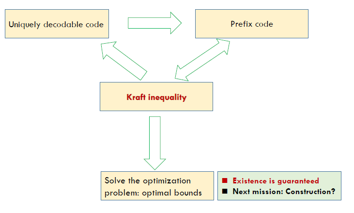

Week 4 of 2020 Spring

<!--more-->

[toc]

## Example of Codes

Let $X$ be a random variable with the following distribution and codeword assignment:
$$\begin{array}{ll}
\operatorname{Pr}(X=1)=1 / 2, & \text { codeword } C(1)=0 \\
\operatorname{Pr}(X=2)=1 / 4, & \text { codeword } C(2)=10 \\
\operatorname{Pr}(X=3)=1 / 8, & \text { codeword } C(3)=110 \\
\operatorname{Pr}(X=4)=1 / 8, & \text { codeword } C(4)=111
\end{array}$$

- Without of loss of generality, we can assume that the $D$ -ary alphabet is $\mathcal{D}=$ $\{0,1, \ldots, D-1\}$. 二进制中,D=2
- 信源编码 $C$ for a random variable $X$ is a mapping from $X$ to $D^{*}$, the set of finite-length strings of symbols from a D-ary (D元组) alphabet.
- Let $C(x)$ denote the codeword corresponding to $x$ and let $l(x)$ denote the length of $C(x)$
- The expected length $L(C)$ of a source code $C(x)$ for a random variable $X$ with probability mass function $p(x)$ is given by
$$L(C)=\sum_{x \in X} p(x) l(x)$$
  - What is min $L(C)$
  - How to construct such an optimal code
- Recall 在AEP中,码率大于等于熵

## Nonsingular Code
- 编码系统不希望两个字母有同样的编码. A code is said to be nonsingular if every element of the range of $X$ maps into $a$ different string in $D^{*} ;$ that is,
$$x \neq x^{\prime} \Rightarrow C(x) \neq C\left(x^{\prime}\right)$$
- 定义编码的连接 The extension $C^{*}$ of a code $C$ is the mapping from finite length strings of $X$ to finite-length strings of $D,$ defined by
  $$C\left(x_{1} x_{2} \ldots x_{n}\right)=C\left(x_{1}\right) C\left(x_{2}\right) \ldots C\left(x_{n}\right)$$

唯一可解码, 在扩展是非奇异的情况下, 编码是可解码的. A code is called uniquely decodable if its extension is nonsingular.
- In other words, any encoded string in a uniquely decodable code has only one possible source string producing it.

在对系统要求更高的情况下, 我们希望实时的解码, 
- 前缀码: 任意编码都不是另一个码的前缀
- 后缀码: 任意编码都不是另一个码的后缀
How to construct?\

### Prefix Code

由前缀码的性质, 我们可以用一些良好的结构描述编码方式.

如, 我们用三叉树表示三进制的码制.

我们也可以用区间来表示.

各个码制对应的左闭右开区间是$[0,1)$的一个互不相交的分割.

### Kraft Inequality
从数学上解决了前缀码存在的一个重要条件.
(Kraft Inequality 1949 ) For any instantaneous code (prefix code) over an alphabet of size
$D,$ the codeword lengths $l_{1}, l_{2}, \ldots, l_{m}$ must satisfy the inequality 
$$\sum_{i=1}^{m} D^{-l_{i}} \leqq 1$$
Conversely, given a set of codeword lengths that satisfy this inequality, there exists an instgntgneous code with these word lengths.

任意两个码制对应的路径是互相不能覆盖的. 当我选定一个路径之后, 我就不可能再将路径的终点展开(叶子转换成子树).

Assume $l_{1} \leq l_{2} \ldots \leq l_{m}$ (The maximum depth is $\left.l_{m}\right)$
- For $l_{i},$ it "occupied" a subtree in size $D^{l_{m}-l_{i}}$ 它把接下来的空间覆盖了
- The aggregate size of subtrees
  $$
  \sum_{i=1}^{m} D^{l_{m}-l_{i}}
  $$
- 对D叉树, 在$l_m$层有必要条件
  $$
  \sum_{i=1}^{m} D^{l_{m}-l_{i}} \leq D^{l_{m}} \Rightarrow \text { "only } i f^{\prime \prime}
  $$
- "if": mathematical induction 利用对m进行数学归纳法证明充分性
- m-1: 
  $$
  \sum_{i=1}^{m-1} D^{l_{m}-l_{i}} < D_{l_m}
  $$
- 一定存在没有覆盖的m

### Extended Kraft Inequality

(Extended Kraft Inequality) For any countably infinite set of codewords that form a prefix code, the codeword lengths satisfy the extended Kraft inequality,
$$\sum_{i=1}^{\infty} D^{-l_{i}} \leq 1$$
Conversely, given any $l_{1}, l_{2}, \ldots$ satisfying the extended Kraft inequality, we can construct a prefix code with these codeword lengths.

证明上, 树的表示不再适用. 我们用区间的方法.

必要性:

Let the D-ary alphabet be $\{0,1, \ldots, D-1\} .$ Consider the $i$ th codeword $y_{1} y_{2} \ldots y_{l_{i}}$
Let $0 . y_{1} y_{2} \ldots y_{l_{i}}$ be the real number given by the D-ary expansion
$$0 . y_{1} y_{2} \dots y_{l_{i}}=\sum_{j=1}^{l_{i}} y_{l_{j}} D^{-j}$$

This codeword corresponds to the interval
$$
\left[0 . y_{1} y_{2} \dots y_{i_{i}}, 0 . y_{1} y_{2} \dots y_{l_{i}}+\frac{1}{D^{l_{i}}}\right)
$$
- This is a subinterval of the unit interval [0,1
- By the prefix condition, these intervals are disjoint.

充分性:
将$l_1,l_2$递增排序, 从左往右依次切割[0,1]区间, 就可以构造前缀码.

## Optimal Codes

### Problem Formulation
Kraft inequality gives a mathematical expression on the existence of prefix code The problem of finding the prefix code with the minimum expected length could be formulated as a standard optimization problem
$$
\min L=\sum p_{i} l_{i}
$$
such that $\sum D^{-l_{i}} \leq 1$

考虑到$l_i$是整数较为复杂, 我们首先考虑实数的情况

By Lagrange, their gradient vectors are parallel $\nabla f(X)=\lambda \nabla g$

### Solution

The Lagrange multipliers
$$J=\sum p_{i} l_{i}+\lambda\left(\sum D^{-l_{i}}-1\right)$$
Differentiating with respect to $l_{i},$ we obtain
$$
\frac{\partial J}{\partial l_{i}}=p_{i}-\lambda D^{-l_{i}} \log _{e} D
$$
Setting the derivatives to $0,$ we obtain
$$
D^{-l_{i}}=\frac{p_{i}}{\lambda \log _{e} D}
$$
又因为$\sum D^{-l_i} = 1$

Substituting this in the constraint to find $\lambda$, we find $\lambda=1 / \log _{e} D,$ and hence
$$
\boldsymbol{p}_{i}=\boldsymbol{D}^{-\boldsymbol{l}_{i}}
$$
yielding optimal code lengths,
$$
l_{i}^{*}=-\log _{D} p_{i}
$$
This noninteger choice of codeword lengths yields expected codeword length
$$
L^{*}=\Sigma p_{i} l_{i}^{*}=\Sigma-p_{i} \log p_{i}=H_{D}(X)
$$
不一定是整数取得到, 但这可以是一个下界.
In general, $H_{D}(X)$ cannot be attained
$$
\boldsymbol{L}^{*} \geq \boldsymbol{H}_{\boldsymbol{D}}(\boldsymbol{X})
$$

然而, 我们通过推导得知, 在最优情况下, 有下面的关键关系.
$$\begin{aligned}
&p_{i}=D^{-l_{i}}\\
&l_{i}=-\log p_{i}
\end{aligned}$$

### Bounds

进一步, 码制在最优情况下的平均情况能满足以下不等式, 得到最优编码的上界是熵+1bit
Let $l_{1}^{*}, l_{2}^{*}, \ldots, l_{m}^{*}$ be optimal codeword lengths for a source distribution $\mathbf{p}$ and $D$ - ary alphabet, and let $L^{*}$ be the associated expected length of an optimal code $\left(L^{*}=\sum p_{i} l_{i}^{*}\right)$ Then
$$H_{D}(X) \leq L^{*}<H_{D}(X)+1$$

**Proof.**
向上取整
Recall that $p_{i}=D^{-l_{i}}$ and $l_{i}=-\log _{\mathrm{D}} p_{i}$
since $\log _{D} \frac{1}{p_{i}}$ may not equal to an integer, we round it up to give integer word-length assignments,
$$
l_{i}=\left|\log _{D} \frac{1}{p_{i}}\right| \Rightarrow \text { Shamon codes }
$$
我们可以验证新的编码长度满足Kraft不等式(由prefix区间不相交的性质保证)
Check $l_{i}^{\prime}$ s satisfying Kraft inequality.
$$
\log _{D} \frac{1}{p_{i}} \leq l_{i}<\log _{D} \frac{1}{p_{i}}+1
$$
Take expectations
$$
H_{D}(X) \leq L<H_{D}(X)+1
$$
下节课我们会继续介绍能否消除一个bit

## Approach the limit
将n个随机变量一同统一处理
Encode $n$ symbols $X_{1}, X_{2}, \ldots, X_{n}$ on $X$ together, where $X_{i}^{\prime} s$ are i.i.d $\sim p(x)$ Denote the alphabet by $\mathcal{X}^{n}$整体字母表, the expected codeword length by $L_{n},$ the length of codeword associated with $\left(x_{1}, x_{2}, \ldots, x_{n}\right)$ by $l\left(x_{1}, x_{2}, \ldots, x_{n}\right)$
$$
L_{n}=\frac{1}{n} \sum p\left(x_{1}, x_{2}, \ldots, x_{n}\right) l\left(x_{1}, x_{2}, \ldots, x_{n}\right)=\frac{1}{n} E l\left(X_{1}, X_{2}, \ldots, X_{n}\right)
$$
我们计算的是per symbol,所以记得除以n
Treat $X_{1}, X_{2}, \ldots, X_{n}$ as a whole and apply the lower bound aforementioned
$$
H\left(X_{1}, X_{2}, \ldots, X_{n}\right) \leq E l\left(X_{1}, X_{2}, \ldots, X_{n}\right)<H\left(X_{1}, X_{2}, \ldots, X_{n}\right)+1
$$
since $X_{i}^{\prime} s$ are i.i.d, $H\left(X_{1}, X_{2}, \ldots, X_{n}\right)=n H(X)$
$$
H(X) \leq L_{n} \leq H(X)+\frac{1}{n}
$$

定理: 区块编码
(Theorem.) The minimum expected codeword length per symbol statisfies
$$
\frac{H\left(X_{1}, X_{2}, \ldots, X_{n}\right)}{n} \leq L^{*}<\frac{H\left(X_{1}, X_{2}, \ldots, X_{n}\right)}{n}+\frac{1}{n}
$$
Moreover, if $X_{1}, X_{2}, \ldots, X_{n}$ is a stationary stochastic process,
$\rightarrow 11$

当n很大时, 期望以熵率为极限, 通过这种方式, 我们可以通过逼近的方式把+1bit去掉, 但坏处是字母表太大了$|\mathcal{X}|^n$码制数量是指数级的. 但至少, 系统的熵率是编码问题的极限.

## Wrong Code

What happens to the expected description length if the code is designed for the wrong distribution $(q(x)) .$ For example, the wrong distribution may be the best estimate that we can make of the unknown true distribution.

Recall 相对熵衡量随机变量之间的距离. 

(Wrong code) The expected length under $p(x)$ of the code assignment $l(x)=\log \frac{1}{q(x)}$ satisfies
$$
H(p)+D(p \| q) \leq E_{p} l(x)<H(p)+D(p \| q)+1
$$

$D(p \| q)$ 是我们估计产生偏差的惩罚项, 这是难以避免的, 但我们可以用数值量化.

$$\begin{aligned}
E l(x) &=\sum_{x} p(x)\left[\log \frac{1}{q(x)}\right] \\
&<\sum_{x} p(x)\left(\log \frac{1}{q(x)}+1\right) \\
&=\sum_{x} p(x) \log \frac{p(x)}{q(x)} \frac{1}{p(x)}+1 \\
&=\sum_{x} p(x) \log \frac{p(x)}{q(x)}+\sum_{x} p(x) \log \frac{1}{p(x)}+1 \\
&=D(p \| q)+H(p)+1
\end{aligned}$$

## Kraft Inequality For Uniquely Decodable Codes
我们进一步说明, Kraft不等式可以描述任意唯一可解码的编码方式, 因此我们仅研究前缀码就够了.
对任意可解码的编码方式， Kraft都成立。推论，对任意满足的$l_i$，如果没有其他特殊要求，前缀码就够了。
(McMillan) The codeword lengths of **any uniquely decodable** D-ary code must satisfy the Kraft inequality $\sum D^{-l_{i}} \leq 1$
Conversely, given a set of codeword lengths that satisfy this inequality, it is possible to construct a uniquely decodable code with these codeword lengths.

- Consider $C^{k} = C(x_1,\ldots,x_k)$, the $k$ th extension of the code (i.e., the code formed by the concatenation of $k$ repetitions of the given uniquely decodable code $C$ ). 考虑每一种编码方式的k次扩展，连在一起作为新的码制。
- By the definition of unique decodability, the $k$ th extension of the code is nonsingular. 由于可以解码，那么k次扩展也是可解码的。
- since there are only $D^{n}$ different D-ary strings of length $n,$ unique decodability implies that the number of code sequences of length $n$ in the $k$ th extension of the code must be no greater than $D^{n}$.考虑D元字符串中，最多有$D^{n}$不同的字符串，唯一可解码性意味着k次扩展码制的长度不能超过$D^{n}$

以上三个结论有助于我们进一步的证明。

- Let the codeword lengths of the symbols $x \in X$ be denoted by $l(x) .$ For the extension code, the length of the code sequence is $l\left(x_{1}, x_{2}, \ldots, x_{k}\right)=\sum_{i=1}^{k} l\left(x_{i}\right)$ 由于扩展是直接相连
- The inequality we wish to prove is $\sum_{x \in X} D^{-l(x)} \leq 1$ 
- Consider the $k$ th power of this quantity
  $$
  \begin{aligned}
  \left(\sum_{x \in X} D^{-l(x)}\right)^{k} &=\sum_{x_{1} \in X} \sum_{x_{2} \in X} \ldots \sum_{x_{k} \in X} D^{-l\left(x_{1}\right)} D^{-l\left(x_{2}\right)} \ldots D^{-l\left(x_{k}\right)} \\
  &=\sum_{x_{1}, x_{2}, \ldots, x_{k} \in X^{k}} D^{-l\left(x_{1}\right)} D^{-l\left(x_{2}\right)} \ldots D^{-l\left(x_{k}\right)} \\
  &=\sum_{x^{k} \in X^{k}} D^{-l\left(x^{k}\right)}=\sum_{m=1}^{k l_{\max }} a(m) D^{-m} \\
  & \leq \sum_{m=1}^{k l_{\max }} D^{m} D^{-m}=k l_{\max }
  \end{aligned}
  $$
  第一行，展开，第二行，合并，第三行，对不同的k，$l(x_k)$可能是相同的，我们合并同类项。
  - $a(m)$用到了生成函数的一些性质，即长度为m的编码方式所对应的数目。概念上类似二项式定理中的组合数。
  - $l \max$ is the maximum codeword length and $a(m)$ is the number of source sequences $x^{k}$ mapping into codewords of length $m$
  - 由于我们考虑的是k次扩展，最长长度是$kl_{max}$，
  - $a(m)\le D^m$是我们之前证明了的结论
  - 由于k任取，极限可以趋向于1。
  $$\sum_{x \in X} D^{-l(x)} \leq\left(k l_{\max }\right)^{\frac{1}{k}} \rightarrow 1, \text { as } k \rightarrow \infty$$
以上是必要性的证明，充分性的证明与唯一可分解码类似。
idea：k次扩展刚好对应于$\left(\sum_{x \in X} D^{-l(x)}\right)^{k}$

因此，Kraft可以约束所有可解码的方式
## Summary

本节我们介绍了最优编码的存在性, 下节课我们介绍最优编码的算法.

