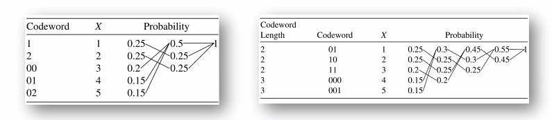
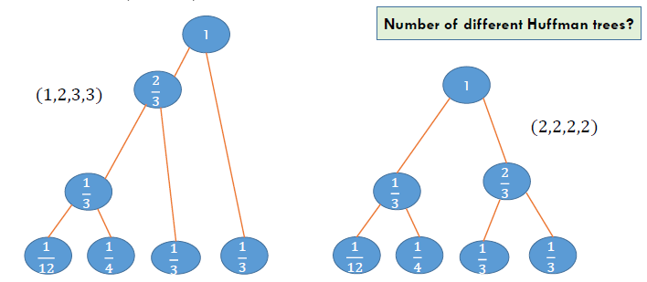
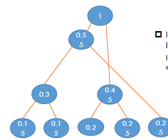
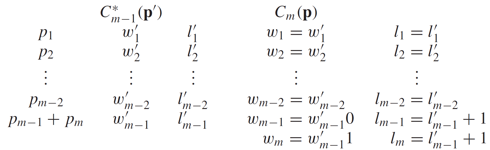
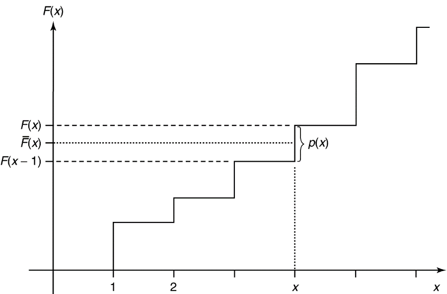
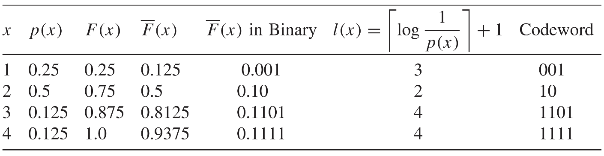

Week 4 of 2020 Spring

<!--more-->

## Huffman coding

### Algorithm

本质是一种贪心算法, D元组(字符串可以不仅是二进制)
> **D-ary Huffman codes (prefix code)** for a given distribution:
> Each time **combine $D$ symbols** with the **lowest probabilities** into a single source symbol, until there is only one symbol

对三元组, 二元组编码的Huffman编码实现

- Huffman Coding is optimal: $\min \sum p_{i} l_{i}$
- Huffman coding for weighted codewords $w_{i}$
  $$
  p_{i} \Rightarrow w_{i} \rightarrow \frac{w_{i}}{\sum w_{i}}
  $$
  等价问题: 用贪心策略取带权重期望长度的最小值. Huffman's algorithm for minimizing $\sum w_{i} l_{i}$ can be applied to any set of numbers $w_{i} \geq 0$

> If $D \geq 3,$ we may not have a sufficient number of symbols so that we can combine them $D$ at a time. In such a case, we **add dummy symbols to the end of the set of symbols**. The dummy symbols have probability o and are inserted to fill the tree.

- 如何计算哑符号的数量: since at each stage of the reduction, the number of symbols is reduced by $D-1$, we want the total number of symbols to be $1+k(D-1),$ where $k$ is the number of merges.
- 本质上原理是一致的 Morse Vs. Huffman Morse code could be regarded as a certain Huffman code when $p_{i}^{\prime} s$ are estimated
- Adaptive Huffman coding

### Extension

> Huffman code is not unique: $l_{i}, 1 \leq i \leq n$

- Counterexample: $0 \rightarrow 1,1 \rightarrow 0$ 一个简单的方式, 交换0,1的编码
- For $p(X)=\left(\frac{1}{3}, \frac{1}{3}, \frac{1}{4}, \frac{1}{12}\right),$ both (2,2,2,2) and (1,2,3,3) are optimal Huffman code. 即便是从码长不同的角度看, 我们也可能得到最优情况下不同的码长分布.
- 对number of different huffman trees, 还没有完善的结论

> A probability distribution $\Pr(X)$ is called **$D$ -adic** if each of the probabilities
> $$
> \Pr\left(X=x_{i}\right)=D^{-n}
> $$
> for some $n$
> - 因为如果概率分布满足D-adic, 那么可以保证取完对数后可以得到整数值. For a $D$ -adic distribution, the optimal solution in Lagrange is unique: $l_{i}=\log \frac{1}{p_{i}}=n_{i}$ 与上一节的香农码的优化问题对应.

- Huffman Vs. Shannon codes
  - Shannon codes $\left|\log \frac{1}{p_{i}}\right|$ attain optimality within 1 bit. If the prob. distribution is $D$ adic, **Shannon codes are optimal** 香农码有些情况可以取到最优值
  - **Shannon codes may be much worse when $p_{i} \rightarrow 0:$** Consider two symbols, one with probability 0.9999 and the other with probability $0.0001 .$ The optimal codeword length is 1 bit for both symbols. The lengths of Shannon codes are 1 and 14. 但Huffman整体情况下比香农码好
- Huffman codes in application
  - JPEG, PNG, ZIP, MP3
  - Cryptography
  - Internet protocol, HTTP header (RFC)

## Canonical Codes
我们希望证明哈弗曼编码的最优性, 我们先讨论一些有关最优编码(规范化编码)的基本性质

基本假设: Without loss of generality, we will assume that the probability masses are ordered, so that $p_{1} \geq p_{2} \geq \cdots \geq p_{m} .$ Recall that a code is **optimal if $\sum p_{i} l_{i}$ is minimal**.

Then, For any optimal coding scheme

> 1\. **概率越大,码长越小** The lengths are ordered inversely with the probabilities (i.e., if $p_{j}>p_{k}$, then $l_{j} \leq l_{k}$ ).

If $p_{j}>p_{k},$ then $l_{j} \leq l_{k}$ 反证法: 交换一下就发现码长期望变小了,contradict.
If not, swap the codewords of $j$ and $k$ Denote the new code by $C_{m}^{\prime}$
$$
\begin{aligned}
L\left(C_{m}^{\prime}\right)-L\left(C_{m}\right) &=\sum p_{i} l_{i}^{\prime}-\sum p_{i} l_{i} \\
&=p_{j} l_{k}+p_{k} l_{j}-p_{j} l_{j}-p_{k} l_{k} \\
&=\left(p_{j}-p_{k}\right)\left(l_{k}-l_{j}\right)<0
\end{aligned}
$$

> 2\. **最长的两个码码制长度一致** The two longest codewords have the same length

If the two longest codewords are not of the same length, one can delete the last bit of the longer one, preserving **the prefix property** and achieving lower expected codeword length. 因为去除最后一位后, 由前缀码的性质, 依然是合法的编码, 但却降低了码长

> 3\. **最长码制一定是兄弟姐妹** Two of the longest codewords differ only in the last bit and correspond to the two least likely symbols.

If there is a maximal length codeword without a sibling( 兄弟姐妹 ), we can delete the last bit of the codeword and still satisfy the prefix property. 如果存在这样的孤儿, 那么根据前缀码的性质, 去掉最后的bit, 依然是合法的编码, 但却降低了码长

### Optimality: Strategy

> We prove the optimality of Huffman coding **for a binary alphabet**
> - When $m=2,$ it is trivial
> - For any probability mass function for an alphabet of size $m, p=\left(p_{1}, p_{2}, \ldots, p_{m}\right)$ with $p_{1} \geq p_{2} \geq \cdots \geq p_{m},$ we define $\mathrm{p}^{\prime}=\left(p_{1}, p_{2}, \ldots, p_{m-2}, p_{m-1}+p_{m}\right)$ over an alphabet of size $m-1$
> Now we need to prove the optimality Huffman coding on $\mathrm{p}$ by the Huffman code on $\mathrm{p}^{\prime}$ Challenge: Not so obvious 归纳证明.

For any probability mass function for an alphabet of size $m, p=\left(p_{1}, p_{2}, \ldots, p_{m}\right)$ with $p_{1} \geq p_{2} \geq \cdots \geq p_{m},$ we define $\mathrm{p}^{\prime}=\left(p_{1}, p_{2}, \ldots, p_{m-2}, p_{m-1}+p_{m}\right)$ over an alphabet of size $m-1$.
Let $C_{m-1}^{*}\left(\mathrm{p}^{\prime}\right)$ be an optimal code for $\mathrm{p}^{\prime}$. Let $C_{m}(\mathrm{p})$ be a code for $\mathrm{p}$ $$C_{m-1}^{*}\left(\mathrm{p}^{\prime}\right) \Rightarrow C_{m}(p)$$

假设左边是最优的编码方案, 我们希望构造出右边的构造方案, 一个简单的操作是把后者的概率分布拆开. 新的码制都是原本码制基础上分别加0和1, 通过这样的操作, 我们可以计算出它们的平均码长符合如下的性质.

>  Expand an optimal code for $\mathrm{p}^{\prime}$ to construct a code for $\mathrm{p}$
> $$
> L(\mathbf{p})=L^{*}\left(\mathbf{p}^{\prime}\right)+p_{m-1}+p_{m}
> $$
> $\left(L \text { and } L^{*}\right)$ $L^{*}$是已知的最优编码,$L$是通过huffman方法构造出的编码
> $C_{m}(p)$ is a Huffman code. Maybe not optimal

From the canonical code for $\mathbf{p},$ we construct a code for $\mathbf{p}^{\prime}$ by merging the codewords for the two lowest-probability symbols $m-1$ and $m$ with probabilities $p_{m-1}$ and $p_{m},$ which are siblings by the properties of the canonical code. 由此前的规范化编码性质, 我们可以说明最长两者是兄弟节点, 因此这样的操作是合法的. The new code for $\mathbf{p}^{\prime}$ has average length:

$$\begin{aligned}
L\left(\mathbf{p}^{\prime}\right) &=\sum_{i=1}^{m-2} p_{i} l_{i}+p_{m-1}\left(l_{m-1}-1\right)+p_{m}\left(l_{m}-1\right) \\
&=\sum_{i=1}^{m} p_{i} l_{i}-p_{m-1}-p_{m} \\
&=L^{*}(\mathbf{p})-p_{m-1}-p_{m}
\end{aligned}$$

- Expand an optimal code for $p^{\prime}$ to construct a code for $p$ 
  $$L(\mathrm{p})=L^{*}\left(\mathrm{p}^{\prime}\right)+p_{m-1}+p_{m}$$
- Condense an optimal canonical code for $p$ to construct a code for the reduction $p^{\prime}$ 
  $$L\left(\mathrm{p}^{\prime}\right)=L^{*}(\mathrm{p})-p_{m-1}-p_{m}$$
- 两式相加, Together, 
  $$L(\mathrm{p})+L\left(\mathrm{p}^{\prime}\right)=L^{*}(\mathrm{p})+L^{*}\left(\mathrm{p}^{\prime}\right)$$
  since $L(\mathrm{p}) \geq L^{*}(\mathrm{p}), L\left(\mathrm{p}^{\prime}\right) \geq L^{*}\left(\mathrm{p}^{\prime}\right)$ 假设中的最优性
  $$L(\mathbf{p})=L^{*}(\mathbf{p}) \text{\quad and \quad} L\left(\mathbf{p}^{\prime}\right)=L^{*}\left(\mathbf{p}^{\prime}\right)$$
- 由此, 我们通过双向构造完成了归纳证明. 即如果p'上哈夫曼编码是最优的, 那么p上面的最优性也是保证的. **Let the optimal code on $\mathbf{p}^{\prime}$ be a Huffman code, then the expanded code on $p$ is also $a$ Huffman code and it is optimal for $p$**.
- 哈夫曼编码最优性的表述: Huffman coding is optimal; that is, if $C^{*}$ is a Huffman code and $C^{\prime}$ is any other uniquely decodable code, $L\left(C^{*}\right) \leq L\left(C^{\prime}\right)$

## Shannon-Fano-Elias coding

### Formulation

> Motivation: 虽然在平均码长上不如哈夫曼编码, 但提出了一种全新的构造方式, 且在后续的应用中获得了更高的改进. the codeword lengths $l(x)=\left\lceil\log \frac{1}{p(x)}\right\rceil \Rightarrow$ Kraft's inequality
> Without loss of generality, we can take $x=\{1,2, \ldots, m\} .$ Assume that $p(x)>0$ for all $x .$ The **cumulative(累积) distribution function** $F(\boldsymbol{x})$ is defined as $F(x)=\sum_{a \leq x} p(a)$
> Consider the modified cumulative distribution function
> $$
> \bar{F}(x)=\sum_{a<x} p(a)+\frac{1}{2} p(x)=F(x)-\frac{1}{2} p(x)
> $$
> 折线段上,我们取中间的节点. 这样设置的好处:
> - The step size is $p(x) . F(x)$ is the midpoint.
> - $\bar{F}(x)$ can determine $x .$ **Thus is a code for $x$**
> 
 
- $\bar{F}(x)$ is a real number. Truncate $\bar{F}(x)$ to $l(x)$ bits and use the first $l(x)$ bit of $\bar{F}(x)$ as a code for $x .$ Denote by $\lfloor\bar{F}(x)\rfloor_{l(x)}$
- We have: $\bar{F}(x)-\left\lfloor\bar{F}(x)\right\rfloor_{l(x)} \leq \frac{1}{2^{l(x)}}$
If $l(x)=\left\lceil\log \frac{1}{p(x)}\right\rceil+1$
$$
\frac{1}{2^{l(x)}} \leq \frac{p(x)}{2}=\bar{F}(x)-\bar{F}(x-1)
$$
$\lfloor\bar{F}(x)\rfloor_{l(x)}$ lies within the step corresponding to $x .$ Thus, $l(x)$ bits suffice to describe $x$. (Prefix-free code)
$$
L=\sum p(x) l(x)<H(X)+2
$$

> ROADMAP: CDF -> improved CDF
> $$p(x) \Rightarrow F(x)=\sum_{a \leq x} p(a) \Rightarrow \bar{F}(x)=F(x)-\frac{1}{2} p(x) \Rightarrow l(x)+1 \text { bits }$$

### Example

The average codeword length is 2.75 bits and the entropy is 1.75 bits. The Huffman code for this case achieves the entropy bound.
- Direct application of Shannon-Fano-Elias coding would also need arithmetic **whose precision grows with the block size**, which is not practical when we deal with long blocks.
- Shannon-Fano-Elias $\Rightarrow$ 改进 Arithmetic coding

### Optimality

> (Optimality) Let $l(x)$ be the codeword lengths associated with the Shannon code, and let $l^{\prime}(x)$ be the codeword lengths associated with any other uniquely decodable code. Then
> $$
> \Pr\left(l(x) \geq l^{\prime}(x)+c\right) \leq \frac{1}{2^{c-1}}
> $$
> Hence, no other code can do much better than the Shannon code most of the time 注意,是具体码制的随机变量,而不是平均码长, 不与Huffman矛盾.

For example, the probability that $l^{\prime}(X)$ is 5 or more bits shorter than $l(X)$ is less than $\frac{1}{16}$
$$
\begin{aligned}
\Pr\left(l(X) \geq l^{\prime}(X)+c\right) &=\Pr\left(\left\lceil\log \frac{1}{p(X)}\right\rceil \geq l^{\prime}(X)+c\right) \\
& \leq \Pr\left(\log \frac{1}{p(X)} \geq l^{\prime}(X)+c-1\right) \\
&=\Pr\left(p(X) \leq 2^{-l^{\prime}(X)-c+1}\right) \\
&=\sum_{x: p(x) \leq 2^{-l^{\prime}(x)-c+1}} p(x) \\
& \leq \sum_{x: p(x) \leq 2^{-l^{\prime}(x)-c+1}} 2^{-l^{\prime}(x)-(c-1)} \\
& \leq \sum_{x} 2^{-l^{\prime}(x)} 2^{-(c-1)} \\
& \leq 2^{-(c-1)}
\end{aligned}
$$
since $\sum 2^{-l^{\prime}(x)} \leq 1$ by the Kraft inequality.

Hence, no other code can do much better than the Shannon code most of the time. We now strengthen this result. In a game-theoretic setting, one would like to ensure that $l(x)<l^{\prime}(x)$ more often than $l(x)>l^{\prime}(x)$ The fact that $l(x) \leq l^{\prime}(x)+1$ with probability $\geq \frac{1}{2}$ does not ensure this. We now show that even under this stricter criterion, Shannon coding is optimal. Recall that the probability mass function $p(x)$ is dyadic if $\log \frac{1}{p(x)}$ is an integer for all $x$