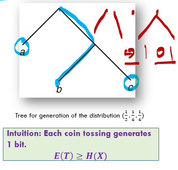
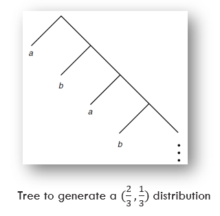
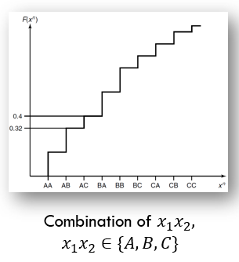
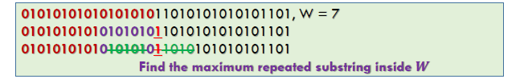
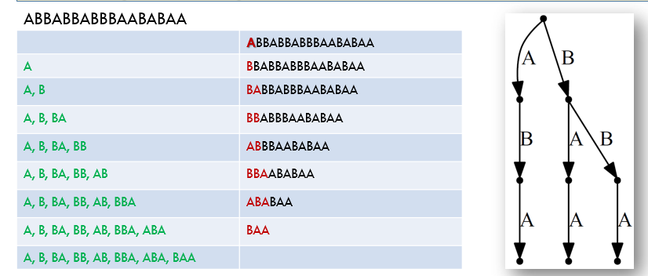

Week 5 of 2020 Spring

<!--more-->

[[toc]]

## Random Variable Generation

### Introduction

> We are given a sequence of fair coin tosses $Z_{1}, Z_{2}, \ldots,$ and we wish to generate $X$ on $X=\{1,2, \ldots, m\}$ with probability mass function $\mathbf{p}=$ $\left(p_{1}, \ldots, p_{m}\right)$
> 直观上, 只要我们抛的够多, 就可以生成X的分布.
> 但我们希望不要抛太多.
> Let the random variable $T$ denote the number of coin flips used in the algorithm

Generate a random variable according the outcome of fair coin flips:

HHHH, TTTTT, HTHTHT, THTHTH 
比如,我们要构造这样的概率分布, If $X=\{0,1,2\}, p(X)=\left(\frac{1}{2}, \frac{1}{4}, \frac{1}{4}\right)$, 利用抛硬币的结果, 我们可以设置这样的生成机制.
$\mathrm{H}: X=0$
$\mathrm{TH}: X=1$
$\mathrm{TT}: X=2$

> 算法优化的目标: How many fair coin flips to generate $X$?
> Recall: The entropy of $X$ $H(X)=1.5$
> 如果一个问题跟信息有关系, 联想到熵
> The expected number of coin flips $E(T)=1.5$

### Formulation

> Representation of a generation algorithm 
> We can describe the algorithm mapping strings of bits $Z_{1}, Z_{2}, \ldots,$ to possible outcomes $X$ by **a binary tree** 
> The **leaves** of the tree are marked by output symbols $X$, and the path to the leaves is given by the sequence of bits produced by the fair coin

The tree representing the algorithm must satisfy certain properties:
- The tree should be **complete** (i.e., every node is either a leaf or has two descendants in the tree). The tree may be infinite, as we will see in some examples. 
- The probability of a leaf **at depth $k$ is $2^{-k}$.** **Many leaves may be labeled with the same output symbol** 不同的叶子节点可能对应同一个随机变量 - the total probability of all these leaves should equal the desired probability of the output symbol.
- The expected number of fair bits $E T$ required to generate $X$ is equal to the expected depth of this tree.

### Properties

> Let $\mathcal{y}$ denote the set of leaves of a complete tree. Consider a distribution on the leaves such that the probability of a leaf at depth $k$ on the tree is $2^{-k} .$ Let $Y$ be a random variable with this distribution. 
> (Lemma). For any complete tree, consider a probability distribution on the leaves such that the probability of a leaf at depth $k$ is $2^{-k} .$ Then **the expected depth of the tree is equal to the entropy of this distribution $(H(Y)=E T)$.**

Proof. trivial.

$$E(T)=\sum_{y \in y} k(y) 2^{-k(y)}$$

The entropy of the distribution of $Y$ is
$$
\begin{aligned}
H(Y) &=-\sum_{y \in \mathcal{Y}} \frac{1}{2^{k(y)}} \log \frac{1}{2^{k(y)}} \\
&=\sum_{y \in y} k(y) 2^{-k(y)}
\end{aligned}
$$
where $k(y)$ denotes the depth of leaf $y .$ 在这里, 暂时不考虑$Y$有相同的情况. Thus,

**在$Y$的样本空间和叶子节点一一对应时**, $H(Y)=E T$.

> (Theorem). 考虑任意生成算法 For any algorithm generating $X$, the expected number of fair bits used is greater than the entropy $H(X),$ that is, $E(T)\geq H(X)$

- Any algorithm generating $X$ from fair bits can be represented by a complete binary tree. 生成算法其实是给没一个叶子节点编号. Label all the leaves of this tree by distinct symbols $y \in Y=\{1,2, \ldots\} .$ 特别的, 考虑If the tree is **infinite**, the alphabet $Y$ is also **infinite**.
- Now consider the random variable $Y$ defined on the leaves of the tree, such that for any leaf $y$ at depth $k$, the probability that $Y=y$ is $2^{-k}$. The expected depth of this tree is equal to the entropy of $Y:$
  $$E T=H(Y)$$
- Now the random variable $X$ is **a function of $Y$** (one or more leaves map onto an output symbol), and hence we have $H(X) \leq H(Y) \leq E(T)$

给出了基本下界, 证明是在上一页基本lemma上, 将算法的生成描述成了一个函数关系.

### Algorithm

> (Theorem). 下界是否可以取到 Let the random variable $X$ have a **dyadic distribution**. (每一个概率分布都可以写作$D^{-n}$) The optimal algorithm to generate $X$ from fair coin flips requires an expected number of coin tosses precisely equal to the entropy:
> $$E T=H(X)$$

- For the constructive part, we use the Huffman code tree for $X$ as the tree to generate the random variable. Each $X=x$ will correspond to a leaf.
- For a dyadic distribution, the Huffman code is the same as the Shannon code and achieves the entropy bound. *(Recall Lagrange Formula, 最优解可以取到)*
  $$- l_{i}=\log D^{-n_{i}}=n_{i}$$
- 又, 每个事件只对应一个节点, For any $x \in X,$ the depth of the leaf in the code tree corresponding to $x$ is the length of the corresponding codeword, which is $\log \frac{1}{p(x)} .$ Hence, when this code tree is used to generate $X,$ the leaf will have a probability 
  $$2^{-\log _{p}(x)}=p(x)$$
- The expected number of coin flips is the expected depth of the tree, which is equal to the entropy (because the distribution is dyadic). Hence, for a dyadic distribution, the optimal generating algorithm achieves
  $$- E T=H(X)$$

一般情况?

- If the distribution is not dyadic? In this case we cannot use the same idea, since **the code tree for the Huffman code will generate a dyadic distribution on the leaves, not the distribution** with which we started 样本空间不再与叶子节点一一对应.
- since all the leaves of the tree have probabilities of the form $2^{-k},$ it follows that **we should split any probability $p_{i}$ that is not of this form into atoms of this form**. We can then allot these atoms(原子形式) to leaves on the tree

$$p(x)=\frac{7}{8}=\frac{1}{2}+\frac{1}{4}+\frac{1}{8}$$

> **Finding the binary expansions of the probabilities $p_{i}^{\prime} s$.**二进制展开式 Let the binary expansion of the probability $p_{i}$ be
> $$p_{i}=\sum_{j \geq 1} p_{i}^{(j)}$$
> 对应叶子节点 where $p_{i}^{(j)}=2^{-j}$ or $0 .$ Then the atoms of the expansion are the $\left\{p_{i}^{(j)}: i=1,2, \ldots, m, j \geq 1\right\}$
> Since $\sum_{i} p_{i}=1,$ **the sum of the probabilities of these atoms is $1 .$** We will allot an atom of probability $2^{-j}$ to a leaf at depth $j$ on the tree.
> The **depths (j) of the atoms satisfy the Kraft inequality**, we can always construct such a tree with all the atoms at the right depths.

### Example

Let $X$ have distribution
$$X=\left\{\begin{array}{l}
a \text { with prob. } \frac{2}{3} \\
b \text { with prob. } \frac{1}{3}
\end{array}\right.$$
We find the binary expansions of these probabilities:
$$
\begin{array}{l}
\frac{2}{3}=0.10101010 \ldots 2 \\
\frac{1}{3}=0.01010101 \ldots 2
\end{array}
$$
Hence, the atom for the expansion are:
$$
\begin{array}{l}
\frac{2}{3} \rightarrow\left(\frac{1}{2}, \frac{1}{8}, \frac{1}{32}, \ldots\right) \\
\frac{1}{3} \rightarrow\left(\frac{1}{4}, \frac{1}{16}, \frac{1}{64}, \ldots\right)
\end{array}
$$

> This procedure yields a tree that generates the random variable $X$. We have argued that this procedure is optimal (gives a tree of minimum expected depth) 因为是最优的, 所以也是完全的.
> 我们也可以从理论上证明, 期望深度的最小值具有上界.
> (Theorem) The expected number of fair bits required by the optimal algorithm to generate a random variable $X$ lies between $H(X)$ and $H(X)+2$:
> $$ H(X) \leq E T<H(X)+2 $$

## Universal Source Coding
理论应用实际的限制: Challenge: For many practical situations, however, the probability distribution underlying the source may be unknown 信源的分布是未知的
- One possible approach is to wait until we have seen all the data, **estimate the distribution** from the data, use this distribution to construct the best code, and then **go back** to the beginning and compress the data using this code.
  - This two-pass procedure is used in some applications where there is a fairly small amount of data to be compressed.
- In yet other cases, there is no probability distribution underlying the data-all we are given is an individual sequence of outcomes. How well can we compress the sequence?
  - If we do not put any restrictions on the class of algorithms, we get a meaningless answer- there always exists a function that compresses a particular sequence to one bit while leaving every other sequence uncompressed. This function is clearly "overfitted" to the data. 我们需要构造通用的算法. 为此, 压缩算法要有一些限制(counter.e.g.: 1 bit)

> Assume we have a random variable $X$ drawn according to a distribution from the family $\left\{p_{\theta}\right\},$ **where the parameter $\theta \in\{1,2,3, \ldots, m\}$ is unknown** We wish to find an efficient code for this source

### Minmax Redundancy

根据上面的问题假设, 我们进行如下分析
- **If we know $\theta$**, we can construct a code with codeword length $l(x)=\log \frac{1}{p_{\theta}(x)}$ 为了分析的方便, 我们省略向上取整的一步.(+1 bit)
  $$\min _{l(x)} E_{p}[l(X)]=E_{p}\left[\log \frac{1}{p_{\theta}(X)}\right]=H\left(p_{\theta}\right)$$
- What happens if **we do not know the true distribution $p_{\theta}$**, yet wish to code as efficiently as possible? In this case, using a code with codeword lengths $l(x)$ and implied probability $q(x)=2^{-l(x)},$ we define the redundancy of the code as the difference between the expected length of the code and the lower limit for the expected length: 定义冗余
  $$
  \begin{aligned}
  R\left(p_{\theta}, q\right) &=E_{p_{\theta}}[l(x)]-E_{p_{\theta}}\left[\log \frac{1}{p_{\theta}(x)}\right]=\sum_{x} p_{\theta}(x)\left(l(x)-\log \frac{1}{p_{\theta}(x)}\right) \\
  &=\sum_{x} p_{\theta}(x)\left(\log \frac{1}{q(x)}-\log \frac{1}{p_{\theta}(x)}\right)=D\left(p_{\theta} \| q\right)
  \end{aligned}
  $$
- 这样, 我们定义了在不知道真实分布的情况下, 某种编码的冗余程度是它和真实分布之间的相对熵
- 目标:最大冗余最小化, We wish to find a code that does well irrespective of the true distribution $p_{\theta},$ and thus we define the **minimax redundancy as**
  $$
  R^{*}=\min _{a} \max _{n e} R=\min _{a} \max _{n e} D\left(p_{\theta} \| q\right)
  $$

### Redundancy and Capacity

对任意冗余我们可以构造一个信道. 任意最小最大冗余的计算可以归结为信道容量的计算.

> (Theorem) The capacity of a channel $p(x | \theta)$ with rows $p_{1}, p_{2}, \ldots, p_{m}$ is given by
> $$ C=R^{*}=\min _{q} \max _{\theta} D\left(p_{\theta} \| q\right) $$

将信源的所有可能分布写作一个状态转移矩阵, 看作一个信道

How to compute $R^{*}$ : Take $\left\{p_{\theta}: 1 \leq \theta \leq m\right\}$ as a transition a matrix 
$$
\boldsymbol{\theta} \rightarrow\left[\begin{array}{c}\ldots p_{1}(x) \ldots \\ \ldots p_{2}(x) \ldots \\ \vdots \\ \ldots p_{\theta}(x) \ldots \\ \ldots p_{m}(x) \ldots\end{array}\right] \rightarrow X
$$

This is a channel $\left\{\theta, p_{\theta}(x), x\right\}$. The capacity of this channel is given by

$$
C=\max _{\pi(\theta)} I(\theta ; X)=\max _{\pi(\theta)} \sum_{\theta} \pi(\theta) p_{\theta}(x) \log \frac{p}{q}
$$

where $q_{\pi}(x)=\sum_{\theta} \pi(\theta) p_{\theta}(x)$

信道和相对熵是等价的

## Arithmetic Coding

> Recall: Shannon-Fano-Elias Coding: $F(a)=\Pr(x \leq a)$
> $$l(x)=\left\lceil\frac{1}{p(x)}\right\rceil+1$$
> $$H(X) \leq E(l(x))<H(X)+2$$
> Motivation: using intervals to represent symbols

Consider a random variable $X$ with a ternary alphabet $\{A, B, C\},$ with probabilities $0.4,0.4,$ and 0.2 respectively. $F(x)=(0.4,0.8,1.0)$.
Let the sequence to be encoded by **ACAA**
- $A \rightarrow[0,0.4)$
- $AC \rightarrow[0.32,0.4) \text { (scale with ratio }(0.4,0.8,1.0))$ 在上一区间的基础上进一步缩放
- $A C A \rightarrow[0.32,0.352)$
- $ACAA \rightarrow[0.32,0.3328)$

## Lempel-Ziv Coding: Introduction

基于字典的适应性的编码, 动态调整字典大小

Use dictionaries for compression dates back to the invention of the telegraph.
- ".25: Merry Christmas"
- "26: May Heaven's choicest blessings be showered on the newly married couple."

The idea of **adaptive dictionary-based** schemes was not explored until Ziv and Lempel wrote their papers in 1977 and $1978 .$ The two papers describe two distinct versions of the algorithm. We refer to these versions as LZ77 or sliding window Lempel-Ziv and LZ78 or tree-structured Lempel-Ziv.

Gzip, pkzip, compress in unix, GIF

LZ编码有两种方式: 滑动窗口/

### Sliding Window

The key idea of the Lempel-Ziv algorithm is to **parse the string into phrases** and to replace phrases by pointers to where the same string has occurred in the past. 重复出现的短语用记号替代它

> Sliding Window Lempel-Ziv Algorithm
> We assume that we have a string $x_{1}, x_{2}, \ldots$ to be compressed from a finite alphabet. A **parsing** $S$ of a string $x_{1} x_{2} \cdots x_{n}$ is a division of the string into phrases, separated by commas.Let $W$ be the **length of the window**.
> Assume that we have compressed the string until time $i-1 .$
> - Then to find the next phrase, find the largest $k$ such that for some $j, i-W \leq j \leq i-1,$ the string of length $k$ starting at $x_{j}$ is equal to the string (of length $k$ ) starting at $x_{i}$ (i.e., $x_{j+l}=x_{i+l}$ for all $0 \leq l<k$ ). The next phrase is then of length $k$ (i.e., $x_{i} \ldots x_{i+k-1}$ ) and is represented by the pair (P, $L$ ), where $P$ is the location of the beginning of the match and $L$ is the length of the match. 
> If a match is not found in the window, the next character is sent uncompressed.

For example, if $W=4$ and the string is ABBABBABBBAABABA and the initial window is empty, the string will be parsed as follows: $\mathrm{A}, \mathrm{B}, \mathrm{B}, \mathrm{ABBABB}, \mathrm{BA}, \mathrm{A}, \mathrm{BA}, \mathrm{BA},$ which is represented by the sequence of "pointers": $(0, \mathrm{A}),(0, \mathrm{B}),(1,1,1),(1,3,6),(1,4,2),(1,1,1),(1,3,2),(1,2,2),$ where the flag bit is 0 if there is no match and 1 if there is a match, and the location of the match is measured backward from the end of the window. [In the example, we have represented every match within the window using the $(P, L)$ pair; however, it might be more efficient to represent short matches as uncompressed characters. See Problem 13.8 for details.]

We can view this algorithm as using a dictionary that consists of all substrings of the string in the window and of all single characters. The algorithm finds the longest match within the dictionary and sends a pointer to that match. We later show that a simple variation on this version of LZ77 is asymptotically optimal. Most practical implementations of LZ77, such as gzip and pkzip, are also based on this version of LZ77.

### Tree-Structure

思想一致, 解析标准改变了:
each phrase is the shortest phrase not seen earlier.

我们用搜索树为字典建模.

"Trie" in data structure.

Since this is the shortest such string, all its prefixes must have occurred earlier. (Thus, we can build up a tree of these phrases.) In particular, the string consisting of all but the last bim of this string must have occurred earlier. We code this phrase by givine the location of the prefix and the value of the last symbol. Thus, the string above would be represented as $(0, \mathrm{A}),(0, \mathrm{B}),(2, \mathrm{A}),(2, \mathrm{B}),(1, \mathrm{B}),(4, \mathrm{A}),(5, \mathrm{A}),(3, \mathrm{A})$