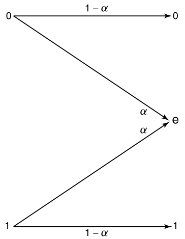

Week 5 of 2020 Spring.

<!--more-->

Noise cannot be eliminated from our life. We should learn how to cope with it.

## Noise in Information Transmission

When you send your friend a message via Email/QQ/wechat, you might experience the following failures due to current network environment. 将信息传递中的噪音干扰问题用数学建模

> For each task, the message is $M$ with alphabet $\mathcal{M}$ 将信息用字母表表示
> How to model the end-to-end pipeline between the sender and the receiver
> - The input is $X$ with alphabet $\mathcal{X}$, the output is $Y$ with alphabet $\mathcal{Y} . \mathcal{X}$ and $\mathcal{Y}$ may be disjoint
> - The change from $X \rightarrow Y$ can be modeled as a transition matrix between $X$ and $Y$
>   $$p(Y | X)$$
> The channel is just like a phone. Each time, you could use it to make a call (M)
> The message may be too large to send in just one use of the channel. Thus
>  $$M \rightarrow X_{1}, \ldots, X_{n}$$
> That is, the channel is used $n$ times and we use a random process $\left\{X_{i}\right\}$ to denote it.
> Does $\mathrm{p}(Y | X)$ remain the same for each $X_{i}^{2}$. Or we need to define $p_{i}(Y | X)$ for $X_{i}$
> 无论背景噪声如何变化, 我们都定义成状态转移矩阵

## Discrete Memoryless Channel
离散无记忆信道(DMC)

> Discrete memoryless channel
> A discrete channel is a system consisting of an input alphabet $\mathcal{X}$ and output alphabet $\mathcal{Y}$ and a probability transition matrix $p(y | x)$ that expresses the probability of observing the output symbol $y$ given that we send the symbol $x$
> 根据我们的实际需求, 我们要求$\Pr (W \neq \hat{W}) \rightarrow 0$
> The channel is said to be **memoryless** 即第二次与第一次无影响 if the probability distribution of the output depends only on the input at that time and is conditionally independent of previous channel inputs or outputs. (Each time, it is a new channel)

$(\mathcal{X}, p(y | x), \mathcal{Y)$: When you try to send $x$, with probability $p(y | x)$, the receiver will get $y$ DMC被定义为一个三元组

## Channel Capacity

> We define the "information" channel capacity of a discrete memoryless channel as
> $$C=\max _{p(x)} I(X ; Y)$$
> where the maximum is taken over all possible input distributions $p(x)$
> 通常,$p(x)$的实际意义是编码方式, 因此我们实际上是在对给定的信道进行优化, 得到最好的编码目标

- $C \geq 0$ since $I(X ; Y) \geq 0$
- $C \leq \log |X|$ since $C=\max I(X ; Y) \leq \max H(X)=\log |X|$
- $C \leq \log |y|$ for the same reason
- $I(X ; Y)$ is a continuous function of $p(x)$
- $I(X ; Y)$ is a concave function of $p(x)$ (recall 信息熵)
  - since $I(X ; Y)$ is a concave function over a closed convex set, a local maximum is a global maximum
  - 因此, 在这个意义上(闭区间凹函数): $\sup I(X ; Y)=\max I(X ; Y)$

"$C=I(X ; Y)$" the most important formula in information age

## Properties Of Channel Capacity

General strategy to calculate $C:$
- $I(X ; Y)=H(Y)-H(Y | X)$
  - Estimate $H(Y | X)=\sum_{x} H(Y | X=x) p(x)$ by the given transition probability matrix
  - Estimate $H(Y)$
- In very few situations, $I(X ; Y)=H(X)-H(X | Y)$
  - Estimate $H(X | Y)$ by the given conditions in the problem
  - Estimate $H(X)$

In general, we do not have a closed form expression ( 显式表达式 ) for channel capacity except for some special $p(y | x)$

## Examples

### Noiseless Binary Channel
Suppose that we have a channel whose the binary input is reproduced exactly at the output
In this case, any transmitted bit is received without error

> $$C=\max I(X ; Y)=\max I(X ; X)=\max H(X) \leq 1$$
> which is achieved by using $p(x)=\left(\frac{1}{2}, \frac{1}{2}\right)$

### Noisy Channel with Nonoverlapping Outputs

This channel has two possible outputs corresponding to each of the two inputs. 噪音没有使信号叠加在一起
The channel appears to be noisy, but really is not.

$$C=\max I(X ; Y)=H(X) \leq 1$$

### Noisy Typewriter

The transition matrix: For each $x \in\{A, B, \ldots ., Z\}$
$$
p(x | x)=\frac{1}{2}, \quad p(x+1 | x)=\frac{1}{2}
$$
The channel looks symmetric (由对称性)
$$
\begin{array}{c}
H(Y | X=x)=1 \\
H(Y | X)=\sum p(x) H(Y | X=x)=1
\end{array}
$$
The capacity
$$
\begin{array}{c}
C=\max I(X ; Y) \\
=\max (H(Y)-H(Y | X))=\max H(Y)-1=\log 26-1=\log 13 \\
p(x)=\frac{1}{26}
\end{array}
$$

### Example: Binary Symmetric Channel
错误率为$p$

由信道的特殊性, 我们可以用单独的随机变量表示噪声, 吧噪声的影响建模为数学取模过程.

$$\begin{array}{c}
X, Y, Z \in\{0,1\} \\
\Pr(Z=0)=1-p \\
Y=X+Z(\bmod 2) \\
H(Y | X=x)=H(p)
\end{array}$$

$$\begin{array}{l}
C=\max I(X ; Y) \\
\quad=\max H(Y)-H(Y | X) \\
\quad=\max H(Y)-\sum p(x) H(Y | X=x) \\
\quad=\max (Y)-\sum p(x) H(p) \\
=\max H(Y)-H(p) \\
\leq 1-H(p) \\
\quad C=1-H(p)
\end{array}$$

> **BSC** is the simplest model of a channel with errors, yet it captures most of the complexity of the general problem 记住$C = 1-H(p)$的结论

### Example: Binary Erasure Channel

The analog of the binary symmetric channel in which some bits are lost (rather than corrupted) is the binary erasure channel. In this channel, a fraction α of the bits are erased. 
The receiver knows which bits have been erased. The binary erasure channel has two inputs and three outputs

$$H(Y | X=x)=H(\alpha)$$

$$\begin{aligned}
C &=\max _{p(x)} I(X ; Y) \\
&=\max _{p(x)}(H(Y)-H(Y | X)\\
&=\max _{p(x)} H(Y)-H(\alpha)
\end{aligned}$$

$$\begin{aligned}
&\text { By letting } \Pr(X=1)=\pi\\
&\begin{array}{l}
H(Y)=H((1-\pi)(1-\alpha), \alpha, \pi(1-\alpha)) \\
\quad=H(\alpha)+(1-\alpha) H(\pi) \\
\mathrm{C}=\max _{p(x)} H(Y)-H(\alpha)=\max _{\pi}((1-\alpha) H(\pi)+
\end{array}\\
&H(\alpha)-H(\alpha))=\max _{\pi}(1-\alpha) H(\pi)=1-\alpha
\end{aligned}$$

注意, 这里不能将$H(Y)$看作均匀分布, 否则取不到.

## Symmetric Channel

考虑一般性质

A channel is said to be **symmetric** if the rows of the channel transition matrix $p(y | x)$ are permutations of each other and the columns are permutations of each other. 状态矩阵的每一行和每一列都是其他行/列的排列. (如左例) A channel is said to be **weakly symmetric** if every row of the transition matrix $p(\cdot | x)$ is a permutation (如右例)
$$
p(y | x)=\left[\begin{array}{ccc}
0.3 & 0.2 & 0.5 \\
0.5 & 0.3 & 0.2 \\
0.2 & 0.5 & 0.3
\end{array}\right], \quad p(y | x)=\left[\begin{array}{ccc}
\frac{1}{3} & \frac{1}{6} & \frac{1}{2} \\
\frac{1}{3} & \frac{1}{2} & \frac{1}{6}
\end{array}\right]
$$

> Letting $\mathbf{r}$ be a row of the transition matrix, we have
> $$
> \begin{aligned}
> I(X ; Y) &=H(Y)-H(Y | X) \\
> &=H(Y)-H(\mathbf{r}) & \text{行对称性} \\
> & \leq \log |\mathcal{Y}|-H(\mathbf{r}) &\text{列对称性}
> \end{aligned}
> $$
> When $p(x)=\frac{1}{|x|}$
> $$C=\log |y|-H(\mathbf{r})$$

## Computation Of Channel Capacity

信道容量公式的算法(ref\[cover\]Ch10.8)

优化目标, 两个凸集间最近的点对.
> Given two convex sets $A$ and $B$ in $\mathcal{R}^{n}$, we would like to find the minimum distance between them:
> $$
> d_{\min }=\min _{a \in A, b \in B} d(a, b)
> $$
> where $d(a, b)$ is the Euclidean distance between $a$ and $b$

> An intuitively obvious algorithm to do this would be to take any point $x \in A,$ and find the $y \in B$ that is closest to it. Then fix this $y$ and find the closest point in $A$. Repeating this process, it is clear that the distance decreases at each stage.

是否收敛?

In particular, if the sets are sets of **probability distributions** and the **distance measure is the relative entropy**, the algorithm does converge to the minimum relative entropy between the two sets of distributions.

