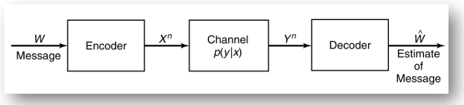
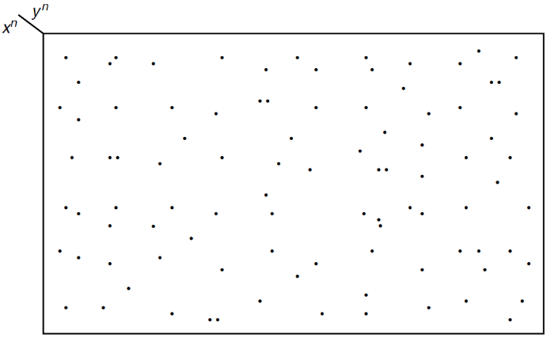

# Channel Capacity Theorems

<!-----
title: 【Information Theory】Channel Capacity Theorems
url: it-channel2
date: 2020-04-08 10:03:57
tags: 
- Information Theory

categories: 
- Courses

----->

Week 6 of 2020 Spring. Channel Coding Theorem: Achievability and Reverse

<!--more-->

[[toc]]

## Recall: Channel Model for Telegraph

- **Codebook** shared by two sides: e.g. a:110, b:111 ...
- 将发电报的过程抽象如下, 由于系统存在随机性, 我们可能解码错误或失败

> - $\boldsymbol{W} \rightarrow \boldsymbol{X}^{\boldsymbol{n}}, \boldsymbol{Y}^{\boldsymbol{n}} \rightarrow \widehat{\mathbf{W}}$ **could be designed** by us
> - $X^{n} \rightarrow Y^{n}: p(y | x)$ is **out of our control**. (Physical law)
> - Aim: a good design with $n(=40)$ as small as possible
> $$
> \max \frac{H(W)}{n}
> $$

- 我们希望信息发送的速率(信道容量)越大越好
- 我们不能改变的是信道的状态转移矩阵, 但我们能改变的是编码方式.
- 进一步, 我们发现具有马尔可夫链性质. $\boldsymbol{W} \rightarrow \boldsymbol{X}^{\boldsymbol{n}}, \boldsymbol{Y}^{\boldsymbol{n}} \rightarrow \widehat{\boldsymbol{W}}$

## Memory and Feedback

### Definition

以磁带为例, 我们翻录磁带的时候, 由于设备原因, 有时翻录能听到原声. 我们把磁带看作一个信道, 反复读写可能会使当前传输的信息受上一次信息保留的影响. 我们在模型中忽略这一因素. (memoryless channel)

- Notation: $y^{k-1} := y_{k-1}, y_{k-2}, \ldots ,y_{1}$
- 定义信道的n阶扩展. **The nth extension of the discrete _memoryless_ channel (DMC) is the channel $\left(x^{n}, p\left(y^{n} | x^{n}\right), y^{n}\right),$ where**
  $$
  p\left(y_{k} | x^{k}, y^{k-1}\right)=p\left(y_{k} | x_{k}\right)
  $$
  When $x_{k}$ is given, $y_{k}$ is determined by $p(y | x)$ and is independent of all the generated before time $k: x_{1}, \ldots, x_{k-1}, y_{1}, \ldots, y_{k-1}$
- If the channel is used **without feedback**, i.e., if the input symbols do not depend on the past output symbols, namely, $p\left(x_{k} | x^{k-1}, y^{k-1}\right)=p\left(x_{k} | x^{k-1}\right)$. 定义无反馈, 表明随机变量的生成也是独立于此前的y的.
- When we refer to the discrete memoryless channel, we mean the **discrete memoryless channel without feedback** unless we state explicitly otherwise, 当我们谈论DMC时, 我们是默认无反馈的.

### Analysis

Memoryless: $p\left(y_{k} | x^{k}, y^{k-1}\right)=p\left(y_{k} | x_{k}\right)$
No feedback: $p\left(x_{k} | x^{k-1}, y^{k-1}\right)=p\left(x_{k} | x^{k-1}\right)$
Memoryless $+$ No Feedback $\implies$
$$
\begin{aligned}
  p\left(y^{n} | x^{n}\right) &= p\left(y^{n-1} | x^{n}\right) p\left(y_{n} | y^{n-1}, x^{n}\right) & \text{条件概率定义式} \\
  &=p\left(y^{n-1} | x^{n-1}, x_{n}\right) p\left(y_{n} | y^{n-1}, x^{n}\right) & x_n\text{展开} \\
  &=p\left(y^{n-1} | x^{n-1}\right) p\left(y_{n} | y^{n-1}, x^{n-1}, x_{n}\right) & \text{无反馈性质的变形} \\
  &=p\left(y^{n-1} | x^{n-1}\right) p\left(y_{n} | x_{n}\right)& \text{无记忆性展开} \\
  &=\prod_{i=1}^{n} p\left(y_{i} | x_{i}\right)  &\text{数学归纳法}\\
\end{aligned}
$$
从信息度量的角度看,
$$\begin{aligned}
&\boldsymbol{p}\left(\boldsymbol{y}^{n} | \boldsymbol{x}^{n}\right)=\prod_{i=1}^{n} \boldsymbol{p}\left(\boldsymbol{y}_{i} | \boldsymbol{x}_{i}\right)\\
&H\left(Y^{n} | X^{n}\right)=\sum_{i=1}^{n} H\left(Y_{i} | X_{i}\right)
\end{aligned}$$

Furthermore, 我们将左侧用链式法则展开, 可以得到更有意思的结论.

### Interpretation
reformulate: 信息传输过程

- A message $W,$ drawn from the index set $\{1,2, \ldots, M\},$ results in the signal $X^{n}(W)$, which is received by the receiver as a random sequence $Y^{n} \sim p\left(y^{n} | x^{n}\right)$
- The receiver **guesses** the index $W$ from $Y^{n}: \widehat{W}=g\left(Y^{n}\right) .$ **An error** if $\widehat{W} \neq W$

> - A discrete channel, denoted by $(x, p(y | x), y)$ 
> - **Memoryless**: The **$n$ th extension** of the discrete **memoryless** channel (DMC) is the channel $\left(x^{n}, p\left(y^{n} | x^{n}\right), y^{n}\right),$ where
>   $$
>   p\left(y_{k} | x_{k}, y^{k-1}\right)=p\left(y_{k} | x_{k}\right), k=1,2, \ldots, n
>   $$
> - NO Feedback: If the channel is used without feedback [i.e, if the input symbols do not depend on the past output symbols, namely, $\left.p\left(x_{k} | x^{k-1}, y_{k-1}\right)=p\left(x_{k} | x^{k-1}\right)\right]$
>   $$
>   p\left(y^{n} | x^{n}\right)=\prod_{i=1}^{n} p\left(y_{i} | x_{i}\right)
>   $$
> - Markov chain
>   $$
>   \boldsymbol{w} \rightarrow \boldsymbol{X}^{n} \rightarrow \boldsymbol{Y}^{n} \rightarrow \widehat{\boldsymbol{w}}
>   $$

recall 上节课中, $C = \max I(X;Y)$
接下来我们要证明, 为什么信道容量是最大互信息.

## Channel Model
下面我们定义信道模型中的编码

### Code

- A code consists of **the message set** $\mathcal{M},$ an **encoder** and a **decoder**
- Encoder: The channel is used $n$ times to send a symbol $\mathrm{w} \in \mathcal{M}$
  - An encoder is a function $f$ such that $f(w): M \rightarrow \mathcal{X}^{n}$ **(one-to-one)** 要求编码/解码函数一一对应
    - $f$ yields a distribution on $x^{n}=\frac{\text { DMC }}{\longrightarrow}$ a distribution on $x$ 一般情况下, 我们不能认为定义在$\mathcal{X}^n$上的分布于$\mathcal{X}$分布式等价的, 但在DMC中我们可以通过数学证明说明这一点.
  - The encoding rule $f(w)=x^{n} \in \mathcal{X}^{n}$ generates a **codebook** 码本
  - The codebook is **shared** between the sender and the receiver
  - When $f$ is given, a random variable $X^{n}$ was also defined. 当我们定义了编码器,我们也就定义了一个随机变量$X^{n}$
- Decoder received $y^{n} \sim p\left(y^{n} | x^{n}\right)=\Pi p\left(y_{n} | x_{n}\right)$
  - The decoder need to **guess** the possible $x^{n}$ by $y^{n}$ in some genius manner
  - By the codebook $f^{-1}\left(x^{n}\right)=w . \widehat{w}$ could be recovered by decoder. Error if $\hat{w} \neq w$

综合以上分析,
> An $(M, n)$ code for the channel $(X, p(y | x), y)$ consists of the following:
> 1. **An index set** $\{1,2, \ldots, M\}$:所有可能信息的集合, 进行索引(如hello-1, world-2, ...)
> 2. **An encoding function** $X^{n}:\{1,2, \ldots, M\} \rightarrow X^{n},$ yielding **codewords** $x^{n}(1), x^{n}(2), \ldots, x^{n}(M) .$ The set of codewords is called the **codebook**
> 3. **A decoding function** 
>    $$g: \mathcal{{Y}}^{n} \rightarrow\{1,2, \ldots, M\}$$
>    which is a deterministic rule that assigns a guess to each possible received vector.

$$\begin{aligned}
&f: \mathcal{M} \rightarrow \mathcal{{X}}^{n} \text { and } g: \mathcal{{Y}}^{n} \rightarrow \mathcal{M}\\
&W \rightarrow X^{n} \rightarrow Y^{n} \rightarrow \widehat{W}
\end{aligned}$$

w的维数(M)一般比x多,所以需要利用信道n次. 由于我们考虑平均意义, 所以我们认为codewords都等长. 否则编码与解码会很麻烦.

recall 码率$r = \frac{\log |M|}{n}$.

$M$可以看做一个随机过程.

### Probability of Error

> - Definition (Conditional probability of error) 条件错误概率 Let
>   $$
>   \lambda_{i}=\Pr\left(g\left(Y^{n}\right) \neq i | X^{n}=x^{n}(i)\right):=\sum_{y^{n}} p\left(y^{n} | x^{n}(i)\right) I\left(g\left(y^{n}\right) \neq i\right)
>   $$
>   be the conditional probability of error given that index $i$ was sent, where $I(\cdot)$ is the indicator function.
>   $x^{n}(i)$ 表示信息i对应的码制. 根据定义式,按照所有y的可能性展开, 我们可以得到计算式.
>   $$
>   I(x \neq y)=0, \quad I(x=y)=1
>   $$
> - Maximal probability of error: 最大错误概率
>   $$
>   \lambda^{(n)}=\max _{i \in\{1,2, \ldots, M\}} \lambda_{i}
>   $$
> - The (arithmetic) average probability of error
>   $$
>   P_{e}^{(n)}=\frac{1}{M} \sum_{i=1}^{M} \lambda_{i}
>   $$

我们有
1. 平均错误概率不大于最大错误概率, $P_{e}^{(n)} \leq \lambda^{(n)}$
2. If $M$ is uniformly distributed,
    $$
    \Pr\left(W \neq g\left(Y^{n}\right)\right)=\sum_{i=1}^{m} \Pr\left(X^{n}=x^{n}(i)\right) \Pr\left(g\left(Y^{n} \neq i | X^{n}=x^{n}(i)\right)\right)=P_{e}^{(n)}
    $$

### Rate and Capacity

- The **rate** $R$ of $(M, n)$ code is
  $$
  R=\frac{\log M}{n} \text { bits per transmission. }
  $$
  因为信息M一定能用长度为$\log M$的码进行编码, 可以通过n次传输.
- A rate $R$ is said to be **achievable** if there exists a sequence of $\left(2^{n R}, n\right)$ codes such that **the maximal probability of error $\lambda(n)$ tends to 0** as $n \rightarrow \infty$
  码率可取, if 我们能找到一个编码, 使**最大**错误概率,在码长很长时可以趋向于0.
- The capacity of a channel is the supremum of all achievable rates.
  信道容量: 所有可取码率的上确界.

> (Channel coding theorem) For a **discrete memoryless channel**, all rates below capacity $C$ are achievable. Specifically, for every rate $R<C,$ there exists a sequence of $\left(2^{n R}, n\right)$ codes with maximum probability of error $\lambda^{(n)} \rightarrow 0 .$ Conversely, any sequence of $\left(2^{n R}, n\right)$ codes with $\lambda^{(n)} \rightarrow 0$ must have $R \leq C$

即,我们要证明$C=\max _{p(x)} I(X ; Y)$
就要证明两点
1. Achievability
   For any $r<C,$ there exists an $\left(2^{n r}, n\right)$ code
2. Converse
   For any $r>c, \lambda_{e}>0$

## Joint Typicality
定义联合典型集.

Roughly speaking, we decode a channel output $Y^{n}$ as the $i$ th index if the codeword $X^{n}(i)$ is "jointly typical" with the received signal $Y^{n}$
现在我们有两组随机变量, The set $A_{\epsilon}^{(n)}$ of jointly typical sequences 联合典型集序列 $\left\{\left(x^{n}, y^{n}\right)\right\}$ with respect to the distribution $p(x, y)$ is the set of n-sequences with empirical entropies $\epsilon$ -close to the true entropies:
$$
\begin{aligned}
A_{\epsilon}^{(n)}=\left\{\left(x^{n}, y^{n}\right) \in X^{n} \times Y^{n}:\right.&-\frac{1}{n} \log p\left(x^{n}\right)-H(X) |<\epsilon \\
&\left|-\frac{1}{n} \log p\left(y^{n}\right)-H(Y)\right|<\epsilon \\
&\left.\left|-\frac{1}{n} \log p\left(x^{n}, y^{n}\right)-H(X, Y)\right|<\epsilon\right\}
\end{aligned}
$$
我们要求, 典型集元素要求满足单个元素在典型集中, 合起来看也要在典型集不等式中.

注意, 一般情况下,$X^{n} \in A_{\epsilon}^{(n)}, Y^{n} \in A_{\epsilon}^{(n)}$ cannot imply $\left(X^{n}, Y^{n}\right) \in A_{\epsilon}^{(n)}$

有了典型集, 顺理成章我们要证明联合AEP.

- $\Pr\left(\left(X^{n}, Y^{n}\right) \in A_{\epsilon}^{(n)}\right) \rightarrow 1 \text { as } n \rightarrow \infty$
- $\left|A_{\epsilon}^{(n)}\right| \leq 2^{n(H(X, Y)+\epsilon)}$ 证明类似单个随机变量的AEP
- $\left|A_{\epsilon}^{(n)}\right| \geq (1-\epsilon) 2^{n(H(X, Y)-\epsilon)}$ 证明类似单个随机变量的AEP
- $\text { If }\left(\tilde{X}^{n}, \tilde{Y}^{n}\right) \sim p\left(x^{n}\right) p\left(y^{n}\right), \text { then }$ 
  $$(1-\epsilon) 2^{-n(I(X, Y)+3 \epsilon)} \leq \Pr\left(\left(\tilde{X}^{n}, \tilde{Y}^{n}\right) \in A_{\epsilon}^{(n)}\right) \leq 2^{-n(I(X, Y)-3 \epsilon)}$$
  (即对典型集中特殊的$X_n,Y_n$, 上下界用互信息衡量, 而不是熵)

我们主要证明第三个性质.
定义展开, 根据典型集大小放缩. 右侧得证
$$\begin{aligned}
\Pr\left(\left(\tilde{X}^{n}, \tilde{Y}^{n}\right) \in A_{\epsilon}^{(n)}\right)=& \sum_{\left(x^{n}, y^{n}\right) \in A_{\varepsilon}^{(n)}} p\left(x^{n}\right) p\left(y^{n}\right) \\
\leq & 2^{n(H(X, Y)+\epsilon)} 2^{-n(H(X)-\epsilon)} 2^{-n(H(Y)-\epsilon)}=2^{-n(I(X, Y)+3 \epsilon)}
\end{aligned}$$

左侧, 先证性质3
$$1-\epsilon \leq \Pr\left(A_{\epsilon}^{(n)}\right)=\sum_{\left(x^{n}, y^{n}\right) \in A_{\epsilon}^{(n)}} p\left(x^{n}, y^{n}\right) \leq\left|A_{\epsilon}^{(n)}\right| 2^{-n(H(X, Y)-\epsilon)}$$

用类似的方法, 
$$\begin{array}{c}
\Pr\left(\left(\tilde{X}^{n}, \tilde{Y}^{n}\right) \in A_{\epsilon}^{(n)}\right)=\sum_{\left(x^{n}, y^{n}\right) \in A_{\varepsilon}^{(n)}} p\left(x^{n}\right) p\left(y^{n}\right) \\
\geq(1-\epsilon) 2^{n(H(X, Y)-\epsilon)} 2^{-n(H(X)+\epsilon)} 2^{-n(H(Y)+\epsilon)}=(1-\epsilon) 2^{-n(I(X ; Y)+3 \epsilon)}
\end{array}$$

为什么信道编码中会出现互信息? 

因为在所有$X^n$,$Y^n$中,能够符合典型集性质3的必须用互信息衡量.
$$\frac{2^{n H(X . Y)}}{2^{n H(X)} 2^{n H(Y)}}=2^{-n I(X: Y)}$$

## Intuition for Channel Capacity

- X与Y的关系类似$X^n$驱动了$Y^n$, 由于噪声的作用, $X^n$的点变成了$Y^n$的区域.
- 那我们最好希望, no two $X$ sequences produce the same $Y$ output sequence.
  - 那比较好的做法就是把Y^n的投影分成越来越多的不相交的小集合.
- 从典型集的角度, 当$X^n$给定的情况下, 也就对应的会有 $2^{nH(Y|X)}$的$Y^n$个序列可能会构成典型性.
- 由于$Y^n$的典型性, 我们最多能找到互不相交的集合数目就是, $2^{n(H(Y)-H(Y | X))}=2^{n I(X ; Y)}$
- 因此, 优化目标是最大化 $I(X ; Y)$
