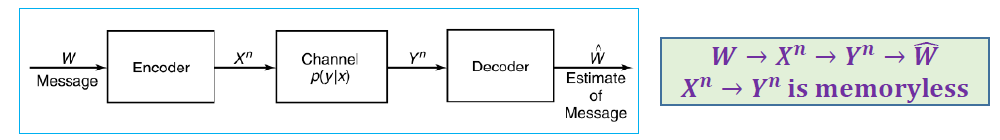
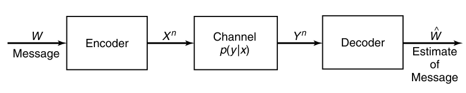
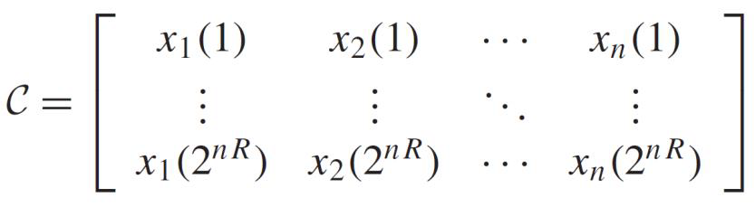
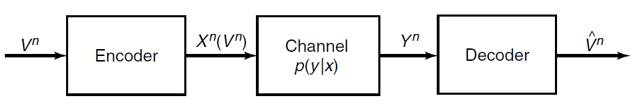

# Channel Capacity 3

<!-----
title: 【Information Theory】Channel Capacity 3
url: it-channel
date: 2020-04-13 08:01:25
tags: 
- Information Theory

categories: 
- Courses

----->

Week 7 of 2020 Spring

<!--more-->

[toc]

## Coverse Proof Special Case: Zero-Error Codes

我们希望证明，对于任何合格的编码方案，码率要小于等于信道容量。

先考虑一个特殊情况：$Y^{n}$可以完美地恢复出$W$。即$H(W|Y^{n})=0$.

The outline of the proof of the converse is most clearly motivated by going through the argument when absolutely no errors are allowed.
$$
\begin{aligned}
n R=H(W) &=H\left(W | Y^{n}\right)_{=0}+I\left(W ; Y^{n}\right) \\
&=I\left(W ; Y^{n}\right) \\
& \leq I\left(X^{n} ; Y^{n}\right) \quad\left(W \rightarrow X^{n} \rightarrow Y^{n}\right) \\
& \leq \sum_{i} I\left(X_{i} ; Y_{i}\right) \\
& \leq n C \\
& R \leq C
\end{aligned}
$$
In general, $H\left(W | Y^{n}\right)>0:$ Fano's inequality

$$\begin{aligned}
I\left(X^{n} ; Y^{n}\right) &=H\left(Y^{n}\right)-H\left(Y^{n} | X^{n}\right)=H\left(Y^{n}\right)-\sum H\left(Y_{i} | X_{i}\right) \\
& \leq \Sigma H\left(Y_{i}\right)-\Sigma H\left(Y_{i} | X_{i}\right)=\sum I\left(X_{i} ; Y_{i}\right)
\end{aligned}$$

注意，在这个问题（DMC）中，$Y_i$与$X_i$相互独立，但不代表$Y_i$之间相互独立。

上面的证明中，我们加强的条件简化了不等式的证明，in general$H(W|Y^{n})>0$，我们就要用到Fano's Inequality。

## Coverse Proof: Channel Coding Theorem

我们假设错误概率率趋小，即根据fano不等式，$H(W | W) \leq 1+P_{e}^{(n)} n R$

$$\begin{aligned}
n R &=H(W) \\
&=H(W | \widehat{W})+I(W ; \widehat{W}) \\
& \leq 1+P_{\epsilon}^{(n)} n R+I(W ; \widehat{W}) \\
& \leq 1+P_{\epsilon}^{(n)} n R+I\left(X^{n} ; Y^{n}\right) \quad \text{马尔可夫链性质，数据处理不等式}\\
& \leq 1+P_{\epsilon}^{(n)} n R+n C
\end{aligned}$$

因此我们有

$$R \leq P_{\epsilon}^{(n)} R+\frac{1}{n}+c \rightarrow C$$

反证法，如果$R>C$，则$P_{\epsilon}^{(n)}$不会趋向于0.
$$P_{\epsilon}^{(n)} \geq 1-\frac{c}{R}-\frac{1}{n R}>0 \text { as } R>C$$

接下来我们证明，对任意小于$C$的编码，我们都能找到一种编码（可达性）

## Achievability

### Code Construction

编码的构造：实际上就是随机生成码本矩阵$\mathcal{C}$。
行：消息，列：编码。

Fix $p(x) .$ Generate $a\left(2^{n R}, n\right)$ code at random according to $p(x)$
$$
p\left(x^{n}\right)=\prod_{i=1}^{n} p\left(x_{i}\right)
$$

The probability the we generate a particular code $C$ is 对任意编码，生成该编码（码本）的概率是 $\operatorname{Pr}(C)=\prod_{w=1}^{2^{n R}} \prod_{i=1}^{n} p\left(x_{i}(w)\right)$
The code $C$ will be shared both by the sender and receiver, both know $p(y|x)$.

A message $W$ is chosen according to a uniform distribution暂时忽略$nR$不是整数的问题。 $\operatorname{Pr}(W=w)=2^{-n R}, w=1,2, \ldots, 2^{n R}$
The $w$ th codeword $X^{n}(w)$ is sent over the channel The receiver receives a sequence $Y^{n}$ according to the distribution
$$
P\left(y^{n} | x^{n}(w)\right)=\prod_{i=1}^{N} p\left(y_{i} | x_{i}(w)\right)
$$

### Joint Decoding
如何解码，我们要用联合AEP解码。

The receiver guess which message was sent. In jointly typical decoding, the receiver declares that the index $\widehat{W}$ was sent if the following conditions are satisfied:
- $\left(X^{n}(\widehat{W}), Y^{n}\right)$ is jointly typical 存在
- There is no other index $W^{\prime} \neq W,$ such that $\left(X^{n}\left(W^{\prime}\right), Y^{n}\right) \in A_{\epsilon}^{(n)}$ 唯一

If no such $\hat{W}$ exists or if there is more than one such, an error is declared. (We may assume that the receiver **outputs a dummy index such as 0** in this case.)
Let $\mathcal{E}$ be the event $\{\widehat{W} \neq W\}$

**We need to show that**
$$
\operatorname{Pr}(\mathcal{E}) \rightarrow \mathbf{0}
$$

## $\operatorname{Pr}(\mathcal{E}) \rightarrow 0$

> Main idea: If we could prove that for all the codebook (all the possible $C$ ), the average $\operatorname{Pr}(\varepsilon) \leq \epsilon_{i}$  **then the error probability of the best code** (one of $C^{\prime}$s $\leq \epsilon$）

We let $W$ be drawn according to a uniform distribution over $\left\{1,2, \ldots, 2^{n R}\right\}$ and use jointly typical decoding $\hat{W}\left(y^{n}\right)$

Let $\mathcal{E}=\left\{\hat{W}\left(y^{n}\right) \neq W\right\}$ denote the error event

We will calculate the average probability of error, averaged over all codewords in the codebook, and averaged over all codebooks 每一个码本、每一个码制上的平均错误率。
$$
\begin{aligned}
&\operatorname{Pr}(\varepsilon)=\sum_{c} \operatorname{Pr}(C) P_{e}^{(n)}(C) \text{\quad 定义展开} \\
&=\sum_{c} \operatorname{Pr}(C) \frac{1}{2^{n R}} \sum_{w=1}^{2^{n R}} \lambda_{w}(C) \text{\quad 码制均匀分布}\\
&=\frac{1}{2^{n R}} \sum_{w=1}^{2^{n R}} \sum_{c} \operatorname{Pr}(C) \lambda_{w}(C) \text{\quad 求和交换位置}
\end{aligned}
$$

我们分析第二个求和表达式。
$$\sum_{C} \operatorname{Pr}(C) \lambda_{1}(C)=\operatorname{Pr}(\mathcal{E} | W=1)$$
是在传递信息1的情况下的平均错误概率，也即
$$\operatorname{Pr}(\mathcal{E})=\frac{1}{2^{n R}} \sum_{w=1}^{2^{n R}} \operatorname{Pr}(\mathcal{E} | W=w)$$

由对称性，我们以证明信息为1时的结论为例。

$$E_{i}=\left\{\left(\left(X^{n}(i), Y^{n}\right) \text { is in } A_{\epsilon}^{(n)}\right), i \in\left\{1,2, \ldots, 2^{n R}\right\}\right\}$$

定义集合$E_{i}$，那么解码错误的概率可以形式化地表达为

$$\begin{aligned}
\operatorname{Pr}(\mathcal{E} | W=1) &=P\left(E_{1}^{c} \cup E_{2} \cup E_{3} \cup \ldots \cup E_{2^{n} R} | W=1\right) \\
& \leq P\left(E_{1}^{c} | W=1\right)+\sum_{i=2}^{2^{n R}} P\left(E_{i} | W=1\right)
\end{aligned}$$

要么不在典型集中，要么在其他典型集中。我们直接对集合进行放缩。并$\rightarrow$不相交并。

我们具体分析两个部分有多大。
- 由联合AEP，By Joint $\mathrm{AEP}, P\left(E_{1}^{c} | W=1\right) \rightarrow 0,$ and hence $\mathrm{P}\left(\mathrm{E}_{1}^{\mathrm{c}} | \mathrm{W}=1\right) \leq \epsilon,$ for $n$ sufficiently large
- For $i \geq 2,\left(E_{i} | W=1\right):$
  - since by the code generation process, $X^{n}(1)$ and $X^{n}(i)$ are independent for $i \neq 1,$，源码的生成相互独立
  - so are $Y^{n}$ and $X^{n}(i) .$
  - Hence, the probability that $X^{n}(i)$ and $Y^{n}$ are jointly typical is $\leq 2^{-n(I(X ; Y)-3 \epsilon)}$ by the joint AEP

$$\begin{aligned}
\operatorname{Pr}(\mathcal{E} | W=1) & \leq \epsilon+\sum_{i=2}^{2^{n R}} 2^{-n(I(X ; Y)-3 \epsilon)} \\
&=\epsilon+\left(2^{n R}-1\right) 2^{-n(I(X ; Y)-3 \epsilon)} \\
& \leq \epsilon+2^{n R} 2^{-n(I(X ; Y)-3 \epsilon)} \\
&=\epsilon+2^{-n(I(X ; Y)-R-3 \epsilon)}
\end{aligned}$$

If $n$ is sufficiently large and $R<I(X ; Y)-3 \epsilon$
$$
\begin{aligned}
\operatorname{Pr}(&\varepsilon | W=1) \leq 2 \epsilon \\
& \operatorname{Pr}(\mathcal{E}) \leq 2 \epsilon
\end{aligned}
$$

这样，我们就证明了，给定$p(x)$情况下，随机编码的错误概率$\le 2\epsilon$。这样也就证明了一定存在这样的编码。

注意到$p(x)$的选择是不受限的，因此Choose $p(x)$ in the proof to be $p^{*}(x),$ the distribution on $X$ that achieving capacity. Then
$$
\begin{aligned}
R \leq I\left(X^{*} ; Y\right) &=C \\
\lambda^{(n)} \leq 4 \epsilon
\end{aligned}
$$

### $\operatorname{Pr}(\mathcal{E}) \rightarrow 0 \Rightarrow \lambda^{(n)} \rightarrow 0$
从平均概率为0到最大错误概率为0.

在前面的证明中，我们说明了There exists a best codebook $C^{*}$ such that
$$
\operatorname{Pr}\left(\varepsilon | C^{*}\right)=\frac{1}{2^{n R}} \sum_{i=1}^{2^{n R}} \lambda_{i}\left(C^{*}\right) \leq 2 \epsilon
$$

根据上一节的定义，By the definition of $\left(n, 2^{n R}\right)$ code, we need to further show that
$$
\lambda^{(n)} \rightarrow 0
$$

Without loss of generality, assume $\lambda_{1} \leq \lambda_{2} \leq \cdots \leq \lambda_{2} n_{R}$
By $\operatorname{Pr}\left(\varepsilon | C^{*}\right) \leq 2 \epsilon,$ we have 我们知道前一半一定足够小
$$\lambda_{1} \leq \lambda_{2} \leq \cdots \leq \lambda_{2} n_{R-1} \leq 4 \epsilon$$
反证法： $\left(\text { Or } \lambda_{2^{n R-1}}>4 \epsilon, \frac{1}{2^{n R}} \sum_{i=1+2^{n R-1}}^{2^{n R}} \lambda_{i}\left(C^{*}\right)>\frac{1}{2} 4 \epsilon=2 \epsilon, \text { contradiction! }\right)$

只需对码本进行微调，就可以达到最大错误概率的降低。把最坏的一半码制直接扔掉。（考虑平均再通过扔掉一半证明最坏，这是一个很general的证明做法，在很多地方都很常见）Further refine the codebook $C^{*}$
- Throw away the worst half of the codewords in the best codebook $C^{*}$
- The best half of the codewords have a maximal probability of error less than $4 \epsilon$
- If we reindex these codewords, we **have $2^{n R-1}$ codewords**. Throwing out half the codewords has changed the rate from $R$ to $R-\frac{1}{n},$ which is negligible for large $n$。在极限情况下不会对码率产生影响。

## (Introduction) Feedback Capacity

Recall，DMC中，收到的信息是什么情况我们是不知情的。信号的发送端与接收端在物理上是隔离开的。

- We assume that **all the received symbols are sent back immediately and noiselessly** to the transmitter, which can then use them to decide **which symbol to send next** 即，在有反馈的情况下，我们有更高的灵活性生成码制。这里我们假设输出的信号马上会发到输入端，输入端可以根据该反馈生成下一个信号。
- We define $a\left(2^{n R}, n\right)$ *feedback code* as a sequence of mappings $x_{i}\left(W, Y^{i-1}\right),$ where each $x_{i}$ is **a function only of** the message $W \in 2^{n R}$ and the previous received values, $Y_{1}, Y_{2}, \ldots, Y_{i-1},$ and a sequence of decoding functions $g: \mathcal{Y}^{n} \rightarrow\left\{1,2, \ldots, 2^{n R}\right\} .$ Thus, 定义解码器没有得到正确结果的概率
$$
P_{e}^{(n)}=\operatorname{Pr}\left(g\left(Y^{n}\right) \neq W\right)
$$
when $W$ is uniformly distributed over $\left\{1,2, \ldots, 2^{n R}\right\}$

我们发现：Feedback capacity
$$
C_{F B}=C=\max _{p(x)} I(X ; Y)
$$

> Feedback cannot increase capacity. （因为该问题中，无**记忆性仍然是保留的**）

### TODO:看一下证明

## (Introduction) Source-Channel Separation
信源信道分离定理

Recall，我们学习了数据的压缩与数据的传输

- In data compression: $R>H$
- In data transmission: $R<C$

> Is the condition $H<C$ sufficient and necessary?
> 是不是$H<C$就保证了我们可以以很低的错误概率？
> **YES**

### Formal Problem

- We want to send the sequence of symbols $V^{n}=V_{1}, V_{2}, \ldots, V_{n}$ over the channel so that the receiver can reconstruct the sequence
- To do this, we map the sequence onto a codeword $X^{n}\left(V^{n}\right)$ and send the codeword over the channel
- The receiver looks at his received sequence $Y^{n}$ and makes an estimate $\hat{V}^{n}$ of the sequence $V^{n}$ that was sent. The receiver makes an error if $V^{n} \neq \hat{V}^{n} .$ We define the probability of error as
  $$
  \operatorname{Pr}\left(V^{n} \neq \hat{V}^{n}\right)=\sum_{y^{n}} \sum_{v^{n}} p\left(v^{n}\right) p\left(y^{n} | x^{n}\left(v^{n}\right)\right) I\left(g\left(y^{n}\right) \neq v^{n}\right)
  $$
  Where $I$ is the indicator function and $g\left(y^{n}\right)$ is the decoding function

### TODO: Theorem

**Theorem (Source-channel coding theorem).** If $V_{1}, V_{2}, \ldots, V_{n}$ is a finite alphabet stochastic process that satisfies the AEP and $H(\mathcal{V})<C,$ there exists a source-channel code with probability of error $\operatorname{Pr}\left(\hat{V}^{n} \neq V^{n}\right) \rightarrow 0 .$ Conversely, for any stationary stochastic process, if $H(v)>C,$ the probability of error is bounded away from zero, and it is not possible to send the process over the channel with arbitrarily low probability of error.

## Error Correction Code

The object of coding is to introduce redundancy so that even if some of the information is lost or corrupted, it will still be possible to recover the message at the receiver. 在前面的学习中，我们知道，我们可以用冗余抵抗噪声的干扰，下面列出一些冗余手段。

- Repetition code: For example, to send a $1,$ we send 11111 , and to send a $0,$ we send 00000. The decoding scheme is to take the majority vote. 接收端数0多还是1多，少数服从多数。
- Parity check code: Starting with a block of $n-1$ information bits, we choose the $n$ th bit so that the parity of the entire block is 0. 奇偶校验位。
- The code does not detect an even number of errors and does not give any information about how to correct the errors that occur.

## Hamming Code

RECALL: BSC信道
由大数定律，因为我们会以$p$的概率翻转，如果信息量够大，那么会有大约np个bits被修改，我们可以证明，$d(x,y)\le np$（曼哈顿距离）。另一种意义上，也就是说，All the points $y$ are within the sphere with center $x$ and radius $n p$

- Deonte the codeword by $x,$ then the noisy version $y$ of $x$ stays inside the sphere with center $x$ and radius $r$
- Sphere packing: the art of error correction code
- https://en.wikipedia.org/wiki/Sphere_packing

