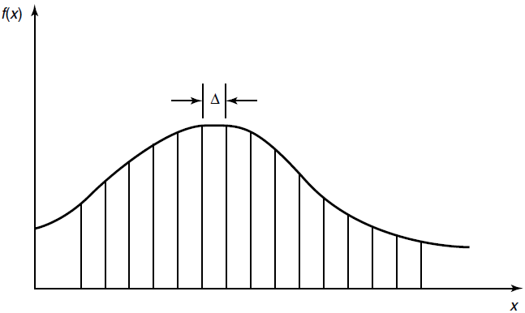

Week 7 of 2020 Spring

<!--more-->

## Differential Entropy

### Definition

概率论中的一些概念

- Let $X$ be a random variable with **cumulative distribution function** $F(x)=\Pr(X \leq x)$
- If $F(x)$ is continuous, the random variable is said to be **continuous**.
- Let $f(x)=F^{\prime}(x)$ when the derivative is defined. If $\int_{-\infty}^{\infty} f(x)=1, f(x)$ is called the **probability density function** for X.
- The set where $f(x)>0$ is called the **support set** of $X .$

微分熵的定义

> The differential entropy $h(X)$ of a continuous random variable $X$ with density $f(x)$ is defined as
> $$
> h(X)=-\int_{S} f(x) \log f(x) d x
> $$
> where $S$ is the support set of the random variable. The differential entropy is sometimes written as $h(f)$ rather than $h(X)$

平移不改变微分熵.
$h(X+c)=h(X)$ (Translation does not change the differential entropy)

对比离散熵
$$\begin{aligned}
&p(x) \Rightarrow f(x)\\
&\sum=\int\\
&H(X) \Rightarrow h(X)
\end{aligned}$$

$H(X)$ is always non-negative. $h(X)$ may be negative

### Example

> Consider a random variable distributed uniformly from 0 to $a$, then $h(X)=\log a$.
> Let $X \sim \mathcal{N}\left(\mu, \sigma^{2}\right),$ then $\boldsymbol{h}(\boldsymbol{X})=\frac{1}{2} \log 2 \pi e \sigma^{2}$

When $X$ is uniformly distributed in $[0, a]$
$$
\begin{array}{c}
f(x)=1 / a \\
h(X)=-\int_{0}^{a} \frac{1}{a} \log \frac{1}{a} d x=\log a
\end{array}
$$
发现, 微分熵已经可以小于0了.

When $X$ is Gaussian $\mathcal{N}\left(\mu, \sigma^{2}\right),$ then
$$
f(x)=\frac{1}{\sqrt{2 \pi \sigma^{2}}} e^{-\frac{(x-\mu)^{2}}{2 \sigma^{2}}}
$$
$$
\begin{aligned}
h(f(x))&=-\int f(x) \log f(x) d x \\
=&-\int f(x) \log \frac{1}{\sqrt{2 \pi \sigma^{2}}}+f(x)\left(-\frac{(x-\mu)^{2}}{2 \sigma^{2}}\right) d x \\
\end{aligned}
$$
$$
\int f(x) d x=1 \text { and } \operatorname{Var}(X)=\int(x-\mu)^{2} f(x) d x=\sigma^{2}
$$
用代入方差的方法, 简化运算.
$$
h(f(x))=\frac{1}{2} \log 2 \pi \sigma^{2}+\frac{1}{2}=\frac{1}{2} \log 2 \pi e \sigma^{2}
$$
我们用e为底, 方便代入概率密度函数.

## h(X): infinite information

连续变量不加以任何限制, 它的信息是无穷大的. 微分熵无法再度量系统中的信息量了.

- Differential entropy does not serve as a measure of the average amount of information contained in a continuous random variable.
- In fact, a continuous random variable generally contains an infinite amount of information

我们计算连续型随机变量的离散熵:
Let $X$ be uniformly distributed on $[0,1) .$ Then we can write
$$
X=0 . X_{1} X_{2}, \dots
$$
The dyadic expansion of $X,$ where $X_{i}^{\prime} s$ is a sequence of i.i.d bits. Then
$$
\begin{aligned}
H(X) &=H\left(X_{1}, X_{2}, \ldots\right) \\
&=\sum_{i=1}^{\infty} H\left(X_{i}\right) \\
&=\sum_{i=1}^{\infty} 1 \\
&=\infty
\end{aligned}
$$

## h(aX): Stretching Random Variable

> $$\begin{array}{c}
> \boldsymbol{h}(\boldsymbol{a} \boldsymbol{X})=\boldsymbol{h}(\boldsymbol{X})+\log |\boldsymbol{a}| \\
> \boldsymbol{h}(\boldsymbol{A X})=\boldsymbol{h}(\boldsymbol{X})+\log |\operatorname{det} \boldsymbol{A}|
> \end{array}$$

Let $Y=a X .$ Then $f_{Y}(y)=\frac{1}{|a|} f_{X}\left(\frac{y}{a}\right),$ and
$$
\begin{aligned}
h(a X) &=-\int f_{Y}(y) \log f_{Y}(y) d y \\
&=-\int \frac{1}{|a|} f_{X}\left(\frac{y}{a}\right) \log \left(\frac{1}{|a|} f_{X}\left(\frac{y}{a}\right)\right) d y \\
&=-\int f_{X}(x) \log f_{X}(x) d x+\log |a| \\
&=h(X)+\log |a|
\end{aligned}
$$

## Differential and Discrete Entropy

Suppose that we divide the range of $X$ into bins of length $\Delta .$ 
By the mean value theorem, there exists a value $x_{i}$ within each bin such that
$$f\left(x_{i}\right) \Delta=\int_{i \Delta}^{(i+1) \Delta} f(x) d x$$

Consider the quantized random variable $X^{\Delta}$, which is defined by
$$X^{\Delta}=x_{i}$ if $i \Delta \leq x<(i+1) \Delta$$

基于连续随机变量定义一个切割意义上的离散随机变量. Then the probability that $X^{\Delta}=x_{i}$ is
$$p_{i}=\int_{i \Delta}^{(i+1) \Delta} f(x) d x=f\left(x_{i}\right) \Delta$$

$$H\left(X^{\Delta}\right)=-\sum \Delta f\left(x_{i}\right) \log f\left(x_{i}\right)-\log \Delta$$

结论:
这里说的是$-\infty +\infty \rightarrow h(f)$.
$$H\left(X^{\Delta}\right)+\log \Delta \rightarrow h(f)=h(X), \text { as } \Delta \rightarrow 0$$

## AEP For Continuous Random Variable

- AEP for continuous random variables: Let $X_{1}, X_{2}, \ldots, X_{n}$ be a sequence of random variables drawn i.i.d. according to the density $f(x) .$ Then
  $$
  -\frac{1}{n} \log f\left(X_{1}, X_{2}, \ldots, X_{n}\right) \rightarrow E(-\log f(X))=h(f)
  $$
  in probability

- For $\epsilon \geq 0$ and any $n,$ we define the typical set $A_{\epsilon}^{(n)}$ with respect to $f(x)$ as follows:
  $$
  A_{\epsilon}^{(n)}=\left\{\left(x_{1}, x_{2}, \ldots, x_{n}\right) \in S^{n}:\left|-\frac{1}{n} \log f\left(x_{1}, x_{2}, \ldots, x_{n}\right)-h(X)\right| \leq \epsilon\right\}
  $$
  where $f\left(x_{1}, x_{2}, \ldots, x_{n}\right)=\prod_{i=1}^{n} f\left(x_{i}\right)$

连续情况,考虑元素的体积
The volume of a set $A \subset \mathcal{R}^{n}$ is defined as
$$
\operatorname{Vol}(A)=\int_{A} d x_{1} d x_{2} \ldots d x_{n}
$$
在这里, $2^{n h(X)}$ is the volume

The typical set $A_{\epsilon}^{(n)}$ has the following properties:
1. $\Pr\left(A_{\epsilon}^{(n)}\right)>1-\epsilon$ for $n$ sufficiently large.
2. Vol $\left(A_{\epsilon}^{(n)}\right) \leq 2^{n(h(X)+\epsilon)}$ for all $n$
3. Vol $\left(A_{\epsilon}^{(n)}\right) \geq(1-\epsilon) 2^{n(h(X)-\epsilon)}$ for $n$ sufficiently large.

## Joint and Conditional Differential Entropy

> - The differential entropy of a set $X_{1}, X_{2}, \ldots, X_{n}$ of random variables with density $f\left(x_{1}, x_{2}, \ldots, x_{n}\right)$ is defined as
>   $$
>   h\left(X_{1}, X_{2}, \dots, X_{n}\right)=-\int f\left(x^{n}\right) \log f\left(x^{n}\right) d x^{n}
>   $$
> - If $X, Y$ have a ioint density function $f(x, y),$ we can define the conditional differential entropy $h(X | Y)$ as
>   $$
>   \begin{array}{c}
>   h(X) | Y)=-\int f(x, y) \log f(x | y) d x d y \\
>   h(X | Y)=h(X, Y)-h(Y)
>   \end{array}
>   $$

考虑到,很多情况下,积分是没法求/不存在的,我们在本课程中仅假设积分是存在的. 但是这在研究中是需要特别谨慎的地方.

可以证明条件减少熵, chain rule, 联合熵的结论依然成立
Pf by expectation (虽然定义的方式不同,但期望的写法依然成立)

- $h(X | Y) \leq h(X)$
  with equality iff $X$ and $Y$ are independent.
- (Chain rule for differential entropy)
  $$
  h\left(X_{1}, X_{2}, \ldots, X_{n}\right)=\sum_{i=1}^{n} h\left(X_{i} | X_{1}, X_{2}, \ldots, X_{i-1}\right)
  $$
- $h\left(X_{1}, X_{2}, \ldots, X_{n}\right) \leq \sum_{i=1}^{n} h\left(X_{i}\right)$
  with equality iff $X_{1}, X_{2}, \ldots, X_{n}$ are independent.

## Entropy of Multivariate Normal Distribution

### Covariance Matrix

> - The **covariance** between two random variables $X$ and $Y$ is defined as
>   $$
>   \operatorname{cov}(X ; Y)=E(X-E X)(Y-E Y)=E(X Y)-(E X)(E Y)
>   $$
> - For a random vector $X=\left[X_{1}, X_{2}, \ldots, X_{n}\right]^{T},$ the **covariance matrix** 相关矩阵 is defined a $=$
>   $$
>   K_{x}=E(X-E X)(X-E X)^{T}=\left[\operatorname{cov}\left(X_{i} ; X_{j}\right)\right]
>   $$
>   and the **correlation matrix** is defined as $\widetilde{K}_{X}=E X X^{T}=\left[{E} {X}_{{i}} {X}_{{j}}\right]$
> - $K_{X}=E X X^{T}-(E X)\left(E X^{T}\right)=\widetilde{K}_{X}-(E X)\left(E X^{T}\right)$

- A covariance matrix is both symmetric and positive semidefinite. 协方差矩阵半正定
  - The eigenvalues of a positive semidefinite matrix are non-negative. 特征值非负
- 线性变换作用于协方差矩阵和关联矩阵. Let $Y=A X,$ where $X$ and $Y$ are column vectors of $n$ random variables and $A$ is an $n \times n$ matrix. Then
  $$K_{Y}=A K_{X} A^{T}$$
  and
  $$\widetilde{K}_{Y}=A \tilde{K}_{Y} A^{T}$$

> A set of correlated random variables can be regarded as an orthogonal
> transformation of a set of uncorrelated random variables. (Ref : Ch. 10.1 Yeung, Information theory and network coding)

### Multivariate Normal Distribution

> - In probability theory and statistics, the multivariate normal distribution, multivariate Gaussian distribution, or joint normal distribution is a generalization of the onedimensional (univariate) normal distribution to higher dimensions.
> - 原始定义: 向量的任意线性组合都是高斯分布 ~ 向量服从多元高斯分布
> - More generally, let $\mathcal{N}(\mu, K)$ denote the multivariate Gaussian distribution with mean $\mu$ and covariance matrix $K,$ i.e., the joint pdf of the distribution is given by
>   $$f(x)=\frac{1}{(\sqrt{2 \pi})^{n}|K|^{1 / 2}} e^{-\frac{1}{2}(x-\mu)^{T} K^{-1}(x-\mu)}$$
> - One definition is that a random vector is said to be **k-variate normally** distributed if every linear combination of its k components has a univariate normal distribution. 

多元高斯分布良好的性质
- In general, random variables may be uncorrelated but statistically dependent. 
- 两个事件不相关不代表两个事件独立. 但对多元高斯分布 一定成立. But if a random vector has a multivariate normal distribution then any two or more of its components that are uncorrelated are independent .
- 两两独立推出联合独立. This implies that any two or more of its components that are pairwise independent are independent.

### Entropy

> (Entropy of a multivariate normal distribution) Let $X_{1}, X_{2}, \ldots, X_{n}$ have a multivariate normal distribution with mean $\mu$ and covariance matrix $K$
> $$h\left(X_{1}, X_{2}, \dots, X_{n}\right)=h(\mathcal{N}(\mu, K))=\frac{1}{2} \log (2 \pi e)^{n}|K|$$
> where $|K|$ denotes the determinant of $K .$
记住,对于多元高斯分布,微分熵是可以计算出来的, 且和协方差矩阵对数值相关即可.
$$f(\mathbf{x})=\frac{1}{(\sqrt{2 \pi})^{n}|K|^{\frac{1}{2}}} e^{-\frac{1}{2}(\mathbf{x}-\mu)^{T} K^{-1}(\mathbf{x}-\mu)}$$

证明不作具体要求, 与一元情况类似.
技巧:期望和求和进行交换
$$\begin{aligned}
h(f) &=-\int f(\mathbf{x})\left[-\frac{1}{2}(\mathbf{x}-\mu)^{T} K^{-1}(\mathbf{x}-\mu)-\ln (\sqrt{2 \pi})^{n}|K|^{\frac{1}{2}}\right] d \mathbf{x} \\
&=\frac{1}{2} E\left[\sum_{i, j}\left(X_{i}-\mu_{i}\right)\left(X_{j}-\mu_{j}\right)\left(K^{-1}\right)_{i j}\right]+\frac{1}{2} \ln (2 \pi)^{n}|K| \\
&=\frac{1}{2} \sum_{i, j} E\left[\left(X_{j}-\mu_{j}\right)\left(X_{i}-\mu_{i}\right)\right]\left(K^{-1}\right)_{i j}+\frac{1}{2} \ln (2 \pi)^{n}|K| \\
&=\frac{1}{2} \sum_{j} \sum_{i} K_{j i}\left(K^{-1}\right)_{i j}+\frac{1}{2} \ln (2 \pi)^{n}|K| \\
&=\frac{1}{2} \sum_{j}\left(K K^{-1}\right)_{j j}+\frac{1}{2} \ln (2 \pi)^{n}|K| \\
&=\frac{1}{2} \sum_{j} I_{j j}+\frac{1}{2} \ln (2 \pi)^{n}|K|\\
&=\frac{n}{2}+\frac{1}{2} \ln (2 \pi)^{n}|K|\\
&=\frac{1}{2} \ln (2 \pi e)^{n}|K|\\
&=\frac{1}{2} \log (2 \pi e)^{n}|K|
\end{aligned}$$

## Relative Entropy and Mutual Information

> - The **relative entropy (or Kullback-Leibler distance) $D(f \| g)$** between two densities $f$ and $g$ is defined by
>   $$D(f \| g)=\int f \log \frac{f}{g}$$
> - The **mutual information $I(X ; Y)$** between two random variables with joint density $f(x, y)$ is defined as
>   $$I(X ; Y)=\int f(x, y) \log \frac{f(x, y)}{f(x) f(y)} d x d y$$

有关相对熵和互信息的性质:
- $I(X ; Y)=h(X)-h(X | Y)=h(Y)-h(Y | X)=h(X)+h(Y)-h(X, Y)$,
  $I(X ; Y)=D(f(x, y) \| f(x) f(y))$
  信息图依然可用,但对非负部分需要考虑.
- $D(f \| g) \geq 0$ with equality iff $f=g$ almost everywhere (a.e.). 与此前证明类似
- $I(X ; Y) \geq 0$ with equality iff $X$ and $Y$ are independent. 从相对熵推出

### Mutual Information: Master Definition

互信息和熵还是有很大区别的. 我们考虑进阶的定义方式:

The mutual information between two random variables is the limit of the mutual information between their quantized versions
$$
\begin{aligned}
I\left(X^{\Delta} ; Y^{\Delta}\right) &=H\left(X^{\Delta}\right)-H\left(X^{\Delta} | Y^{\Delta}\right) \\
& \approx h(X)-\log \Delta-(h(x | y)-\log \Delta) \\
&=I(X ; Y)
\end{aligned}
$$

我们发现, 离散型随机变量与连续型随机变量的互信息(离散化)是近似相等的.

> **Definition**. The mutual information between two random variables $X$ and $Y$ is given by
> $$I(X ; Y)=\sup _{\mathcal{P}, Q} I\left([X]_{\mathcal{P} ;}[Y]_{Q}\right)$$
> where the supremum is over all finite partitions $\mathcal{P}$ and $Q$
> 这里, $X$ 和 $Y$ 既可以是离散的也可以是连续的(4种情况), 但定义是通用的.

- Let $\mathcal{X}$ be the range of a random variable $X .$ A partition $\mathcal{P}$ of $\mathcal{X}$ is a finite collection of disjoint sets $P_{i}$ such that $U_{i} P_{i}=\mathcal{X}$. The quantization of $X$ by $\mathcal{P}$ (denoted $[X]_{\mathcal{P}}$ ) is the discrete random variable defined by
  $$\Pr\left([X]_{P}=i\right)=\Pr\left(X \in P_{i}\right)=\int_{P_{i}} d F(x)$$
- For two random variables $X$ and $Y$ with partitions $\mathcal{P}$ and $Q,$ we can calculate the mutual information between the quantized versions of $X$ and $Y$

> This is the master definition of mutual information that always applies, even to joint distributions with atoms, densities, and singular parts.