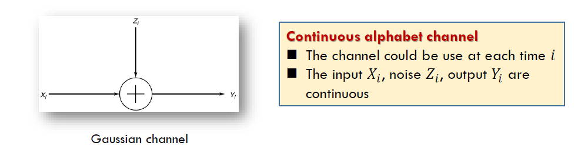
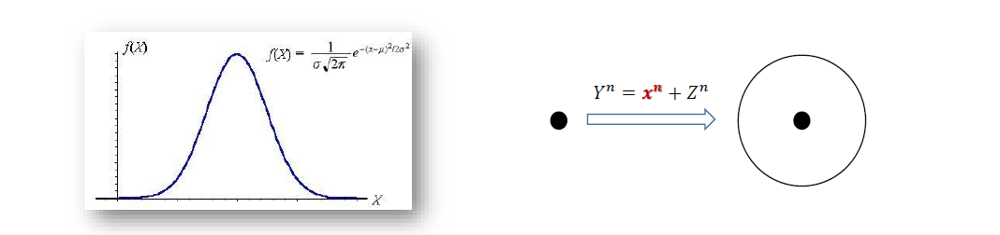
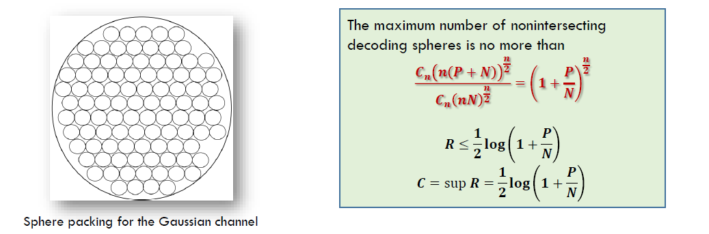
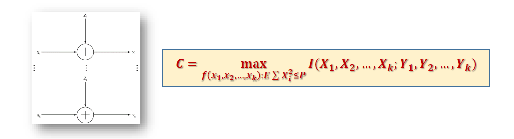
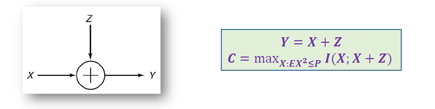

# Gaussian Channel

<!-----
title: 【Information Theory】Gaussian Channel
url: it-gaussian
date: 2020-04-22 10:02:09
tags: 
- Information Theory

categories: 
- Courses

----->

Week 8 of 2020 Spring

<!--more-->

[toc]

## Gaussian Channel
连续信道中最常见的是高斯信道，背景噪声服从高斯分布。

- the most important continuous alphabet channel is the Gaussian channel. For example, wireless telephone channels and satellite links
- The noise $Z_{i}$ is drawn i.i.d. from **a Gaussian distribution** with variance $N$
- The noise $Z_{i}$ is assumed to be **independent** of the signal $X_{i}$
- This is a time-discrete channel with output $Y_{i}$ at time $i,$ where $Y_{i}$ is the sum of the input $X_{i}$ and the noise $Z_{i}$ ，
  $$Y_{i}=X_{i}+Z_{i}, \quad Z_{i} \sim \mathcal{N}(0, N)$$
  对连续随机变量，两个随机变量的和的概率密度函数是它们的卷积。
- Without further conditions, the capacity of this channel may be $\infty$.
  - The values of $X$ may be very sparse
  - 一个例子：Assume the variance of noise $N$ is neglected compared to the distances of the values of $X$ Then $Y=X+Z \approx X .$ Thus $I(X ; Y) \approx H(X),$ which may be $\infty$。连续型随机变量的离散熵有可能是无穷大的，信道容量此时也失去了意义。

为进一步研究信道容量，我们需要从实际出发，为信道增加一些功能、限制。

## Energy Constraint

高斯信道中常见的一个限制是能量限制。能量通常与方差相关。在一些研究中，有关“能量”可以用其他更复杂或更精细的模型进行定义，从而得到类似的推导和结论。

- The most common limitation on the input is **an energy or power constraint**
- We assume an average power constraint. For any codeword $\left(x_{1}, x_{2}, \ldots, x_{n}\right)$ transmitted over the channel, we require that （假设码制中的符号均匀分布）
  $$\frac{1}{n} \sum_{i=1}^{n} x_{i}^{2} \leq P$$
  - within the sphere $\sqrt{n P}$
  - $P$ per channel use 每次信道使用功率消耗最大为P
  - 如果码制不均匀分布，只需改成$EX^2 \leq P$
- This communication channel models many practical channels, including radio and satellite links.

> The information capacity of the Gaussian channel with power constraint $P$ is
> $$C=\max _{f(x): E X^{2} \leq P} I(X ; Y)$$

下面求解该优化问题。
$$\begin{aligned}
I(X ; Y) &=h(Y)-h(Y | X) \\
&=h(Y)-h(X+Z | X) \\
&=h(Y)-h(Z | X) \\
&=h(Y)-h(Z) \\
h(Z)&=\frac{1}{2} \log 2 \pi e N
\end{aligned}$$

$$\begin{array}{l}
E Y^{2}=E(X+Z)^{2}=E X^{2}+2 E X E Z+E Z^{2}\leq P+N \\
h(Y) \leq \frac{1}{2} \log 2 \pi e(P+N)
\end{array}$$

$$\begin{aligned}
I(X ; Y) &=h(Y)-h(Z) \leq \frac{1}{2} \log 2 \pi e(P+N)-\frac{1}{2} \log 2 \pi e N \\
&=\frac{1}{2} \log \left(1+\frac{P}{N}\right)
\end{aligned}$$

综上：
$$
C=\frac{1}{2} \log \left(1+\frac{P}{N}\right)
$$
The maximum is attained when $X \sim \mathcal{N}(\mathbf{0}, P)$，$P\over N$也被称为信道比。

## Intuition

每个输入信号都会在接收端产生一定的区域。考虑一个给定的码制$x_n$

- The received vector is **normally distributed** with mean equal to the true codeword and variance equal to the noise variance.
- With high probability, the received vector is contained **in a sphere of radius $\sqrt{n(N+\epsilon)}$ around the true codeword**.
- 任何码制在高斯噪声的影响下，接收端都产生一个球体
- 我们在解码时，只要获得的$Y_n$在球体内，我们就认为$Y_n$对应$X_n$，为了降低错误率，我们希望任意两个球都是不相交的。
- If we assign everything within this sphere to the given codeword, when this codeword is sen there will be an error only if the received vector falls outside the sphere, which has low probability.
  - Each codeword is represented by a sphere 
  - Low decoding error requires no intersection between any spheres
那么填充满的小球空间率越大，码率就越高

- The received vectors $(Y=X+Z)$ have energy no greater than $n(P+N),$ so they lie in a sphere of radius $\sqrt{n(P+N)}$
- The volume of an n-dimensional sphere is of the form $C_{n} r^{n}$, where $r$ is the radius of the sphere.
  $$2 \pi r, \pi r^{2} \text { and } \frac{4}{3} \pi r^{3}$$
- The volumes are approximated by
  $$C_{n}(n N)^{\frac{n}{2}} \text { and } C_{n}(n(P+N))^{\frac{n}{2}}$$
  我们不需要把球体的公式算的特别细，忽略前面的系数，计算高阶的情况。
  我们完成了上界的推算。当然，高维空间小球的堆放问题，其实际的构造是一个非常复杂的问题。

## Theorems

证明思路与DMC一致，定义编码，定义错误概率，定义可达区域，证明converse和achievability

### Definition

对能量限制P的信道定义编码函数。

**Definition**. An $(M, n)$ code for the Gaussian channel with power constraint $P$ consists of the following:
1. An index set $\{1,2, \ldots, M\}$
2. An encoding function $x:\{1,2, \ldots, M\} \rightarrow X^{n}$, yielding codewords $x^{n}(1), x^{n}(2), \ldots$ $x^{n}(M),$ satisfying the power constraint $P$; that is, for every codeword
   $$\sum_{i=1}^{n} x_{i}^{2}(w) \leq n P, \quad w=1,2, \dots, M$$
3. A decoding function
   $$g: y^{n} \rightarrow\{1,2, \ldots, M\}$$

The arithmetic average of the probability of error is defined by
$$P_{e}^{(n)}=\frac{1}{2^{n R}} \sum \lambda_{i}$$

A rate $R$ is said to be achievable for a Gaussian channel with a power constraint $P$ if there exists a sequence of $\left(2^{n R}, n\right)$ codes with codewords satisfying the power constraint such that the maximal probability of error $\lambda^{(n)}$ tends to zero. The capacity of the channel is the supremum of the achievable rates.

### Code Construction

#### Generation of the codebook
We generate the codewords $\left(x_{1}, x_{2}, \ldots, x_{n}\right)$ with each element i.i.d. according to a normal distribution with variance $P-\epsilon .$ since for large $n$
$$
\frac{1}{n} \sum x_{i}^{2} \rightarrow P-\epsilon
$$
The probability that a codeword does not satisfy the power constraint will be small. 根据方差的定义，超过能量限制的概率是非常小的。
Let $X_{i}(w), \quad i=1,2, \ldots, n, w=1,2, \ldots, 2^{n R}$ be i.i.d. $\sim \mathcal{N}(0, P-\epsilon),$ forming codewords $X^{n}(1), X^{n}(2), \ldots, X^{n}\left(2^{n R}\right) \in \mathcal{R}^{n}$ 完成了码本的生成
#### Encoding
- The codebook is revealed to both the sender and the receiver.
- To send the message index $w$, sends the $w$ th codeword $X^{n}(w)$ in the codebook.
#### Decoding:
根据联合典型性解码，The receiver looks down the list of codewords $\left\{X^{n}(w)\right\}$ and searches for one that is jointly typical with the received vector.
- If there is one and only one such codeword $X^{n}(w)$, the receiver declares $\widehat{W}=w$ to be the transmitted codeword.
- Otherwise, the receiver declares an error. The receiver also declares an error **if the chosen codeword does not satisfy the power constraint.**（除了不满足典型性，错误还可能是超过了能量限制）

### Probability of Error

WLOG，假设我们发送了码制1.

Without loss of generality, assume that codeword 1 was sent. Thus,
$$
Y^{n}=X^{n}(1)+Z^{n}
$$
现在我们要分析两种限制。Define the following events:
$$E_{0}=\left\{\frac{1}{n} \sum_{j=1}^{n} X_{j}^{2}(1)>P\right\}$$
and
$$E_{i}=\left\{\left(X^{n}(i), Y^{n}\right) \text { is in } A_{\epsilon}^{(n)}\right\}$$

$$\operatorname{Pr}(\mathcal{E} | W=1)=P\left(E_{0} \cup E_{1}^{c} \cup E_{2} \cup E_{3} \ldots \cup E_{2^{n R}}\right) \leq P\left(E_{0}\right)+P\left(E_{1}^{c}\right)+\sum_{i=2}^{2^{n R}} P\left(E_{i}\right)$$

$E_0$表示违背了能量约束。

但根据我们前面的分析，$P\left(E_{0}\right) \rightarrow 0$， $P\left(E_{1}^{c}\right) \leq \epsilon$，又根据联合典型性，

$$\sum_{i=2}^{2^{n R}} P\left(E_{i}\right)=\left(2^{n R}-1\right) 2^{-n(I(X ; Y)-3 \epsilon)} \leq 2^{-n(I(X ; Y)-R-3 \epsilon)}$$

所以我们有$P_{e}^{(n)} \leq 3 \epsilon$。利用DMC中类似的减一半方法，我们可以证明最大错误概率也是趋向于0的。

### Converse

Let $W$ be distributed uniformly over $\left\{1,2, \ldots, 2^{n R}\right\}$
$$
W \rightarrow X^{n}(W) \rightarrow Y^{n} \rightarrow \widehat{W}
$$

By Fano's inequality
$$H(W | \widehat{W}) \leq 1+n R P_{e}^{(n)}=n \epsilon_{n}$$
where $\epsilon_{n} \rightarrow 0$ as $P_{e}^{(n)} \rightarrow 0$

$$\begin{aligned}
n R &=H(W)=I(W ; \widehat{W})+H(W | \widehat{W}) \\
& \leq I(W ; \widehat{W})+n \epsilon_{n} \\
& \leq I\left(X^{n} ; Y^{n}\right)+n \epsilon_{n} \\
&=h\left(Y^{n}\right)-h\left(Y^{n} | X^{n}\right)+n \epsilon_{n} \\
&=h\left(Y^{n}\right)-h\left(Z^{n}\right)+n \epsilon_{n} \quad \text{去除信号}Y_n = X_n + Z_n \\
& \leq \sum_{i=1}^{n} h\left(Y_{i}\right)-\sum_{i=1}^{n} h\left(Z_{i}\right)+n \epsilon_{n}
\end{aligned}$$

Let $P_{i}$ be the average power of the $i$ th column of the codebook
$$
P_{i}=\frac{1}{2^{n R}} \sum_{w} x_{i}^{2}(w) \text { and } \frac{1}{n} \sum_{i} P_{i} \leq P
$$

since $X_{i}$ and $Z_{i}$ are independent, then 建立微分熵$h(Y_i)$的上界
$$
E Y_{i}^{2}=P_{i}+N, h\left(Y_{i}\right) \leq \frac{1}{2} \log 2 \pi e\left(P_{i}+N\right)
$$

$$\begin{aligned}
n R &\leq \sum_{i=1}^{n} h\left(Y_{i}\right)-\sum_{i=1}^{n} h\left(Z_{i}\right)+n \epsilon_{n} \\
&\leq \sum\left(\frac{1}{2} \log 2 \pi e\left(P_{i}+N\right)-\frac{1}{2} \log 2 \pi e N\right)+n \epsilon_{n} \\
&=\sum \frac{1}{2} \log 2 \pi e\left(1+\frac{P_{i}}{N}\right)+n \epsilon_{n}
\end{aligned}$$

利用凹函数的性质，$f(x)= \frac{1}{2} \log (1+x) \text { is concave }$

$$\begin{aligned}
& \frac{1}{n} \sum_{i=1}^{n} \frac{1}{2} \log \left(1+\frac{P_{i}}{N}\right) \\
& \leq \frac{1}{2} \log \left(1+\frac{1}{n} \sum_{i=1}^{n} \frac{P_{i}}{N}\right) \leq \frac{1}{2} \log \left(1+\frac{P}{N}\right)
\end{aligned}$$

所以
$$R \leq \frac{1}{2} \log \left(1+\frac{P}{N}\right)+\epsilon_{n}$$

这里我们借用凹函数的性质处理了能量的问题，完成了converse的证明。

## Parallel Gaussian Channel

### Problem

高斯信道的扩展：n个信道，可以同时使用。仍然存在能量的限制。

Assume that we have a set of Gaussian channels in parallel. The output of each channel is the sum of the input and Gaussian noise. For channel $j$
$$Y_{j}=X_{j}+Z_{j}, \quad j=1,2, \dots, k$$
The noise is assumed to be independent from channel to channel. We assume that there is a common power constraint on the total power used, that is
$$E \sum_{j=1}^{k} X_{j}^{2} \leq P$$
We wish to **distribute the power among the various channels** so as to maximize the total capacity. 将问题更细化一步，我们需要对单个信道的能量做一定的分配。
$$ P_{i}=E X_{i}^{2},\text{ and }\sum P_{i} \leq P$$

### Solution

$$\begin{aligned}
& I\left(X_{1}, X_{2}, \ldots, X_{k} ; Y_{1}, Y_{2}, \ldots, Y_{k}\right) \\
=& h\left(Y_{1}, Y_{2}, \ldots, Y_{k}\right)-h\left(Y_{1}, Y_{2}, \ldots, Y_{k} | X_{1}, X_{2}, \ldots, X_{k}\right) \\
=& h\left(Y_{1}, Y_{2}, \ldots, Y_{k}\right)-h\left(Z_{1}, Z_{2}, \ldots, Z_{k} | X_{1}, X_{2}, \ldots, X_{k}\right) \\
=& h\left(Y_{1}, Y_{2}, \ldots, Y_{k}\right)-h\left(Z_{1}, Z_{2}, \ldots, Z_{k}\right) \\
=& h\left(Y_{1}, Y_{2}, \ldots, Y_{k}\right)-\sum_{i} h\left(Z_{i}\right) \\
\leq & \sum h\left(Y_{i}\right)-h\left(Z_{i}\right) \\
\leq & \sum_{i} \frac{1}{2} \log \left(1+\frac{P_{i}}{N_{i}}\right) \quad \text{高斯噪声最大化微分熵}
\end{aligned}$$

where $P_{i}=E X_{i}^{2},$ and $\sum P_{i}=P .$ 等号是可以取到的，Equality is achieved by
$$
\left(X_{1}, X_{2}, \ldots, X_{k}\right) \sim \mathcal{N}\left(0,\left[\begin{array}{cccc}
P_{1} & 0 & \cdots & 0 \\
0 & P_{2} & \cdots & \vdots \\
\vdots & \vdots & \ddots & \vdots \\
0 & 0 & \cdots & P_{k}
\end{array}\right]\right)
$$

优化目标：
$$\begin{array}{c}
\max \sum_{i} \log \left(1+\frac{P_{i}}{N_{i}}\right) \\
\sum P_{i}=P
\end{array}$$

凸优化问题，可解。我们发现，在并行高斯信道中，我们需要专门分配能量。
Extension：分配能量算法：water-filling

## Worst Additive Noise

推广到噪声的一般分布，信道容量定理依然成立。

### Problem

- Under the energy constraint $P,$ the channel capacity of additive channel $Y=X+Z$ is
  $$
  \begin{aligned}
  C(Z) &=\max _{X: E X^{2} \leq P} I(X ; Y) \\
  &=\max _{X: E X^{2} \leq P} h(X+Z)-h(Z)
  \end{aligned}
  $$
  后一项需要根据具体情况具体分析。

- 加一个限制？What is the minimum of $C(Z),$ if we could choose $Z: E Z^{2} \leq N$
  - That is, to play a max-min game between $X$ and $Z$ 在Z给定的情况下设定X
    $$\begin{aligned}
    \max _{Z: E Z^{2} \leq N} C(Z)&:=\min _{Z: E Z^{2} \leq N} \max _{X: E X^{2} \leq P} I(X ; X+Z)\\
    &=\min _{Z: E Z^{2} \leq N}\left(\max _{X: E X^{2} \leq P} I(X ; X+Z)\right)
    \end{aligned}
    $$
  - 对多重优化问题，把内部看成一个函数，分两步走。We need to find a $Z^{*} .$ When $C\left(Z^{*}\right)$ is attained by $X^{*}$
    $$
    I\left(X^{*} ; X^{*}+Z^{*}\right) \leq \max _{X: E X^{2} \leq P} I(X ; X+Z)
    $$

- The $\min _{Z: E Z^{2} \leq N} C(Z)$ is attained iff $Z=Z_{G} \sim \mathcal{N}\left(0, \sigma^{2}\right)$ (Shannon, 1948)

### Entropy power inequality
在给定信道能量的情况下，高斯噪声是最坏的加性噪声。EPI，熵幂不等式

> Entropy power inequality (EPI, Shannon 1948 ): If $X$ and $Y$ are independent random $n$ vectors with densities, then
> $$
> e^{\frac{2}{n} h(X+Y)} \geq e^{\frac{2}{n} h(X)}+e^{\frac{2}{n} h(Y)}
> $$
> 证明略

利用EPI，我们证明前一节的定理
- Recall $I(X ; X+Z)=h(X+Z)-h(Z)$
- By EPI, $h(X+Z) \geq \frac{1}{2} \log \left(e^{2 h(X)}+e^{2 h(Z)}\right)$
- 我们有$I(X ; X+Z) \geq \frac{1}{2} \log \left(e^{2 h(X)}+e^{2 h(Z)}\right)-h(Z)$
- $f(t, s)=\frac{1}{2} \log \left(e^{2 t}+e^{2 s}\right)-s,$ where

$$\begin{array}{l}
t=h(X) \leq \frac{1}{2} \log 2 \pi e P \\
s=h(Z) \leq \frac{1}{2} \log 2 \pi e N
\end{array}$$

- In $f(t, s)$ is increasing and convex in $t,$ and is decreasing and convex in $S$
- Fix $s, f(t, s)$ is maximized if $t=\frac{1}{2} \log 2 \pi e P$
- Fix $t, f(t, s)$ is minimized if $s=\frac{1}{2} \log 2 \pi e N$
- $X^{*} \sim \mathcal{N}(0, P), Z \sim \mathcal{N}\left(0, N^{*}\right)$

In Gaussian channel

$$I\left(X ; X+Z^{*}\right) \leq I\left(X^{*} ; X^{*}+Z^{*}\right)=C\left(Z^{*}\right)$$

$$\begin{aligned}
& I\left(X^{*} ; X^{*}+Z\right) \\
=& h\left(X^{*}+Z\right)-h(Z) \\
\geq & \frac{1}{2} \log \left(e^{2 h\left(X^{*}\right)}+e^{2 h(Z)}\right)-h(Z) \\
\geq & \min f(t, s) \\
=& I\left(X^{*} ; X^{*}+Z^{*}\right)
\end{aligned}$$

综合起来，我们获得了一个不等式链，高斯分布位于中间。同时作为下界和上界而存在。这也揭示了我们在很多问题中，以高斯信道为例的意义。

$$\boldsymbol{I}\left(\boldsymbol{X} ; \boldsymbol{X}+\boldsymbol{Z}^{*}\right) \leq \boldsymbol{I}\left(\boldsymbol{X}^{*} ; \boldsymbol{X}^{*}+\boldsymbol{Z}^{*}\right) \leq \boldsymbol{I}\left(\boldsymbol{X}^{*} ; \boldsymbol{X}^{*}+\boldsymbol{Z}\right)$$

$$\begin{aligned}
\min _{Z} \max _{X} I(X ; X+Z) &=\max _{X} \min _{Z} I(X ; X+Z) \\
&=\frac{1}{2} \log \left(1+\frac{P}{N}\right)
\end{aligned}$$

完结撒花~

