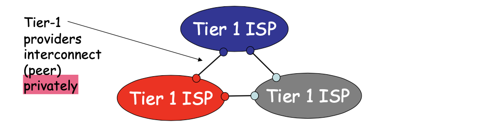
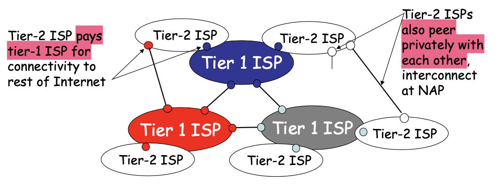
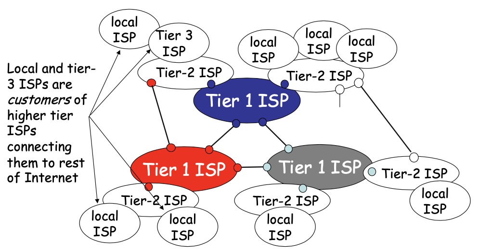
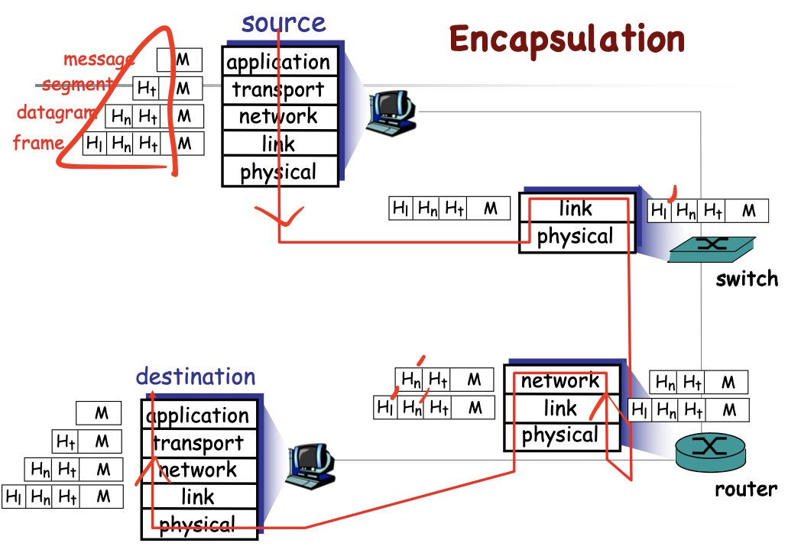

<!-- more -->

- Introductory (first) course in computer networking
  - learn **principles** of computer networking
  - learn **practice** of computer networking
  - Internet architecture/protocols as case study
    > Computer networks are more than Internet, though.
  - Glimpses into the future of networking
  - learn via hands-on experiments

## Difference between Communications and Networking

::: tip Not a “communications” course

This is course on Understanding, analyzing, and (perhaps) designing **protocols** and **algorithms** in networking systems (with case studies in wired and wireless networks)

:::

Communication( 通信 ) deals with issues related to how information transfer from one device to the other.
- media, power, ...
- encoding, modulation( 调制 ) schemes, ...
- How to build up an infrastructure to connect two parties

Networking( 网络 ) usually involves multiple devices, cares about the forwarding of messages and resolution between multiple parties.

## Computer Network Architecture (Past, Present and Future)

- 1961, packet switching
  > We don't need to actually build a real circuit between two devices, we can pack the message into several chunks, so that the information can be spread across the network
- 1972, TCP for **reliable** packet transport
  > To build a reliable connection based on unreliable devices
- 1975, DNS - Domain Name Service
  > A very useful protocal on application level

### InterNetwork

- Millions of end points (you, me, and devices) are connected over a network
  - Many end points can be addressed by numbers
    > Not necessarily IP. NAT
  - Many others lie behind a virtual end point
- Many networks form a bigger network
- The overall structure called the Internet

### Internet Structure: network of networks

- **roughly** hierarchical
  > since private connection also exist across distinct layers 
- at center: **“tier-1” ISPs**(Internet Service Provider)
  - (e.g., ChinaNet, MCI, Sprint, AT&T, Cable and Wireless)
  - national/international coverage
  - treat each other as equals
  - thus using a private connection between

- **Tier-2 ISPs** - often regional
  - France telecome, Tiscali, etc. buys from Sprint

- **“Tier-3” ISPs** and **local ISPs** (Time Warner, Earthlink, etc.) 
  - last hop (“access”) network (closest to end systems)

- A packet passes through **many networks**

## Layering

We have viewed network from the perspective of ISP. We can also use layering to orgainize the structure of the network

::: tip
Layers - **each layer implements a service**
- layers communicate with peer layers
- rely on services provided by layer below
:::

### Why layering

Explicit structure allows identification, relationship of complex system’s pieces

Modularization eases maintenance, updating of system
- change of implementation of layer’s service transparent to rest of system
  > updating resources on one layer will not affect the rest of the layers

### Protocol “Layers”

- Service of each layer encapsulated 
- Universally agreed services called **PROTOCOLS**

A large part of this course will focus on understanding protocols for networking systems

### Internet protocol stack

|  Protocol     |  Functions     | Example      |
|  :--: |  ---  |  ---  |
|  **application**     | supporting network applications      | FTP, SMTP, HTTP, DNS ...     |
|  **transport**     |  host-host data transfer     | TCP, UDP ...      |
|  **network**     | routing of datagrams from source to destination      | IP, BGP, routing protocols ...      |
|  **link**     | data transfer between neighboring network elements      |  PPP, Ethernet, WiFi, Bluetooth ...     |
|  **physical**     | bits “on the wire”      |  OFDM, DSSS, CDMA, Coding ...     |

::: tip The big Picture of Encapsulation

:::